# content
- Cell marker genes
- Working with DGE Contrast 
   + Volcano plot
   + split contrast
   + Calculate distance between contrast
   + ditt plot
- Gene Ontology gene sets (KEGG gene sets)
- Gene Set Enrichment Analysis (GSEA)


## Cell marker genes
Download `/gdp` from step7 on your working path `WDP`, cell marker genes and seurat object are  the `de_genes` and  `seu.int`, respectively


```r
WDP='/Volumes/F/for_my_website/scrnabox0/related_to_scrnaR'
setwd(WDP)
mk_genes<-readRDS(paste0(WDP, "/gdp/de_genes.rds"))
seu.int<-readRDS(paste0(WDP, "/gdp/seu.int.c.rds"))
```


Select top 2

```r
mk_genes %>%
    group_by(cluster) %>%
    top_n(-2, p_val_adj) -> top_sel
```


```r
top_sel
```

```
## # A tibble: 15 × 7
## # Groups:   cluster [7]
##        p_val avg_log2FC pct.1 pct.2 p_val_adj cluster     gene      
##        <dbl>      <dbl> <dbl> <dbl>     <dbl> <fct>       <chr>     
##  1 0              1.09  0.802 0.573 0         DAneurons   FEV       
##  2 0              0.931 0.928 0.767 0         DAneurons   NTM       
##  3 0              0.750 0.85  0.605 0         DAneurons   LUZP2     
##  4 1.13e-105      0.266 0.33  0.813 2.26e-102 other       MTHFD2    
##  5 2.74e- 85      0.364 0.42  0.786 5.47e- 82 other       PCBD1     
##  6 4.61e-297      0.377 0.535 0.245 9.23e-294 neurons     AC022075.1
##  7 1.03e-273      0.752 0.875 0.707 2.06e-270 neurons     CNR1      
##  8 1.14e-260      0.633 0.643 0.284 2.27e-257 progenitors COL2A1    
##  9 4.05e-224      1.45  0.677 0.378 8.11e-221 progenitors SULF1     
## 10 1.15e-189      0.834 0.815 0.387 2.30e-186 ependymal   NKX2-2    
## 11 7.85e-149      0.863 0.991 0.779 1.57e-145 ependymal   POU2F2    
## 12 2.74e-222      2.55  0.921 0.427 5.48e-219 Glia        HOXA5     
## 13 1.34e-207      1.79  0.986 0.609 2.68e-204 Glia        LINC02381 
## 14 1.25e-221      0.633 0.93  0.27  2.50e-218 neuroblasts VSX2      
## 15 4.07e-208      1.71  0.917 0.274 8.13e-205 neuroblasts MAB21L1
```
See the plot of genes: 

```r
mypar(3, 3, mar = c(5, 5, 3, 3))
for (i in unique(top_sel$cluster)) {
    barplot(sort(setNames(top_sel$avg_log2FC, top_sel$gene)[top_sel$cluster == i], F),
        horiz = T, las = 1, main = paste0(i, " vs. rest"),)
    abline(v = c(0, 0.25))
}
```

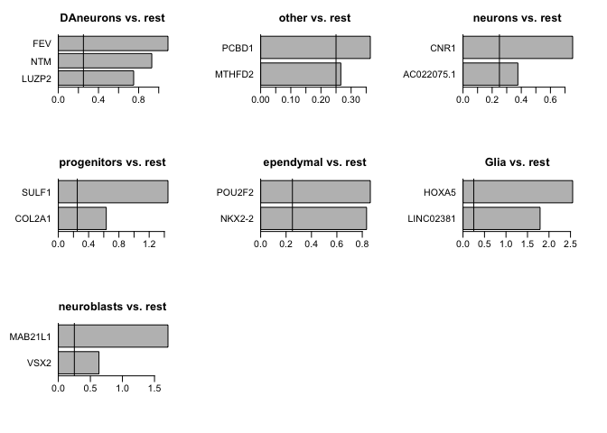<!-- -->
Visualize via heatmap 


```r
seu.int_sel <- ScaleData(seu.int, features = as.character(unique(top_sel$gene)), assay = "RNA")
```

```
## Centering and scaling data matrix
```

```r
DoHeatmap(seu.int_sel, features = as.character(unique(top_sel$gene)), group.by = "cell.types.pool",    assay = "RNA")
```

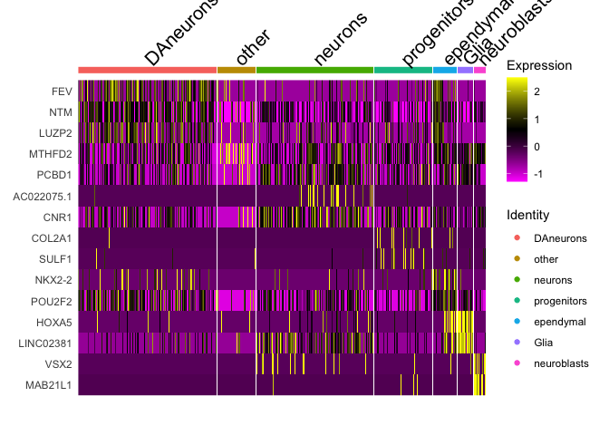<!-- -->

Visualize the overall expression via dot plot. 


```r
 DotPlot(seu.int_sel, features = rev(as.character(unique(top_sel$gene))), group.by = "cell.types.pool",
    assay = "RNA") + coord_flip()
```

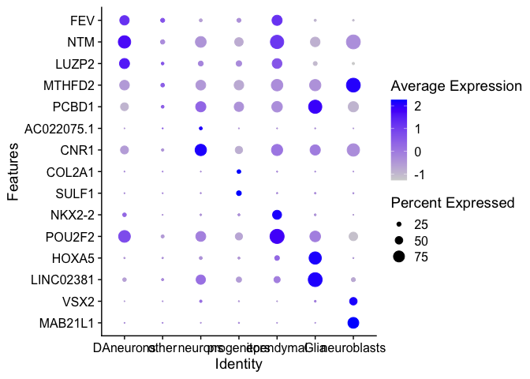<!-- -->

Visulaize via violin plot 
 

```r
VlnPlot(seu.int_sel, features = as.character(unique(top_sel$gene)[1:5]), ncol = 5, group.by = "cell.types.pool", assay = "RNA")
```

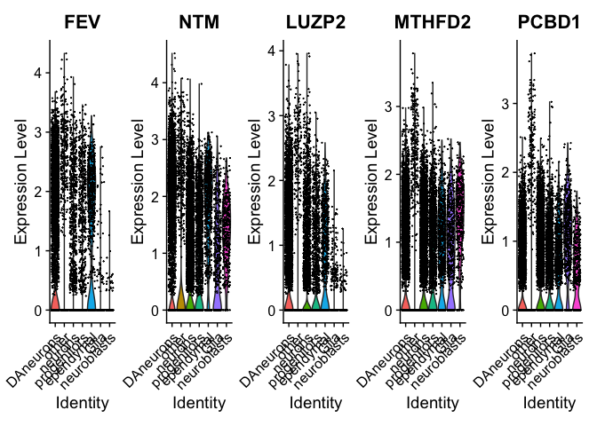<!-- -->

## Working with DGE Contrast 
Download the contrasts relust from step 7, 
### Volcano plot

```r
suppressPackageStartupMessages({
library(EnhancedVolcano)
})
cont_a53t<-read.csv(paste0(WDP,'/cont_main/design1.csv'))
EnhancedVolcano(cont_a53t,lab = rownames(cont_a53t),x = 'logFC',  y = 'P.Value', FCcutoff=1, title = 'A53T - rest', drawConnectors = TRUE, max.overlaps= 30)
```

```
## Warning: One or more p-values is 0. Converting to 10^-1 * current lowest non-
## zero p-value...
```

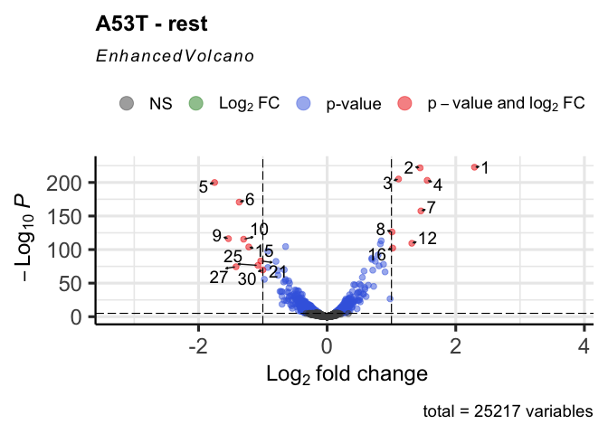<!-- -->

```r
ggsave(file = "EnhancedVolcano2.pdf")
```

```
## Saving 7 x 5 in image
```


```r
suppressPackageStartupMessages({
library(htmlwidgets)
library(plotly)
})
cont_a53t_sig<-cont_a53t[cont_a53t$adj.P.Val<0.05,]
p <- plot_ly(data = cont_a53t_sig, x = cont_a53t_sig$logFC, y = -log(cont_a53t_sig$adj.P.Val), text = cont_a53t_sig$X, mode = "markers") %>% layout(title ="A53T vs rest")
p
```

```
## No trace type specified:
##   Based on info supplied, a 'scatter' trace seems appropriate.
##   Read more about this trace type -> https://plotly.com/r/reference/#scatter
```

```{=html}
<div id="htmlwidget-9a207c0e8d3f1b0e9ab4" style="width:672px;height:480px;" class="plotly html-widget"></div>
<script type="application/json" data-for="htmlwidget-9a207c0e8d3f1b0e9ab4">{"x":{"visdat":{"bc295c50c478":["function () ","plotlyVisDat"]},"cur_data":"bc295c50c478","attrs":{"bc295c50c478":{"x":[2.29102647584848,1.44539069315036,1.11036284674921,1.55546108907637,-1.74979486235151,-1.36768997444122,1.45774779714223,1.00854057327726,-1.53468328972807,-1.29863737926572,0.841579009306097,1.31664145515013,0.826809364372332,-0.646335145233116,-1.21843438822559,1.01955645751488,-0.92331262217812,0.791600035521569,0.694128352866199,0.695716886553136,-1.03262831980225,0.748686047349739,-0.795584535546227,0.876185045828695,-1.07718029822118,0.806769034338976,-1.41720629200636,-0.921821185356031,-0.666288364872812,-1.0000987085685,0.7096273754985,-0.768272923872886,0.574153196950797,0.900480527183379,-0.762495477275568,0.547088048753986,-0.976164856236865,-0.645105972871908,-0.650425488359428,-0.597165468548307,-0.675988086044931,-0.584738480453572,0.50071055852092,0.413181648340563,0.433758766301199,0.640145591456569,0.526170458551546,0.723384113337403,0.585215797334868,-0.593470860684596,0.587112971512125,-0.498978410729871,-0.483898197120269,-0.459502428689298,-0.443523211474318,-0.733052746010237,-0.716619101080935,0.393409096585476,-0.623985162851715,-0.699845468085462,0.489888499608899,0.518679803817007,-0.598902960542523,0.488221012574214,0.469797714985259,0.562125259048125,-0.517788621986664,0.565558441719005,-0.386447424477981,-0.45889512802287,-0.405741754690026,0.34871799215861,-0.491190764265423,-0.543230116564954,-0.567944222960202,-0.512406652846868,-0.701680530050867,-0.5892656684763,0.60607025213377,-0.501389965117402,0.418094552313255,-0.432967849605149,0.36929456692776,-0.455078821595061,0.511284254322274,-0.445387434252094,0.345354890045256,-0.389039119074743,-0.457486999950839,-0.498833148565976,-0.600219066998744,0.336503047572878,0.978495033655326,0.2928192746327,-0.473299843286556,-0.41691095834699,-0.406291261242671,0.375698758208931,0.328173068850936,-0.481275619276635,-0.494443451931277,-0.446128229223371,-0.461272558222172,0.431164318564845,0.315902764286347,0.33971925043556,-0.544515838384532,0.503691879667543,0.295907863217209,0.321088624242602,-0.452783192795321,0.487346329253385,-0.44514801139696,0.470147321747172,-0.667116592424152,-0.43736865227692,-0.452094632504126,-0.632916381039244,-0.613366922500408,-0.372568614832025,0.276922435189785,0.313794462728409,-0.393817428254382,-0.418569293251904,-0.445944646764248,-0.358095281139266,-0.405702477352809,-0.350489639991971,-0.386743484482427,-0.405298427848185,-0.382249179611731,0.411006768866915,-0.42268710955266,-0.394384512695719,-0.396385586735095,0.418927399377242,-0.334307284381423,-0.336545210214192,0.368097005499024,0.514459477847446,0.39435577718918,0.275989039892837,0.297350409911296,-0.361089620001721,0.389323244352242,-0.438902677798707,-0.353507437496805,-0.447130974774522,0.307979857915448,-0.397947602971364,-0.350949769544505,-0.347864468409563,-0.418618176177601,0.277755881591308,0.272568878320492,-0.370432087412244,0.293243370734048,0.285287617133566,-0.366948723022202,-0.348951213563835,-0.372267522775734,-0.377204714273121,-0.356510402069144,-0.461842274946679,-0.372444052713121,0.406648451527889,0.30185233926033,-0.34825310601946,0.329336776110233,-0.361549807239562,-0.352023598017124,-0.529733439793841,-0.488584074071232,-0.33989498369734,-0.701347823546094,-0.341294812319358,-0.324757447418739,0.328061345287263,-0.326729907545597,-0.458045677783183,-0.28796606467612,-0.307038774086762,0.242529063237865,-0.353434444113388,-0.344426097536372,0.261606625101147,-0.279198696038846,0.346121187636967,-0.568833653391094,0.28702731957225,0.359976488866326,0.327919100775924,0.348650832097078,0.377999973051148,-0.312973535836182,-0.306223292115927,-0.381829298185544,-0.362588456984671,-0.416841466299982,0.307991757723149,-0.439621770551127,-0.284012526253553,0.252182234366832,-0.425846550624788,-0.414329895779179,-0.341361347437975,0.352128366866497,-0.337093889465237,-0.293491135704148,-0.319257388898539,-0.263857537975125,-0.350778360918611,-0.311958427389461,-0.249551069309202,-0.304726319273113,0.291209051925501,-0.324131781096405,-0.356936522075014,-0.363853236078802,0.289121198662014,-0.55069712723863,0.273955290802187,-0.364055916084304,-0.423565548696553,-0.299417194978853,-0.320480860937824,-0.309641573042262,-0.398970408687069,0.254903844260029,-0.406382872410621,-0.366513499123771,-0.336207611552307,-0.254004492546037,-0.321943162371172,0.323875407772825,0.290075554442552,0.266074864832143,0.233789549205087,-0.333402014468877,-0.360848905243895,-0.329846307780952,0.347762826182938,0.288368729439773,0.32592213672394,-0.316753864592248,-0.318928146086743,-0.317206713139917,-0.31250147843881,-0.284179150335961,0.254616513935336,-0.315153943270407,-0.295630860055395,-0.300703789072307,-0.294637421028696,0.234745786922984,0.383592928613225,0.336237694060373,-0.469013388721294,-0.373750634906392,0.330542004011433,-0.288414350854503,0.214636388203453,-0.429360752212548,-0.262172129371548,0.285444790392765,-0.299467677634445,-0.280966168201942,-0.309222094781664,0.255468684053809,0.24178760771177,-0.37343111714353,-0.323988061094884,-0.356205247766967,0.267566070700946,-0.294312115805647,0.223230362321662,-0.326080155310594,-0.336172451391324,0.385132528834736,-0.295839554845704,0.246902391830694,-0.295714438547981,0.255146631529052,0.209259103318066,0.264805579998581,-0.259707289306433,0.268111307473424,-0.30211481167478,-0.334489021253963,0.290025015134146,0.24527523359327,0.324549453811251,-0.276190859634563,-0.373492581526211,0.26516740431784,0.251717455968121,-0.29710677651676,0.204937917264059,-0.29648597836942,0.325728958140389,-0.294692874338836,0.225858051079136,-0.303883099343119,-0.295423435011933,0.280378910675283,-0.306149582258077,-0.276466896813452,0.277973624699826,-0.308498384486848,-0.372033122110713,-0.285862255666509,-0.21956981474439,-0.232956244550468,0.292674056485642,-0.282489045236053,-0.224688462314982,0.257748641947486,0.24766973981365,-0.270646633067376,-0.410597905855768,-0.299775986615092,-0.296663107004864,0.318558858718516,-0.256556365748997,-0.309571174874756,0.202723863933607,-0.266204419670818,-0.273311701804562,-0.540962213029337,-0.278312599367562,-0.31062624389549,0.233560460553378,0.277526200552877,-0.287027993221517,-0.33224629574685,-0.247828044644306,-0.316132115091083,-0.272601060994362,-0.281396353425879,0.23272192473246,-0.301791257371724,-0.303218552177793,0.268280488366678,-0.322947590727404,-0.252735544224137,-0.279857931461003,-0.292640227761705,-0.27573967332782,-0.352452118001299,0.243732898636497,-0.286703229200295,-0.273145145189885,-0.291280660860433,-0.276649533042762,-0.278902708499652,0.205091723528168,0.301657199880522,-0.271572825958216,0.207374899489157,0.332774089085712,0.220347938543803,0.227767110281414,0.277216978165974,-0.368879892196045,0.211495989665452,-0.282704070467922,0.465329423968447,-0.275985079754365,-0.358688007672685,-0.24030494035116,0.205144847844931,0.235525690796057,0.219150166302295,0.26245642365117,0.242054194909564,-0.298600660550427,0.208331481473223,-0.252188191037484,0.210144602540149,-0.325477574760757,0.192523212278821,-0.282381575893192,-0.311407339384747,0.273791466573382,-0.407037222046725,-0.260831226041554,0.212598615087836,-0.250544608292265,-0.276521104353661,-0.260158664457992,-0.276978413478209,0.305049468203202,-0.314398083598011,0.252724511574715,0.284190094672926,0.263630361499707,-0.297877132375858,-0.265435804595392,0.211415432610517,0.233148371407324,-0.260137935270565,0.238840990791998,-0.306903727294193,-0.364215985065233,-0.267339385478938,-0.293910533975228,-0.23520411645518,-0.239048100162669,-0.412838323998262,-0.271826407943378,0.216747797251732,-0.268302271962765,-0.276551607917408,0.226255387476762,0.284494875453635,-0.264125534953354,-0.25175631819315,-0.256699900345919,-0.198939468536157,0.233472019825845,0.217660668415516,-0.278481274240122,0.187050036072323,-0.296018282897832,-0.202914387615245,-0.258413285371022,-0.26600120197648,0.205094326357682,-0.247896166237363,0.233204092997033,0.207344641410479,0.188797940302199,-0.347535921376062,-0.260997930406046,-0.305716069853133,-0.28847960814586,0.270187617550916,0.179010799319633,-0.368187872641276,0.222408943404065,0.251720681327808,0.202531702275875,0.307014466868104,0.185111001537667,-0.24295210565691,0.255589008727845,-0.314498733985074,-0.263118713906232,0.215397586415065,0.179178970914804,0.189831523883269,0.248351509824213,-0.261746764401871,-0.264769188789205,0.204572697938127,0.240096748177733,0.222809158887742,0.220303731955813,-0.258836183644822,-0.253607522054565,0.200026321114211,-0.201600030736178,0.170938429398152,-0.265093520299461,0.22225938341837,-0.333344992755801,-0.25825293024698,0.233212589624668,0.216822352926749,-0.21280093585282,-0.260871822028941,0.236771152753557,0.171446779110564,-0.253807051006097,-0.229370604793384,0.193057138469612,0.183129353042449,-0.265696029054255,0.192261262185745,-0.23259060817544,-0.239773181466643,-0.222371617763092,-0.2890896259186,-0.280085742202115,-0.232668257549296,-0.241455014361836,0.175725647751618,0.194713441568087,0.221841903656975,-0.221630496410572,0.231273406388043,-0.264151965120982,0.252561471654643,0.181527576416206,-0.265136902951001,0.238000250623993,0.235867198010985,0.188029502999351,0.199699570992511,0.27782849976978,-0.338575604625508,-0.262784041146132,-0.247888733161735,0.198285228276298,-0.20804194993795,-0.222602185011305,-0.251898220141961,-0.167995520298119,0.162552114123318,-0.400348384318022,0.22733428029752,0.299498421439308,-0.209985771775051,-0.232148611778138,0.199834174673563,-0.225515320362042,-0.227511145966632,-0.232428513829278,-0.255161797851168,0.240035099306407,0.208834240548954,0.198232293643287,0.216825672089578,0.189370738991664,-0.304570353362172,-0.355566964934772,0.161717533760967,-0.229523458831361,0.275555850099408,-0.224945553195813,0.218199970761864,0.234331529706872,-0.448239549589946,-0.234818673576499,0.227601913842707,0.172862803205247,0.167500446110963,-0.242622924049132,-0.257564969897766,0.253591887282803,0.172989214097053,-0.264687620527663,0.165116280363977,-0.272466881253111,-0.231498275409529,-0.192290065243359,-0.227849386280034,0.353941698315293,0.228032765102252,-0.339425662656382,-0.22599990952923,0.219371083574786,-0.225932344813473,0.232626150920022,0.17344809726201,0.233917555684839,0.332503266667157,0.280532460102748,0.201248194591158,0.226899501142091,-0.229147769884491,-0.231693818386727,-0.213482558607554,0.19296862685161,-0.189263560463512,-0.231632956466383,-0.239591438463819,0.242315005139396,-0.235982558615859,0.168693686898416,-0.219497333629203,-0.224575106544853,-0.226961636977924,0.172772445687658,0.182355564681473,-0.225890302944222,-0.21981798861597,-0.273325691707276,0.20218116777054,-0.25253336054238,0.169659431434484,-0.214115450540378,-0.277175565095017,0.216576201589871,-0.230725898027488,-0.243472652255907,-0.313210310871719,0.160318385676228,-0.233624920718003,-0.218385381580905,-0.247911342785373,0.272438586615841,0.181666361289616,0.168388242479025,-0.235297921724522,0.192721166622898,-0.207912529366935,-0.402429682257955,0.229980754426978,0.199120852275083,-0.321301548390894,0.178418294547613,-0.211157263151489,-0.314852549880182,0.184356988356182,-0.213518124805312,-0.234538601269996,-0.23884334554166,0.152724579160621,-0.214088911841696,-0.245080378843085,-0.216271595887704,-0.215134945202083,-0.225689637610955,0.172367101393819,-0.410445835791164,-0.22414954992187,0.20322406578221,-0.22064133944648,0.308428210434979,-0.25292911567702,-0.217991870433557,-0.192037221137234,0.147858613953935,-0.17889389503102,0.168882719659203,-0.210668157119558,0.280632823746725,-0.252162793223931,-0.217983849013872,0.198813460779549,0.18393073870467,-0.246540705357439,-0.227174696424578,-0.164308986253347,-0.296005368125083,-0.237386485503423,-0.206984838995012,-0.208309827790028,-0.213048836182664,-0.281835846191145,-0.249065865029223,-0.201011573296915,0.166269662279537,0.19716721315984,-0.197923991870607,-0.215438905250629,-0.213187542701799,-0.281911036729566,0.215412432390418,0.150646111102624,-0.214471509750879,-0.223698373656367,-0.214518092074142,-0.217961810506343,0.213704428942957,0.193542976018779,0.187209063605556,-0.202565913596836,0.260859398667495,-0.204476530517868,-0.201613256903209,0.240733659386176,0.184269332230118,-0.215509793707245,-0.205936375297888,-0.181774135222675,0.155175354914834,-0.288160540612989,-0.189624719547663,-0.225063442192615,-0.214318526949482,-0.217084279749331,-0.208248433385053,-0.212454566634088,-0.220448780496678,-0.211154140611875,0.180910578534544,-0.219252057972694,0.237794772558683,0.191848460732211,0.190006437257327,-0.209637296225796,0.145780894868615,-0.212681854369242,-0.210139922982399,-0.219957955255879,-0.233756144332102,-0.213182148236665,-0.340893962575841,0.161576546077086,0.184050616436329,-0.203999220641802,-0.216278171696401,0.150547528726927,0.203193886284653,-0.169816754916715,0.272220867009954,-0.313144984513134,-0.222690050394093,-0.215722753146224,0.163325808664156,0.20636962633275,-0.177234897533268,-0.228761722844811,-0.266657812023233,0.159350166167501,-0.206434455769165,-0.237626109640775,0.150085500597046,0.157069416598039,-0.196315670551657,0.208645901783689,-0.221881770566995,0.167929723117925,-0.261496645247425,-0.194008295637406,-0.183325145895789,-0.214982269164938,0.186215443258379,-0.214344345767714,0.142318478268391,-0.189363103829991,-0.201748537022617,-0.242315725587616,-0.203928304314872,0.20631352581008,0.157351939214111,-0.210756876443954,0.184220149911352,0.272324548939933,-0.199976341188261,-0.226120867241585,-0.202732845039803,0.249029483973315,-0.238589618348493,-0.24469383399275,0.154583654342413,-0.208505651885293,-0.193809527105546,-0.202631191398509,-0.200343208590287,0.301548076406728,0.149145314393842,-0.232224680946679,-0.217332748630074,-0.223751247465717,-0.204005713935762,0.184911428919677,0.148809104252884,-0.276620895694762,-0.186550631312103,-0.259360652910132,0.214467119855673,0.140270122391927,-0.18757998949532,0.203543590011788,-0.20643269098549,0.155972192442777,-0.353320471027716,-0.175499220632148,0.147119472557065,0.148187126185172,-0.22109718420899,-0.206499473506369,0.213036756848778,-0.258289365747981,0.161157662500506,0.194252122112473,0.212585140888659,-0.2040886275239,-0.194008327905588,0.15459999185598,0.183063754325905,-0.189984825953037,0.182211580672492,-0.318451986246505,-0.204003127082364,-0.202771174810712,0.17429631241754,0.14495170901592,0.141997142623191,-0.294131114477054,-0.192166978974632,0.176993608551593,-0.28551763710394,0.189143112959121,-0.231720140007711,0.233812414404386,0.147842736125199,-0.210232048568232,-0.176350146160107,-0.187990404226283,-0.217778177644758,0.149772004525416,0.225046874549009,0.186154582950302,-0.184165048360907,0.161330316922985,0.15280023317873,-0.235967080255824,-0.288569353353539,0.191770452851166,0.139986801562618,0.170919053777826,-0.204916625785804,-0.181599745286963,-0.21671765416253,-0.214298179979367,0.178519743040046,-0.18780105791982,-0.256950530208124,0.171670823005525,-0.243570648030129,0.145314133322755,-0.196780915925846,-0.18994199159881,0.163198028627976,0.146894901889981,0.172321447296843,-0.176115307953561,0.170335365882386,0.22354606627639,0.185538529711473,-0.164166901291149,0.171836954109494,0.14900865559366,0.189770711019046,-0.161446098559695,0.14923201700396,0.204933788563348,-0.204264916929747,0.149847485803813,0.149912661145525,0.180596552202179,-0.19245244156948,0.213418753593074,0.195298291084456,0.154799290786751,-0.194149224529505,-0.250360992620513,0.138373541086834,-0.198229728832415,-0.281192203300233,-0.183918610361614,-0.353633875854216,0.157319842912264,0.214704625536461,-0.218736795694102,-0.243460943872142,-0.191920888948938,0.14193400528685,-0.208983741925531,-0.196016923665455,-0.263959442308764,0.20062821094254,0.174692437849626,-0.19183009073008,-0.282859740684428,-0.191337596851676,-0.201008510195607,0.160793360620591,-0.175190695981843,-0.196819732414713,-0.204281396997958,0.175557455132298,0.156773830640214,-0.167243302189256,-0.178117338614015,0.171866851009766,-0.176054659427735,-0.160540184635612,0.1599799595998,-0.1609938527482,-0.259127561651113,0.222477601708383,-0.128390078168453,0.195584550956005,-0.188639863589627,-0.358320861804401,0.188466364024658,0.157189596454795,0.170535767062362,-0.295721563036567,-0.224844481829249,0.175638171532678,0.147210728970381,-0.142239522932544,-0.196896873130703,0.192975669957251,-0.190555075633872,0.152674638652238,-0.310047668691761,-0.199995230877763,-0.191119691895993,-0.304475360677806,-0.215669591321166,-0.217995966096191,0.171604645080352,-0.257020663615441,0.155598206371613,-0.186415299808208,0.152916010503526,0.193461387089552,0.161315791651867,0.163684295899725,-0.186349239321812,0.138361989702622,0.183871732339067,-0.192415787054342,-0.138591672619196,-0.204067235529069,-0.20566023707077,0.233448877634483,-0.206616872610481,-0.175768105792677,0.159935642639168,-0.178631656238802,0.189193476981395,-0.266411626463915,-0.193513566691633,-0.155983472607355,0.144212004023593,-0.189996002305943,0.151555305209545,-0.183691382527705,0.154621782441515,-0.204481357926515,0.174331051318743,-0.190155675592806,-0.179489522182172,-0.195013871379913,0.168362157870811,-0.187657969663428,0.193668808985358,-0.190500869776169,-0.190533821011007,0.201517456187819,-0.177496362415386,0.12481958640438,0.165851496696843,-0.186238327321747,-0.173734911145017,-0.214933735724992,-0.182398527914807,-0.326527745521791,0.200802015395907,-0.173224178696812,-0.188520230123629,0.186044226342299,-0.184365223736708,-0.171411051680314,-0.182375796813212,0.186740919445681,-0.289461440076265,-0.189546778392875,0.184274336846507,0.14521448701753,0.169420289464624,0.1503096189757,-0.150106054768917,-0.183826813147052,0.211056734964111,0.126138603030742,-0.170609806623625,-0.131380941723186,-0.1782954677473,-0.186610643531763,-0.206608395176255,0.139156365396425,-0.158959123953936,-0.175847867207731,0.138369745120548,0.131959280222972,0.160372230241073,0.128722840283098,0.144462593909752,-0.179425495947942,-0.179889703006114,-0.166881012582062,0.131377724702459,-0.130535847091141,-0.193748845254312,0.291235792300276,0.124959788563098,-0.180926405296288,-0.171432874208438,-0.181650156629158,-0.162084208227722,-0.181366437766407,0.125161688005792,0.129336637056489,-0.15305237261737,0.131006699362424,-0.170773020803284,0.147740820063308,-0.191383533042412,-0.216166228131733,0.127270661820149,0.133992416557564,-0.189134557061672,-0.17282951895704,0.191126381240518,-0.182938129184276,-0.159513477077081,-0.186381790798135,0.226615016654589,-0.194036643116641,-0.18652286069698,0.177552185891376,-0.167628614783802,-0.169850417551549,0.139556696575759,-0.178469386796082,-0.355295029209259,-0.191871064301896,0.219559045465235,-0.187085604806413,-0.167824249683606,-0.178648872886088,-0.182423431396852,-0.171354623504241,0.181843088490231,-0.205021055700213,-0.267557526662882,-0.176512040079243,0.135459880093256,0.177342035477216,0.138558237044162,-0.17951610762995,-0.166670699236467,-0.133546546706274,-0.174342345837816,0.168286408170976,0.26124101913725,-0.176993834411393,0.135920226620668,-0.193222268924994,0.160134722080154,-0.175064527991013,-0.183301412793289,-0.166736309514734,0.127645521000186,-0.179593587523659,-0.223481471647336,0.142748416613676,0.130275558449114,-0.309453197316767,-0.171692767596877,-0.15667618991289,-0.236571600015855,-0.287198223668954,0.155293360413626,0.127151913601922,0.169161934570594,-0.200600790790052,0.131548171029291,0.211110458169169,0.117261062851623,-0.160693664007434,-0.159459823532691,-0.171869501937874,-0.169490728878782,-0.166388811544874,0.16693356260275,0.131364477451732,0.126040908860113,0.133146548803744,0.118318902492952,-0.305507964963267,0.168341021603497,0.142947398535807,-0.151575345105909,-0.167725892136259,0.125181916815102,-0.200018611611711,0.141208223268253,-0.16193642356258,0.132722195675279,-0.168564710920765,0.11584657554046,0.140850778728411,-0.186730979334063,0.133913038817869,0.214374340864214,-0.151972832707933,-0.184296200368087,0.130848566461777,0.162420034422881,0.175433200316752,-0.161948540604458,0.175762312552878,-0.17394101244621,-0.165153902444744,-0.166203831475486,-0.166571550911749,-0.237949846087691,0.151284104550169,0.140765318200319,-0.181815685804225,-0.181594819710127,-0.217999105023896,0.12444921699109,-0.170247273869324,0.156173394658672,-0.183459070863194,0.119231834419431,0.120885641851169,-0.163148868255415,0.120782009320653,-0.162774497061449,0.136661199461201,0.149117248048011,-0.147196095611574,0.19572732824206,-0.168338899844361,0.182852880775489,-0.15565606600799,-0.284763666978069,0.122379597744465,-0.170318837898916,-0.170825256601504,0.113879136119592,0.174625435882518,0.136344177469073,-0.169223137985264,-0.274893975497125,-0.235927605972515,0.159284796697248,0.11963422972932,0.142714549772605,0.174340034691048,0.161258369681866,-0.156949298989862,-0.16685623795676,-0.168226431176982,0.134686920278458,-0.167625732693135,-0.176871408509181,-0.175361162628526,0.160420641719202,-0.184771127331821,-0.162858533933212,0.127474820372289,-0.142112422293281,-0.164584706194272,-0.162632147096657,-0.119865743792875,-0.175251000164702,-0.179353050594876,0.143505851218558,-0.161979307165722,-0.171931618756246,-0.16749891192161,0.126170971424021,0.114332254255211,-0.181689227838556,-0.28955963138996,-0.183943493647458,0.129166213080908,-0.15044090531395,-0.182075982103583,-0.234669755584457,-0.271749927690259,-0.188967237800518,-0.16617466883728,0.121802554730786,-0.173948723195464,-0.119458091181214,0.114961179722433,0.147565542121344,-0.14076020158469,-0.1649153370781,-0.156644844756836,-0.164695284725574,-0.167124325680617,-0.131685556903644,-0.166914035179261,-0.22411292813406,-0.182772546903349,-0.16475501285133,-0.160810252665798,-0.16185470345985,-0.155836521621122,0.162760372731036,0.149723453477114,0.133164510381376,-0.15994499938078,-0.125739700811799,-0.161738524714496,-0.188901355376034,-0.326170792150204,-0.144503642683072,-0.137289471845828,-0.163891618647522,-0.271078653531111,-0.174935754762882,-0.192044170860076,-0.177592482243428,0.134315266191439,-0.162177038676258,-0.230120590438588,-0.165799956325743,0.169686070387868,0.15740276486752,-0.135925251245243,-0.149698717597733,-0.163177711255115,0.132330659470735,0.156881304111367,0.176762456786009,-0.15869485147858,-0.169580437334361,0.126838219438838,0.158151837426721,0.112350027225459,-0.185686551071338,-0.177103007394757,0.157904116387205,-0.16904105248075,-0.150918359496886,-0.29173803163161,-0.15919846859506,-0.177442730173105,0.137838071707732,-0.186829848898519,0.152208561370476,0.111019271870879,0.135032797473857,0.154295752761919,-0.140357515331958,0.170924411708606,0.169297276112321,-0.161478409901118,-0.115392743976918,0.329939720356325,-0.178375545843293,-0.164247810644675,-0.156306920014745,-0.158069745445827,-0.157757539839322,0.135359657765063,-0.156028517436122,0.140343951531047,-0.170702484648629,-0.149025849539154,-0.165339330041483,-0.157755977788095,-0.175852326160943,0.15057431304493,-0.154574106813442,-0.140894616968346,-0.205082818868085,-0.234375978071158,-0.156434300508953,0.12410018278009,-0.150581293762602,-0.183923466698797,-0.183311345296527,0.139029324661379,0.108286545548022,0.169941979927471,-0.215224437386739,0.169647096858561,-0.157481873168138,-0.193744459480722,0.146876559249216,-0.156614294440452,-0.180078027611261,-0.161659973639341,-0.138273139493066,-0.159897206169668,0.142174008781418,-0.163678208876016,0.121334794971903,-0.169699478761535,-0.159242499713462,-0.194565973083455,-0.133320226745297,-0.173364713562263,-0.121653028316347,0.147932602152959,0.12980273959799,0.180380100305057,-0.153629625197485,-0.194047243584663,0.114206244313468,0.193211645497106,-0.155255239331325,-0.267943943174416,0.155732508354396,0.105972728694241,-0.129192691701514,0.153225047067185,-0.158582153682246,0.151700914888802,-0.219234454421661,0.126295636702422,0.12406135548809,-0.151133190878294,-0.153521397970554,-0.189998569060853,-0.155096468504709,0.110929074896059,-0.13905692202828,0.123601306709617,-0.156308372016032,-0.12067620770339,-0.173186672514534,-0.116228788027793,0.115830066913123,-0.144083194156956,-0.159932123330446,0.106688111263626,0.145820222113725,0.150811211055436,-0.160108480396919,0.134073522802253,0.156675458725343,-0.170533551799758,0.108858218216991,0.109713082250432,-0.145247629983934,-0.184904641729426,-0.149970669796415,0.131653427490141,-0.145466075497503,-0.146537400833584,0.11623882723458,0.121239118171187,0.126410940296288,-0.137884125049694,0.123991919947501,-0.168114546084065,-0.144349088585578,0.105507399724792,0.109730575048829,0.103504813575225,0.117006133795498,0.119208895282397,0.162773202530184,-0.146712598917332,-0.175624167902669,-0.151390002733768,0.108592120696158,-0.155222882762093,-0.142139938409677,0.142653946340202,0.114437922761005,-0.148165957972689,-0.202763179822589,-0.123911848897606,0.132115760148515,-0.145570500012123,-0.154352653230925,0.118548356947264,-0.155208325731398,0.137088288301518,0.149479863607311,-0.27167931834664,0.111048699504302,0.117767116788092,0.150598679297173,0.116452594394288,-0.127665639635665,0.104905143265404,-0.153562497289325,0.123443158617379,-0.14053041303352,0.10890151972368,-0.155819856310058,-0.156878390238618,-0.121369174280034,0.162763698775826,-0.124644589992145,-0.174131003621588,-0.146352467680526,-0.163778116182503,0.115445754265926,0.114700047513836,-0.124486362731468,0.147699198726036,0.131128968521391,0.169916552732865,0.115925817515289,-0.151027162814813,0.111681969597188,-0.136566080140962,-0.139783572807049,0.119483424101334,0.110364663632367,-0.120525357045125,-0.118094739502154,-0.121929835047799,-0.143901440385475,-0.195151083776071,-0.178541324780564,-0.12498350839691,0.124846580177838,-0.17710968159321,-0.170764629318896,-0.151930831972398,-0.146851289695597,-0.151957019018062,-0.153641711484269,-0.152959827653889,-0.193671809352695,-0.190795345975681,-0.150401041078918,0.104674997377233,0.105509722043186,-0.145393237655031,-0.169998416727905,0.146829192070919,0.104490434032177,0.109848896549364,0.195593968205854,0.110644792445978,-0.15736897111967,-0.187844210903542,-0.147356268658363,0.115567202454479,0.131814340794308,-0.144354972014995,-0.131956628584615,-0.146831977457857,-0.168079297982958,0.126913142515742,-0.144654806533681,-0.146688994703787,-0.158376465466084,0.126159754151264,-0.133334228158333,-0.156273854909765,0.136885146901155,-0.268200097261252,-0.149019330639048,0.127412606456432,0.147234299150043,0.113151897884397,0.137054664613139,-0.261115176542553,-0.140436235452511,-0.139385206756833,-0.144646707546217,-0.150832930949269,0.105086131619226,-0.148515192624263,-0.147491046968544,-0.146123426260515,-0.139556536536153,-0.197717479596696,-0.155424993996876,-0.126018299469411,0.129205716888164,0.12198672254292,-0.125342058450198,-0.148541521427664,-0.161615303296911,0.105645263142588,-0.144716775617054,0.123953796276086,0.10832257641318,0.126872316461629,0.0985522512953381,-0.140636640203009,-0.144590258056809,-0.16943735743633,-0.175207149682452,0.104497606854467,0.116681852714657,-0.171356647943904,0.158465688570413,-0.133511243414089,0.100582774071849,0.123879166881167,-0.174302521155942,0.178277023848068,0.130582495914886,0.120341884654122,0.113249315102849,-0.113979965237767,0.152088851725066,-0.1530843722616,-0.160983860139332,-0.197729505781913,0.120507290509552,0.113307932017973,-0.147684052456873,0.153250758596889,0.119291427782971,-0.147102294809276,-0.122763213950114,0.106091919127333,-0.142985666681263,0.0995005481534035,-0.148791407288768,-0.12920057909137,0.142909996950527,0.148480156196763,-0.14652876387343,-0.148188112505706,-0.134023325420947,-0.138584830877948,-0.267021335333746,-0.148242249777089,-0.142040383897032,-0.142273895476951,0.132446914486695,0.10033886168041,-0.137400600237387,0.168679159452831,-0.146280800486165,0.139346781892133,0.151611092390644,-0.132833375081324,0.159003697963156,0.120431386272441,-0.142525305987706,-0.141676106268483,0.11021613188231,-0.142030040412463,-0.11463195172315,0.147477592712463,-0.238247113607038,-0.140517648577411,-0.111921139895647,0.115139204761751,0.114410917542096,-0.141684620258115,0.158752231871818,-0.144038536937046,-0.161318680150192,-0.166468168217841,-0.142699481881438,0.114246201309261,-0.262293392710479,-0.167426981318938,0.0948748736157539,0.132593203132147,0.129817198309555,-0.141487674668808,0.11218950217285,-0.134955273038801,-0.127642147504147,-0.11004570155511,-0.13760819705536,-0.140214520934815,-0.139754459282395,-0.170468980853105,-0.194378758733173,-0.18632986123219,-0.162776366629556,0.110441965411323,-0.123371450874414,0.217083727478408,-0.145623362550518,0.141362980986805,0.102503415548504,-0.143425905101134,-0.137771934480164,-0.13970945922169,-0.125571363981128,0.0991054015774511,-0.14762752721531,-0.140270695535132,0.106449233737525,-0.13830706476838,-0.134994430345602,-0.265505818502177,0.145930393001853,0.135295180931355,0.123895799904228,-0.125154974645222,-0.145239529457112,-0.11941835742504,0.0978625351321849,-0.128725440146491,-0.146318357485649,0.0999301548414291,-0.136923004259568,0.148994106823508,0.143604485948625,-0.133421443089692,-0.143068435795719,-0.142417374738916,-0.0985497651426943,0.0956998731868408,0.110021842318017,-0.161577262226034,-0.137776436969371,-0.130230059858177,-0.139388537565819,-0.217620013125503,0.0951167808946831,0.106460254042667,-0.161097666530573,0.11352947278254,0.117026371662598,-0.159978497084005,-0.146398513788882,0.0961386323210753,-0.133273553612796,-0.133820062894507,0.133281318100238,-0.135640789633714,-0.116592682518571,-0.13786385605158,0.147576980044794,-0.213864093157326,-0.1408947557145,-0.111254884258775,0.121500730954704,-0.149997745600895,-0.145433022108159,-0.126803975565303,0.106942400795289,-0.139404253013401,-0.135079926150559,0.132501251044059,-0.141528476579577,-0.255921235237368,0.144728197142509,-0.141357811906516,0.115774159262354,-0.137611536530937,0.12593758426272,0.0942889326343268,-0.118060864147935,0.100038248021835,0.131680393492687,-0.137150794693853,-0.124896679228822,-0.175183402464576,0.13574719426191,0.145545537223825,0.11175485981345,-0.133025172592332,-0.146921325346342,-0.13477623721368,0.0928808151134959,0.109274596932035,-0.135286699788248,0.116952419516799,-0.158430436504565,0.129000037452064,-0.130524343945685,0.14085506087184,0.132662374966735,-0.140749509651689,0.130440881597805,0.113192859183462,0.092686397724365,0.109810774274923,0.100490725017254,0.103336332997349,0.0923791090543506,-0.136843291548354,-0.139897989512043,-0.133345441204701,0.131974660296653,-0.131348380468136,0.128814751508411,-0.129406346018867,0.124345233197161,-0.135145601143483,-0.149771324972511,0.0968303130692085,-0.126352614128771,-0.139147711678172,-0.14077937958722,-0.254239623555064,0.120730030057303,0.138312778262203,-0.157448380959547,0.0975918807501595,0.10555764302145,-0.169985272313781,0.109512225101889,0.0954317389223043,-0.137974468222817,-0.136332351077694,-0.104498111795614,-0.149304245454384,0.121694473525216,-0.135045241692404,-0.151051324673166,0.0946462392045513,-0.127917345768048,-0.149402893806865,-0.133232612916972,0.117517825625391,0.118777839053618,-0.108666557543471,-0.133287607141479,0.0975427816221446,0.0941411026788286,-0.129391485164559,0.0976403641904087,0.113564712440223,-0.128851938190023,0.0919660733252003,0.104090266491148,0.0953904664396799,0.118970093451175,0.105901029685068,0.105097484916415,-0.139225498531234,-0.13900874449879,0.125579459825153,-0.135834040128023,-0.129957202230234,-0.145253512781116,-0.137649693954928,-0.142217982839929,-0.0991857581774092,0.101575080539487,0.105639975151959,0.0960612854655549,0.143768742730214,0.139290424514261,-0.126289884218039,-0.164339160700706,0.109906951701592,0.10604748963742,-0.197227382764895,-0.125376076518753,-0.133400673775501,0.0925669753364318,0.111499952112296,0.118341936793423,-0.117382373547741,-0.139044181072268,-0.238951315694733,0.101259637695794,-0.138345263806785,-0.130980776613558,0.103906495976184,-0.125326982299005,-0.124377383963838,0.0897531987132583,-0.133435022307494,-0.143508683713785,0.100258901646182,0.131522794238584,0.107465498797128,0.0971931740696457,-0.135488264468345,-0.121436725723746,0.133351641854754,-0.13239411630345,-0.103481444961077,-0.111955834043563,-0.112593326971964,0.0989078731981081,-0.132691738483494,-0.128679941986531,-0.120124392992144,0.162045090891277,-0.114029321250481,0.139842815577525,-0.116476138871977,-0.125711777903588,-0.129622232674817,-0.128169598850293,0.0900739981197534,0.0989307463113231,0.124398235537176,-0.120527184326162,0.0984778675951006,0.147470781498439,-0.145147135880087,-0.132351742943055,-0.133676105400301,0.104571243621042,-0.130132988444766,0.171422909015342,-0.129847629765004,-0.128392133187812,-0.133345963576381,-0.096451783286839,-0.13807338203641,-0.135884442636199,0.0915744770646167,0.104236171309815,-0.141580675884864,-0.236858305062611,-0.140341293524649,0.0978627208390632,0.102625213234155,0.0886169505699739,0.10511577279563,0.0955952420404511,-0.131179906059651,-0.123232674003134,0.117337825713018,0.101426303103527,-0.127023113210542,-0.125683182431718,0.104504974049423,0.0876583320206308,-0.130546544403288,-0.127323137161621,0.0894805013010576,0.101706071065439,-0.146134879204268,0.111635637105274,-0.133837605790359,-0.127023682950635,-0.14231683963528,-0.122832420126882,0.109457941520754,0.139989107998476,0.0911974574322212,0.0910240080315727,-0.133058929081257,-0.140452696146768,0.101162996083302,0.0953036942042846,0.101867087047778,0.0932508826783254,-0.131213616737649,0.12304190023569,0.126517599501345,-0.131230612670167,0.0883617702217743,0.112725061581576,-0.133927734222004,0.0925988670645408,0.125708815016575,0.108127470432979,-0.122492205309337,0.119055481757931,-0.134585911925189,0.103232736239624,0.121642111774741,-0.133998973747936,0.115559113831697,0.106169747736105,-0.164132076068483,0.118721191019649,-0.129549627849973,-0.126504930261874,-0.13006982134658,-0.125327846572226,-0.123352182320841,-0.131672976830783,0.0876469782257319,-0.124713812721459,-0.122901701233209,-0.115679654331698,-0.114377436215961,-0.120934653151322,0.101402089834287,-0.126527313467047,0.0870224662857657,-0.233313486695273,-0.137591156563685,0.100635933963752,0.098108029333793,-0.128342932944306,0.122141415571553,-0.137757114001076,-0.129108687120138,-0.127690896346047,-0.125704746913079,-0.163404859365764,-0.111041790304608,-0.118166582001532,0.136254075316077,0.10343748760701,-0.138298462367549,-0.10950511416145,0.135907483429129,0.107836146490296,0.110393783610736,-0.109260806540362,-0.119874012999576,0.125433038837238,0.0884695127413924,-0.115272402923788,0.101343520358759,0.102479528069989,-0.119963126595823,0.11527626471512,-0.217093609428971,0.121668352774478,0.092449537512727,-0.137967743008555,-0.117866269036252,-0.156701229515548,0.0890263178823778,-0.122204636606176,-0.106425739849979,0.0970832125887293,-0.126566181569224,-0.123594535837579,0.0892680759527638,-0.126101697555231,0.115052207451135,0.125804056406871,0.108002693098975,-0.122102203565239,0.135090189487788,0.0994043396950515,0.128753101802168,-0.147308235451309,-0.12453311366102,0.0912679032820902,0.0895785839901047,-0.129932331872845,-0.113423626720425,-0.158553854282484,-0.228514048555144,-0.199077532954554,-0.0951339783686347,0.114929990971961,-0.120892861479621,0.0887533627799995,-0.123201143665965,0.103413828798011,-0.128285168206446,0.10130894326798,0.116422907166989,0.1170133423477,-0.124669051581238,0.109720574935499,0.102961526102106,0.122281796781215,0.0985561039569509,-0.230159815758137,0.101411573941785,0.104820225022434,-0.105306592032185,0.102506896313082,-0.131990933257423,-0.107910886951591,-0.109884746182806,-0.13492854463292,0.0853322259079254,0.10662549958754,-0.243453351851914,0.110210787135319,-0.211355305913649,-0.118085832319053,0.0850797494239863,-0.135690055481798,-0.128460801014604,-0.120775771755979,0.114626520645669,0.118439023247577,0.0877995021104985,-0.121101715956731,-0.134820044382882,0.105388593212181,0.145547614071047,0.100404178811827,0.091222317393683,0.117650491199135,-0.113187085305925,-0.126390900851327,0.128557239562124,-0.118601159167809,-0.130960581314231,-0.109108920124126,0.152747052477135,0.0984109055708053,0.123365087260074,-0.12850017911768,0.11903964222343,-0.101350859276669,0.100794473159085,0.0966919031070583,-0.124715440649378,-0.119953787561026,0.115069156607751,-0.136507820224319,-0.126417560806717,0.127058395040165,-0.115072857761845,-0.116743101935812,0.112576756209468,-0.129773887690825,0.0894181070325377,-0.115883793566138,-0.111744838422219,0.103662818298454,-0.115000615230877,-0.109237295422124,-0.125643531531243,0.11321156109017,-0.129991451374063,-0.122734134998981,0.098447829695913,-0.11232133449293,-0.127459005205173,0.083180595849015,0.0829811719100135,0.0850755919343049,-0.110351907745836,-0.111622408826339,0.0930696912059537,-0.154445269884379,0.101030658999634,-0.130202313539035,0.116966357007325,0.130739257432306,-0.124931302785722,-0.119032132373693,0.113965350781564,0.127011461012466,0.106118256342615,-0.126435974196538,-0.120992237367703,-0.103070459608329,0.10041829383275,-0.110749634773615,-0.126847858087737,-0.121779326234189,-0.138237305518242,-0.127789343877776,0.0844354980062931,-0.161194453420702,0.104010650432274,0.100683424216857,0.0941455051743461,0.10123720816521,-0.115276825994942,0.109687727168138,-0.122557871565975,0.0927552460241898,-0.127568286409984,-0.140506049165195,-0.122034432539025,-0.101083230895024,0.127467139783572,-0.115055530420631,-0.164716956437047,-0.145256455495108,-0.117928331339553,0.0851183205867585,-0.108021397806074,-0.114122925171299,0.0929240383771122,-0.0840113502629869,0.10284170132409,0.111889729072561,0.119971322895962,-0.164191088397628,-0.222065603112071,-0.125604039755434,0.0811232467567322,0.109115927071779,-0.127863249934595,0.128129242360862,-0.119734772789652,-0.12220506664091,-0.104660471995652,-0.123037309204945,-0.128163166520746,-0.117709117789992,-0.122071698260018,0.120275479937531,-0.153308408056159,0.131152078915927,-0.1540131649078,-0.112863006924064,-0.127101137286297,0.113450670385331,0.125370883364091,0.107808367218268,-0.106803497824373,0.0832197877035901,0.111304179509348,0.0976975252138796,0.0928175859829565,0.112278710219097,0.0925436160065285,-0.128051893055437,-0.177008312420021,0.118713251052122,-0.125572217219601,0.10143129067472,-0.114355402804889,-0.110497048323424,-0.121463074333703,0.097414734623035,-0.137719492319592,0.102199667238676,0.150111735542831,0.0804841337304829,-0.176236504794625,-0.241627740928919,0.086710496841115,0.103949122823777,-0.100739887548541,-0.109422591684986,-0.100078985875434,0.105989071283711,0.085298080330837,-0.10716230256048,-0.114649332169413,0.114653882345653,-0.122315398816077,-0.114697086223908,-0.126128799447895,-0.10346525535392,-0.112343614910484,-0.116308156287801,0.0820186214018426,0.126338220880395,-0.155673643416931,-0.120856184756361,-0.116802277884903,-0.123283999985411,-0.134483171118305,-0.213707410415735,0.0947918343541563,-0.140982584777104,0.0807009588130958,0.108953785073561,-0.126260764818451,-0.119596986829614,-0.110749769603453,-0.117636349856005,0.125201368461211,-0.109023578413472,-0.115497448548318,-0.121223341163497,0.0827367350470958,-0.108060851129412,-0.106594794233347,-0.124461094725858,0.0840988472297228,0.0901742430020098,-0.116898457896499,-0.121253083679408,-0.105296931139073,0.0824077901001967,0.0822941322096966,0.0812170998273585,-0.118623813348709,-0.105871874346491,-0.108801959922012,0.11326038307565,0.0883233635983443,0.0829924023498005,-0.105039572014052,-0.11944573487826,-0.109187604255567,-0.101757943875013,0.0926581193172646,-0.122867260961449,-0.120616994057498,0.113071226594699,-0.153524958025493,0.0803752958069461,0.0965965437664318,-0.113332138119105,-0.12659590898005,0.0821574417736421,0.125720772975339,-0.107865212495907,0.0870186256474357,-0.11534820590412,-0.112949798882875,0.117118901666985,-0.136380713543652,0.0840546014968693,0.116915928043213,-0.0954891179131927,-0.22031093139697,-0.116725197031324,0.101374325734809,-0.151815127427321,-0.103557804157775,-0.120881814296018,-0.102897452088563,0.0825243887692944,0.119037541947272,-0.176443353869624,-0.125770020068655,-0.114248858070051,-0.110920116295548,-0.122864482760994,0.0848398593745241,0.0778171192954185,0.0788740254181288,0.0972906346099647,-0.112514903691115,-0.117806383488939,-0.090748598904181,-0.116490950521246,-0.112589479391143,-0.106473685224623,-0.11389774670137,0.0953723540409657,0.102348082718367,-0.108870896227288,0.101622312109879,0.0947523877969383,-0.119511269529515,-0.111047713031745,0.0920478166564713,0.0774151008985466,0.121518324166333,-0.125078641219837,-0.113911535615665,0.108534055729863,0.0852730783597933,-0.0965350831320233,0.112104001976775,0.086548674971783,0.0903864930756351,0.0780248296113237,0.0811162034165891,0.0780155844272228,0.12062710724727,0.103775144724986,-0.210529401035723,0.111629798918183,-0.11019725073299,0.103671227286695,-0.114358967488528,-0.162847271122246,-0.117375891007507,-0.110929821567327,-0.112552444466564,-0.111659190522534,-0.122230044065361,0.10517016341116,-0.0984756585659845,0.0910662580083157,0.0993450303869023,-0.115262053617802,0.108183535306544,-0.112093859503291,0.0918950267408016,0.0811698431642585,-0.0913802955072205,0.0947231796857535,-0.111771189556182,-0.12725953108977,-0.106858685672409,-0.191485832999614,0.093932424783306,-0.12991467102349,-0.113534774709075,0.0891676870679019,-0.210544181959317,-0.127230607895177,-0.111443729436627,0.0887181014394942,-0.105051881121354,-0.204824459766151,-0.135030852338261,0.0822746452812497,-0.127508176687629,-0.111071951141485,-0.12682501229833,-0.11728998694708,-0.0938094632503352,-0.196212237151455,0.0838516921957417,0.102398132334832,-0.11638886084395,-0.113994882336889,0.114995961169286,0.0983410367159046,0.101051812041518,0.0902557954329071,0.0813432568934251,-0.112970238161195,0.0916869348457423,0.0828825438405305,-0.115459663695322,-0.111478332994849,0.0819278039637021,-0.0970800327474288,-0.178146535508791,0.134906031734782,-0.105642304492993,0.111142899425178,0.119751127208326,0.0973940279196697,0.0976935440919044,0.0776474078736893,-0.111904590937825,-0.114038071919404,-0.0966669818680481,-0.107699024559475,-0.110475893546107,-0.0830417491183866,-0.144273581127928,-0.102613595981152,-0.0910848282026517,0.115491778878127,-0.174990105011767,0.0761755411520193,-0.114671034771662,0.133193886687716,-0.0815739983045267,-0.104990497085168,0.10017407980436,-0.118803080191088,-0.0916296551342013,-0.111414143606462,-0.108726348217791,-0.10937548807552,0.10742157311768,-0.118410718913127,-0.113048590677027,0.113284834488357,0.119130529123793,-0.0768232397504454,0.0774747238424993,-0.104894142323968,-0.0992339973660394,0.0767915487222313,-0.103066885165801,0.088794594773276,-0.102572309908274,-0.0823642714503228,-0.111231530781024,0.0989841705527477,-0.107326273922459,0.0826657996999414,-0.0962110172365085,0.100077914327239,-0.109137355669026,0.0959271900667336,0.0742921845560369,0.122830960695617,0.0748465719307969,0.0993114737919596,-0.11074701506169,-0.10835091064333,-0.0782351805010624,-0.105609869807947,0.082547813450156,-0.112875355712577,-0.101836841056985,0.119825242529167,-0.108631762659051,-0.108155921621719,0.0983692333019608,0.0787720753798951,0.0761474396814812,-0.0896487671263912,0.0747115651395838,0.090708373467896,-0.195262357403216,0.0887157758085841,-0.0994899303078371,-0.103951526048077,-0.104228415543701,-0.103300919857727,0.0876934374728071,-0.102853700754062,0.073928063774007,0.0761762434820303,-0.151227766927137,0.0971978343987336,0.100939164578548,0.0754043388764876,-0.101043232317343,-0.140177162441512,0.0842458702501432,0.132832468534668,0.075839118143441,-0.132307592567106,-0.116086995853176,-0.0986243122367751,0.0965282044365896,0.0961861724975028,0.0875598899206711,0.0965868350019772,0.103197915822511,0.0827039377256797,-0.098756855351124,0.102805916178651,0.0805554064248799,0.0749628703448364,-0.120445929397393,-0.112732124347976,0.0775953048113767,0.073387917718879,-0.107339565274171,-0.111815510039676,-0.111131441802377,-0.14129919106399,-0.114300886042503,0.110553693816194,0.0762850602713367,-0.0965888652327163,-0.103336842658747,0.0996917045263208,-0.127268112226911,-0.108337369285974,0.105629717381522,-0.0940823405094022,-0.112939625463012,0.0918566761826751,-0.132605427780854,0.102814691825334,0.0773600313297012,0.0801222685026106,0.0814421514759847,0.0753059376310308,-0.0982972399642437,0.0739094049681448,0.0967819336225908,-0.10551137368669,-0.108851354272095,-0.0947555444279837,-0.0948193405194209,0.0784645012757093,0.090253878358677,0.0735982020563091,-0.0910562899117053,0.0822663395508529,0.107165331809899,-0.10694271300287,0.0885884679410127,-0.166129077262553,-0.0966806428699902,0.0938079643334904,0.0917661801646075,0.101473103451689,0.0744559252713977,0.073205397404374,-0.095363928591139,0.083165144409084,-0.10591477433158,-0.10810043718949,0.105601767051503,0.0756918298703493,-0.105683843304618,-0.116245571823692,0.0864513284156816,0.0754381269233724,0.114510766333193,0.0816025898551622,0.0819445228186737,-0.086254676211678,-0.101562947732814,0.134394507544438,-0.140572610050441,0.108879901029531,-0.104680312953263,-0.10998329395421,-0.106492040746957,0.101299627665373,-0.091909705563495,0.0868812943005848,0.083464000440463,0.0942978525662284,0.078171837489208,0.103909396629792,0.0933579939616811,0.0763200464724134,-0.129379531677176,0.0745484403233316,0.0785401830859316,-0.118822617970611,-0.113080772172523,-0.111215438754805,0.089961390342272,0.0940981460754022,-0.109934427874472,-0.105792253719837,0.0850540333258518,-0.119931233399432,-0.105399767227271,-0.0932043266043996,0.128606272511042,0.0961154068845813,0.092184960810771,-0.108105574842907,0.0752260666016857,0.098955245900413,0.0772325106376872,-0.0980530750815696,-0.10060941243317,-0.101310719956914,0.0985882624236067,-0.109137053383046,-0.0922544323614964,0.0758916651941419,-0.122308715358331,0.0732347308344581,-0.106609683261317,-0.105395214234461,0.133494035239821,0.102289387522585,-0.117496893357336,-0.113682285406625,0.104512490372549,-0.100242454556815,-0.13234858882174,-0.100929479114497,0.0747595644153787,-0.0940813253280588,-0.10574017886098,-0.113256298171828,-0.112236455729956,-0.154506403522422,0.0961608894802968,-0.109088851023626,0.0900889667254612,0.13012778970068,0.0786269532998833,-0.108691016229794,-0.103158629448383,0.0883877124504755,-0.157735511064574,-0.0905014332074785,-0.0835981438387021,0.0936230431948468,-0.0928110891599179,0.0849399183905133,-0.111767378953029,-0.127975424970057,-0.0934172513935074,0.0912364858919448,-0.0925364379258129,-0.0904353637866073,-0.132812732161396,-0.103540286548028,-0.0780829595197492,0.110041051946643,0.0958790505549629,-0.127818166785044,0.0800346662384399,-0.103635935318929,-0.0881293752515129,0.108322347785212,-0.110609461401994,-0.108779402030678,-0.0905265033931366,-0.098247349523005,-0.0811131621087471,0.0852278344617599,-0.153465042456508,-0.100987402982133,0.0770052645856358,0.103146470259459,-0.0796900527778321,-0.075744181464473,-0.103231891829949,0.0734591293069382,0.0858297952491087,0.0978933201234407,-0.0869057680727767,-0.0880278152052032,-0.124563925312241,0.0973656042434214,-0.154061777211062,-0.141063183432564,-0.0868371417914098,-0.108210212023648,-0.0870566524676653,0.0825681316753135,-0.117152555356228,0.0773283251372021,0.0758690467272976,0.0920083032979555,-0.0986754728061143,-0.0858106767269842,-0.14879408323597,0.101014775454096,-0.100072710645438,-0.105933890474746,-0.101650691214512,0.0706093708298887,-0.0884671987276491,-0.101999846390549,-0.102557447184028],"y":[null,501.110496958072,463.293267518895,459.014959334449,451.855895289911,384.666442040331,354.665253630639,282.57730512452,259.66580397166,258.024619725009,252.537546395229,244.21775938636,242.221764268151,233.118477442051,231.957875843256,228.075697454274,217.262071019099,204.383276642993,193.720137858156,189.353743628691,184.289631331302,183.189739437582,182.700046945012,172.70103535105,169.154916450885,167.453181475468,164.4693154875,162.046819522969,154.202091691648,153.572321364106,152.884572248932,151.964617446109,149.821744293403,147.046053512985,135.108572730097,128.201464921129,121.606386024857,121.226687688397,116.921430130604,116.394828450941,112.662756681761,108.522160102389,105.778943204567,103.555873379999,102.267159514152,101.825575760934,101.222220424792,97.759192787981,93.993234876193,92.8030198473003,87.5955390203646,85.5608886950871,83.1056833568893,83.0114076684854,82.390792465233,80.640523351306,80.5369884209836,80.1547353275301,79.5284465093334,79.4871120369745,79.2509145350532,78.159865373754,77.3534995130654,77.217166937592,74.5066863049543,72.6745479027979,71.7011004532004,71.2980771749969,70.8869729577869,70.2097901329507,70.1952114878519,69.3240722259336,67.8766489456404,66.7705220960602,66.0681075506089,64.3019040684384,64.1500330586554,63.6737495976487,63.5139120356577,62.8188796906219,61.9322502825148,60.5559210459813,60.5067149285307,60.3405499492649,60.3190407755204,59.6993096078428,59.0421104406508,58.9426587049241,58.2572004530177,57.6978266799818,56.1064540684356,56.0913942133534,55.8163658445202,55.4730195634631,55.4058731434221,55.1877449790199,54.7777985692176,54.6582802964325,54.361755162514,54.3502505166725,54.2739240912595,54.0732959625478,53.8098581837213,52.8196311098802,52.6980370280104,52.4205373602136,52.2425599098866,51.8222851795763,51.171029864732,51.0425332565,50.8207294830503,50.7122405067741,50.5631936841461,50.5543477933659,50.535533339445,50.2068065729691,49.8505766654736,49.78126150862,49.4753983428127,49.3533510517154,49.3024139497362,48.89995260808,48.334368979873,47.8519539370066,47.8186511665661,47.8144625298493,47.4468054491343,47.3035352015745,47.3035352015745,46.9792887654435,46.8212075904379,46.7584258481469,46.7560604608626,46.7148112265536,46.5987625908036,46.4236520973261,46.4072013056018,45.8249083019814,45.7152139172487,45.5938419551479,45.3536778271926,45.1471586912277,45.1471586912277,45.0745199864763,45.0672282646456,44.9794927193797,44.4057979035271,44.1775561494649,43.5396282717073,43.4557318131958,43.0895614888395,43.0888320457476,43.0776129065512,42.7975410777925,42.7839683880037,42.7839683880037,42.6422562365329,41.8858443164435,41.841519733099,41.5500206052612,41.4026355287787,41.3812255355933,41.2778941752959,41.043651901879,41.0218042016879,40.8558363600725,40.3313641579493,40.0901588774857,39.4593533446335,39.3906366019138,38.8268918762051,38.4447145164778,38.3791386869633,38.0922772183474,37.9357313319299,37.7876682647311,37.6534902695058,37.4842480597421,37.4767257233076,37.3042571277207,37.2310746836593,36.7382152790267,36.4851958176527,36.4851958176527,36.3285663936148,36.2781808979798,36.0372485181526,36.0034709159884,35.9802189070533,35.9453626257341,35.7687992006059,35.5910981164237,35.5822342415666,35.4068228558419,35.2641564204552,35.1253076766589,34.8181241157497,34.7266330474484,34.710949649519,34.5777290318713,34.5056396214689,34.338391171088,34.3354957797076,34.3321562679073,34.2827517390888,34.2275769279649,34.0498348381954,34.0262558604174,33.7891252009769,33.7069792934038,33.4270728990064,33.2216242835892,33.2084589336166,33.0012815578657,32.883773975762,32.8395080206057,32.8395080206057,32.7742958085211,32.7483019401818,32.4816655478919,32.4064739570708,32.388561999384,32.3457866656359,32.2532519463256,32.2273703878293,32.1441888258563,32.1311227681943,32.0999246453478,32.0176321519131,31.9999438698809,31.8035509936678,31.7126044834505,31.6268831282948,31.5596330431091,31.3710508790875,31.1451745798645,31.0037647392659,30.9673073925336,30.7730200386556,30.7647251384266,30.7641431241913,30.6551790328436,30.452900705033,30.3017483901115,30.1410852023071,29.9820416116898,29.7680437795136,29.6592074917873,29.5909438356162,29.5646876821723,29.4704870139642,29.3832505854526,29.3231545733619,29.3023152735628,29.0491791802233,28.9137584840828,28.8257162911927,28.6851162651001,28.5913396649433,28.4966415776732,28.4240274218784,28.3901472508716,28.3901472508716,28.2856550802414,28.1990537474898,28.1182169087203,28.1170385297202,27.9942960031688,27.99098657907,27.9715081564895,27.9347299804048,27.8789020349563,27.8412035377156,27.8412035377156,27.7891552162026,27.7048742155852,27.5978469442991,27.4173822437263,27.3096762668235,27.2503195380456,27.2503195380456,27.208725958269,27.1461101483538,27.030452977694,26.9900818697177,26.9737253982539,26.9342760363958,26.9195777286867,26.9195777286867,26.9097811265922,26.8830129141581,26.8515931785005,26.6290236113553,26.5968402112464,26.5905233540774,26.4560464721067,26.4258145163335,26.3170176283011,26.1834165750273,26.1212782023072,26.1162056810002,26.0796229546812,26.0691634608646,26.0170733963263,25.9671830122317,25.8697136730707,25.4927528620404,25.4182098386569,25.3851409965891,25.3851409965891,25.3188393407644,25.2760536995056,25.2404478874354,25.2010277703841,24.9659095465395,24.9319787024733,24.8874308760854,24.791318090761,24.7299372295496,24.7003897483522,24.6806149338883,24.6790739175629,24.6618989430143,24.6463690686965,24.6393385323,24.6117052473737,24.5570472964318,24.4976396940801,24.4200732746006,24.4188319753243,24.359497335211,24.3171245552898,24.1772803652841,24.1424658241251,24.0969230920808,24.06222172499,24.0150339887,23.8845387968375,23.8521709581009,23.8360153598092,23.8232945818415,23.8211748313159,23.7780832835971,23.7563795937677,23.7437869796641,23.7024936349322,23.6834432399647,23.6834432399647,23.6773483141877,23.653675003758,23.557470387011,23.490820159151,23.450752828522,23.3997484834295,23.3921509485016,23.3458492747191,23.3256089931734,23.2042104475169,23.0960906392782,23.0366843309216,23.0056770529814,22.9262421549302,22.9190741942968,22.9176797611103,22.8936316038771,22.888383468742,22.8793351228904,22.8783267296448,22.8764664005731,22.8764664005731,22.8054022338555,22.7661649998407,22.7536654650415,22.7051916541868,22.7009288264006,22.6622400238623,22.6302223429444,22.5972698883878,22.5972698883878,22.5493185162243,22.4999099132349,22.410718987022,22.3906130115127,22.3261531000275,22.2255707474931,22.2010839768,22.1014870963863,22.0980920909232,22.0367416037466,22.0306858855062,22.0306858855062,22.0100588180858,22.0100588180858,21.9793419551215,21.9525879190955,21.9171818751365,21.7563557871975,21.725261090505,21.7109288332485,21.5400454206388,21.5130461597384,21.5062371961706,21.5026297908599,21.3913156530441,21.3507192973591,21.3323707866887,21.3264230620023,21.2424329835693,21.2399528652404,21.2371413846683,21.2342140812668,21.1467705787833,21.1158593177723,21.0000086032014,20.954791801873,20.9346703681045,20.9246459911459,20.8468175450868,20.6740443403072,20.6686057244135,20.66419476182,20.6538278677314,20.6187767058424,20.60858815763,20.4894628466084,20.4807020259526,20.4263942487451,20.3942816413565,20.3813436093276,20.3416802143483,20.2917729613364,20.2144900329486,20.1567125336915,20.0923521084011,20.0216350098133,20.0073307422991,19.9905027079068,19.9692728680862,19.9635070079039,19.9423782436756,19.9072774341575,19.8971302758429,19.8870496892151,19.8525638690516,19.8029415995265,19.7075250487554,19.6934910889175,19.6176828929924,19.5732479233968,19.5340666681905,19.4057080211987,19.3661035759439,19.3598621556586,19.2765035357038,19.2676587071688,19.2414631733209,19.1718878098599,19.154852420824,19.154852420824,19.1514986832103,19.1359880438205,19.1208828944942,19.1076402924447,19.0707315502076,19.0584606014587,18.9644240854021,18.9521118256702,18.8793856462004,18.8793856462004,18.845515488343,18.7373648181208,18.7147857787298,18.7064295626984,18.7051360587164,18.7051360587164,18.6884294895615,18.6194895547982,18.5756133038924,18.5085864056587,18.4550338590106,18.4426515790236,18.4014539241711,18.3313978375287,18.3279424297964,18.313062569791,18.293075943382,18.2774374502096,18.2626921940834,18.2397412303629,18.2251864073605,18.2145704212932,18.2027162018328,18.1156879031776,18.1109087655615,18.1033342541647,18.064321232222,18.0618090785144,17.9787526253847,17.9718836706139,17.9198048601719,17.908793949824,17.833712750157,17.7882357790948,17.7798637529751,17.6772931751407,17.620966339913,17.5971144522652,17.5551338794757,17.5400665963842,17.5008877348915,17.4731898061435,17.4609487828688,17.2570914439663,17.2310974626619,17.2058898039768,17.191967890592,17.1487331840662,17.1154467412992,17.1152790302781,17.0043397522613,16.9922205380583,16.9724281549351,16.9177563375909,16.8661334967884,16.8108390028068,16.7666582940486,16.7633181996394,16.760556677856,16.6825613758435,16.6808045243624,16.673505021299,16.67064315329,16.6605698605557,16.651949141746,16.605964648699,16.5622735899887,16.5622735899887,16.542752337181,16.5278600023428,16.4964213555983,16.4438248091565,16.4355187896381,16.3977980642314,16.3456058935637,16.3121567439612,16.2823189999561,16.2692863107866,16.262198857924,16.2234608733783,16.2041637883608,16.18343752625,16.17082408522,16.1636353879242,16.1596576659014,16.1575981211426,16.1564885404545,16.1474727275448,16.1425065110557,16.0994820963212,16.0913591219632,16.0624186291363,16.0624186291363,16.048527688972,16.0323346783777,16.0315174050781,16.0129018842679,15.9698361317918,15.9668678522794,15.9592234367496,15.9428699974701,15.9058238145068,15.8799589677134,15.8677175291485,15.8649471711525,15.8143756143341,15.7675834968165,15.7491116316284,15.7474703788031,15.7259761867779,15.7259761867779,15.7239533060087,15.6987257207682,15.5980067573735,15.5868752933205,15.5840786158194,15.5764816296645,15.5666760961882,15.5253694392849,15.5071106585047,15.4898246562924,15.45595675398,15.4214373227279,15.4025523615214,15.3354306092287,15.3180747535254,15.3088351986766,15.2459396486297,15.2426265382883,15.1879993225507,15.1173551806867,15.0944556170501,15.0843573967254,15.0549604577988,15.0450204105664,15.040071225838,15.0196468836732,15.0017241250937,15.0017241250937,14.9841759659174,14.9465457725202,14.9436320823336,14.9343701395959,14.8946466523968,14.8939690034997,14.8864761179401,14.8765814020424,14.8613477966131,14.857229362244,14.8435277697777,14.7922977162532,14.7413348182961,14.7382879638573,14.7163836652191,14.7083395432143,14.6700679935583,14.6629403769081,14.6020932416128,14.5645617180213,14.5601898559671,14.5506551792308,14.5177082383802,14.5168601941761,14.5009211784004,14.4638181008147,14.4427638681771,14.4176001630308,14.3853882767757,14.3280564280296,14.3025207539352,14.2842438143533,14.2657839305887,14.2657839305887,14.2560724034526,14.2499002249063,14.244725131681,14.2438010400686,14.2344725911099,14.2191615886287,14.2140375566834,14.2083901315567,14.1823893686852,14.1646526386944,14.1571120877969,14.1517339473229,14.1400186718667,14.1006051889889,14.0891209960097,14.0850060862449,14.0850060862449,14.0764173680272,14.0715515919854,14.0477055788907,14.0226950048148,14.0039488642697,14.0016533753937,14.0008712608026,13.9952021672312,13.981150713373,13.9720756491743,13.9691868931193,13.9448628813121,13.9322241838656,13.9294496087302,13.9060851629627,13.9060851629627,13.865353611122,13.85267640686,13.8196642983699,13.7976707187712,13.7934533158885,13.7865123922132,13.7816035860636,13.7685834069283,13.7641042410285,13.7311349915787,13.7272555748454,13.7239892456042,13.7183482639038,13.7178705940255,13.688343694704,13.68370663137,13.6675857677598,13.6534194075135,13.6534194075135,13.6259568436947,13.6095552427313,13.6059700273435,13.5681597104075,13.5650270386435,13.5621875325154,13.5355970970434,13.520589542664,13.5029523657295,13.4922593121855,13.4895969471366,13.4799588536985,13.4779812175247,13.4617384388338,13.437106213111,13.4314978796728,13.4205923268206,13.4040787392866,13.3787613265242,13.3787613265242,13.3787613265242,13.3695345875986,13.3494174229471,13.3427656790119,13.3362155249071,13.3341681629542,13.3192324679146,13.2506088342078,13.2409996085566,13.2394501411334,13.2359071894003,13.2300879197005,13.2077919899419,13.1971211544589,13.1759844239767,13.1422717251826,13.1369100607829,13.1309818961969,13.1309818961969,13.1309818961969,13.1309818961969,13.0977575273325,13.0924325941202,13.0592967267208,13.0538684210497,13.0538684210497,13.0477639066042,13.0337532247091,13.0180940324935,12.974450560639,12.9314564237505,12.9314564237505,12.923864461606,12.923864461606,12.8850655759879,12.8850655759879,12.8766524488349,12.8694017391741,12.8392052210956,12.8392052210956,12.8115352163207,12.7837047663918,12.7609307144135,12.7528590363411,12.7528590363411,12.751441768193,12.7226846268259,12.7049535181777,12.6896644266713,12.6812247743709,12.6561924373986,12.6502058743047,12.648758007543,12.6433812954221,12.6000557328164,12.5543688258979,12.5053037060009,12.487391046116,12.4765440757069,12.4673117745524,12.4456912323762,12.4226527312647,12.377730850822,12.359581184466,12.3572912311406,12.3540463349035,12.3523326019373,12.3450066188686,12.3436093945498,12.3419222664401,12.3267202238468,12.3104717021987,12.3022904726967,12.2916541313205,12.2908081953674,12.2897340140901,12.2806252379191,12.2806252379191,12.2704060068438,12.2311130681279,12.226373598834,12.2207250816949,12.2057371394001,12.1870010152231,12.1828717470568,12.1777058759599,12.1593404192738,12.1505304415932,12.1244057316785,12.1197423418172,12.1004398620369,12.1004398620369,12.0971364943449,12.0945948722103,12.0756056836444,12.0706487779887,12.0468018388099,12.0356997058551,12.0356997058551,12.0346027864808,12.034268930405,11.9700106553739,11.9491056550376,11.9456126042533,11.9203068582996,11.9043368353985,11.9043368353985,11.8860906268592,11.8652172289694,11.8652172289694,11.8509411502109,11.8246334524818,11.8135210300723,11.7760845352318,11.7653762982093,11.7544615856232,11.7526686511306,11.7394097157657,11.7275000453567,11.7275000453567,11.7049965508655,11.6864854012025,11.6571728385967,11.6429181628015,11.6427392456327,11.6186714534993,11.6097540340492,11.5872356609584,11.5823149382977,11.5699562164694,11.5585610609601,11.5480819250148,11.5475499297554,11.5309165855761,11.5284166721719,11.5274125583348,11.5169448265397,11.5012560125274,11.500544219759,11.4981426203172,11.476981573695,11.476981573695,11.4726469903607,11.4710252211422,11.460229983926,11.4267787797182,11.4235550075056,11.4168447083537,11.3843314922635,11.3843314922635,11.3689989752725,11.3684947030629,11.3527864080601,11.3348706362662,11.3341255737848,11.3162710796498,11.2823286928934,11.2662541327144,11.2649746245973,11.2548387941541,11.2514766126318,11.2485879703139,11.2427726420593,11.2251383767528,11.2065987099109,11.1955757730762,11.1885483617463,11.1421444843128,11.1360059913903,11.123818901167,11.1148967351813,11.0993565178078,11.0952652420698,11.092847107639,11.0799946180599,11.0616057554487,11.0539756306423,11.0507278228855,11.0224603195869,11.0085396544575,10.9877192833917,10.9685945761117,10.9481144655963,10.9448139177203,10.9448139177203,10.9235456227212,10.8986347390122,10.8966174099379,10.8908312254377,10.8891740270876,10.8747535508868,10.8631605746637,10.8601221118436,10.8591899785009,10.8591899785009,10.8550136564454,10.8325395822128,10.8297097851724,10.8297097851724,10.7996504140966,10.7934463324166,10.7838109516422,10.7709993976953,10.7346186422663,10.725340913346,10.7220543665884,10.6873324592074,10.6860441410025,10.6857902641018,10.6791433671111,10.6755683941749,10.6697651957864,10.6680175327972,10.6645783270932,10.6641141783763,10.6595858378989,10.6585826661324,10.6336836174588,10.6299941176147,10.6245091752288,10.6227661680272,10.6227661680272,10.6227513847343,10.6154531118007,10.5703505793053,10.5633529292606,10.5532687975158,10.5116681896293,10.4877388654695,10.4441917700335,10.4423323424205,10.4405815012919,10.4312108135356,10.421147564633,10.4158750040609,10.4126315967402,10.407053908208,10.407053908208,10.3893613857501,10.3570154259976,10.3373487458653,10.3218094815944,10.3089532315187,10.2924964043777,10.2834594132894,10.2825306653857,10.270669440629,10.2492911536129,10.2348918165852,10.2273702904131,10.2227191583475,10.2217575244666,10.2217575244666,10.2056751322321,10.1777866874102,10.1773935084664,10.1766408953005,10.1602217506154,10.1523614219428,10.1517919490185,10.1394849044473,10.1362360865155,10.133140833193,10.1298838010131,10.1215437996502,10.0802969952025,10.062947493793,10.0626965202901,10.0612082912764,10.0584615332957,10.0584615332957,10.0544787116653,10.0544787116653,10.0386404176052,10.0310582879321,10.0241719026409,10.0175188355347,10.0142052596605,9.97614509081371,9.96555349596041,9.96011653923605,9.95970659283118,9.9577337872663,9.9512824423449,9.94567653208184,9.90877892511128,9.90332967144873,9.90222569055403,9.90185657163387,9.8842072991266,9.87880551380974,9.85896971903472,9.85840183032819,9.855601954644,9.8517961637231,9.8517961637231,9.84712632178269,9.84712632178269,9.84499347714837,9.79344140058028,9.7849394464683,9.78372865211402,9.78234286510736,9.77205335185257,9.76192512116549,9.75599039898404,9.74484283461763,9.71694919011209,9.70835740142842,9.68794231487063,9.68276908338716,9.65756354876644,9.65552852220476,9.64936459488282,9.64721583868145,9.63704458591659,9.63687186802404,9.62853901663819,9.61762447196677,9.61537834172852,9.61495790511285,9.60346353262177,9.58501021679833,9.56697081077117,9.54872196600269,9.53638772849096,9.52404174557806,9.49903937673573,9.49811841643042,9.48803355348647,9.48452242326615,9.45466326410516,9.44403309007043,9.42356698851403,9.40982008407463,9.40476745959854,9.3961482938752,9.38839590466294,9.38607504956385,9.36881560071588,9.34966537324605,9.33250695133852,9.33250695133852,9.31950960160986,9.31904112117604,9.31003755191996,9.29202212139297,9.29057903480479,9.23843925077931,9.2265736255046,9.1621567125082,9.1492240023258,9.12942505034754,9.10912925059344,9.09571854336501,9.09571854336501,9.0877293464731,9.08637491645256,9.0749251306704,9.06388928728343,9.05602328281476,9.05161154882853,9.050043662077,9.04540679874944,9.0409983295724,9.04045595727825,9.0357088735453,9.01708207140861,9.01062762062198,9.00928779475356,8.98737365288305,8.98681540515503,8.97320018911991,8.9385895017636,8.93515882433684,8.93515882433684,8.93022936015562,8.9272915001162,8.92394189407347,8.91843460429919,8.91307799134075,8.90446605345709,8.88773070684641,8.87455359330755,8.87455359330755,8.87392047793615,8.86533046668246,8.86525988948272,8.86198666672405,8.86198666672405,8.85996001679092,8.85996001679092,8.84861768028824,8.84223497586561,8.80482744797402,8.80321061301908,8.79167279975133,8.79117845615848,8.77744871653131,8.77257622948852,8.75400657648735,8.75142107032399,8.73826733132149,8.73665731596357,8.72582131237855,8.71242599035514,8.71242599035514,8.7117563004825,8.69516258414933,8.69392245503252,8.69267589049182,8.68404566302164,8.67691915152898,8.67668337636282,8.67033516607616,8.66851443926988,8.66670488440526,8.66372400281391,8.66199398906818,8.65565196776885,8.65563046521398,8.65563046521398,8.65563046521398,8.62678176827891,8.60994626332784,8.60805249407995,8.59356787820761,8.58970556421055,8.58683238860709,8.57605142225156,8.57530437695929,8.5687287580146,8.56776777132822,8.52880166267548,8.52880166267548,8.51342902709833,8.49521111723064,8.49457746518117,8.48898872672104,8.48250973755944,8.47984337701858,8.47275691195139,8.46039647747066,8.44616252666158,8.44267824356674,8.43982169310121,8.42612139410004,8.42069743195483,8.39561193188852,8.38865011736362,8.37476986780159,8.3710053090667,8.37018860765285,8.36795096360257,8.36387420934641,8.36166494515093,8.36007152989983,8.35050288544268,8.35050288544268,8.3438729504721,8.33267022633376,8.32766468603108,8.31775235583252,8.31213441654068,8.3087438778148,8.30292495176185,8.29805728569694,8.29805728569694,8.29805728569694,8.29805728569694,8.29453426936133,8.29420729686613,8.28938833913153,8.26971991436815,8.26654554497081,8.25699832343841,8.25699832343841,8.24149530592113,8.231233656049,8.22429941146768,8.22300516178719,8.22188023079322,8.20643970937856,8.19640021170645,8.19061475506749,8.18301535196212,8.17300762786074,8.16934210019759,8.16310823793461,8.15851273137537,8.13970767743965,8.13970767743965,8.1319332934286,8.12606338690157,8.11540730899539,8.11540730899539,8.11457870520767,8.11008665403418,8.09823936703307,8.07544755468687,8.065587391117,8.06034831844749,8.06007560712803,8.05844040280946,8.04799186271581,8.01662182857546,8.00849658979682,7.98157066056046,7.97041050031596,7.95195812756956,7.95175690441886,7.94678990150092,7.94678990150092,7.93142875977369,7.9245676839378,7.91997224404495,7.8880540461481,7.88568593410024,7.87097695526473,7.86770244593053,7.85618292488635,7.84391813469469,7.81845724664065,7.81845724664065,7.81845724664065,7.81743647907775,7.80987810721201,7.80714004563819,7.79557881723334,7.79491518196479,7.78219341114296,7.75755638261117,7.75513344979505,7.75461349627338,7.75115671511573,7.74849477795966,7.73960311398396,7.73800730295263,7.73361344043617,7.73361344043617,7.72976698638137,7.72976698638137,7.72882120819361,7.72484038854731,7.71310297131535,7.71114296501517,7.70114506536928,7.68094690913834,7.67907841494396,7.6759371290756,7.67271296737264,7.66187797846339,7.65960849798594,7.6496286835691,7.6315937560118,7.62785157848492,7.62132705266108,7.60796560000216,7.58213060504307,7.58197370818003,7.57666967384244,7.56772532314052,7.56768187243846,7.56616521136753,7.56426724209596,7.56426724209596,7.55913017677038,7.55351599659187,7.55351599659187,7.5493657147942,7.54875844683594,7.52413332446587,7.5205435486908,7.52038118102424,7.51920979190156,7.51834245837394,7.51294230862832,7.48622030292286,7.48622030292286,7.45250274992357,7.41740941776692,7.41633042832276,7.41536830932949,7.4044294356639,7.4044294356639,7.40381711907389,7.3878830370424,7.38233658446792,7.34831573130287,7.33897593809821,7.33897593809821,7.33774275346836,7.31971688691192,7.31774759248123,7.30463755417649,7.30463755417649,7.28254465715207,7.2692454131198,7.24970271989741,7.24875644764228,7.24789299564176,7.23051327658056,7.2303420502371,7.21578354289309,7.20646080865122,7.19886975780098,7.19557643767412,7.18495440980284,7.17875802585158,7.17691177239253,7.1651585650763,7.16433874269924,7.16433874269924,7.16303146550514,7.16060163452953,7.15242208197171,7.14918813301442,7.14750153806311,7.14006962113274,7.13850588343891,7.13522090207615,7.13522090207615,7.13255388580542,7.13099033637825,7.12690008060274,7.08557986229641,7.08456692636846,7.0825463252794,7.0825463252794,7.07723623173252,7.07481714886569,7.06180833573953,7.05775694913222,7.0558988471309,7.05412586207633,7.0531321037532,7.04655197426935,7.04636825776869,7.04538951389076,7.04488528005929,7.04267137074311,7.03981192180907,7.03291043563358,7.03093592084314,6.99505709764394,6.99406921685804,6.99406921685804,6.99194199571279,6.98761887067831,6.98165548808476,6.98158242828972,6.96845912020209,6.96728529922425,6.95536849306762,6.95189367326206,6.93958914643514,6.93626524681374,6.9358305694384,6.9358305694384,6.92350214910612,6.91725572728944,6.91404277247344,6.90948185452136,6.89755329368982,6.87763707221501,6.87763707221501,6.87466151647174,6.86794372502066,6.86794372502066,6.86374711862323,6.85339769166387,6.84301575472703,6.84301575472703,6.83858891157115,6.82624811973717,6.81870219442773,6.81867142891532,6.81775208728077,6.81775208728077,6.81399232218853,6.81268311980059,6.81193609458374,6.81131884438983,6.79697263499308,6.79456657585391,6.78329603272997,6.78091912265204,6.77967300888517,6.7767253389146,6.77484735933388,6.773686445916,6.773686445916,6.76306897400867,6.7555065534237,6.75035619916865,6.75000655568309,6.74151094762282,6.73087389733134,6.72317081298735,6.71577287428709,6.71515730597118,6.70635282305971,6.70241005631743,6.67928190913376,6.67308344292582,6.67308344292582,6.66519857814187,6.66052907017383,6.65794519165396,6.64650203309583,6.64249657995391,6.64105960630428,6.61649167334512,6.61051618105094,6.59534930630695,6.57311222807011,6.5711636352992,6.56173643744945,6.56173643744945,6.55832712355482,6.55215131834859,6.54666917793401,6.53548650700954,6.53510845646857,6.53510845646857,6.52782096437849,6.52444717129265,6.52293809664573,6.51637848421322,6.5148716109931,6.51168195698351,6.50704689091156,6.50704689091156,6.50704689091156,6.50553894884836,6.50000884127082,6.50000884127082,6.49678767342162,6.48811119316726,6.48744118640249,6.47117361353673,6.46948779689167,6.46559588882745,6.45933661166136,6.45619422936435,6.45402757435761,6.45145196717243,6.43878540568404,6.43539801093736,6.43307411215703,6.42466988087886,6.42118335080962,6.40721195718131,6.3924751308333,6.39082872177616,6.38129688060673,6.37910404414367,6.36975685065358,6.36556313040011,6.3410424988735,6.33408565165542,6.33265501806264,6.31498584926698,6.31193106251053,6.30849792790654,6.30849792790654,6.30750095279856,6.30576706769139,6.2973035836902,6.2897017737299,6.27317960776536,6.26616099282094,6.25503918952256,6.25368864223514,6.24487502154048,6.2438106729019,6.24359511020895,6.23581052625471,6.23531769015723,6.22625043216251,6.20635068418235,6.19958250105623,6.19852833043765,6.19663764677197,6.18936404446212,6.1882534529493,6.17462228606706,6.17453423542403,6.1731218909223,6.1699876186873,6.15996246110893,6.15870533215098,6.15870533215098,6.15115049713965,6.13893700852959,6.13352704356565,6.13242818553761,6.12741465256364,6.11869387161651,6.11743794052741,6.09726154560051,6.08775627531701,6.08533105354038,6.08505295735787,6.0826458166707,6.06990793375423,6.06386026298147,6.06240189075374,6.05906556991613,6.0575664071746,6.05555817850097,6.05172646222816,6.04879450209012,6.04687695259455,6.03217921569611,6.03064905882303,6.02571475761856,6.02533101345994,6.01480837870746,6.01169323622426,6.0106064934582,6.00705508745863,6.00382914306656,5.9969871480552,5.99596592312824,5.99413171034761,5.99413171034761,5.9937550957358,5.99238487854809,5.98081104567845,5.97982250732488,5.97618110188978,5.9704454743293,5.9665525539224,5.95313222709012,5.94811153635127,5.93802451599808,5.93492427895292,5.93492427895292,5.9290472024622,5.92769447066905,5.9255308827119,5.9255308827119,5.92442405444848,5.92046602652963,5.92046602652963,5.9188788607938,5.91823658479018,5.90605747945369,5.90604856334105,5.90450633876316,5.89861562434424,5.89861562434424,5.89557161248847,5.8954490650548,5.88748531507987,5.88726342792017,5.88673729173741,5.86431706204649,5.85438556647536,5.84902187503954,5.84527102881489,5.84468306446293,5.84382763247071,5.84345308781425,5.84345308781425,5.84345308781425,5.84345308781425,5.84345308781425,5.8429291047416,5.8429291047416,5.83622255201967,5.81980387332518,5.81655148148208,5.81369498441587,5.81186319766424,5.81039690619252,5.81039690619252,5.81039690619252,5.80522663588918,5.80458649560586,5.80103587179436,5.79738918809725,5.79376116528112,5.78266635831045,5.77884564221931,5.77865626257033,5.77438476419046,5.76911824485535,5.76757055348083,5.76504077750829,5.76367790732505,5.76252724526064,5.75495458381895,5.75495458381895,5.74469815841005,5.73307119889637,5.72927304509887,5.72927304509887,5.72448457865777,5.719596343451,5.7186803305204,5.71631591404727,5.71631591404727,5.71251605315364,5.71183393995784,5.70683946966569,5.70670202807849,5.70308911880408,5.69564579778848,5.69319929929526,5.69317449686911,5.69044350247579,5.68131122867199,5.68131122867199,5.66504586971597,5.66504586971597,5.66092078641464,5.6591097936181,5.65892774997157,5.65839721227179,5.65824534247524,5.65370689782038,5.64694346486025,5.64302044276953,5.64302044276953,5.6386999902886,5.63747218397696,5.63678512420704,5.6356115928503,5.631802485944,5.62497548466124,5.62250945760832,5.61950728821394,5.61513526491023,5.60205525417264,5.59700519537242,5.5900812051312,5.58540497843152,5.58388272207441,5.57957666481834,5.57264680038611,5.56962182389046,5.56879587458129,5.56715236120927,5.55838419041779,5.54545340837679,5.54076948624051,5.53793951335727,5.53152736808686,5.52873240019098,5.52810175627578,5.51761947978419,5.51515736561694,5.51472358754241,5.51338691030146,5.50829713629067,5.5020558657972,5.50083986048171,5.50036074024106,5.50036074024106,5.50036074024106,5.49763656505974,5.49113982577546,5.48792837377534,5.48662219779751,5.48662219779751,5.47919531953587,5.47919531953587,5.47609599345121,5.47514999382296,5.47166836237384,5.47132818408772,5.45974000989462,5.45537742906392,5.45054736265506,5.44862744997238,5.44829164493394,5.44462323830943,5.43801286096663,5.43801286096663,5.43476251702738,5.43438503016683,5.42086602386753,5.40279395489074,5.40160695035819,5.39878294686627,5.39801417212488,5.38988118857189,5.38591859048498,5.38322421850919,5.35497868991687,5.35456117540404,5.34536258301362,5.34009440203859,5.33988580968643,5.33713737944175,5.33429477305859,5.33316882881775,5.31750177982261,5.30605382189384,5.30475044416281,5.30014295583343,5.29530878150562,5.28814447384678,5.28814447384678,5.28697834389637,5.28559264577442,5.28418447001641,5.2740553822461,5.27375693842353,5.2668103930813,5.2668103930813,5.2668103930813,5.26190029269612,5.26190029269612,5.25746712101801,5.2574265920699,5.24808295152745,5.22780850399332,5.22547207197083,5.21473212970962,5.21394580684666,5.20612380087294,5.20514581709101,5.20363773386281,5.20363773386281,5.19986025302481,5.18509323457299,5.17836637492512,5.16945789568433,5.16900322164493,5.16640409544597,5.16436873770943,5.16308665348186,5.16267280130725,5.16258603413399,5.16206381556143,5.15338810780424,5.15231968747452,5.14724949572788,5.14033231147453,5.14026672626087,5.14026672626087,5.13934531135299,5.1296607524741,5.12443000737879,5.12231282472966,5.12231282472966,5.11880888896783,5.11460505821795,5.11247352056276,5.11097811635045,5.10810545941029,5.10810545941029,5.10633669444098,5.09335734793699,5.09126890060626,5.0887020035206,5.08641340114427,5.08251408692412,5.07564523834019,5.06730796124104,5.06397544840311,5.06348194910374,5.05760799846425,5.05516849233944,5.05265134324336,5.050150914824,5.050150914824,5.04373631333987,5.03938769255494,5.03304901474388,5.03144603044448,5.02407199072768,5.02407199072768,5.01876346162688,5.0144801642558,5.00110220639225,4.99680998877717,4.98984101982756,4.98642590642894,4.98240166034896,4.98109542736727,4.98109542736727,4.97774243638895,4.97695947361063,4.97289864926264,4.97120975976696,4.96708014558589,4.96695016733566,4.96563510228253,4.95851026930797,4.95851026930797,4.95851026930797,4.95698775548512,4.9528366546803,4.95268993351615,4.94252122524448,4.94241776787165,4.93937919864278,4.93577311532672,4.93385311761801,4.932593255125,4.93254820738875,4.93254820738875,4.93042097418613,4.93042097418613,4.92727795282669,4.92727795282669,4.92698030688213,4.92698030688213,4.92453715348895,4.91497872469153,4.91487621624017,4.91093389715282,4.90803424877118,4.90459633764098,4.90352831309275,4.90093765712373,4.90093765712373,4.89818101575497,4.89523381525351,4.88305162579446,4.88223962309625,4.87546708769144,4.87383072384125,4.87383072384125,4.87308738111633,4.86930634452227,4.85503702036252,4.85398378766012,4.84892943198836,4.84730766640157,4.84479234283475,4.84453009547549,4.83705159546556,4.83115407139426,4.82824170994523,4.82632301678653,4.81382933077882,4.8099068914098,4.8099068914098,4.80874371989965,4.78083335702157,4.78083335702157,4.77225989543891,4.77198767940142,4.76482834862345,4.76259780206436,4.76012716289216,4.76012716289216,4.76012716289216,4.76012716289216,4.75412143533066,4.75344768716568,4.7526910844941,4.75035529200639,4.74902284822477,4.74386705083711,4.73626831971538,4.7338730577495,4.7338730577495,4.73204741467398,4.72684236563755,4.71963380222367,4.71726997517813,4.71638453088963,4.71172108368451,4.7047651668696,4.70474936065414,4.69473431821264,4.69292859697179,4.69184293691705,4.69141794137202,4.68498343417948,4.67545893898958,4.67463193997825,4.67463193997825,4.67463193997825,4.67463193997825,4.67116364352613,4.67005537484858,4.67005537484858,4.66390269940615,4.66059896268243,4.65528978797897,4.65336399916027,4.64804099496524,4.64152577317308,4.64152577317308,4.63808939531637,4.63029223097138,4.62635961562163,4.62435197667599,4.6242318438107,4.62405970053051,4.62372398948087,4.61377403459783,4.61308332531632,4.61308332531632,4.60287529696751,4.6010842737799,4.59925392921219,4.59855536642795,4.59798714153332,4.59708650250037,4.59515796359032,4.59515796359032,4.59515796359032,4.59165144669764,4.59164125331969,4.58742649955245,4.58706660235793,4.58213669271095,4.58073899110356,4.57652989414778,4.57622691988479,4.57539804349736,4.5751830780361,4.57492507858035,4.57389415599012,4.56842350724208,4.56325261151409,4.55835564254674,4.55704232745058,4.55510417035388,4.5514065877272,4.54965680382346,4.54965680382346,4.54562030928651,4.54511446223482,4.54023926893987,4.53921884366943,4.53855401487707,4.53734967466024,4.53494003707077,4.53390133833907,4.5336657659508,4.53353406782621,4.53293333149236,4.53147559989845,4.53141121801682,4.52954834883123,4.52764936496942,4.51633159613041,4.51505847302245,4.50703888554991,4.50571184213202,4.50257365728945,4.50169214745629,4.49861337385317,4.49697576635241,4.49697576635241,4.49697576635241,4.49697576635241,4.49697576635241,4.49697576635241,4.49697576635241,4.49245489192469,4.49236971736493,4.48791490419634,4.48488978143899,4.48413119066013,4.48087190895434,4.47758364790505,4.47637219595078,4.47184236939482,4.47012845829602,4.46758251122138,4.45462308768487,4.45121177662965,4.43632298294307,4.4351334995842,4.4351334995842,4.42597569625037,4.42597569625037,4.42170727609495,4.42097710829725,4.41766115764532,4.41766115764532,4.4136411523163,4.41122247381759,4.40652644622387,4.40502283361017,4.40320794520024,4.40151860382199,4.39572452989829,4.39515313562925,4.39515313562925,4.39453071197481,4.39305457734844,4.39192930628324,4.38769954418695,4.38619599750118,4.37952561736748,4.37120368296054,4.36950770432591,4.36636306581515,4.36461342421283,4.35946812887792,4.35946812887792,4.35868368707943,4.3569496906872,4.35219655346338,4.34953077569705,4.34894088490725,4.34546221429832,4.32932408333955,4.32401375523867,4.32346182392184,4.31850660167109,4.31745519841423,4.31713958040284,4.31544610676188,4.30244650358086,4.3018825342723,4.3018825342723,4.3018825342723,4.29962666818137,4.29255583667092,4.291295040334,4.29032287047936,4.29004598322102,4.28975591411488,4.28847592883921,4.2870528561407,4.2856024897115,4.28314222064234,4.28085275434955,4.28085275434955,4.2766476048675,4.27515982692592,4.26994900196834,4.26983127726714,4.26817650196694,4.26739637688652,4.26453253730074,4.26116030042362,4.25909257954476,4.25750322751735,4.24852133874642,4.24852133874642,4.247342759723,4.247342759723,4.23506564620731,4.23049873250349,4.23024091668785,4.23024091668785,4.22157411694419,4.22115821782369,4.21960667877582,4.21452466937993,4.21210676937633,4.21010310108444,4.20794308803436,4.20605407144073,4.19781708176407,4.19689350069243,4.19623487135058,4.19152817668503,4.18838457352001,4.18718379533389,4.17877842770492,4.17393048040581,4.17354502488674,4.17062841478379,4.17056729151881,4.16788455108958,4.16788455108958,4.16788455108958,4.16750579700106,4.16750579700106,4.16644255983933,4.16526717740111,4.16498481953592,4.16498481953592,4.15687978857034,4.15592273593837,4.15335251946853,4.15335251946853,4.15323926199918,4.14710252021886,4.14493614533676,4.14367584321196,4.13963354070883,4.12805354922997,4.12645533012138,4.12389044123834,4.12146231932878,4.11829353416917,4.11770436314453,4.11433138074185,4.11316421164058,4.11151572002229,4.10999588083775,4.10999588083775,4.10777027759296,4.10777027759296,4.09959556004686,4.09644207063339,4.09616206513969,4.09273220882095,4.08822779969265,4.08379735350198,4.08379735350198,4.07607308985294,4.07416728540234,4.07147767860632,4.07127589883688,4.07084794509931,4.07003263828785,4.06504314965723,4.05911687459151,4.05310839543796,4.04851954646362,4.0432184162661,4.03983618191021,4.03132989024061,4.0270037626638,4.02554182061053,4.0186264404332,4.01859882044461,4.01721127912553,4.01309245209272,4.00102488464914,4.00102488464914,3.99979550143302,3.99456971168416,3.98253994428786,3.98070845868415,3.97635419855834,3.9744466127022,3.96882702515301,3.96853022573741,3.96853022573741,3.96853022573741,3.96806586207782,3.9669080712927,3.96531523471151,3.96483796616499,3.96350719359445,3.96104733014712,3.95968248578668,3.94387137658055,3.94014997803909,3.9350086597238,3.9350086597238,3.93419867723907,3.93419867723907,3.93093135991564,3.92751420680154,3.91941960427137,3.91917453323579,3.90696111661741,3.90633050924472,3.90181919279388,3.90157903047461,3.89791441636929,3.89784092936771,3.89473247389121,3.89074770126753,3.89074770126753,3.883939951477,3.88051448652072,3.87963391221718,3.87601286696936,3.87512335451535,3.87379988073033,3.87078466166151,3.87070046103474,3.86690710290679,3.86376843136994,3.8599931291817,3.85967309571185,3.85916512232831,3.85845373971663,3.85692601737983,3.85414546261616,3.85309589772413,3.85156038101741,3.85156038101741,3.84753246313663,3.84693222861088,3.83839868123575,3.83839868123575,3.83839868123575,3.83788212492141,3.83712257741567,3.82354193931988,3.81134129414671,3.8039868478697,3.80362730471848,3.79677571453014,3.78991471667666,3.78918088460841,3.78359837775764,3.78136940504905,3.78136940504905,3.77817147315149,3.77504648440575,3.76909396449765,3.76909396449765,3.76645932600566,3.76645932600566,3.76645932600566,3.76645932600566,3.76582194001585,3.76582194001585,3.76283198686195,3.75678997810697,3.75067039341001,3.75046880677616,3.74876975353778,3.74793610886334,3.74781284544421,3.74354962748315,3.74228279299792,3.74192442049317,3.74152519188751,3.74065263179123,3.74050594531095,3.72642224000322,3.71923516649299,3.71824783009093,3.71546288791558,3.71170026257937,3.71142737650323,3.70095415432065,3.70095415432065,3.70095415432065,3.69496579283586,3.69496579283586,3.6936479139527,3.6936479139527,3.69291406016658,3.6907690017339,3.68989206196198,3.68626348540951,3.6845047757946,3.68127647050519,3.68127647050519,3.68127647050519,3.68082661693513,3.68003066385797,3.6738680335958,3.67148126160875,3.65559486242174,3.65469808632249,3.64756171400166,3.64756171400166,3.64296715293411,3.6423021037498,3.6423021037498,3.63899133110024,3.62658653808318,3.62379469896181,3.62291136809173,3.6189958031542,3.61687918754884,3.61274528287465,3.61274528287465,3.61094594048558,3.6058400675235,3.6058400675235,3.60532510574889,3.60464154400189,3.60464154400189,3.60035969856031,3.59728310273137,3.5957038944239,3.59335667578873,3.59107104321081,3.58937682314947,3.58699442905874,3.58692443175822,3.58240708728136,3.58041368084578,3.57830962000455,3.57830962000455,3.57645827329482,3.57431864911013,3.5730098798661,3.56942016946287,3.56821514360361,3.56684171377213,3.56059739447731,3.56019746979867,3.56019746979867,3.55844293866034,3.55521569751316,3.55141907485027,3.54285792138521,3.54123812657555,3.54123812657555,3.54123812657555,3.54013594004823,3.53006605942763,3.52650253857331,3.51926290202913,3.51782923045286,3.51764942849038,3.51629489447567,3.50952117473314,3.50792601499189,3.50792601499189,3.50773663708433,3.50720174596712,3.50516527992223,3.50490871641284,3.50442804343709,3.5038778198734,3.50205463276073,3.5010061119736,3.49953790744229,3.49944032571423,3.49160022047063,3.4913781635537,3.49051309438619,3.48945576116742,3.48780332666597,3.4821213768042,3.48122161365234,3.48001451851385,3.4670671050436,3.4670671050436,3.46094159425586,3.4608074924589,3.4564970870558,3.45583857337055,3.45257048681787,3.45164349612173,3.45120270161153,3.45034805174681,3.4475299653661,3.4439349494938,3.44110764700446,3.4406354671423,3.44024323511952,3.43277879606637,3.43142109002064,3.42445311954342,3.42421130805689,3.42421130805689,3.41859579697694,3.41626408880959,3.41572016476589,3.41494247244861,3.41469724852771,3.41469724852771,3.41117693496015,3.40923365122082,3.40875650772857,3.40818266456947,3.40818266456947,3.40643020986674,3.40471643950054,3.40427276195074,3.40111105487111,3.39601367550653,3.39596814750552,3.39333655998061,3.38714303406999,3.38670547093524,3.38670547093524,3.38670547093524,3.37339289298578,3.37339289298578,3.37339289298578,3.37232267931225,3.36961412636431,3.36763232244328,3.36673366709764,3.36518686597708,3.36012731765827,3.35915260824682,3.34901889280796,3.34810984725285,3.3426994860205,3.342240125324,3.34016861810368,3.33918164323562,3.33858566102547,3.33858566102547,3.33625020862531,3.33625020862531,3.33214578655306,3.32949834238574,3.32949834238574,3.32949834238574,3.32949834238574,3.32926663987282,3.32595738057636,3.32555224466618,3.32267246898911,3.3223132475875,3.31768341168263,3.31743282425351,3.31387782757241,3.31039667696232,3.31039667696232,3.31039667696232,3.30766262956085,3.30634765301834,3.30591496154571,3.30197605306725,3.30029396113384,3.29984255994069,3.29775488613987,3.29247370974909,3.2910346998301,3.28740432752515,3.286487738926,3.28534697282984,3.28369754646902,3.27393652011371,3.27353282836679,3.27265238224298,3.27033225650525,3.26908579160708,3.26787181534813,3.26617468056356,3.26617468056356,3.26617468056356,3.26617468056356,3.26617468056356,3.2574476022718,3.25337231361278,3.25333084853984,3.24922975902686,3.24820075176625,3.24807675578006,3.24807675578006,3.2452909186989,3.24489816193197,3.24222530296818,3.24222530296818,3.24222530296818,3.24160840451818,3.24148397308795,3.24029196473618,3.23894717779887,3.23684748528043,3.2350905075392,3.23359293726394,3.23221947872816,3.23218915094564,3.22828816164315,3.22762564778753,3.22762564778753,3.2246980411551,3.22443166387054,3.22442418880157,3.22433679981698,3.22432360376872,3.22167835681346,3.22100435179156,3.22067697356237,3.21921102294945,3.21891090298961,3.21671449879058,3.20866870304243,3.20866870304243,3.20443356618503,3.20438226889485,3.20400046007261,3.19917883647193,3.19374353253668,3.18981288220805,3.18981288220805,3.18981288220805,3.18814529190805,3.18764275601323,3.18764275601323,3.18294467885374,3.18118795946606,3.1793650825347,3.17422165427493,3.17422165427493,3.17422165427493,3.17422165427493,3.17227033696261,3.16616800722667,3.16580530968815,3.1615542818256,3.1615542818256,3.1615542818256,3.15962528173097,3.15926928457314,3.15775720056285,3.15483066558174,3.15451930396667,3.15447144281736,3.15431983871176,3.15287853389969,3.15250549141076,3.15060544323415,3.1496796477281,3.1434383878929,3.14209538800262,3.13817196900101,3.13817196900101,3.13523685057053,3.13523685057053,3.13495600335195,3.13325059599128,3.12912233654197,3.12912233654197,3.125248008922,3.125248008922,3.12458661706286,3.12069168156241,3.11904474244054,3.11135588090654,3.10857809386978,3.10776467868886,3.10656666148845,3.10515473879915,3.10184644103921,3.1013120772527,3.10020747263648,3.10020747263648,3.09530647147139,3.09374003376011,3.09343317837831,3.09253932389375,3.09177256020179,3.09130660475844,3.08992485222845,3.08948755897061,3.08795205431949,3.08589706645588,3.07933755167278,3.07926592385277,3.07880384670007,3.07374979750426,3.06886017494531,3.06874823292457,3.06835208163958,3.0672189853437,3.0635385784282,3.06319390476756,3.05717688943814,3.04727615650674,3.04727615650674,3.03889814619484,3.03829134043641,3.03813698577327,3.0348512713044,3.03473904122708,3.03315380671851,3.03174273370597,3.03033877297107,3.03033877297107,3.02718347831011,3.02675013761357,3.02473586491958,3.01282907365129,3.0124602044801,3.00862479433791,3.00862479433791,3.0063000124476,3.00312359401869,2.99762416023924],"text":["HOXB5","HOXA5","HOXA4","LINC02381","SHOX2","LUZP2","HOXB4","SKAP2","FEV","NTM","HOXA3","HOTAIRM1","HOXC4","ZNF667-AS1","LMO4","PCP4","ONECUT3","KCNIP4","HOXB7","HOXB6","ONECUT2","TSHZ1","DACH1","ID3","DNAJC12","PKIB","PEG10","GPM6A","LMX1B","ZNF503","CHCHD2","PSD3","HOXB8","TSHZ2","SNCA","SMAD9","GAP43","ESRRG","GRIA4","PLPPR5","EPS8","KCTD8","ID1","HOXD4","HOXC5","PCBD1","ZADH2","CDH2","LAPTM4B","PGM2L1","TMEFF2","TAF7","CXCR4","SPP1","GAREM1","STMN4","CHGB","PRDM8","MAPT","TAC1","SDC2","SOX1","SOX11","MAML2","CTGF","HMGN3","ANK2","RPRM","NNAT","CHN1","GRIK3","HOXA-AS2","SSBP2","ASAH1","ELAVL2","LMO3","MEIS2","LSAMP","ID2","GATA2-AS1","ANXA2","PLCL1","GFRA1","ROBO1","CD99","CCDC184","EPHA3","MBP","TMEM196","PLXDC2","GATA3","KCNIP4-IT1","CRABP1","HOXD3","KIFAP3","PHACTR3","CCSER1","HOMER2","CALB2","GRIA2","ELAVL4","RNF152","DAAM1","BTBD3","RFTN1","KRT18","DCX","CST3","PRSS35","SALL1","PTPRD","S100A10","NRIP1","QKI","SYT4","MEAF6","CBX5","RTN1","MLLT11","ICK","HAGLROS","BCL11A","DACH2","GNAO1","FABP7","GABBR2","KIF5A","SMARCA2","DCC","C2orf80","MTSS1","LRRN3","ZC2HC1A","ZNF385D","RBFOX2","CLU","ZNF793","FSTL5","B2M","CHL1","SPATS2L","HOXA1","S100A11","MGAT4C","FAM19A5","MAP2","ST8SIA3","MAP1B","GALNT13","CEP170","PTBP3","HS3ST5","CDKN2D","KRT8","UGT8","FAM107B","PTPRT","PIEZO2","CTNND2","ZNF738","BLCAP","ELMO1","TRIM2","EN1","GATA3-AS1","LYPD1","WNT4","RPH3A","NFIA","SESTD1","DNM3","INA","YWHAH","PAK5","STMN2","MAGI2","CLVS2","POU6F2","NMNAT2","NSG1","KCND3","PRICKLE1","AC023794.4","BAZ2B","ASXL3","AR","SLC17A8","FRMD4B","SYT1","SAMD11","TLE4","ISOC2","VSNL1","VEGFB","MTUS1","ZEB2","FJX1","SARS","OLFM1","VSTM2A","GCHFR","CDYL2","GPC3","DPYSL2","RTN4","TMX4","CLIC1","PRKAR2A","MIR4500HG","BUB3","ZNF883","KLC1","PHF14","CACNA2D3","CAMK4","TFPI2","FGF14","LBH","GDAP1L1","POP5","ACTG1","EFR3B","AES","CELF4","JAZF1","DCTN1","NDRG4","PCDH17","TPBG","NSG2","CXXC5","ELAVL3","GRP","ARHGAP21","TNIK","NT5C","LINC00645","STAC","MYT1L","DPYSL3","NAV3","GNG5","CEMIP2","TPM1","PPP1R12A","FGF13","TSHZ3","SMAP1","PTPN1","ITGAV","MAPK6","DYNC1LI2","AKR1C2","PCM1","SOX6","NEAT1","RBFOX1","H3F3B","CRMP1","SDF2L1","RAPGEF5","LRAT","ZFHX3","SALL3","TMEM47","CMIP","LINC01896","KIF3A","FSTL1","CA8","H1FX","SH3BGRL","FXYD6","SEZ6","KLF7","CADPS2","C16orf45","PAK2","BTG1","RIOK3","VWC2","JAKMIP2","FLRT3","SELL","TCF4","SORCS3","RAB13","OSBPL8","MPPED2","CDH8","CHRM3","MRPS6","RIMS1","PKIA","HIBCH","RAB11FIP1","RGMB","DHRS3","IDH1","DNAJB11","SCN9A","CNTNAP3B","CHD4","TPGS2","HSPB1","TNRC6C","MAP3K13","WLS","PPM1G","SOX2","EPS15","TRHDE","ADARB2","CHMP2B","MAP4K4","ZNF429","LGALS3BP","OLFM3","RUNDC3B","CAMK2N1","AP2B1","APC","POLR2L","MMP16","DDC","ANTXR2","B3GAT2","ACTL6B","TMSB10","RIMS2","CCDC112","JAG1","NDUFAF8","SCN2A","MTHFD2","GPR85","CSDE1","AKR1C1","FAM32A","P4HA1","GDI2","RNF5","CCDC85B","TSPYL4","DMTN","KIF21B","TPM3","CLASP2","UBE2E3","EBF3","TMEM35A","RFX3","OPTN","RAB6B","GNAQ","C11orf87","IFI27L2","NEDD4L","AK5","PDIA4","EZR","GNG11","C12orf75","ATP5MC2","TMEM123","VAT1","ID4","CELF5","VAMP2","MAST4","ZFP36L1","SLITRK4","PTTG1","CCDC80","CDH6","FNBP1L","RAB34","AGPS","COL2A1","FABP5","DAB2","SLC38A1","HMGCR","TIMP1","TUBB2A","PHACTR1","C3orf58","PWWP2A","EFNB2","TTLL7","GNG2","DUSP4","SSTR2","IL6ST","DNAJC3","KLHL5","ENO2","DPYSL5","CDH10","DOCK4","EPB41","ADD3","AP1S2","CD24","NTRK2","RALYL","ZNF43","CDK5R2","TUBB2B","DYNC1H1","EMP3","NUDT3","GSTA4","SWI5","CRELD2","NPAS3","NLN","COL6A1","TUSC1","PATJ","RASGEF1B","HS6ST3","PRR11","SPOCK3","ZNF793-AS1","PLEKHA5","ATCAY","EGLN3","YPEL1","TTYH1","LHX1","PDE3A","TMSB15A","PLCB4","EIF4A2","BTF3L4","SLC5A3","GRM5","GATA2","PTPRG","HEBP2","OTULINL","AKAP12","NFIB","WDR47","PDLIM2","XRCC5","DYNC1I2","TRPT1","GABRG3","TMEM190","SORBS2","PCDH10","AC010247.2","MAGT1","TSPAN4","NECAB2","CPNE8","REEP1","PITHD1","DSP","LINC01351","HOXB-AS3","FKBP1B","NRP1","EID1","KPNA2","DNPH1","ADCYAP1","TLE2","PCBP2","TMEM256","MDFI","CCDC90B","GUCY1B1","TP53I13","REST","SRRM4","IGFBP4","SLITRK5","LRRN1","CACNA2D1","TOX2","FDFT1","C5orf38","ATF7IP","NDNF","SERPINH1","DYNC1I1","RGMA","TSPAN6","DCTN2","PRDX4","GPX8","SVBP","RFX4","SPART","ARX","CYBA","NME4","YWHAQ","CHGA","DHCR24","EFEMP2","GUCY1A1","ZNF33B","ATF4","ZNF506","INHBA","RPS24","SLC25A39","NOVA1","FGD4","RSRC1","GYPC","LNPK","CSNK2A2","ATAT1","PAM","TM9SF3","PDE4D","DECR1","GPC6","CHST11","BRK1","UCHL1","CNTN6","KIF3C","LHFPL6","NUDT21","NECTIN2","TAF10","H3F3A","ATP1B3","VPS41","CD36","FAR2","SEPT3","RAD21","SPINT2","TCF7L2","SEZ6L2","SOX9","TTC9B","PTP4A1","GLIS3","CMPK1","CALR","DNAJB9","TUBB","TULP4","TENM2","CUL3","PLPPR1","DDR2","NDUFAF3","PDIA6","PON2","AC100810.1","CLPTM1L","DPF1","NSD3","CEP126","RIMBP2","REC8","NAV1","APLP1","CALU","MMD","SNX25","PTBP2","ARHGEF12","FSCN1","DLGAP2","FNDC3B","CRYBA2","PARP1","TOMM20","C17orf58","YWHAG","SPTSSB","PTPRO","CALY","APRT","MAPK10","TCAF1","HIST1H4C","GABRB2","CRABP2","UBXN2A","TMEM97","PLK2","PARD3","SPRY1","HES6","ELMOD1","WASHC3","STMN1","MFAP2","SLC35F1","PEBP1","NTN1","PPIP5K2","SCG5","HOXA2","BAG6","FAM57B","GNAI1","AC090627.1","ZFP90","CCT6A","KPNA3","ZNRF1","ANKRD11","LMCD1","CCNI","SCRN1","GNA12","ACTR10","PDIA3","DNAJB6","ARG2","DPP10","HOXA-AS3","GALNTL6","KCNIP1","PCMTD1","METRN","NRXN1","CLCN3","SHH","PRCP","SEMA6A","TMEM160","MEG3","PAFAH1B3","KIF21A","IRX2","ADGRG1","NEXMIF","PTGES3","TBCB","SLC12A5","PELI2","AL162231.1","PPP1R18","POU3F3","CPEB4","SEPT7","CNTN4","FAM84B","KPNB1","ARPC1A","PBRM1","SUGT1","CDK2AP2","CCNB1IP1","BRINP1","SRD5A1","MANF","AFDN","SH3GL3","TM7SF2","DAB1","SBK1","SERINC3","GRB10","GJA1","YWHAZ","VASH2","STARD3NL","MPHOSPH8","APC2","GPI","SMAP2","DYNLL2","RAB6A","TMEM38B","BAG1","MLEC","AKR7A2","IRX3","STXBP1","AHNAK","NCBP2","SF3B2","HDGFL3","PCLO","ANKS1B","JPT1","DHRS7B","CREG1","RIMS3","KAT6B","CTSC","CRNDE","PLD5","ZFHX4","UBB","LPIN2","PCBP4","MAL2","PDE4DIP","ETS2","TMOD2","ACAT2","C1orf54","COPS3","AASDHPPT","PLOD2","ETV4","HPCAL4","SERPINE2","MAP4","GRIA3","RAB2A","PANK2","LSM11","GDI1","NXPH4","KIF1B","BMPR1B","GPAT4","KLHDC10","FDPS","ATL1","CD320","MAP7","HDAC2","TMEM263","APP","SYNRG","HNRNPAB","CSNK1E","CMTM8","ZBTB20","CCT2","PREX1","FNIP2","IGDCC3","SMARCAD1","CADM4","HSPA5","TRIP6","KIF2A","NONO","HMGB3","RB1CC1","PIGM","NXPH2","EEF2","KIZ","KIDINS220","TMEM50B","PHLDB2","CHIC2","TMEM205","ARL8A","JAM2","EIF1","FABP6","RBM20","KCNG1","CSRNP3","ATP1A3","SEPT2","GNG3","TMEM132B","HYOU1","UQCC2","NAP1L4","C20orf27","WWC2","FAM162A","SOD2","CRISPLD1","HSP90AB1","ZNF292","MYCBP2","PTPRE","AGPAT2","MAN1A1","NR2F1","VPS26A","NDUFA7","UBC","SH3KBP1","ATP5F1A","SCRG1","IRX5","ANKRD12","GCH1","AP1M1","HNRNPU","ST6GALNAC5","OSTC","TEX264","LYPLA2","CDH12","ARHGAP20","SH3BGRL3","DNAJA1","AC084033.3","IFITM2","AAMDC","ZNF608","LHX3","BZW2","SRGAP1","SEMA3A","PPME1","DDX5","YES1","BEX4","AC114316.2","SMARCC2","TUBA1C","SEPT10","ADCY2","S100A13","SIRT1","ATP2B1-AS1","ROMO1","LEPROT","HPCA","DTNA","TTC39B","RHOC","NTNG2","CRB2","SINHCAF","ROBO2","SERPING1","IL11RA","LY6E","GTF2F1","VGF","ERI3","SLC1A3","ZCCHC17","CIRBP","AC091138.1","STAU1","H2AFZ","ADD2","PTMA","SATB1","NAA38","G3BP2","MGST3","ZNF720","DLX5","FAM89B","WDR82","RTN3","MXI1","NR2F1-AS1","ZBTB38","YWHAE","ADNP","RAB14","YIPF1","ZNF675","SH3GLB1","DNAJA2","ZFHX2","SIL1","AC008522.1","C1orf216","TCIM","BLMH","ARID3B","DAP","ANK1","ZNF428","HOXB3","ZNF667","PSENEN","FAM192A","TUBA1A","GSE1","EGFL7","SH3PXD2A","SOX4","LY6H","SPARC","FOXA1","AMHR2","RALA","CTNNA1","CAP1","GBX2","ACTB","PAFAH1B1","AKAP6","SUMO2","RAB3A","FXYD7","HLA-C","TERF2IP","NXN","EPS8L1","SPRED1","LAGE3","IFI6","PAICS","KMT5B","FKBP10","CUX1","XRN2","ZNF300","PIK3R1","EIF1AX","ATP2B1","GNG4","DCK","DHRSX","FBLL1","NETO2","YWHAB","PODXL2","PSD2","C2orf40","SUPT4H1","FLRT2","RALBP1","GALNT2","DDAH2","NAXE","CAMSAP2","TMED8","C3orf14","HS6ST1","TNRC6B","CD151","KRAS","HTATSF1","ATRAID","SMIM29","HOXD1","DNAJC15","FRG1","VPS4A","ATXN7L3B","MTURN","RPL15","RPS27L","CEP41","UBE2D3","GAMT","TMEM50A","HPCAL1","CNRIP1","C1orf21","CFL1","PPP1CC","MIR99AHG","EPB41L2","MPDZ","SEMA3C","LRRTM1","GDAP1","MYDGF","VASN","PPFIA2","CCDC125","PRDM2","KLF6","FAM213A","SOWAHC","MN1","TOX4","TNFRSF19","PHACTR2","PEX2","WNT5A","SLC2A4RG","SMC1A","MAP7D1","SLC25A12","LRRC1","AFMID","GNB1","HSP90B1","AP001596.1","CCDC50","IRGQ","BTBD10","NAP1L2","POLR3GL","PMP22","OLFML2B","FAM19A2","B3GLCT","B4GALT5","IGFBPL1","NDUFS4","STRAP","UNC93B1","TPD52L1","PNMA2","PWP1","GCSH","DICER1","NKX2-2","CSNK1A1","NPC2","DDX24","ARID4A","ACVR2A","AC004540.2","ZNF281","ST6GAL2","FAM204A","RPL10","DTD1","VCAN","GTF2I","PIK3R3","IFRD1","BLOC1S2","LRRC49","ADH5","EIF3L","SET","WASL","HSD17B14","MFSD10","ZDHHC12","DYNC1LI1","ZSCAN9","TPH2","PSMD1","BTG3","IGFBP5","MRFAP1L1","COL18A1","ESD","AC027644.3","BRD3","SMIM18","RAB39B","DLX6-AS1","MAPRE3","CLTA","RXRA","EFEMP1","RPL6","ARMC1","HOXB-AS1","BRI3","CALM2","SEMA4D","UNC5B","PSME1","NDFIP1","RASGRF2","CSRP2","ITGB5","GPHN","SH3GL2","LRPPRC","ZBTB41","WDR48","ARFGAP3","ANTXR1","WWC1","DNASE2","SELENBP1","MARCKSL1","CTSL","UTRN","KCND2","RAB21","LHX1-DT","KHDRBS1","TRIM9","RAB11FIP2","PROX1","WBP11","HOXD8","RBMS3","NCS1","CDS1","NR2F2","PDP1","NES","RNF213","IFT43","METRNL","SNN","QPRT","STX12","POLE3","NARF","LZIC","PSMA7","CDYL","GSS","CAMK2N2","ARL6IP1","TXN","AGTRAP","CAMK2B","FBXO2","IGBP1","YAP1","MAP7D3","GNPTAB","FAM114A1","EHBP1","COL4A2","TMED1","SEMA5A","CADPS","PAK1","IFT57","GIT1","BASP1","RGS4","RAB33A","SUPT16H","TMEM100","MXRA7","CDH18","ACVR2B","GAPDH","RPL4","CDC26","ETV5","ADGRL2","CRELD1","ERCC1","KIAA1841","RUFY2","SRP72","PTPRZ1","SNX4","CD200","ZFR","CHD5","VAPA","PLPPR2","GRIK1","PRKAG2","TNKS","GNB5","CAT","RANBP1","HIST1H1E","CMTM6","R3HDM1","EDIL3","TAF9","STK17A","HOXA6","CFDP1","RPS4X","MSRB2","LRP10","KIAA1211","SV2A","COX4I1","HSP90AA1","NSA2","MAPK8","TRAM2","MPC2","SYTL2","PDK4","HEBP1","MEF2C","PHF20","FSD1L","ZNF33A","PPP1CB","ANGPT2","L1CAM","GABARAPL2","ASNS","ATG12","ELOVL4","CRBN","TBC1D9","TEAD1","ARID5B","PAQR3","NOVA2","MED18","ATP6V1E1","PAK3","NEFL","C15orf41","ZDHHC18","AKAP13","SRP14","RHBDD2","ARPC2","UBE2V2","GPRC5C","MKRN1","EIF1B","THOC7","MYO1B","CEBPZOS","CYGB","GREB1","GOLGA7","HDAC1","TMEM179B","TMED10","GGNBP2","SEPT11","HOXC6","TADA3","AJUBA","ARPC3","BNIP3L","TMEM41B","KDM5B","KLF13","RPL26","PRKRA","NDUFA5","ADGRV1","PRKAR2B","GPAA1","NDP","VAV3","DDR1","LIN28B","TSPAN3","TAGLN2","ZFAND5","PRR16","VIM","GNAI2","BCL7A","RAP1GDS1","MTF2","ST8SIA1","ZNF83","POLB","RYK","PTPRA","NKAIN1","XKR4","APBB2","CRIP2","ADI1","OXCT1","RASA1","NREP","ZFAS1","COMMD9","DSCAM","FAHD1","XPR1","PJA2","SERPINB6","EMP1","BLOC1S1","NAP1L1","FGFBP3","GNAI3","DCTN3","ETFA","TM2D3","CAMLG","DUSP8","NSMCE4A","CARS","DNAJC1","PCNP","STC2","PPP1R1A","ISCA1","NUCKS1","GREB1L","RIT2","AMIGO2","TLN2","SNAPC1","OCIAD2","CSNK1G3","CADM2","NETO1","FKBP2","NKIRAS2","RPL24","TTC17","AC009336.1","LINC00237","SULF1","SNRNP27","CNPY3","ATP6V1G1","PRSS23","ANKRD9","TPGS1","SMARCD1","NLRP1","BRD4","SIX3","GLRX2","TXLNB","RABEP1","C21orf62","METTL9","OPRM1","LDLRAD4","PIK3CA","CCDC88A","VGLL3","SLIT3","TMX2","GPC2","MGMT","FAAP20","CENPV","NPY1R","COLEC12","NOS1AP","SLC8A1","PHAX","LINC00261","SLF2","UBE2G1","TMEM161A","SLC20A2","YBX3","CPEB3","FLNA","GARS","TIAM1","CD9","CYTL1","CPXM2","AC078909.1","AC008267.5","CHD7","EPHB2","IDI1","PRPF6","USP44","TPR","EIF2A","ATXN1","CTSH","AGTPBP1","THSD7A","ZDHHC14","HMG20B","PDCL","LINGO1","LGI1","ATP6V1A","GOLIM4","TMBIM4","RPL9","SHROOM3","SPRY2","SDF4","FOXP2","PRADC1","PROCR","KIAA1109","TLN1","AARS","LTBP3","ETNK1","RAP1B","CACNG2","TOX3","UNC13B","EIF3H","NT5C3A","PGAM1","SLC39A14","FAT4","AC110285.6","CLEC11A","MTX1","NKX6-1","TPM2","PSMD12","GLIPR2","PPP1R21","GPRIN1","LRRC42","BCAM","ZNF85","FABP3","RASGRP2","GLS","VDAC2","TRIR","LINC01224","TMEM141","ARL6IP5","NBDY","FGD5-AS1","CFL2","PPM1K","SMIM14","JARID2","KDELR1","MAP1LC3A","SRPK1","SMIM1","NEDD9","COPA","SLC25A5","HLA-B","LAYN","PLEKHB1","HERPUD1","SYNGR2","KIF1A","SLC25A3","CHD9","MIR181A1HG","PRPH","CCDC92","FAM49A","BOD1L1","SERP2","CENPJ","ATP6V1B2","IGF2BP2","DUT","RHBDD3","GOLT1B","DRAXIN","DMAP1","RPL18","R3HDM2","AC245595.1","LIMD2","RAB29","ARL4A","RPL28","HMOX2","KPNA5","HECTD1","TMEM30A","OPRK1","LCOR","CADM3","NDUFAF2","SLC7A1","COX5A","CAPRIN1","ZNF681","SLC18A3","E2F3","REM2","WNK3","VPS28","MRC2","TFAM","SLC25A37","ME1","LGMN","AC023794.3","ZNF704","RNF157","ANP32B","VDAC1","GAB1","CYREN","EPB41L4A-AS1","PCDH7","C1orf50","NUPR1","CREG2","RBX1","PHGDH","RAI14","H2AFJ","NUDT1","ZNF273","REX1BD","POLR2K","ARF1","SNRPN","ACAA2","DLX1","PLPPR3","TIMM8B","ARPP21","PAFAH1B2","B3GALT2","MMP2","PLEKHA8","ARHGEF26","SDC3","BBC3","PPP4R2","MORN2","MED19","CDK5R1","CPLX2","BAG5","NEFM","SPTAN1","TGFBR1","SF3B1","FDX1","TGIF1","SCAMP5","FAT3","CCND1","MCRIP2","TSPAN5","AL391807.1","NDUFA3","SFXN4","RSRP1","DLGAP4","MANSC1","FAM155A","CNTLN","UROS","RPLP0","CAMSAP1","ZNF519","PIPOX","SOX21","NOSIP","MAFB","MARCH6","SAP18","ARPC5","DDX18","TMEM67","RPL5","SERBP1","EYA4","DALRD3","PRR13","SAFB","TGFB2","PNMA8A","ARF6","CNTNAP5","PACSIN2","USP33","ZNF652","CALM3","NCL","ATP5MPL","SERINC1","SYCE1L","DUSP16","IGFBP2","TUBB4A","CLSTN2","PCDHA11","GDF11","EIF4EBP2","UBR2","POU3F4","MAPKAPK3","FAM171B","BMPR2","SLC35D2","NDUFV1","MTMR9","RPS3A","FAM210B","APH1A","PFKL","SYT17","YAF2","ST6GAL1","RGS10","DDX39A","KMT2E","PPP4R4","RAB5A","HIPK2","BAX","RHOB","BEND5","TSG101","KCNC2","MAP3K20","RHOBTB1","CBX3","CCP110","ZNF431","ZYG11B","RPL38","ZIC1","GCA","SNAP25","NINJ1","ANXA6","PSMB5","UBE2I","CYR61","DNMT3A","FAM222B","CBX6","ATF2","PTPRD-AS1","SUPT5H","LMAN2","RPL14","SLC38A2","DGKB","EPHX1","SPCS3","TXNL1","ASCC1","MGST2","SHOC2","PSMF1","RNASEH2C","KMT2A","RPL32","P4HTM","ATP6V1D","PBXIP1","ZNF770","SURF4","GPC4","AK9","CEBPD","LUM","HECTD4","AFF2","RUNX1T1","PNRC2","DDOST","EVA1B","MICU3","SCN3B","APBB1","TMEM132C","SLC31A1","THRA","LRRTM4","FEZ1","TMEM65","FAM13C","ANXA5","BUD23","RNF165","PYCR1","C1orf194","CDC42EP5","GLB1","CHST8","B3GNT5","HEG1","SBNO1","FUNDC2","PALM","PLTP","FAM76B","CAPN7","ATP6V1C1","TMEM134","FBXO9","CDKN1C","CA14","SMIM13","APOPT1","WSB2","TPT1","GNB4","SUCO","DDIT4","GULP1","BMP1","MAP1LC3B","GAA","DSG2","CWC15","STRBP","SHB","ODC1","DUSP6","GLOD4","POU3F2","DLX6","CEP97","UBE2D2","RNPS1","MFSD3","SPOCK2","SLC44A5","KLHL24","DZIP1L","SOX1-OT","DLG4","CACNA1G","RASSF8","MYO9A","F5","CCDC74B","CMTM7","SOX21-AS1","NECTIN1","FN1","GHITM","PFDN4","POLE4","TRIO","MRPS35","MAP6","RGS17","ACOT7","DIO3OS","SLC4A2","APOE","FCGRT","LRPAP1","B4GAT1","MAST1","NDN","SSSCA1","LYSMD3","UQCRH","POLR3A","FBXO11","ERICH5","HEXIM1","OLMALINC","OSBPL6","VPS35","RPL19","GAS7","KDM1A","ASPHD1","B9D1","RAB2B","ERVK3-1","SMOC1","DNAJC21","SIPA1L2","RARRES2","IGF2BP3","DLG2","NAB1","REV3L","METTL6","VGLL4","C9orf78","GTDC1","TTC9","TLNRD1","CRTAP","ABI2","INPP5F","SEPT8","CNR1","IMPDH1","MLLT3","ZNF677","ACVR1B","IMMT","GTF2A1","RASGRF1","ZMAT4","LAMP5","MTMR2","TIMP3","CCDC167","NCAM1","CASK","TMPO","ADAM9","YIPF4","NRP2","CEP19","TXNRD1","CACNA1A","DOCK10","PREPL","PPIG","PDPN","CA10","HSPA4","RPL34","TRIM36","SCPEP1","AKAP7","EFS","TRPS1","KLHL29","HERC1","ARFGAP2","CNTN5","ZNF217","TRIM13","CRCP","SLC40A1","RAB38","ILF3-DT","LSM14B","PLP1","TENT5A","TCEAL4","GRN","EPB41L1","RNF24","DST","CASC3","PARD6B","KTN1","GSN","TRIM25","UQCRC2","SRI","DUSP23","C8orf34","LAP3","PPARGC1A","MINDY2","MPG","PDZD11","U2SURP","ADAMTS1","GANAB","SLC4A8","ARHGAP29","ITGB8","CKS1B","HSPA1A","FAM120AOS","MTDH","TNNI3","CD276","TP53BP1","ASPH","FLNB","DYNLT1","IGSF3","ZNF711","FAM161A","RSBN1","CDK8","CYB5B","BDP1","HMGA2","TOMM70","IDH3B","PUS7L","TRAPPC2","SOCS4","DBP","MAGI1","SLC12A8","RPL13","PAIP2","SERINC2","CDH9","TDG","NUDCD2","UBXN1","YTHDC1","NDUFS2","CAPZA1","ATP5MD","BRINP3","PARP2","FAT1","VASP","MYO5A","RAPH1","SLIT2","DCAKD","CAPRIN2","MBNL1","SLC4A1AP","C15orf61","TNFRSF12A","NACAD","GALK1","CTSA","RAPGEF2","BCAT2","RPSA","AL078639.1","RRAS","HMGA1","RMND1","CXADR","SYNDIG1","DNAJC18","UPRT","ARHGEF25","SMARCC1","ANAPC5","CNTNAP4","PITPNB","LDB2","DLL3","B4GALT7","ASGR1","GOLM1","TMEM108","CFAP97","PFDN2","KIF3B","STK32A","PXDC1","ZNHIT3","OXR1","ITM2C","RPL30","RPL37","AL365361.1","METTL23","BAZ2A","WWTR1","KATNAL1","ABCA5","PRRC2C","CDH11","CDH7","F2R","AFAP1","CHST12","GALNT18","PEPD","CDK6","RPS23","C8orf58","PLIN3","BMI1","PREP","ARID1B","MAOB","LINC02525","SRGAP3","IL13RA1","NCSTN","RPS8","SS18","RACK1","SSH2","BOC","NDUFA6","SREK1IP1","CACNB4","RPL22L1","BMP7","SP9","FAXC","RDX","ZBTB7A","HMGN2","ADGRB1","S100A6","FOXA2","WIZ","PLEKHO1","SRM","HIC2","AP1S1","CORO1A","CD81","TNFRSF1A","TMTC4","SLC39A10","PLXNA1","DIO3","SDHD","PTPN13","KLHL23","CDC42BPA","SRA1","SSR2","FKBP4","CD59","HDAC6","SMG7","GPRIN3","DCLK1","LRIG1","CACNB3","ZNF493","CPNE2","KBTBD6","CWC25","TMEFF1","MBD3","PCBP1","PPP3CB","SCAMP2","TMEM200A","UBE2L3","LYPD6B","FOXO1","DMKN","AC011043.1","RRM1","HOXB9","KIF5C","SH3RF1","C12orf76","FAM69B","NENF","CELF1","CYTH2","WDR61","RPN1","UROD","NAP1L3","NECAP1","ZNF570","MAPK11","SFXN3","ZNF618","ARL2BP","SNHG7","RAB10","VAX1","BEX2","YDJC","EMID1","ANXA1","LTA4H","BACE1","NUS1","ACTR3","BCKDHB","CTNNB1","PPP2R2B","RPS6KA2","KCNH2","MYL12A","DARS","DYNLRB1","RAB3B","CAB39","TMTC1","SMPD3","MAP2K6","CYB561D2","ZFP28","C8orf76","SMC5","FLYWCH2","MORF4L1","RPL13A","MEX3A","PDGFRB","SYT6","HNRNPA0","TMCO1","ACYP1","UBE3A","CNPPD1","CLSTN1","DBN1","RALGDS","CLIP3","SETX","TSC22D1","NKTR","NKX6-2","GABRG2","HRAS","PIH1D1","CTSD","MINPP1","HIST1H1D","BCL2L12","KIAA0319L","ENOX2","SLC16A1","MANBAL","SLC6A9","ATP6V1G2","TUBA1B","IFT27","YARS","RFXANK","GLYR1","ARHGAP33","UBE2L6","TMEM8A","TCEAL2","FBLN1","ARL4C","ATOH8","DYNLL1","FTH1","SHC1","CYP46A1","KANSL1L","ZNF362","SRGAP2C","VEGFA","P2RX3","MUT","RAB8B","WARS","NAPB","ATE1","TSPAN7","PRPF18","LPCAT1","STX1B","SLC4A4","TCEAL9","C9orf16","ARID4B","USP15","UFM1","SMS","RPL29","NUDT22","EIF5","COL4A6","POMGNT1","CCT8","ANKRD46","UBALD2","PIN4","SELENOS","BCOR","SIRT2","EPC1","SSPN","AP3M1","TPRG1L","SNX6","SORCS2","MFSD14B","SYT5","BOD1","NVL","MNX1","PCSK5","AL031058.1","LYPLA1","FBXO45","EIF4ENIF1","TJP1","SHISA6","HLA-E","SOCS2","BAZ1B","SEMA6D","ZNF503-AS2","CDC14B","PPP1R9A","FOXN3","STK33","UQCRB","TGIF2","LITAF","UBE2Z","C11orf58","EHD4","ENHO","RNF168","SYDE2","COPS5","NISCH","SPTSSA","NDUFB7","PDZRN3","TMEM106C","NYAP2","RPL41","FASN","ZHX3","SQLE","SLC35E2A","RFK","CNOT8","FICD","TRAPPC2L","BTF3","UFC1","MRPL18","MAX","EIF3A","CABP1","HAGLR","PRKD1","RELL2","IDH3G","ATP6V0A1","FGD3","C1orf52","MICAL3","AC008124.1","PLEKHA3","GNS","TRAPPC6A","SULT4A1","CKLF","CALB1","NDUFS3","MBOAT2","SYPL1","HOXD-AS2","NME3","RUFY3","SUDS3","NCOR2","TPP1","GABPB1","DZIP1","DLX2","ECEL1","ADORA2B","PCDH18","AL021395.1","GPATCH2L","KRCC1","TMSB4X","XPOT","KHDRBS2","NAV2","STX7","SARAF","PSMA2","STAM","MRPL1","RBM22","RABGAP1L","BCCIP","RMI1","C9orf3","MRPS18A","DDX1","PIK3C2A","PDHA1","DDX54","GAD2","SLC25A27","BIK","ATP6V1H","ATP5F1B","GRAMD1A","RPS5","MAP2K5","KIF5B","SPAG9","MARCH3","RPS27A","SOBP","SLC35E3","DPY19L4","ZBED4","RPS15A","PABPC1","SLC29A2","TKT","LSM6","RPAIN","PRRC2B","MYO16","NACA","HPS1","SLC5A7","ATP6V0D1","DNAJB14","ERP44","ANKRD44","PPT1","ORAI3","CTBS","MACO1","MRPS28","HS3ST2","SUCLG1","FAM216A","SPAG1","ZFP69B","RPS29","MAB21L2","UBAP2","EWSR1","BCAP31","C8orf82","TMEM121","COL4A5","RSL1D1","GSPT2","PRPS1","KDM4B","PIGP","MET","ERH","CS","HMGCL","PPP1R14C","RPL35","TUBB6","UBTF","DAD1","ZNF680","RAB11FIP4","ACADVL","TCEAL3","SH2D3C","RASAL2","MRPS23","BORCS7","TMEM165","ZNF706","NOP56","BBX","CCDC144NL-AS1","ZNF439","EFNA4","ADGRB3","ZNF766","GPR143","SGTB","HSDL2","ENDOD1","KCNJ3","GABBR1","HADHB","UBQLN1","OTUB2","LZTS1","RRBP1","GFOD2","SEMA6B","NOG","TRMT112","S1PR3","CAMK1","PSMA3-AS1","GRK3","PNPO","BFAR","RHOF","VPS29","ARV1","SMARCA1","DUSP12","GOT1","CPT1C","PPARA","OSBPL10","TEX2","TFPI","HES1","RPL37A","AMOT","PELI1","MAPK8IP1","PSMG3","PICALM","DCN","MADD","P3H2","TCF7L1","EEF1B2","AGRN","P3H4","AL022313.3","UBR3","RAC1","AC104986.2","PRDX1","STK26","SCAND1","BCLAF1","CEP295","CCDC122","GUCY1A2","KIF26B","AHCY","ILVBL","NMNAT3","DOC2B","TCTN1","CPQ","FLNC","SPTBN1","CTDNEP1","EFCC1","HSPB8","VPS36","PPP2R5E","ACSL4","CUTA","PTOV1","NUCB1","ANXA11","MIR7-3HG","EID2B","EFHC1","ATP5F1C","CCDC115","YIF1A","THOC5","THRAP3","KCTD16","KHDRBS3","FGF12","ELF1","ERO1B","EFNB1","FRZB","C9orf72","IGFBP7","RGL2","COMMD2","USP3","LDLRAD3","FBXL16","LOXL3","SPRED2","CAVIN1","GPR22","DCPS","KCNQ2","LPGAT1","SPEF2","COX6A1","UBE4A","BCL2","RASSF4","SHARPIN","RGS16","TEAD3","PRKCB","CREB3L2","NFYB","TRIM8","ALG5","NOTCH3","NCKAP5","SMC3","MKRN3","PIR","SAT2","OGFOD3","HDAC9","AP001816.1","LSS","CADM1","SRP9","MAML3","ACTR6","NRXN2","OPA1","ZSCAN16-AS1","SRC","PPP1R16A","ETV2","IMPACT","MDGA1","DPCD","ECI2","GPR137B","EIF3E","CNFN","ZNF385B","MRPS21","YPEL3","PIP4P2","FAM118B","SMIM30","RNF145","TERF1","IQGAP1","CCT3","GAN","STRN","NUCB2","SFT2D1","PDLIM1","SGIP1","HOXA7","CCDC30","GSTM4","CDKN2AIP","THAP2","CORO1C","TGS1","SRPK2","ARHGAP24","HRASLS","HNRNPDL","TEAD2","MRPS18B","FAM92A","OST4","TLK1","MTCH1","ATXN10","RNF13","LPIN1","ATP5IF1","SPSB3","PTGFRN","MID1","DOK6","ZMAT2","FZD3","SCG3","PLCG2","KLHL9","NGFR","ETFB","STON2","TSC22D3","CRIPT","CYB561","BEX1","NMT2","SLC6A1","ALDH9A1","SLC35E2B","QTRT1","ZKSCAN1","NDUFB4","ZNF689","C19orf81","CSPG5","PRIM1","JUN","SOGA1","FKBP5","SERP1","UNC5D","ST13","KIRREL1","SSRP1","MEX3D","CYSTM1","IK","YTHDF2","EPB41L4A","NCAM2","HKR1","DCTD","DSTN","ATP2C1","GPR176","ECI1","PCDHA10","ZNF100","INIP","SLC35F4","BAIAP2-DT","SLC39A3","GRIK2","BRAP","RNF7","FUCA2","RPL22","UQCR10","SEPT4","PPP3CA","KIF26A","IER3","NTRK3","GNG12","SFMBT2","SCN1A","SYNC","OPHN1","PFDN5","ABCD4","CAMKK2","COMMD3","OARD1","RASL11A","SMC2","MSL1","AKAP11"],"mode":"markers","alpha_stroke":1,"sizes":[10,100],"spans":[1,20]}},"layout":{"margin":{"b":40,"l":60,"t":25,"r":10},"title":"A53T vs rest","xaxis":{"domain":[0,1],"automargin":true,"title":[]},"yaxis":{"domain":[0,1],"automargin":true,"title":[]},"hovermode":"closest","showlegend":false},"source":"A","config":{"modeBarButtonsToAdd":["hoverclosest","hovercompare"],"showSendToCloud":false},"data":[{"x":[2.29102647584848,1.44539069315036,1.11036284674921,1.55546108907637,-1.74979486235151,-1.36768997444122,1.45774779714223,1.00854057327726,-1.53468328972807,-1.29863737926572,0.841579009306097,1.31664145515013,0.826809364372332,-0.646335145233116,-1.21843438822559,1.01955645751488,-0.92331262217812,0.791600035521569,0.694128352866199,0.695716886553136,-1.03262831980225,0.748686047349739,-0.795584535546227,0.876185045828695,-1.07718029822118,0.806769034338976,-1.41720629200636,-0.921821185356031,-0.666288364872812,-1.0000987085685,0.7096273754985,-0.768272923872886,0.574153196950797,0.900480527183379,-0.762495477275568,0.547088048753986,-0.976164856236865,-0.645105972871908,-0.650425488359428,-0.597165468548307,-0.675988086044931,-0.584738480453572,0.50071055852092,0.413181648340563,0.433758766301199,0.640145591456569,0.526170458551546,0.723384113337403,0.585215797334868,-0.593470860684596,0.587112971512125,-0.498978410729871,-0.483898197120269,-0.459502428689298,-0.443523211474318,-0.733052746010237,-0.716619101080935,0.393409096585476,-0.623985162851715,-0.699845468085462,0.489888499608899,0.518679803817007,-0.598902960542523,0.488221012574214,0.469797714985259,0.562125259048125,-0.517788621986664,0.565558441719005,-0.386447424477981,-0.45889512802287,-0.405741754690026,0.34871799215861,-0.491190764265423,-0.543230116564954,-0.567944222960202,-0.512406652846868,-0.701680530050867,-0.5892656684763,0.60607025213377,-0.501389965117402,0.418094552313255,-0.432967849605149,0.36929456692776,-0.455078821595061,0.511284254322274,-0.445387434252094,0.345354890045256,-0.389039119074743,-0.457486999950839,-0.498833148565976,-0.600219066998744,0.336503047572878,0.978495033655326,0.2928192746327,-0.473299843286556,-0.41691095834699,-0.406291261242671,0.375698758208931,0.328173068850936,-0.481275619276635,-0.494443451931277,-0.446128229223371,-0.461272558222172,0.431164318564845,0.315902764286347,0.33971925043556,-0.544515838384532,0.503691879667543,0.295907863217209,0.321088624242602,-0.452783192795321,0.487346329253385,-0.44514801139696,0.470147321747172,-0.667116592424152,-0.43736865227692,-0.452094632504126,-0.632916381039244,-0.613366922500408,-0.372568614832025,0.276922435189785,0.313794462728409,-0.393817428254382,-0.418569293251904,-0.445944646764248,-0.358095281139266,-0.405702477352809,-0.350489639991971,-0.386743484482427,-0.405298427848185,-0.382249179611731,0.411006768866915,-0.42268710955266,-0.394384512695719,-0.396385586735095,0.418927399377242,-0.334307284381423,-0.336545210214192,0.368097005499024,0.514459477847446,0.39435577718918,0.275989039892837,0.297350409911296,-0.361089620001721,0.389323244352242,-0.438902677798707,-0.353507437496805,-0.447130974774522,0.307979857915448,-0.397947602971364,-0.350949769544505,-0.347864468409563,-0.418618176177601,0.277755881591308,0.272568878320492,-0.370432087412244,0.293243370734048,0.285287617133566,-0.366948723022202,-0.348951213563835,-0.372267522775734,-0.377204714273121,-0.356510402069144,-0.461842274946679,-0.372444052713121,0.406648451527889,0.30185233926033,-0.34825310601946,0.329336776110233,-0.361549807239562,-0.352023598017124,-0.529733439793841,-0.488584074071232,-0.33989498369734,-0.701347823546094,-0.341294812319358,-0.324757447418739,0.328061345287263,-0.326729907545597,-0.458045677783183,-0.28796606467612,-0.307038774086762,0.242529063237865,-0.353434444113388,-0.344426097536372,0.261606625101147,-0.279198696038846,0.346121187636967,-0.568833653391094,0.28702731957225,0.359976488866326,0.327919100775924,0.348650832097078,0.377999973051148,-0.312973535836182,-0.306223292115927,-0.381829298185544,-0.362588456984671,-0.416841466299982,0.307991757723149,-0.439621770551127,-0.284012526253553,0.252182234366832,-0.425846550624788,-0.414329895779179,-0.341361347437975,0.352128366866497,-0.337093889465237,-0.293491135704148,-0.319257388898539,-0.263857537975125,-0.350778360918611,-0.311958427389461,-0.249551069309202,-0.304726319273113,0.291209051925501,-0.324131781096405,-0.356936522075014,-0.363853236078802,0.289121198662014,-0.55069712723863,0.273955290802187,-0.364055916084304,-0.423565548696553,-0.299417194978853,-0.320480860937824,-0.309641573042262,-0.398970408687069,0.254903844260029,-0.406382872410621,-0.366513499123771,-0.336207611552307,-0.254004492546037,-0.321943162371172,0.323875407772825,0.290075554442552,0.266074864832143,0.233789549205087,-0.333402014468877,-0.360848905243895,-0.329846307780952,0.347762826182938,0.288368729439773,0.32592213672394,-0.316753864592248,-0.318928146086743,-0.317206713139917,-0.31250147843881,-0.284179150335961,0.254616513935336,-0.315153943270407,-0.295630860055395,-0.300703789072307,-0.294637421028696,0.234745786922984,0.383592928613225,0.336237694060373,-0.469013388721294,-0.373750634906392,0.330542004011433,-0.288414350854503,0.214636388203453,-0.429360752212548,-0.262172129371548,0.285444790392765,-0.299467677634445,-0.280966168201942,-0.309222094781664,0.255468684053809,0.24178760771177,-0.37343111714353,-0.323988061094884,-0.356205247766967,0.267566070700946,-0.294312115805647,0.223230362321662,-0.326080155310594,-0.336172451391324,0.385132528834736,-0.295839554845704,0.246902391830694,-0.295714438547981,0.255146631529052,0.209259103318066,0.264805579998581,-0.259707289306433,0.268111307473424,-0.30211481167478,-0.334489021253963,0.290025015134146,0.24527523359327,0.324549453811251,-0.276190859634563,-0.373492581526211,0.26516740431784,0.251717455968121,-0.29710677651676,0.204937917264059,-0.29648597836942,0.325728958140389,-0.294692874338836,0.225858051079136,-0.303883099343119,-0.295423435011933,0.280378910675283,-0.306149582258077,-0.276466896813452,0.277973624699826,-0.308498384486848,-0.372033122110713,-0.285862255666509,-0.21956981474439,-0.232956244550468,0.292674056485642,-0.282489045236053,-0.224688462314982,0.257748641947486,0.24766973981365,-0.270646633067376,-0.410597905855768,-0.299775986615092,-0.296663107004864,0.318558858718516,-0.256556365748997,-0.309571174874756,0.202723863933607,-0.266204419670818,-0.273311701804562,-0.540962213029337,-0.278312599367562,-0.31062624389549,0.233560460553378,0.277526200552877,-0.287027993221517,-0.33224629574685,-0.247828044644306,-0.316132115091083,-0.272601060994362,-0.281396353425879,0.23272192473246,-0.301791257371724,-0.303218552177793,0.268280488366678,-0.322947590727404,-0.252735544224137,-0.279857931461003,-0.292640227761705,-0.27573967332782,-0.352452118001299,0.243732898636497,-0.286703229200295,-0.273145145189885,-0.291280660860433,-0.276649533042762,-0.278902708499652,0.205091723528168,0.301657199880522,-0.271572825958216,0.207374899489157,0.332774089085712,0.220347938543803,0.227767110281414,0.277216978165974,-0.368879892196045,0.211495989665452,-0.282704070467922,0.465329423968447,-0.275985079754365,-0.358688007672685,-0.24030494035116,0.205144847844931,0.235525690796057,0.219150166302295,0.26245642365117,0.242054194909564,-0.298600660550427,0.208331481473223,-0.252188191037484,0.210144602540149,-0.325477574760757,0.192523212278821,-0.282381575893192,-0.311407339384747,0.273791466573382,-0.407037222046725,-0.260831226041554,0.212598615087836,-0.250544608292265,-0.276521104353661,-0.260158664457992,-0.276978413478209,0.305049468203202,-0.314398083598011,0.252724511574715,0.284190094672926,0.263630361499707,-0.297877132375858,-0.265435804595392,0.211415432610517,0.233148371407324,-0.260137935270565,0.238840990791998,-0.306903727294193,-0.364215985065233,-0.267339385478938,-0.293910533975228,-0.23520411645518,-0.239048100162669,-0.412838323998262,-0.271826407943378,0.216747797251732,-0.268302271962765,-0.276551607917408,0.226255387476762,0.284494875453635,-0.264125534953354,-0.25175631819315,-0.256699900345919,-0.198939468536157,0.233472019825845,0.217660668415516,-0.278481274240122,0.187050036072323,-0.296018282897832,-0.202914387615245,-0.258413285371022,-0.26600120197648,0.205094326357682,-0.247896166237363,0.233204092997033,0.207344641410479,0.188797940302199,-0.347535921376062,-0.260997930406046,-0.305716069853133,-0.28847960814586,0.270187617550916,0.179010799319633,-0.368187872641276,0.222408943404065,0.251720681327808,0.202531702275875,0.307014466868104,0.185111001537667,-0.24295210565691,0.255589008727845,-0.314498733985074,-0.263118713906232,0.215397586415065,0.179178970914804,0.189831523883269,0.248351509824213,-0.261746764401871,-0.264769188789205,0.204572697938127,0.240096748177733,0.222809158887742,0.220303731955813,-0.258836183644822,-0.253607522054565,0.200026321114211,-0.201600030736178,0.170938429398152,-0.265093520299461,0.22225938341837,-0.333344992755801,-0.25825293024698,0.233212589624668,0.216822352926749,-0.21280093585282,-0.260871822028941,0.236771152753557,0.171446779110564,-0.253807051006097,-0.229370604793384,0.193057138469612,0.183129353042449,-0.265696029054255,0.192261262185745,-0.23259060817544,-0.239773181466643,-0.222371617763092,-0.2890896259186,-0.280085742202115,-0.232668257549296,-0.241455014361836,0.175725647751618,0.194713441568087,0.221841903656975,-0.221630496410572,0.231273406388043,-0.264151965120982,0.252561471654643,0.181527576416206,-0.265136902951001,0.238000250623993,0.235867198010985,0.188029502999351,0.199699570992511,0.27782849976978,-0.338575604625508,-0.262784041146132,-0.247888733161735,0.198285228276298,-0.20804194993795,-0.222602185011305,-0.251898220141961,-0.167995520298119,0.162552114123318,-0.400348384318022,0.22733428029752,0.299498421439308,-0.209985771775051,-0.232148611778138,0.199834174673563,-0.225515320362042,-0.227511145966632,-0.232428513829278,-0.255161797851168,0.240035099306407,0.208834240548954,0.198232293643287,0.216825672089578,0.189370738991664,-0.304570353362172,-0.355566964934772,0.161717533760967,-0.229523458831361,0.275555850099408,-0.224945553195813,0.218199970761864,0.234331529706872,-0.448239549589946,-0.234818673576499,0.227601913842707,0.172862803205247,0.167500446110963,-0.242622924049132,-0.257564969897766,0.253591887282803,0.172989214097053,-0.264687620527663,0.165116280363977,-0.272466881253111,-0.231498275409529,-0.192290065243359,-0.227849386280034,0.353941698315293,0.228032765102252,-0.339425662656382,-0.22599990952923,0.219371083574786,-0.225932344813473,0.232626150920022,0.17344809726201,0.233917555684839,0.332503266667157,0.280532460102748,0.201248194591158,0.226899501142091,-0.229147769884491,-0.231693818386727,-0.213482558607554,0.19296862685161,-0.189263560463512,-0.231632956466383,-0.239591438463819,0.242315005139396,-0.235982558615859,0.168693686898416,-0.219497333629203,-0.224575106544853,-0.226961636977924,0.172772445687658,0.182355564681473,-0.225890302944222,-0.21981798861597,-0.273325691707276,0.20218116777054,-0.25253336054238,0.169659431434484,-0.214115450540378,-0.277175565095017,0.216576201589871,-0.230725898027488,-0.243472652255907,-0.313210310871719,0.160318385676228,-0.233624920718003,-0.218385381580905,-0.247911342785373,0.272438586615841,0.181666361289616,0.168388242479025,-0.235297921724522,0.192721166622898,-0.207912529366935,-0.402429682257955,0.229980754426978,0.199120852275083,-0.321301548390894,0.178418294547613,-0.211157263151489,-0.314852549880182,0.184356988356182,-0.213518124805312,-0.234538601269996,-0.23884334554166,0.152724579160621,-0.214088911841696,-0.245080378843085,-0.216271595887704,-0.215134945202083,-0.225689637610955,0.172367101393819,-0.410445835791164,-0.22414954992187,0.20322406578221,-0.22064133944648,0.308428210434979,-0.25292911567702,-0.217991870433557,-0.192037221137234,0.147858613953935,-0.17889389503102,0.168882719659203,-0.210668157119558,0.280632823746725,-0.252162793223931,-0.217983849013872,0.198813460779549,0.18393073870467,-0.246540705357439,-0.227174696424578,-0.164308986253347,-0.296005368125083,-0.237386485503423,-0.206984838995012,-0.208309827790028,-0.213048836182664,-0.281835846191145,-0.249065865029223,-0.201011573296915,0.166269662279537,0.19716721315984,-0.197923991870607,-0.215438905250629,-0.213187542701799,-0.281911036729566,0.215412432390418,0.150646111102624,-0.214471509750879,-0.223698373656367,-0.214518092074142,-0.217961810506343,0.213704428942957,0.193542976018779,0.187209063605556,-0.202565913596836,0.260859398667495,-0.204476530517868,-0.201613256903209,0.240733659386176,0.184269332230118,-0.215509793707245,-0.205936375297888,-0.181774135222675,0.155175354914834,-0.288160540612989,-0.189624719547663,-0.225063442192615,-0.214318526949482,-0.217084279749331,-0.208248433385053,-0.212454566634088,-0.220448780496678,-0.211154140611875,0.180910578534544,-0.219252057972694,0.237794772558683,0.191848460732211,0.190006437257327,-0.209637296225796,0.145780894868615,-0.212681854369242,-0.210139922982399,-0.219957955255879,-0.233756144332102,-0.213182148236665,-0.340893962575841,0.161576546077086,0.184050616436329,-0.203999220641802,-0.216278171696401,0.150547528726927,0.203193886284653,-0.169816754916715,0.272220867009954,-0.313144984513134,-0.222690050394093,-0.215722753146224,0.163325808664156,0.20636962633275,-0.177234897533268,-0.228761722844811,-0.266657812023233,0.159350166167501,-0.206434455769165,-0.237626109640775,0.150085500597046,0.157069416598039,-0.196315670551657,0.208645901783689,-0.221881770566995,0.167929723117925,-0.261496645247425,-0.194008295637406,-0.183325145895789,-0.214982269164938,0.186215443258379,-0.214344345767714,0.142318478268391,-0.189363103829991,-0.201748537022617,-0.242315725587616,-0.203928304314872,0.20631352581008,0.157351939214111,-0.210756876443954,0.184220149911352,0.272324548939933,-0.199976341188261,-0.226120867241585,-0.202732845039803,0.249029483973315,-0.238589618348493,-0.24469383399275,0.154583654342413,-0.208505651885293,-0.193809527105546,-0.202631191398509,-0.200343208590287,0.301548076406728,0.149145314393842,-0.232224680946679,-0.217332748630074,-0.223751247465717,-0.204005713935762,0.184911428919677,0.148809104252884,-0.276620895694762,-0.186550631312103,-0.259360652910132,0.214467119855673,0.140270122391927,-0.18757998949532,0.203543590011788,-0.20643269098549,0.155972192442777,-0.353320471027716,-0.175499220632148,0.147119472557065,0.148187126185172,-0.22109718420899,-0.206499473506369,0.213036756848778,-0.258289365747981,0.161157662500506,0.194252122112473,0.212585140888659,-0.2040886275239,-0.194008327905588,0.15459999185598,0.183063754325905,-0.189984825953037,0.182211580672492,-0.318451986246505,-0.204003127082364,-0.202771174810712,0.17429631241754,0.14495170901592,0.141997142623191,-0.294131114477054,-0.192166978974632,0.176993608551593,-0.28551763710394,0.189143112959121,-0.231720140007711,0.233812414404386,0.147842736125199,-0.210232048568232,-0.176350146160107,-0.187990404226283,-0.217778177644758,0.149772004525416,0.225046874549009,0.186154582950302,-0.184165048360907,0.161330316922985,0.15280023317873,-0.235967080255824,-0.288569353353539,0.191770452851166,0.139986801562618,0.170919053777826,-0.204916625785804,-0.181599745286963,-0.21671765416253,-0.214298179979367,0.178519743040046,-0.18780105791982,-0.256950530208124,0.171670823005525,-0.243570648030129,0.145314133322755,-0.196780915925846,-0.18994199159881,0.163198028627976,0.146894901889981,0.172321447296843,-0.176115307953561,0.170335365882386,0.22354606627639,0.185538529711473,-0.164166901291149,0.171836954109494,0.14900865559366,0.189770711019046,-0.161446098559695,0.14923201700396,0.204933788563348,-0.204264916929747,0.149847485803813,0.149912661145525,0.180596552202179,-0.19245244156948,0.213418753593074,0.195298291084456,0.154799290786751,-0.194149224529505,-0.250360992620513,0.138373541086834,-0.198229728832415,-0.281192203300233,-0.183918610361614,-0.353633875854216,0.157319842912264,0.214704625536461,-0.218736795694102,-0.243460943872142,-0.191920888948938,0.14193400528685,-0.208983741925531,-0.196016923665455,-0.263959442308764,0.20062821094254,0.174692437849626,-0.19183009073008,-0.282859740684428,-0.191337596851676,-0.201008510195607,0.160793360620591,-0.175190695981843,-0.196819732414713,-0.204281396997958,0.175557455132298,0.156773830640214,-0.167243302189256,-0.178117338614015,0.171866851009766,-0.176054659427735,-0.160540184635612,0.1599799595998,-0.1609938527482,-0.259127561651113,0.222477601708383,-0.128390078168453,0.195584550956005,-0.188639863589627,-0.358320861804401,0.188466364024658,0.157189596454795,0.170535767062362,-0.295721563036567,-0.224844481829249,0.175638171532678,0.147210728970381,-0.142239522932544,-0.196896873130703,0.192975669957251,-0.190555075633872,0.152674638652238,-0.310047668691761,-0.199995230877763,-0.191119691895993,-0.304475360677806,-0.215669591321166,-0.217995966096191,0.171604645080352,-0.257020663615441,0.155598206371613,-0.186415299808208,0.152916010503526,0.193461387089552,0.161315791651867,0.163684295899725,-0.186349239321812,0.138361989702622,0.183871732339067,-0.192415787054342,-0.138591672619196,-0.204067235529069,-0.20566023707077,0.233448877634483,-0.206616872610481,-0.175768105792677,0.159935642639168,-0.178631656238802,0.189193476981395,-0.266411626463915,-0.193513566691633,-0.155983472607355,0.144212004023593,-0.189996002305943,0.151555305209545,-0.183691382527705,0.154621782441515,-0.204481357926515,0.174331051318743,-0.190155675592806,-0.179489522182172,-0.195013871379913,0.168362157870811,-0.187657969663428,0.193668808985358,-0.190500869776169,-0.190533821011007,0.201517456187819,-0.177496362415386,0.12481958640438,0.165851496696843,-0.186238327321747,-0.173734911145017,-0.214933735724992,-0.182398527914807,-0.326527745521791,0.200802015395907,-0.173224178696812,-0.188520230123629,0.186044226342299,-0.184365223736708,-0.171411051680314,-0.182375796813212,0.186740919445681,-0.289461440076265,-0.189546778392875,0.184274336846507,0.14521448701753,0.169420289464624,0.1503096189757,-0.150106054768917,-0.183826813147052,0.211056734964111,0.126138603030742,-0.170609806623625,-0.131380941723186,-0.1782954677473,-0.186610643531763,-0.206608395176255,0.139156365396425,-0.158959123953936,-0.175847867207731,0.138369745120548,0.131959280222972,0.160372230241073,0.128722840283098,0.144462593909752,-0.179425495947942,-0.179889703006114,-0.166881012582062,0.131377724702459,-0.130535847091141,-0.193748845254312,0.291235792300276,0.124959788563098,-0.180926405296288,-0.171432874208438,-0.181650156629158,-0.162084208227722,-0.181366437766407,0.125161688005792,0.129336637056489,-0.15305237261737,0.131006699362424,-0.170773020803284,0.147740820063308,-0.191383533042412,-0.216166228131733,0.127270661820149,0.133992416557564,-0.189134557061672,-0.17282951895704,0.191126381240518,-0.182938129184276,-0.159513477077081,-0.186381790798135,0.226615016654589,-0.194036643116641,-0.18652286069698,0.177552185891376,-0.167628614783802,-0.169850417551549,0.139556696575759,-0.178469386796082,-0.355295029209259,-0.191871064301896,0.219559045465235,-0.187085604806413,-0.167824249683606,-0.178648872886088,-0.182423431396852,-0.171354623504241,0.181843088490231,-0.205021055700213,-0.267557526662882,-0.176512040079243,0.135459880093256,0.177342035477216,0.138558237044162,-0.17951610762995,-0.166670699236467,-0.133546546706274,-0.174342345837816,0.168286408170976,0.26124101913725,-0.176993834411393,0.135920226620668,-0.193222268924994,0.160134722080154,-0.175064527991013,-0.183301412793289,-0.166736309514734,0.127645521000186,-0.179593587523659,-0.223481471647336,0.142748416613676,0.130275558449114,-0.309453197316767,-0.171692767596877,-0.15667618991289,-0.236571600015855,-0.287198223668954,0.155293360413626,0.127151913601922,0.169161934570594,-0.200600790790052,0.131548171029291,0.211110458169169,0.117261062851623,-0.160693664007434,-0.159459823532691,-0.171869501937874,-0.169490728878782,-0.166388811544874,0.16693356260275,0.131364477451732,0.126040908860113,0.133146548803744,0.118318902492952,-0.305507964963267,0.168341021603497,0.142947398535807,-0.151575345105909,-0.167725892136259,0.125181916815102,-0.200018611611711,0.141208223268253,-0.16193642356258,0.132722195675279,-0.168564710920765,0.11584657554046,0.140850778728411,-0.186730979334063,0.133913038817869,0.214374340864214,-0.151972832707933,-0.184296200368087,0.130848566461777,0.162420034422881,0.175433200316752,-0.161948540604458,0.175762312552878,-0.17394101244621,-0.165153902444744,-0.166203831475486,-0.166571550911749,-0.237949846087691,0.151284104550169,0.140765318200319,-0.181815685804225,-0.181594819710127,-0.217999105023896,0.12444921699109,-0.170247273869324,0.156173394658672,-0.183459070863194,0.119231834419431,0.120885641851169,-0.163148868255415,0.120782009320653,-0.162774497061449,0.136661199461201,0.149117248048011,-0.147196095611574,0.19572732824206,-0.168338899844361,0.182852880775489,-0.15565606600799,-0.284763666978069,0.122379597744465,-0.170318837898916,-0.170825256601504,0.113879136119592,0.174625435882518,0.136344177469073,-0.169223137985264,-0.274893975497125,-0.235927605972515,0.159284796697248,0.11963422972932,0.142714549772605,0.174340034691048,0.161258369681866,-0.156949298989862,-0.16685623795676,-0.168226431176982,0.134686920278458,-0.167625732693135,-0.176871408509181,-0.175361162628526,0.160420641719202,-0.184771127331821,-0.162858533933212,0.127474820372289,-0.142112422293281,-0.164584706194272,-0.162632147096657,-0.119865743792875,-0.175251000164702,-0.179353050594876,0.143505851218558,-0.161979307165722,-0.171931618756246,-0.16749891192161,0.126170971424021,0.114332254255211,-0.181689227838556,-0.28955963138996,-0.183943493647458,0.129166213080908,-0.15044090531395,-0.182075982103583,-0.234669755584457,-0.271749927690259,-0.188967237800518,-0.16617466883728,0.121802554730786,-0.173948723195464,-0.119458091181214,0.114961179722433,0.147565542121344,-0.14076020158469,-0.1649153370781,-0.156644844756836,-0.164695284725574,-0.167124325680617,-0.131685556903644,-0.166914035179261,-0.22411292813406,-0.182772546903349,-0.16475501285133,-0.160810252665798,-0.16185470345985,-0.155836521621122,0.162760372731036,0.149723453477114,0.133164510381376,-0.15994499938078,-0.125739700811799,-0.161738524714496,-0.188901355376034,-0.326170792150204,-0.144503642683072,-0.137289471845828,-0.163891618647522,-0.271078653531111,-0.174935754762882,-0.192044170860076,-0.177592482243428,0.134315266191439,-0.162177038676258,-0.230120590438588,-0.165799956325743,0.169686070387868,0.15740276486752,-0.135925251245243,-0.149698717597733,-0.163177711255115,0.132330659470735,0.156881304111367,0.176762456786009,-0.15869485147858,-0.169580437334361,0.126838219438838,0.158151837426721,0.112350027225459,-0.185686551071338,-0.177103007394757,0.157904116387205,-0.16904105248075,-0.150918359496886,-0.29173803163161,-0.15919846859506,-0.177442730173105,0.137838071707732,-0.186829848898519,0.152208561370476,0.111019271870879,0.135032797473857,0.154295752761919,-0.140357515331958,0.170924411708606,0.169297276112321,-0.161478409901118,-0.115392743976918,0.329939720356325,-0.178375545843293,-0.164247810644675,-0.156306920014745,-0.158069745445827,-0.157757539839322,0.135359657765063,-0.156028517436122,0.140343951531047,-0.170702484648629,-0.149025849539154,-0.165339330041483,-0.157755977788095,-0.175852326160943,0.15057431304493,-0.154574106813442,-0.140894616968346,-0.205082818868085,-0.234375978071158,-0.156434300508953,0.12410018278009,-0.150581293762602,-0.183923466698797,-0.183311345296527,0.139029324661379,0.108286545548022,0.169941979927471,-0.215224437386739,0.169647096858561,-0.157481873168138,-0.193744459480722,0.146876559249216,-0.156614294440452,-0.180078027611261,-0.161659973639341,-0.138273139493066,-0.159897206169668,0.142174008781418,-0.163678208876016,0.121334794971903,-0.169699478761535,-0.159242499713462,-0.194565973083455,-0.133320226745297,-0.173364713562263,-0.121653028316347,0.147932602152959,0.12980273959799,0.180380100305057,-0.153629625197485,-0.194047243584663,0.114206244313468,0.193211645497106,-0.155255239331325,-0.267943943174416,0.155732508354396,0.105972728694241,-0.129192691701514,0.153225047067185,-0.158582153682246,0.151700914888802,-0.219234454421661,0.126295636702422,0.12406135548809,-0.151133190878294,-0.153521397970554,-0.189998569060853,-0.155096468504709,0.110929074896059,-0.13905692202828,0.123601306709617,-0.156308372016032,-0.12067620770339,-0.173186672514534,-0.116228788027793,0.115830066913123,-0.144083194156956,-0.159932123330446,0.106688111263626,0.145820222113725,0.150811211055436,-0.160108480396919,0.134073522802253,0.156675458725343,-0.170533551799758,0.108858218216991,0.109713082250432,-0.145247629983934,-0.184904641729426,-0.149970669796415,0.131653427490141,-0.145466075497503,-0.146537400833584,0.11623882723458,0.121239118171187,0.126410940296288,-0.137884125049694,0.123991919947501,-0.168114546084065,-0.144349088585578,0.105507399724792,0.109730575048829,0.103504813575225,0.117006133795498,0.119208895282397,0.162773202530184,-0.146712598917332,-0.175624167902669,-0.151390002733768,0.108592120696158,-0.155222882762093,-0.142139938409677,0.142653946340202,0.114437922761005,-0.148165957972689,-0.202763179822589,-0.123911848897606,0.132115760148515,-0.145570500012123,-0.154352653230925,0.118548356947264,-0.155208325731398,0.137088288301518,0.149479863607311,-0.27167931834664,0.111048699504302,0.117767116788092,0.150598679297173,0.116452594394288,-0.127665639635665,0.104905143265404,-0.153562497289325,0.123443158617379,-0.14053041303352,0.10890151972368,-0.155819856310058,-0.156878390238618,-0.121369174280034,0.162763698775826,-0.124644589992145,-0.174131003621588,-0.146352467680526,-0.163778116182503,0.115445754265926,0.114700047513836,-0.124486362731468,0.147699198726036,0.131128968521391,0.169916552732865,0.115925817515289,-0.151027162814813,0.111681969597188,-0.136566080140962,-0.139783572807049,0.119483424101334,0.110364663632367,-0.120525357045125,-0.118094739502154,-0.121929835047799,-0.143901440385475,-0.195151083776071,-0.178541324780564,-0.12498350839691,0.124846580177838,-0.17710968159321,-0.170764629318896,-0.151930831972398,-0.146851289695597,-0.151957019018062,-0.153641711484269,-0.152959827653889,-0.193671809352695,-0.190795345975681,-0.150401041078918,0.104674997377233,0.105509722043186,-0.145393237655031,-0.169998416727905,0.146829192070919,0.104490434032177,0.109848896549364,0.195593968205854,0.110644792445978,-0.15736897111967,-0.187844210903542,-0.147356268658363,0.115567202454479,0.131814340794308,-0.144354972014995,-0.131956628584615,-0.146831977457857,-0.168079297982958,0.126913142515742,-0.144654806533681,-0.146688994703787,-0.158376465466084,0.126159754151264,-0.133334228158333,-0.156273854909765,0.136885146901155,-0.268200097261252,-0.149019330639048,0.127412606456432,0.147234299150043,0.113151897884397,0.137054664613139,-0.261115176542553,-0.140436235452511,-0.139385206756833,-0.144646707546217,-0.150832930949269,0.105086131619226,-0.148515192624263,-0.147491046968544,-0.146123426260515,-0.139556536536153,-0.197717479596696,-0.155424993996876,-0.126018299469411,0.129205716888164,0.12198672254292,-0.125342058450198,-0.148541521427664,-0.161615303296911,0.105645263142588,-0.144716775617054,0.123953796276086,0.10832257641318,0.126872316461629,0.0985522512953381,-0.140636640203009,-0.144590258056809,-0.16943735743633,-0.175207149682452,0.104497606854467,0.116681852714657,-0.171356647943904,0.158465688570413,-0.133511243414089,0.100582774071849,0.123879166881167,-0.174302521155942,0.178277023848068,0.130582495914886,0.120341884654122,0.113249315102849,-0.113979965237767,0.152088851725066,-0.1530843722616,-0.160983860139332,-0.197729505781913,0.120507290509552,0.113307932017973,-0.147684052456873,0.153250758596889,0.119291427782971,-0.147102294809276,-0.122763213950114,0.106091919127333,-0.142985666681263,0.0995005481534035,-0.148791407288768,-0.12920057909137,0.142909996950527,0.148480156196763,-0.14652876387343,-0.148188112505706,-0.134023325420947,-0.138584830877948,-0.267021335333746,-0.148242249777089,-0.142040383897032,-0.142273895476951,0.132446914486695,0.10033886168041,-0.137400600237387,0.168679159452831,-0.146280800486165,0.139346781892133,0.151611092390644,-0.132833375081324,0.159003697963156,0.120431386272441,-0.142525305987706,-0.141676106268483,0.11021613188231,-0.142030040412463,-0.11463195172315,0.147477592712463,-0.238247113607038,-0.140517648577411,-0.111921139895647,0.115139204761751,0.114410917542096,-0.141684620258115,0.158752231871818,-0.144038536937046,-0.161318680150192,-0.166468168217841,-0.142699481881438,0.114246201309261,-0.262293392710479,-0.167426981318938,0.0948748736157539,0.132593203132147,0.129817198309555,-0.141487674668808,0.11218950217285,-0.134955273038801,-0.127642147504147,-0.11004570155511,-0.13760819705536,-0.140214520934815,-0.139754459282395,-0.170468980853105,-0.194378758733173,-0.18632986123219,-0.162776366629556,0.110441965411323,-0.123371450874414,0.217083727478408,-0.145623362550518,0.141362980986805,0.102503415548504,-0.143425905101134,-0.137771934480164,-0.13970945922169,-0.125571363981128,0.0991054015774511,-0.14762752721531,-0.140270695535132,0.106449233737525,-0.13830706476838,-0.134994430345602,-0.265505818502177,0.145930393001853,0.135295180931355,0.123895799904228,-0.125154974645222,-0.145239529457112,-0.11941835742504,0.0978625351321849,-0.128725440146491,-0.146318357485649,0.0999301548414291,-0.136923004259568,0.148994106823508,0.143604485948625,-0.133421443089692,-0.143068435795719,-0.142417374738916,-0.0985497651426943,0.0956998731868408,0.110021842318017,-0.161577262226034,-0.137776436969371,-0.130230059858177,-0.139388537565819,-0.217620013125503,0.0951167808946831,0.106460254042667,-0.161097666530573,0.11352947278254,0.117026371662598,-0.159978497084005,-0.146398513788882,0.0961386323210753,-0.133273553612796,-0.133820062894507,0.133281318100238,-0.135640789633714,-0.116592682518571,-0.13786385605158,0.147576980044794,-0.213864093157326,-0.1408947557145,-0.111254884258775,0.121500730954704,-0.149997745600895,-0.145433022108159,-0.126803975565303,0.106942400795289,-0.139404253013401,-0.135079926150559,0.132501251044059,-0.141528476579577,-0.255921235237368,0.144728197142509,-0.141357811906516,0.115774159262354,-0.137611536530937,0.12593758426272,0.0942889326343268,-0.118060864147935,0.100038248021835,0.131680393492687,-0.137150794693853,-0.124896679228822,-0.175183402464576,0.13574719426191,0.145545537223825,0.11175485981345,-0.133025172592332,-0.146921325346342,-0.13477623721368,0.0928808151134959,0.109274596932035,-0.135286699788248,0.116952419516799,-0.158430436504565,0.129000037452064,-0.130524343945685,0.14085506087184,0.132662374966735,-0.140749509651689,0.130440881597805,0.113192859183462,0.092686397724365,0.109810774274923,0.100490725017254,0.103336332997349,0.0923791090543506,-0.136843291548354,-0.139897989512043,-0.133345441204701,0.131974660296653,-0.131348380468136,0.128814751508411,-0.129406346018867,0.124345233197161,-0.135145601143483,-0.149771324972511,0.0968303130692085,-0.126352614128771,-0.139147711678172,-0.14077937958722,-0.254239623555064,0.120730030057303,0.138312778262203,-0.157448380959547,0.0975918807501595,0.10555764302145,-0.169985272313781,0.109512225101889,0.0954317389223043,-0.137974468222817,-0.136332351077694,-0.104498111795614,-0.149304245454384,0.121694473525216,-0.135045241692404,-0.151051324673166,0.0946462392045513,-0.127917345768048,-0.149402893806865,-0.133232612916972,0.117517825625391,0.118777839053618,-0.108666557543471,-0.133287607141479,0.0975427816221446,0.0941411026788286,-0.129391485164559,0.0976403641904087,0.113564712440223,-0.128851938190023,0.0919660733252003,0.104090266491148,0.0953904664396799,0.118970093451175,0.105901029685068,0.105097484916415,-0.139225498531234,-0.13900874449879,0.125579459825153,-0.135834040128023,-0.129957202230234,-0.145253512781116,-0.137649693954928,-0.142217982839929,-0.0991857581774092,0.101575080539487,0.105639975151959,0.0960612854655549,0.143768742730214,0.139290424514261,-0.126289884218039,-0.164339160700706,0.109906951701592,0.10604748963742,-0.197227382764895,-0.125376076518753,-0.133400673775501,0.0925669753364318,0.111499952112296,0.118341936793423,-0.117382373547741,-0.139044181072268,-0.238951315694733,0.101259637695794,-0.138345263806785,-0.130980776613558,0.103906495976184,-0.125326982299005,-0.124377383963838,0.0897531987132583,-0.133435022307494,-0.143508683713785,0.100258901646182,0.131522794238584,0.107465498797128,0.0971931740696457,-0.135488264468345,-0.121436725723746,0.133351641854754,-0.13239411630345,-0.103481444961077,-0.111955834043563,-0.112593326971964,0.0989078731981081,-0.132691738483494,-0.128679941986531,-0.120124392992144,0.162045090891277,-0.114029321250481,0.139842815577525,-0.116476138871977,-0.125711777903588,-0.129622232674817,-0.128169598850293,0.0900739981197534,0.0989307463113231,0.124398235537176,-0.120527184326162,0.0984778675951006,0.147470781498439,-0.145147135880087,-0.132351742943055,-0.133676105400301,0.104571243621042,-0.130132988444766,0.171422909015342,-0.129847629765004,-0.128392133187812,-0.133345963576381,-0.096451783286839,-0.13807338203641,-0.135884442636199,0.0915744770646167,0.104236171309815,-0.141580675884864,-0.236858305062611,-0.140341293524649,0.0978627208390632,0.102625213234155,0.0886169505699739,0.10511577279563,0.0955952420404511,-0.131179906059651,-0.123232674003134,0.117337825713018,0.101426303103527,-0.127023113210542,-0.125683182431718,0.104504974049423,0.0876583320206308,-0.130546544403288,-0.127323137161621,0.0894805013010576,0.101706071065439,-0.146134879204268,0.111635637105274,-0.133837605790359,-0.127023682950635,-0.14231683963528,-0.122832420126882,0.109457941520754,0.139989107998476,0.0911974574322212,0.0910240080315727,-0.133058929081257,-0.140452696146768,0.101162996083302,0.0953036942042846,0.101867087047778,0.0932508826783254,-0.131213616737649,0.12304190023569,0.126517599501345,-0.131230612670167,0.0883617702217743,0.112725061581576,-0.133927734222004,0.0925988670645408,0.125708815016575,0.108127470432979,-0.122492205309337,0.119055481757931,-0.134585911925189,0.103232736239624,0.121642111774741,-0.133998973747936,0.115559113831697,0.106169747736105,-0.164132076068483,0.118721191019649,-0.129549627849973,-0.126504930261874,-0.13006982134658,-0.125327846572226,-0.123352182320841,-0.131672976830783,0.0876469782257319,-0.124713812721459,-0.122901701233209,-0.115679654331698,-0.114377436215961,-0.120934653151322,0.101402089834287,-0.126527313467047,0.0870224662857657,-0.233313486695273,-0.137591156563685,0.100635933963752,0.098108029333793,-0.128342932944306,0.122141415571553,-0.137757114001076,-0.129108687120138,-0.127690896346047,-0.125704746913079,-0.163404859365764,-0.111041790304608,-0.118166582001532,0.136254075316077,0.10343748760701,-0.138298462367549,-0.10950511416145,0.135907483429129,0.107836146490296,0.110393783610736,-0.109260806540362,-0.119874012999576,0.125433038837238,0.0884695127413924,-0.115272402923788,0.101343520358759,0.102479528069989,-0.119963126595823,0.11527626471512,-0.217093609428971,0.121668352774478,0.092449537512727,-0.137967743008555,-0.117866269036252,-0.156701229515548,0.0890263178823778,-0.122204636606176,-0.106425739849979,0.0970832125887293,-0.126566181569224,-0.123594535837579,0.0892680759527638,-0.126101697555231,0.115052207451135,0.125804056406871,0.108002693098975,-0.122102203565239,0.135090189487788,0.0994043396950515,0.128753101802168,-0.147308235451309,-0.12453311366102,0.0912679032820902,0.0895785839901047,-0.129932331872845,-0.113423626720425,-0.158553854282484,-0.228514048555144,-0.199077532954554,-0.0951339783686347,0.114929990971961,-0.120892861479621,0.0887533627799995,-0.123201143665965,0.103413828798011,-0.128285168206446,0.10130894326798,0.116422907166989,0.1170133423477,-0.124669051581238,0.109720574935499,0.102961526102106,0.122281796781215,0.0985561039569509,-0.230159815758137,0.101411573941785,0.104820225022434,-0.105306592032185,0.102506896313082,-0.131990933257423,-0.107910886951591,-0.109884746182806,-0.13492854463292,0.0853322259079254,0.10662549958754,-0.243453351851914,0.110210787135319,-0.211355305913649,-0.118085832319053,0.0850797494239863,-0.135690055481798,-0.128460801014604,-0.120775771755979,0.114626520645669,0.118439023247577,0.0877995021104985,-0.121101715956731,-0.134820044382882,0.105388593212181,0.145547614071047,0.100404178811827,0.091222317393683,0.117650491199135,-0.113187085305925,-0.126390900851327,0.128557239562124,-0.118601159167809,-0.130960581314231,-0.109108920124126,0.152747052477135,0.0984109055708053,0.123365087260074,-0.12850017911768,0.11903964222343,-0.101350859276669,0.100794473159085,0.0966919031070583,-0.124715440649378,-0.119953787561026,0.115069156607751,-0.136507820224319,-0.126417560806717,0.127058395040165,-0.115072857761845,-0.116743101935812,0.112576756209468,-0.129773887690825,0.0894181070325377,-0.115883793566138,-0.111744838422219,0.103662818298454,-0.115000615230877,-0.109237295422124,-0.125643531531243,0.11321156109017,-0.129991451374063,-0.122734134998981,0.098447829695913,-0.11232133449293,-0.127459005205173,0.083180595849015,0.0829811719100135,0.0850755919343049,-0.110351907745836,-0.111622408826339,0.0930696912059537,-0.154445269884379,0.101030658999634,-0.130202313539035,0.116966357007325,0.130739257432306,-0.124931302785722,-0.119032132373693,0.113965350781564,0.127011461012466,0.106118256342615,-0.126435974196538,-0.120992237367703,-0.103070459608329,0.10041829383275,-0.110749634773615,-0.126847858087737,-0.121779326234189,-0.138237305518242,-0.127789343877776,0.0844354980062931,-0.161194453420702,0.104010650432274,0.100683424216857,0.0941455051743461,0.10123720816521,-0.115276825994942,0.109687727168138,-0.122557871565975,0.0927552460241898,-0.127568286409984,-0.140506049165195,-0.122034432539025,-0.101083230895024,0.127467139783572,-0.115055530420631,-0.164716956437047,-0.145256455495108,-0.117928331339553,0.0851183205867585,-0.108021397806074,-0.114122925171299,0.0929240383771122,-0.0840113502629869,0.10284170132409,0.111889729072561,0.119971322895962,-0.164191088397628,-0.222065603112071,-0.125604039755434,0.0811232467567322,0.109115927071779,-0.127863249934595,0.128129242360862,-0.119734772789652,-0.12220506664091,-0.104660471995652,-0.123037309204945,-0.128163166520746,-0.117709117789992,-0.122071698260018,0.120275479937531,-0.153308408056159,0.131152078915927,-0.1540131649078,-0.112863006924064,-0.127101137286297,0.113450670385331,0.125370883364091,0.107808367218268,-0.106803497824373,0.0832197877035901,0.111304179509348,0.0976975252138796,0.0928175859829565,0.112278710219097,0.0925436160065285,-0.128051893055437,-0.177008312420021,0.118713251052122,-0.125572217219601,0.10143129067472,-0.114355402804889,-0.110497048323424,-0.121463074333703,0.097414734623035,-0.137719492319592,0.102199667238676,0.150111735542831,0.0804841337304829,-0.176236504794625,-0.241627740928919,0.086710496841115,0.103949122823777,-0.100739887548541,-0.109422591684986,-0.100078985875434,0.105989071283711,0.085298080330837,-0.10716230256048,-0.114649332169413,0.114653882345653,-0.122315398816077,-0.114697086223908,-0.126128799447895,-0.10346525535392,-0.112343614910484,-0.116308156287801,0.0820186214018426,0.126338220880395,-0.155673643416931,-0.120856184756361,-0.116802277884903,-0.123283999985411,-0.134483171118305,-0.213707410415735,0.0947918343541563,-0.140982584777104,0.0807009588130958,0.108953785073561,-0.126260764818451,-0.119596986829614,-0.110749769603453,-0.117636349856005,0.125201368461211,-0.109023578413472,-0.115497448548318,-0.121223341163497,0.0827367350470958,-0.108060851129412,-0.106594794233347,-0.124461094725858,0.0840988472297228,0.0901742430020098,-0.116898457896499,-0.121253083679408,-0.105296931139073,0.0824077901001967,0.0822941322096966,0.0812170998273585,-0.118623813348709,-0.105871874346491,-0.108801959922012,0.11326038307565,0.0883233635983443,0.0829924023498005,-0.105039572014052,-0.11944573487826,-0.109187604255567,-0.101757943875013,0.0926581193172646,-0.122867260961449,-0.120616994057498,0.113071226594699,-0.153524958025493,0.0803752958069461,0.0965965437664318,-0.113332138119105,-0.12659590898005,0.0821574417736421,0.125720772975339,-0.107865212495907,0.0870186256474357,-0.11534820590412,-0.112949798882875,0.117118901666985,-0.136380713543652,0.0840546014968693,0.116915928043213,-0.0954891179131927,-0.22031093139697,-0.116725197031324,0.101374325734809,-0.151815127427321,-0.103557804157775,-0.120881814296018,-0.102897452088563,0.0825243887692944,0.119037541947272,-0.176443353869624,-0.125770020068655,-0.114248858070051,-0.110920116295548,-0.122864482760994,0.0848398593745241,0.0778171192954185,0.0788740254181288,0.0972906346099647,-0.112514903691115,-0.117806383488939,-0.090748598904181,-0.116490950521246,-0.112589479391143,-0.106473685224623,-0.11389774670137,0.0953723540409657,0.102348082718367,-0.108870896227288,0.101622312109879,0.0947523877969383,-0.119511269529515,-0.111047713031745,0.0920478166564713,0.0774151008985466,0.121518324166333,-0.125078641219837,-0.113911535615665,0.108534055729863,0.0852730783597933,-0.0965350831320233,0.112104001976775,0.086548674971783,0.0903864930756351,0.0780248296113237,0.0811162034165891,0.0780155844272228,0.12062710724727,0.103775144724986,-0.210529401035723,0.111629798918183,-0.11019725073299,0.103671227286695,-0.114358967488528,-0.162847271122246,-0.117375891007507,-0.110929821567327,-0.112552444466564,-0.111659190522534,-0.122230044065361,0.10517016341116,-0.0984756585659845,0.0910662580083157,0.0993450303869023,-0.115262053617802,0.108183535306544,-0.112093859503291,0.0918950267408016,0.0811698431642585,-0.0913802955072205,0.0947231796857535,-0.111771189556182,-0.12725953108977,-0.106858685672409,-0.191485832999614,0.093932424783306,-0.12991467102349,-0.113534774709075,0.0891676870679019,-0.210544181959317,-0.127230607895177,-0.111443729436627,0.0887181014394942,-0.105051881121354,-0.204824459766151,-0.135030852338261,0.0822746452812497,-0.127508176687629,-0.111071951141485,-0.12682501229833,-0.11728998694708,-0.0938094632503352,-0.196212237151455,0.0838516921957417,0.102398132334832,-0.11638886084395,-0.113994882336889,0.114995961169286,0.0983410367159046,0.101051812041518,0.0902557954329071,0.0813432568934251,-0.112970238161195,0.0916869348457423,0.0828825438405305,-0.115459663695322,-0.111478332994849,0.0819278039637021,-0.0970800327474288,-0.178146535508791,0.134906031734782,-0.105642304492993,0.111142899425178,0.119751127208326,0.0973940279196697,0.0976935440919044,0.0776474078736893,-0.111904590937825,-0.114038071919404,-0.0966669818680481,-0.107699024559475,-0.110475893546107,-0.0830417491183866,-0.144273581127928,-0.102613595981152,-0.0910848282026517,0.115491778878127,-0.174990105011767,0.0761755411520193,-0.114671034771662,0.133193886687716,-0.0815739983045267,-0.104990497085168,0.10017407980436,-0.118803080191088,-0.0916296551342013,-0.111414143606462,-0.108726348217791,-0.10937548807552,0.10742157311768,-0.118410718913127,-0.113048590677027,0.113284834488357,0.119130529123793,-0.0768232397504454,0.0774747238424993,-0.104894142323968,-0.0992339973660394,0.0767915487222313,-0.103066885165801,0.088794594773276,-0.102572309908274,-0.0823642714503228,-0.111231530781024,0.0989841705527477,-0.107326273922459,0.0826657996999414,-0.0962110172365085,0.100077914327239,-0.109137355669026,0.0959271900667336,0.0742921845560369,0.122830960695617,0.0748465719307969,0.0993114737919596,-0.11074701506169,-0.10835091064333,-0.0782351805010624,-0.105609869807947,0.082547813450156,-0.112875355712577,-0.101836841056985,0.119825242529167,-0.108631762659051,-0.108155921621719,0.0983692333019608,0.0787720753798951,0.0761474396814812,-0.0896487671263912,0.0747115651395838,0.090708373467896,-0.195262357403216,0.0887157758085841,-0.0994899303078371,-0.103951526048077,-0.104228415543701,-0.103300919857727,0.0876934374728071,-0.102853700754062,0.073928063774007,0.0761762434820303,-0.151227766927137,0.0971978343987336,0.100939164578548,0.0754043388764876,-0.101043232317343,-0.140177162441512,0.0842458702501432,0.132832468534668,0.075839118143441,-0.132307592567106,-0.116086995853176,-0.0986243122367751,0.0965282044365896,0.0961861724975028,0.0875598899206711,0.0965868350019772,0.103197915822511,0.0827039377256797,-0.098756855351124,0.102805916178651,0.0805554064248799,0.0749628703448364,-0.120445929397393,-0.112732124347976,0.0775953048113767,0.073387917718879,-0.107339565274171,-0.111815510039676,-0.111131441802377,-0.14129919106399,-0.114300886042503,0.110553693816194,0.0762850602713367,-0.0965888652327163,-0.103336842658747,0.0996917045263208,-0.127268112226911,-0.108337369285974,0.105629717381522,-0.0940823405094022,-0.112939625463012,0.0918566761826751,-0.132605427780854,0.102814691825334,0.0773600313297012,0.0801222685026106,0.0814421514759847,0.0753059376310308,-0.0982972399642437,0.0739094049681448,0.0967819336225908,-0.10551137368669,-0.108851354272095,-0.0947555444279837,-0.0948193405194209,0.0784645012757093,0.090253878358677,0.0735982020563091,-0.0910562899117053,0.0822663395508529,0.107165331809899,-0.10694271300287,0.0885884679410127,-0.166129077262553,-0.0966806428699902,0.0938079643334904,0.0917661801646075,0.101473103451689,0.0744559252713977,0.073205397404374,-0.095363928591139,0.083165144409084,-0.10591477433158,-0.10810043718949,0.105601767051503,0.0756918298703493,-0.105683843304618,-0.116245571823692,0.0864513284156816,0.0754381269233724,0.114510766333193,0.0816025898551622,0.0819445228186737,-0.086254676211678,-0.101562947732814,0.134394507544438,-0.140572610050441,0.108879901029531,-0.104680312953263,-0.10998329395421,-0.106492040746957,0.101299627665373,-0.091909705563495,0.0868812943005848,0.083464000440463,0.0942978525662284,0.078171837489208,0.103909396629792,0.0933579939616811,0.0763200464724134,-0.129379531677176,0.0745484403233316,0.0785401830859316,-0.118822617970611,-0.113080772172523,-0.111215438754805,0.089961390342272,0.0940981460754022,-0.109934427874472,-0.105792253719837,0.0850540333258518,-0.119931233399432,-0.105399767227271,-0.0932043266043996,0.128606272511042,0.0961154068845813,0.092184960810771,-0.108105574842907,0.0752260666016857,0.098955245900413,0.0772325106376872,-0.0980530750815696,-0.10060941243317,-0.101310719956914,0.0985882624236067,-0.109137053383046,-0.0922544323614964,0.0758916651941419,-0.122308715358331,0.0732347308344581,-0.106609683261317,-0.105395214234461,0.133494035239821,0.102289387522585,-0.117496893357336,-0.113682285406625,0.104512490372549,-0.100242454556815,-0.13234858882174,-0.100929479114497,0.0747595644153787,-0.0940813253280588,-0.10574017886098,-0.113256298171828,-0.112236455729956,-0.154506403522422,0.0961608894802968,-0.109088851023626,0.0900889667254612,0.13012778970068,0.0786269532998833,-0.108691016229794,-0.103158629448383,0.0883877124504755,-0.157735511064574,-0.0905014332074785,-0.0835981438387021,0.0936230431948468,-0.0928110891599179,0.0849399183905133,-0.111767378953029,-0.127975424970057,-0.0934172513935074,0.0912364858919448,-0.0925364379258129,-0.0904353637866073,-0.132812732161396,-0.103540286548028,-0.0780829595197492,0.110041051946643,0.0958790505549629,-0.127818166785044,0.0800346662384399,-0.103635935318929,-0.0881293752515129,0.108322347785212,-0.110609461401994,-0.108779402030678,-0.0905265033931366,-0.098247349523005,-0.0811131621087471,0.0852278344617599,-0.153465042456508,-0.100987402982133,0.0770052645856358,0.103146470259459,-0.0796900527778321,-0.075744181464473,-0.103231891829949,0.0734591293069382,0.0858297952491087,0.0978933201234407,-0.0869057680727767,-0.0880278152052032,-0.124563925312241,0.0973656042434214,-0.154061777211062,-0.141063183432564,-0.0868371417914098,-0.108210212023648,-0.0870566524676653,0.0825681316753135,-0.117152555356228,0.0773283251372021,0.0758690467272976,0.0920083032979555,-0.0986754728061143,-0.0858106767269842,-0.14879408323597,0.101014775454096,-0.100072710645438,-0.105933890474746,-0.101650691214512,0.0706093708298887,-0.0884671987276491,-0.101999846390549,-0.102557447184028],"y":[null,501.110496958072,463.293267518895,459.014959334449,451.855895289911,384.666442040331,354.665253630639,282.57730512452,259.66580397166,258.024619725009,252.537546395229,244.21775938636,242.221764268151,233.118477442051,231.957875843256,228.075697454274,217.262071019099,204.383276642993,193.720137858156,189.353743628691,184.289631331302,183.189739437582,182.700046945012,172.70103535105,169.154916450885,167.453181475468,164.4693154875,162.046819522969,154.202091691648,153.572321364106,152.884572248932,151.964617446109,149.821744293403,147.046053512985,135.108572730097,128.201464921129,121.606386024857,121.226687688397,116.921430130604,116.394828450941,112.662756681761,108.522160102389,105.778943204567,103.555873379999,102.267159514152,101.825575760934,101.222220424792,97.759192787981,93.993234876193,92.8030198473003,87.5955390203646,85.5608886950871,83.1056833568893,83.0114076684854,82.390792465233,80.640523351306,80.5369884209836,80.1547353275301,79.5284465093334,79.4871120369745,79.2509145350532,78.159865373754,77.3534995130654,77.217166937592,74.5066863049543,72.6745479027979,71.7011004532004,71.2980771749969,70.8869729577869,70.2097901329507,70.1952114878519,69.3240722259336,67.8766489456404,66.7705220960602,66.0681075506089,64.3019040684384,64.1500330586554,63.6737495976487,63.5139120356577,62.8188796906219,61.9322502825148,60.5559210459813,60.5067149285307,60.3405499492649,60.3190407755204,59.6993096078428,59.0421104406508,58.9426587049241,58.2572004530177,57.6978266799818,56.1064540684356,56.0913942133534,55.8163658445202,55.4730195634631,55.4058731434221,55.1877449790199,54.7777985692176,54.6582802964325,54.361755162514,54.3502505166725,54.2739240912595,54.0732959625478,53.8098581837213,52.8196311098802,52.6980370280104,52.4205373602136,52.2425599098866,51.8222851795763,51.171029864732,51.0425332565,50.8207294830503,50.7122405067741,50.5631936841461,50.5543477933659,50.535533339445,50.2068065729691,49.8505766654736,49.78126150862,49.4753983428127,49.3533510517154,49.3024139497362,48.89995260808,48.334368979873,47.8519539370066,47.8186511665661,47.8144625298493,47.4468054491343,47.3035352015745,47.3035352015745,46.9792887654435,46.8212075904379,46.7584258481469,46.7560604608626,46.7148112265536,46.5987625908036,46.4236520973261,46.4072013056018,45.8249083019814,45.7152139172487,45.5938419551479,45.3536778271926,45.1471586912277,45.1471586912277,45.0745199864763,45.0672282646456,44.9794927193797,44.4057979035271,44.1775561494649,43.5396282717073,43.4557318131958,43.0895614888395,43.0888320457476,43.0776129065512,42.7975410777925,42.7839683880037,42.7839683880037,42.6422562365329,41.8858443164435,41.841519733099,41.5500206052612,41.4026355287787,41.3812255355933,41.2778941752959,41.043651901879,41.0218042016879,40.8558363600725,40.3313641579493,40.0901588774857,39.4593533446335,39.3906366019138,38.8268918762051,38.4447145164778,38.3791386869633,38.0922772183474,37.9357313319299,37.7876682647311,37.6534902695058,37.4842480597421,37.4767257233076,37.3042571277207,37.2310746836593,36.7382152790267,36.4851958176527,36.4851958176527,36.3285663936148,36.2781808979798,36.0372485181526,36.0034709159884,35.9802189070533,35.9453626257341,35.7687992006059,35.5910981164237,35.5822342415666,35.4068228558419,35.2641564204552,35.1253076766589,34.8181241157497,34.7266330474484,34.710949649519,34.5777290318713,34.5056396214689,34.338391171088,34.3354957797076,34.3321562679073,34.2827517390888,34.2275769279649,34.0498348381954,34.0262558604174,33.7891252009769,33.7069792934038,33.4270728990064,33.2216242835892,33.2084589336166,33.0012815578657,32.883773975762,32.8395080206057,32.8395080206057,32.7742958085211,32.7483019401818,32.4816655478919,32.4064739570708,32.388561999384,32.3457866656359,32.2532519463256,32.2273703878293,32.1441888258563,32.1311227681943,32.0999246453478,32.0176321519131,31.9999438698809,31.8035509936678,31.7126044834505,31.6268831282948,31.5596330431091,31.3710508790875,31.1451745798645,31.0037647392659,30.9673073925336,30.7730200386556,30.7647251384266,30.7641431241913,30.6551790328436,30.452900705033,30.3017483901115,30.1410852023071,29.9820416116898,29.7680437795136,29.6592074917873,29.5909438356162,29.5646876821723,29.4704870139642,29.3832505854526,29.3231545733619,29.3023152735628,29.0491791802233,28.9137584840828,28.8257162911927,28.6851162651001,28.5913396649433,28.4966415776732,28.4240274218784,28.3901472508716,28.3901472508716,28.2856550802414,28.1990537474898,28.1182169087203,28.1170385297202,27.9942960031688,27.99098657907,27.9715081564895,27.9347299804048,27.8789020349563,27.8412035377156,27.8412035377156,27.7891552162026,27.7048742155852,27.5978469442991,27.4173822437263,27.3096762668235,27.2503195380456,27.2503195380456,27.208725958269,27.1461101483538,27.030452977694,26.9900818697177,26.9737253982539,26.9342760363958,26.9195777286867,26.9195777286867,26.9097811265922,26.8830129141581,26.8515931785005,26.6290236113553,26.5968402112464,26.5905233540774,26.4560464721067,26.4258145163335,26.3170176283011,26.1834165750273,26.1212782023072,26.1162056810002,26.0796229546812,26.0691634608646,26.0170733963263,25.9671830122317,25.8697136730707,25.4927528620404,25.4182098386569,25.3851409965891,25.3851409965891,25.3188393407644,25.2760536995056,25.2404478874354,25.2010277703841,24.9659095465395,24.9319787024733,24.8874308760854,24.791318090761,24.7299372295496,24.7003897483522,24.6806149338883,24.6790739175629,24.6618989430143,24.6463690686965,24.6393385323,24.6117052473737,24.5570472964318,24.4976396940801,24.4200732746006,24.4188319753243,24.359497335211,24.3171245552898,24.1772803652841,24.1424658241251,24.0969230920808,24.06222172499,24.0150339887,23.8845387968375,23.8521709581009,23.8360153598092,23.8232945818415,23.8211748313159,23.7780832835971,23.7563795937677,23.7437869796641,23.7024936349322,23.6834432399647,23.6834432399647,23.6773483141877,23.653675003758,23.557470387011,23.490820159151,23.450752828522,23.3997484834295,23.3921509485016,23.3458492747191,23.3256089931734,23.2042104475169,23.0960906392782,23.0366843309216,23.0056770529814,22.9262421549302,22.9190741942968,22.9176797611103,22.8936316038771,22.888383468742,22.8793351228904,22.8783267296448,22.8764664005731,22.8764664005731,22.8054022338555,22.7661649998407,22.7536654650415,22.7051916541868,22.7009288264006,22.6622400238623,22.6302223429444,22.5972698883878,22.5972698883878,22.5493185162243,22.4999099132349,22.410718987022,22.3906130115127,22.3261531000275,22.2255707474931,22.2010839768,22.1014870963863,22.0980920909232,22.0367416037466,22.0306858855062,22.0306858855062,22.0100588180858,22.0100588180858,21.9793419551215,21.9525879190955,21.9171818751365,21.7563557871975,21.725261090505,21.7109288332485,21.5400454206388,21.5130461597384,21.5062371961706,21.5026297908599,21.3913156530441,21.3507192973591,21.3323707866887,21.3264230620023,21.2424329835693,21.2399528652404,21.2371413846683,21.2342140812668,21.1467705787833,21.1158593177723,21.0000086032014,20.954791801873,20.9346703681045,20.9246459911459,20.8468175450868,20.6740443403072,20.6686057244135,20.66419476182,20.6538278677314,20.6187767058424,20.60858815763,20.4894628466084,20.4807020259526,20.4263942487451,20.3942816413565,20.3813436093276,20.3416802143483,20.2917729613364,20.2144900329486,20.1567125336915,20.0923521084011,20.0216350098133,20.0073307422991,19.9905027079068,19.9692728680862,19.9635070079039,19.9423782436756,19.9072774341575,19.8971302758429,19.8870496892151,19.8525638690516,19.8029415995265,19.7075250487554,19.6934910889175,19.6176828929924,19.5732479233968,19.5340666681905,19.4057080211987,19.3661035759439,19.3598621556586,19.2765035357038,19.2676587071688,19.2414631733209,19.1718878098599,19.154852420824,19.154852420824,19.1514986832103,19.1359880438205,19.1208828944942,19.1076402924447,19.0707315502076,19.0584606014587,18.9644240854021,18.9521118256702,18.8793856462004,18.8793856462004,18.845515488343,18.7373648181208,18.7147857787298,18.7064295626984,18.7051360587164,18.7051360587164,18.6884294895615,18.6194895547982,18.5756133038924,18.5085864056587,18.4550338590106,18.4426515790236,18.4014539241711,18.3313978375287,18.3279424297964,18.313062569791,18.293075943382,18.2774374502096,18.2626921940834,18.2397412303629,18.2251864073605,18.2145704212932,18.2027162018328,18.1156879031776,18.1109087655615,18.1033342541647,18.064321232222,18.0618090785144,17.9787526253847,17.9718836706139,17.9198048601719,17.908793949824,17.833712750157,17.7882357790948,17.7798637529751,17.6772931751407,17.620966339913,17.5971144522652,17.5551338794757,17.5400665963842,17.5008877348915,17.4731898061435,17.4609487828688,17.2570914439663,17.2310974626619,17.2058898039768,17.191967890592,17.1487331840662,17.1154467412992,17.1152790302781,17.0043397522613,16.9922205380583,16.9724281549351,16.9177563375909,16.8661334967884,16.8108390028068,16.7666582940486,16.7633181996394,16.760556677856,16.6825613758435,16.6808045243624,16.673505021299,16.67064315329,16.6605698605557,16.651949141746,16.605964648699,16.5622735899887,16.5622735899887,16.542752337181,16.5278600023428,16.4964213555983,16.4438248091565,16.4355187896381,16.3977980642314,16.3456058935637,16.3121567439612,16.2823189999561,16.2692863107866,16.262198857924,16.2234608733783,16.2041637883608,16.18343752625,16.17082408522,16.1636353879242,16.1596576659014,16.1575981211426,16.1564885404545,16.1474727275448,16.1425065110557,16.0994820963212,16.0913591219632,16.0624186291363,16.0624186291363,16.048527688972,16.0323346783777,16.0315174050781,16.0129018842679,15.9698361317918,15.9668678522794,15.9592234367496,15.9428699974701,15.9058238145068,15.8799589677134,15.8677175291485,15.8649471711525,15.8143756143341,15.7675834968165,15.7491116316284,15.7474703788031,15.7259761867779,15.7259761867779,15.7239533060087,15.6987257207682,15.5980067573735,15.5868752933205,15.5840786158194,15.5764816296645,15.5666760961882,15.5253694392849,15.5071106585047,15.4898246562924,15.45595675398,15.4214373227279,15.4025523615214,15.3354306092287,15.3180747535254,15.3088351986766,15.2459396486297,15.2426265382883,15.1879993225507,15.1173551806867,15.0944556170501,15.0843573967254,15.0549604577988,15.0450204105664,15.040071225838,15.0196468836732,15.0017241250937,15.0017241250937,14.9841759659174,14.9465457725202,14.9436320823336,14.9343701395959,14.8946466523968,14.8939690034997,14.8864761179401,14.8765814020424,14.8613477966131,14.857229362244,14.8435277697777,14.7922977162532,14.7413348182961,14.7382879638573,14.7163836652191,14.7083395432143,14.6700679935583,14.6629403769081,14.6020932416128,14.5645617180213,14.5601898559671,14.5506551792308,14.5177082383802,14.5168601941761,14.5009211784004,14.4638181008147,14.4427638681771,14.4176001630308,14.3853882767757,14.3280564280296,14.3025207539352,14.2842438143533,14.2657839305887,14.2657839305887,14.2560724034526,14.2499002249063,14.244725131681,14.2438010400686,14.2344725911099,14.2191615886287,14.2140375566834,14.2083901315567,14.1823893686852,14.1646526386944,14.1571120877969,14.1517339473229,14.1400186718667,14.1006051889889,14.0891209960097,14.0850060862449,14.0850060862449,14.0764173680272,14.0715515919854,14.0477055788907,14.0226950048148,14.0039488642697,14.0016533753937,14.0008712608026,13.9952021672312,13.981150713373,13.9720756491743,13.9691868931193,13.9448628813121,13.9322241838656,13.9294496087302,13.9060851629627,13.9060851629627,13.865353611122,13.85267640686,13.8196642983699,13.7976707187712,13.7934533158885,13.7865123922132,13.7816035860636,13.7685834069283,13.7641042410285,13.7311349915787,13.7272555748454,13.7239892456042,13.7183482639038,13.7178705940255,13.688343694704,13.68370663137,13.6675857677598,13.6534194075135,13.6534194075135,13.6259568436947,13.6095552427313,13.6059700273435,13.5681597104075,13.5650270386435,13.5621875325154,13.5355970970434,13.520589542664,13.5029523657295,13.4922593121855,13.4895969471366,13.4799588536985,13.4779812175247,13.4617384388338,13.437106213111,13.4314978796728,13.4205923268206,13.4040787392866,13.3787613265242,13.3787613265242,13.3787613265242,13.3695345875986,13.3494174229471,13.3427656790119,13.3362155249071,13.3341681629542,13.3192324679146,13.2506088342078,13.2409996085566,13.2394501411334,13.2359071894003,13.2300879197005,13.2077919899419,13.1971211544589,13.1759844239767,13.1422717251826,13.1369100607829,13.1309818961969,13.1309818961969,13.1309818961969,13.1309818961969,13.0977575273325,13.0924325941202,13.0592967267208,13.0538684210497,13.0538684210497,13.0477639066042,13.0337532247091,13.0180940324935,12.974450560639,12.9314564237505,12.9314564237505,12.923864461606,12.923864461606,12.8850655759879,12.8850655759879,12.8766524488349,12.8694017391741,12.8392052210956,12.8392052210956,12.8115352163207,12.7837047663918,12.7609307144135,12.7528590363411,12.7528590363411,12.751441768193,12.7226846268259,12.7049535181777,12.6896644266713,12.6812247743709,12.6561924373986,12.6502058743047,12.648758007543,12.6433812954221,12.6000557328164,12.5543688258979,12.5053037060009,12.487391046116,12.4765440757069,12.4673117745524,12.4456912323762,12.4226527312647,12.377730850822,12.359581184466,12.3572912311406,12.3540463349035,12.3523326019373,12.3450066188686,12.3436093945498,12.3419222664401,12.3267202238468,12.3104717021987,12.3022904726967,12.2916541313205,12.2908081953674,12.2897340140901,12.2806252379191,12.2806252379191,12.2704060068438,12.2311130681279,12.226373598834,12.2207250816949,12.2057371394001,12.1870010152231,12.1828717470568,12.1777058759599,12.1593404192738,12.1505304415932,12.1244057316785,12.1197423418172,12.1004398620369,12.1004398620369,12.0971364943449,12.0945948722103,12.0756056836444,12.0706487779887,12.0468018388099,12.0356997058551,12.0356997058551,12.0346027864808,12.034268930405,11.9700106553739,11.9491056550376,11.9456126042533,11.9203068582996,11.9043368353985,11.9043368353985,11.8860906268592,11.8652172289694,11.8652172289694,11.8509411502109,11.8246334524818,11.8135210300723,11.7760845352318,11.7653762982093,11.7544615856232,11.7526686511306,11.7394097157657,11.7275000453567,11.7275000453567,11.7049965508655,11.6864854012025,11.6571728385967,11.6429181628015,11.6427392456327,11.6186714534993,11.6097540340492,11.5872356609584,11.5823149382977,11.5699562164694,11.5585610609601,11.5480819250148,11.5475499297554,11.5309165855761,11.5284166721719,11.5274125583348,11.5169448265397,11.5012560125274,11.500544219759,11.4981426203172,11.476981573695,11.476981573695,11.4726469903607,11.4710252211422,11.460229983926,11.4267787797182,11.4235550075056,11.4168447083537,11.3843314922635,11.3843314922635,11.3689989752725,11.3684947030629,11.3527864080601,11.3348706362662,11.3341255737848,11.3162710796498,11.2823286928934,11.2662541327144,11.2649746245973,11.2548387941541,11.2514766126318,11.2485879703139,11.2427726420593,11.2251383767528,11.2065987099109,11.1955757730762,11.1885483617463,11.1421444843128,11.1360059913903,11.123818901167,11.1148967351813,11.0993565178078,11.0952652420698,11.092847107639,11.0799946180599,11.0616057554487,11.0539756306423,11.0507278228855,11.0224603195869,11.0085396544575,10.9877192833917,10.9685945761117,10.9481144655963,10.9448139177203,10.9448139177203,10.9235456227212,10.8986347390122,10.8966174099379,10.8908312254377,10.8891740270876,10.8747535508868,10.8631605746637,10.8601221118436,10.8591899785009,10.8591899785009,10.8550136564454,10.8325395822128,10.8297097851724,10.8297097851724,10.7996504140966,10.7934463324166,10.7838109516422,10.7709993976953,10.7346186422663,10.725340913346,10.7220543665884,10.6873324592074,10.6860441410025,10.6857902641018,10.6791433671111,10.6755683941749,10.6697651957864,10.6680175327972,10.6645783270932,10.6641141783763,10.6595858378989,10.6585826661324,10.6336836174588,10.6299941176147,10.6245091752288,10.6227661680272,10.6227661680272,10.6227513847343,10.6154531118007,10.5703505793053,10.5633529292606,10.5532687975158,10.5116681896293,10.4877388654695,10.4441917700335,10.4423323424205,10.4405815012919,10.4312108135356,10.421147564633,10.4158750040609,10.4126315967402,10.407053908208,10.407053908208,10.3893613857501,10.3570154259976,10.3373487458653,10.3218094815944,10.3089532315187,10.2924964043777,10.2834594132894,10.2825306653857,10.270669440629,10.2492911536129,10.2348918165852,10.2273702904131,10.2227191583475,10.2217575244666,10.2217575244666,10.2056751322321,10.1777866874102,10.1773935084664,10.1766408953005,10.1602217506154,10.1523614219428,10.1517919490185,10.1394849044473,10.1362360865155,10.133140833193,10.1298838010131,10.1215437996502,10.0802969952025,10.062947493793,10.0626965202901,10.0612082912764,10.0584615332957,10.0584615332957,10.0544787116653,10.0544787116653,10.0386404176052,10.0310582879321,10.0241719026409,10.0175188355347,10.0142052596605,9.97614509081371,9.96555349596041,9.96011653923605,9.95970659283118,9.9577337872663,9.9512824423449,9.94567653208184,9.90877892511128,9.90332967144873,9.90222569055403,9.90185657163387,9.8842072991266,9.87880551380974,9.85896971903472,9.85840183032819,9.855601954644,9.8517961637231,9.8517961637231,9.84712632178269,9.84712632178269,9.84499347714837,9.79344140058028,9.7849394464683,9.78372865211402,9.78234286510736,9.77205335185257,9.76192512116549,9.75599039898404,9.74484283461763,9.71694919011209,9.70835740142842,9.68794231487063,9.68276908338716,9.65756354876644,9.65552852220476,9.64936459488282,9.64721583868145,9.63704458591659,9.63687186802404,9.62853901663819,9.61762447196677,9.61537834172852,9.61495790511285,9.60346353262177,9.58501021679833,9.56697081077117,9.54872196600269,9.53638772849096,9.52404174557806,9.49903937673573,9.49811841643042,9.48803355348647,9.48452242326615,9.45466326410516,9.44403309007043,9.42356698851403,9.40982008407463,9.40476745959854,9.3961482938752,9.38839590466294,9.38607504956385,9.36881560071588,9.34966537324605,9.33250695133852,9.33250695133852,9.31950960160986,9.31904112117604,9.31003755191996,9.29202212139297,9.29057903480479,9.23843925077931,9.2265736255046,9.1621567125082,9.1492240023258,9.12942505034754,9.10912925059344,9.09571854336501,9.09571854336501,9.0877293464731,9.08637491645256,9.0749251306704,9.06388928728343,9.05602328281476,9.05161154882853,9.050043662077,9.04540679874944,9.0409983295724,9.04045595727825,9.0357088735453,9.01708207140861,9.01062762062198,9.00928779475356,8.98737365288305,8.98681540515503,8.97320018911991,8.9385895017636,8.93515882433684,8.93515882433684,8.93022936015562,8.9272915001162,8.92394189407347,8.91843460429919,8.91307799134075,8.90446605345709,8.88773070684641,8.87455359330755,8.87455359330755,8.87392047793615,8.86533046668246,8.86525988948272,8.86198666672405,8.86198666672405,8.85996001679092,8.85996001679092,8.84861768028824,8.84223497586561,8.80482744797402,8.80321061301908,8.79167279975133,8.79117845615848,8.77744871653131,8.77257622948852,8.75400657648735,8.75142107032399,8.73826733132149,8.73665731596357,8.72582131237855,8.71242599035514,8.71242599035514,8.7117563004825,8.69516258414933,8.69392245503252,8.69267589049182,8.68404566302164,8.67691915152898,8.67668337636282,8.67033516607616,8.66851443926988,8.66670488440526,8.66372400281391,8.66199398906818,8.65565196776885,8.65563046521398,8.65563046521398,8.65563046521398,8.62678176827891,8.60994626332784,8.60805249407995,8.59356787820761,8.58970556421055,8.58683238860709,8.57605142225156,8.57530437695929,8.5687287580146,8.56776777132822,8.52880166267548,8.52880166267548,8.51342902709833,8.49521111723064,8.49457746518117,8.48898872672104,8.48250973755944,8.47984337701858,8.47275691195139,8.46039647747066,8.44616252666158,8.44267824356674,8.43982169310121,8.42612139410004,8.42069743195483,8.39561193188852,8.38865011736362,8.37476986780159,8.3710053090667,8.37018860765285,8.36795096360257,8.36387420934641,8.36166494515093,8.36007152989983,8.35050288544268,8.35050288544268,8.3438729504721,8.33267022633376,8.32766468603108,8.31775235583252,8.31213441654068,8.3087438778148,8.30292495176185,8.29805728569694,8.29805728569694,8.29805728569694,8.29805728569694,8.29453426936133,8.29420729686613,8.28938833913153,8.26971991436815,8.26654554497081,8.25699832343841,8.25699832343841,8.24149530592113,8.231233656049,8.22429941146768,8.22300516178719,8.22188023079322,8.20643970937856,8.19640021170645,8.19061475506749,8.18301535196212,8.17300762786074,8.16934210019759,8.16310823793461,8.15851273137537,8.13970767743965,8.13970767743965,8.1319332934286,8.12606338690157,8.11540730899539,8.11540730899539,8.11457870520767,8.11008665403418,8.09823936703307,8.07544755468687,8.065587391117,8.06034831844749,8.06007560712803,8.05844040280946,8.04799186271581,8.01662182857546,8.00849658979682,7.98157066056046,7.97041050031596,7.95195812756956,7.95175690441886,7.94678990150092,7.94678990150092,7.93142875977369,7.9245676839378,7.91997224404495,7.8880540461481,7.88568593410024,7.87097695526473,7.86770244593053,7.85618292488635,7.84391813469469,7.81845724664065,7.81845724664065,7.81845724664065,7.81743647907775,7.80987810721201,7.80714004563819,7.79557881723334,7.79491518196479,7.78219341114296,7.75755638261117,7.75513344979505,7.75461349627338,7.75115671511573,7.74849477795966,7.73960311398396,7.73800730295263,7.73361344043617,7.73361344043617,7.72976698638137,7.72976698638137,7.72882120819361,7.72484038854731,7.71310297131535,7.71114296501517,7.70114506536928,7.68094690913834,7.67907841494396,7.6759371290756,7.67271296737264,7.66187797846339,7.65960849798594,7.6496286835691,7.6315937560118,7.62785157848492,7.62132705266108,7.60796560000216,7.58213060504307,7.58197370818003,7.57666967384244,7.56772532314052,7.56768187243846,7.56616521136753,7.56426724209596,7.56426724209596,7.55913017677038,7.55351599659187,7.55351599659187,7.5493657147942,7.54875844683594,7.52413332446587,7.5205435486908,7.52038118102424,7.51920979190156,7.51834245837394,7.51294230862832,7.48622030292286,7.48622030292286,7.45250274992357,7.41740941776692,7.41633042832276,7.41536830932949,7.4044294356639,7.4044294356639,7.40381711907389,7.3878830370424,7.38233658446792,7.34831573130287,7.33897593809821,7.33897593809821,7.33774275346836,7.31971688691192,7.31774759248123,7.30463755417649,7.30463755417649,7.28254465715207,7.2692454131198,7.24970271989741,7.24875644764228,7.24789299564176,7.23051327658056,7.2303420502371,7.21578354289309,7.20646080865122,7.19886975780098,7.19557643767412,7.18495440980284,7.17875802585158,7.17691177239253,7.1651585650763,7.16433874269924,7.16433874269924,7.16303146550514,7.16060163452953,7.15242208197171,7.14918813301442,7.14750153806311,7.14006962113274,7.13850588343891,7.13522090207615,7.13522090207615,7.13255388580542,7.13099033637825,7.12690008060274,7.08557986229641,7.08456692636846,7.0825463252794,7.0825463252794,7.07723623173252,7.07481714886569,7.06180833573953,7.05775694913222,7.0558988471309,7.05412586207633,7.0531321037532,7.04655197426935,7.04636825776869,7.04538951389076,7.04488528005929,7.04267137074311,7.03981192180907,7.03291043563358,7.03093592084314,6.99505709764394,6.99406921685804,6.99406921685804,6.99194199571279,6.98761887067831,6.98165548808476,6.98158242828972,6.96845912020209,6.96728529922425,6.95536849306762,6.95189367326206,6.93958914643514,6.93626524681374,6.9358305694384,6.9358305694384,6.92350214910612,6.91725572728944,6.91404277247344,6.90948185452136,6.89755329368982,6.87763707221501,6.87763707221501,6.87466151647174,6.86794372502066,6.86794372502066,6.86374711862323,6.85339769166387,6.84301575472703,6.84301575472703,6.83858891157115,6.82624811973717,6.81870219442773,6.81867142891532,6.81775208728077,6.81775208728077,6.81399232218853,6.81268311980059,6.81193609458374,6.81131884438983,6.79697263499308,6.79456657585391,6.78329603272997,6.78091912265204,6.77967300888517,6.7767253389146,6.77484735933388,6.773686445916,6.773686445916,6.76306897400867,6.7555065534237,6.75035619916865,6.75000655568309,6.74151094762282,6.73087389733134,6.72317081298735,6.71577287428709,6.71515730597118,6.70635282305971,6.70241005631743,6.67928190913376,6.67308344292582,6.67308344292582,6.66519857814187,6.66052907017383,6.65794519165396,6.64650203309583,6.64249657995391,6.64105960630428,6.61649167334512,6.61051618105094,6.59534930630695,6.57311222807011,6.5711636352992,6.56173643744945,6.56173643744945,6.55832712355482,6.55215131834859,6.54666917793401,6.53548650700954,6.53510845646857,6.53510845646857,6.52782096437849,6.52444717129265,6.52293809664573,6.51637848421322,6.5148716109931,6.51168195698351,6.50704689091156,6.50704689091156,6.50704689091156,6.50553894884836,6.50000884127082,6.50000884127082,6.49678767342162,6.48811119316726,6.48744118640249,6.47117361353673,6.46948779689167,6.46559588882745,6.45933661166136,6.45619422936435,6.45402757435761,6.45145196717243,6.43878540568404,6.43539801093736,6.43307411215703,6.42466988087886,6.42118335080962,6.40721195718131,6.3924751308333,6.39082872177616,6.38129688060673,6.37910404414367,6.36975685065358,6.36556313040011,6.3410424988735,6.33408565165542,6.33265501806264,6.31498584926698,6.31193106251053,6.30849792790654,6.30849792790654,6.30750095279856,6.30576706769139,6.2973035836902,6.2897017737299,6.27317960776536,6.26616099282094,6.25503918952256,6.25368864223514,6.24487502154048,6.2438106729019,6.24359511020895,6.23581052625471,6.23531769015723,6.22625043216251,6.20635068418235,6.19958250105623,6.19852833043765,6.19663764677197,6.18936404446212,6.1882534529493,6.17462228606706,6.17453423542403,6.1731218909223,6.1699876186873,6.15996246110893,6.15870533215098,6.15870533215098,6.15115049713965,6.13893700852959,6.13352704356565,6.13242818553761,6.12741465256364,6.11869387161651,6.11743794052741,6.09726154560051,6.08775627531701,6.08533105354038,6.08505295735787,6.0826458166707,6.06990793375423,6.06386026298147,6.06240189075374,6.05906556991613,6.0575664071746,6.05555817850097,6.05172646222816,6.04879450209012,6.04687695259455,6.03217921569611,6.03064905882303,6.02571475761856,6.02533101345994,6.01480837870746,6.01169323622426,6.0106064934582,6.00705508745863,6.00382914306656,5.9969871480552,5.99596592312824,5.99413171034761,5.99413171034761,5.9937550957358,5.99238487854809,5.98081104567845,5.97982250732488,5.97618110188978,5.9704454743293,5.9665525539224,5.95313222709012,5.94811153635127,5.93802451599808,5.93492427895292,5.93492427895292,5.9290472024622,5.92769447066905,5.9255308827119,5.9255308827119,5.92442405444848,5.92046602652963,5.92046602652963,5.9188788607938,5.91823658479018,5.90605747945369,5.90604856334105,5.90450633876316,5.89861562434424,5.89861562434424,5.89557161248847,5.8954490650548,5.88748531507987,5.88726342792017,5.88673729173741,5.86431706204649,5.85438556647536,5.84902187503954,5.84527102881489,5.84468306446293,5.84382763247071,5.84345308781425,5.84345308781425,5.84345308781425,5.84345308781425,5.84345308781425,5.8429291047416,5.8429291047416,5.83622255201967,5.81980387332518,5.81655148148208,5.81369498441587,5.81186319766424,5.81039690619252,5.81039690619252,5.81039690619252,5.80522663588918,5.80458649560586,5.80103587179436,5.79738918809725,5.79376116528112,5.78266635831045,5.77884564221931,5.77865626257033,5.77438476419046,5.76911824485535,5.76757055348083,5.76504077750829,5.76367790732505,5.76252724526064,5.75495458381895,5.75495458381895,5.74469815841005,5.73307119889637,5.72927304509887,5.72927304509887,5.72448457865777,5.719596343451,5.7186803305204,5.71631591404727,5.71631591404727,5.71251605315364,5.71183393995784,5.70683946966569,5.70670202807849,5.70308911880408,5.69564579778848,5.69319929929526,5.69317449686911,5.69044350247579,5.68131122867199,5.68131122867199,5.66504586971597,5.66504586971597,5.66092078641464,5.6591097936181,5.65892774997157,5.65839721227179,5.65824534247524,5.65370689782038,5.64694346486025,5.64302044276953,5.64302044276953,5.6386999902886,5.63747218397696,5.63678512420704,5.6356115928503,5.631802485944,5.62497548466124,5.62250945760832,5.61950728821394,5.61513526491023,5.60205525417264,5.59700519537242,5.5900812051312,5.58540497843152,5.58388272207441,5.57957666481834,5.57264680038611,5.56962182389046,5.56879587458129,5.56715236120927,5.55838419041779,5.54545340837679,5.54076948624051,5.53793951335727,5.53152736808686,5.52873240019098,5.52810175627578,5.51761947978419,5.51515736561694,5.51472358754241,5.51338691030146,5.50829713629067,5.5020558657972,5.50083986048171,5.50036074024106,5.50036074024106,5.50036074024106,5.49763656505974,5.49113982577546,5.48792837377534,5.48662219779751,5.48662219779751,5.47919531953587,5.47919531953587,5.47609599345121,5.47514999382296,5.47166836237384,5.47132818408772,5.45974000989462,5.45537742906392,5.45054736265506,5.44862744997238,5.44829164493394,5.44462323830943,5.43801286096663,5.43801286096663,5.43476251702738,5.43438503016683,5.42086602386753,5.40279395489074,5.40160695035819,5.39878294686627,5.39801417212488,5.38988118857189,5.38591859048498,5.38322421850919,5.35497868991687,5.35456117540404,5.34536258301362,5.34009440203859,5.33988580968643,5.33713737944175,5.33429477305859,5.33316882881775,5.31750177982261,5.30605382189384,5.30475044416281,5.30014295583343,5.29530878150562,5.28814447384678,5.28814447384678,5.28697834389637,5.28559264577442,5.28418447001641,5.2740553822461,5.27375693842353,5.2668103930813,5.2668103930813,5.2668103930813,5.26190029269612,5.26190029269612,5.25746712101801,5.2574265920699,5.24808295152745,5.22780850399332,5.22547207197083,5.21473212970962,5.21394580684666,5.20612380087294,5.20514581709101,5.20363773386281,5.20363773386281,5.19986025302481,5.18509323457299,5.17836637492512,5.16945789568433,5.16900322164493,5.16640409544597,5.16436873770943,5.16308665348186,5.16267280130725,5.16258603413399,5.16206381556143,5.15338810780424,5.15231968747452,5.14724949572788,5.14033231147453,5.14026672626087,5.14026672626087,5.13934531135299,5.1296607524741,5.12443000737879,5.12231282472966,5.12231282472966,5.11880888896783,5.11460505821795,5.11247352056276,5.11097811635045,5.10810545941029,5.10810545941029,5.10633669444098,5.09335734793699,5.09126890060626,5.0887020035206,5.08641340114427,5.08251408692412,5.07564523834019,5.06730796124104,5.06397544840311,5.06348194910374,5.05760799846425,5.05516849233944,5.05265134324336,5.050150914824,5.050150914824,5.04373631333987,5.03938769255494,5.03304901474388,5.03144603044448,5.02407199072768,5.02407199072768,5.01876346162688,5.0144801642558,5.00110220639225,4.99680998877717,4.98984101982756,4.98642590642894,4.98240166034896,4.98109542736727,4.98109542736727,4.97774243638895,4.97695947361063,4.97289864926264,4.97120975976696,4.96708014558589,4.96695016733566,4.96563510228253,4.95851026930797,4.95851026930797,4.95851026930797,4.95698775548512,4.9528366546803,4.95268993351615,4.94252122524448,4.94241776787165,4.93937919864278,4.93577311532672,4.93385311761801,4.932593255125,4.93254820738875,4.93254820738875,4.93042097418613,4.93042097418613,4.92727795282669,4.92727795282669,4.92698030688213,4.92698030688213,4.92453715348895,4.91497872469153,4.91487621624017,4.91093389715282,4.90803424877118,4.90459633764098,4.90352831309275,4.90093765712373,4.90093765712373,4.89818101575497,4.89523381525351,4.88305162579446,4.88223962309625,4.87546708769144,4.87383072384125,4.87383072384125,4.87308738111633,4.86930634452227,4.85503702036252,4.85398378766012,4.84892943198836,4.84730766640157,4.84479234283475,4.84453009547549,4.83705159546556,4.83115407139426,4.82824170994523,4.82632301678653,4.81382933077882,4.8099068914098,4.8099068914098,4.80874371989965,4.78083335702157,4.78083335702157,4.77225989543891,4.77198767940142,4.76482834862345,4.76259780206436,4.76012716289216,4.76012716289216,4.76012716289216,4.76012716289216,4.75412143533066,4.75344768716568,4.7526910844941,4.75035529200639,4.74902284822477,4.74386705083711,4.73626831971538,4.7338730577495,4.7338730577495,4.73204741467398,4.72684236563755,4.71963380222367,4.71726997517813,4.71638453088963,4.71172108368451,4.7047651668696,4.70474936065414,4.69473431821264,4.69292859697179,4.69184293691705,4.69141794137202,4.68498343417948,4.67545893898958,4.67463193997825,4.67463193997825,4.67463193997825,4.67463193997825,4.67116364352613,4.67005537484858,4.67005537484858,4.66390269940615,4.66059896268243,4.65528978797897,4.65336399916027,4.64804099496524,4.64152577317308,4.64152577317308,4.63808939531637,4.63029223097138,4.62635961562163,4.62435197667599,4.6242318438107,4.62405970053051,4.62372398948087,4.61377403459783,4.61308332531632,4.61308332531632,4.60287529696751,4.6010842737799,4.59925392921219,4.59855536642795,4.59798714153332,4.59708650250037,4.59515796359032,4.59515796359032,4.59515796359032,4.59165144669764,4.59164125331969,4.58742649955245,4.58706660235793,4.58213669271095,4.58073899110356,4.57652989414778,4.57622691988479,4.57539804349736,4.5751830780361,4.57492507858035,4.57389415599012,4.56842350724208,4.56325261151409,4.55835564254674,4.55704232745058,4.55510417035388,4.5514065877272,4.54965680382346,4.54965680382346,4.54562030928651,4.54511446223482,4.54023926893987,4.53921884366943,4.53855401487707,4.53734967466024,4.53494003707077,4.53390133833907,4.5336657659508,4.53353406782621,4.53293333149236,4.53147559989845,4.53141121801682,4.52954834883123,4.52764936496942,4.51633159613041,4.51505847302245,4.50703888554991,4.50571184213202,4.50257365728945,4.50169214745629,4.49861337385317,4.49697576635241,4.49697576635241,4.49697576635241,4.49697576635241,4.49697576635241,4.49697576635241,4.49697576635241,4.49245489192469,4.49236971736493,4.48791490419634,4.48488978143899,4.48413119066013,4.48087190895434,4.47758364790505,4.47637219595078,4.47184236939482,4.47012845829602,4.46758251122138,4.45462308768487,4.45121177662965,4.43632298294307,4.4351334995842,4.4351334995842,4.42597569625037,4.42597569625037,4.42170727609495,4.42097710829725,4.41766115764532,4.41766115764532,4.4136411523163,4.41122247381759,4.40652644622387,4.40502283361017,4.40320794520024,4.40151860382199,4.39572452989829,4.39515313562925,4.39515313562925,4.39453071197481,4.39305457734844,4.39192930628324,4.38769954418695,4.38619599750118,4.37952561736748,4.37120368296054,4.36950770432591,4.36636306581515,4.36461342421283,4.35946812887792,4.35946812887792,4.35868368707943,4.3569496906872,4.35219655346338,4.34953077569705,4.34894088490725,4.34546221429832,4.32932408333955,4.32401375523867,4.32346182392184,4.31850660167109,4.31745519841423,4.31713958040284,4.31544610676188,4.30244650358086,4.3018825342723,4.3018825342723,4.3018825342723,4.29962666818137,4.29255583667092,4.291295040334,4.29032287047936,4.29004598322102,4.28975591411488,4.28847592883921,4.2870528561407,4.2856024897115,4.28314222064234,4.28085275434955,4.28085275434955,4.2766476048675,4.27515982692592,4.26994900196834,4.26983127726714,4.26817650196694,4.26739637688652,4.26453253730074,4.26116030042362,4.25909257954476,4.25750322751735,4.24852133874642,4.24852133874642,4.247342759723,4.247342759723,4.23506564620731,4.23049873250349,4.23024091668785,4.23024091668785,4.22157411694419,4.22115821782369,4.21960667877582,4.21452466937993,4.21210676937633,4.21010310108444,4.20794308803436,4.20605407144073,4.19781708176407,4.19689350069243,4.19623487135058,4.19152817668503,4.18838457352001,4.18718379533389,4.17877842770492,4.17393048040581,4.17354502488674,4.17062841478379,4.17056729151881,4.16788455108958,4.16788455108958,4.16788455108958,4.16750579700106,4.16750579700106,4.16644255983933,4.16526717740111,4.16498481953592,4.16498481953592,4.15687978857034,4.15592273593837,4.15335251946853,4.15335251946853,4.15323926199918,4.14710252021886,4.14493614533676,4.14367584321196,4.13963354070883,4.12805354922997,4.12645533012138,4.12389044123834,4.12146231932878,4.11829353416917,4.11770436314453,4.11433138074185,4.11316421164058,4.11151572002229,4.10999588083775,4.10999588083775,4.10777027759296,4.10777027759296,4.09959556004686,4.09644207063339,4.09616206513969,4.09273220882095,4.08822779969265,4.08379735350198,4.08379735350198,4.07607308985294,4.07416728540234,4.07147767860632,4.07127589883688,4.07084794509931,4.07003263828785,4.06504314965723,4.05911687459151,4.05310839543796,4.04851954646362,4.0432184162661,4.03983618191021,4.03132989024061,4.0270037626638,4.02554182061053,4.0186264404332,4.01859882044461,4.01721127912553,4.01309245209272,4.00102488464914,4.00102488464914,3.99979550143302,3.99456971168416,3.98253994428786,3.98070845868415,3.97635419855834,3.9744466127022,3.96882702515301,3.96853022573741,3.96853022573741,3.96853022573741,3.96806586207782,3.9669080712927,3.96531523471151,3.96483796616499,3.96350719359445,3.96104733014712,3.95968248578668,3.94387137658055,3.94014997803909,3.9350086597238,3.9350086597238,3.93419867723907,3.93419867723907,3.93093135991564,3.92751420680154,3.91941960427137,3.91917453323579,3.90696111661741,3.90633050924472,3.90181919279388,3.90157903047461,3.89791441636929,3.89784092936771,3.89473247389121,3.89074770126753,3.89074770126753,3.883939951477,3.88051448652072,3.87963391221718,3.87601286696936,3.87512335451535,3.87379988073033,3.87078466166151,3.87070046103474,3.86690710290679,3.86376843136994,3.8599931291817,3.85967309571185,3.85916512232831,3.85845373971663,3.85692601737983,3.85414546261616,3.85309589772413,3.85156038101741,3.85156038101741,3.84753246313663,3.84693222861088,3.83839868123575,3.83839868123575,3.83839868123575,3.83788212492141,3.83712257741567,3.82354193931988,3.81134129414671,3.8039868478697,3.80362730471848,3.79677571453014,3.78991471667666,3.78918088460841,3.78359837775764,3.78136940504905,3.78136940504905,3.77817147315149,3.77504648440575,3.76909396449765,3.76909396449765,3.76645932600566,3.76645932600566,3.76645932600566,3.76645932600566,3.76582194001585,3.76582194001585,3.76283198686195,3.75678997810697,3.75067039341001,3.75046880677616,3.74876975353778,3.74793610886334,3.74781284544421,3.74354962748315,3.74228279299792,3.74192442049317,3.74152519188751,3.74065263179123,3.74050594531095,3.72642224000322,3.71923516649299,3.71824783009093,3.71546288791558,3.71170026257937,3.71142737650323,3.70095415432065,3.70095415432065,3.70095415432065,3.69496579283586,3.69496579283586,3.6936479139527,3.6936479139527,3.69291406016658,3.6907690017339,3.68989206196198,3.68626348540951,3.6845047757946,3.68127647050519,3.68127647050519,3.68127647050519,3.68082661693513,3.68003066385797,3.6738680335958,3.67148126160875,3.65559486242174,3.65469808632249,3.64756171400166,3.64756171400166,3.64296715293411,3.6423021037498,3.6423021037498,3.63899133110024,3.62658653808318,3.62379469896181,3.62291136809173,3.6189958031542,3.61687918754884,3.61274528287465,3.61274528287465,3.61094594048558,3.6058400675235,3.6058400675235,3.60532510574889,3.60464154400189,3.60464154400189,3.60035969856031,3.59728310273137,3.5957038944239,3.59335667578873,3.59107104321081,3.58937682314947,3.58699442905874,3.58692443175822,3.58240708728136,3.58041368084578,3.57830962000455,3.57830962000455,3.57645827329482,3.57431864911013,3.5730098798661,3.56942016946287,3.56821514360361,3.56684171377213,3.56059739447731,3.56019746979867,3.56019746979867,3.55844293866034,3.55521569751316,3.55141907485027,3.54285792138521,3.54123812657555,3.54123812657555,3.54123812657555,3.54013594004823,3.53006605942763,3.52650253857331,3.51926290202913,3.51782923045286,3.51764942849038,3.51629489447567,3.50952117473314,3.50792601499189,3.50792601499189,3.50773663708433,3.50720174596712,3.50516527992223,3.50490871641284,3.50442804343709,3.5038778198734,3.50205463276073,3.5010061119736,3.49953790744229,3.49944032571423,3.49160022047063,3.4913781635537,3.49051309438619,3.48945576116742,3.48780332666597,3.4821213768042,3.48122161365234,3.48001451851385,3.4670671050436,3.4670671050436,3.46094159425586,3.4608074924589,3.4564970870558,3.45583857337055,3.45257048681787,3.45164349612173,3.45120270161153,3.45034805174681,3.4475299653661,3.4439349494938,3.44110764700446,3.4406354671423,3.44024323511952,3.43277879606637,3.43142109002064,3.42445311954342,3.42421130805689,3.42421130805689,3.41859579697694,3.41626408880959,3.41572016476589,3.41494247244861,3.41469724852771,3.41469724852771,3.41117693496015,3.40923365122082,3.40875650772857,3.40818266456947,3.40818266456947,3.40643020986674,3.40471643950054,3.40427276195074,3.40111105487111,3.39601367550653,3.39596814750552,3.39333655998061,3.38714303406999,3.38670547093524,3.38670547093524,3.38670547093524,3.37339289298578,3.37339289298578,3.37339289298578,3.37232267931225,3.36961412636431,3.36763232244328,3.36673366709764,3.36518686597708,3.36012731765827,3.35915260824682,3.34901889280796,3.34810984725285,3.3426994860205,3.342240125324,3.34016861810368,3.33918164323562,3.33858566102547,3.33858566102547,3.33625020862531,3.33625020862531,3.33214578655306,3.32949834238574,3.32949834238574,3.32949834238574,3.32949834238574,3.32926663987282,3.32595738057636,3.32555224466618,3.32267246898911,3.3223132475875,3.31768341168263,3.31743282425351,3.31387782757241,3.31039667696232,3.31039667696232,3.31039667696232,3.30766262956085,3.30634765301834,3.30591496154571,3.30197605306725,3.30029396113384,3.29984255994069,3.29775488613987,3.29247370974909,3.2910346998301,3.28740432752515,3.286487738926,3.28534697282984,3.28369754646902,3.27393652011371,3.27353282836679,3.27265238224298,3.27033225650525,3.26908579160708,3.26787181534813,3.26617468056356,3.26617468056356,3.26617468056356,3.26617468056356,3.26617468056356,3.2574476022718,3.25337231361278,3.25333084853984,3.24922975902686,3.24820075176625,3.24807675578006,3.24807675578006,3.2452909186989,3.24489816193197,3.24222530296818,3.24222530296818,3.24222530296818,3.24160840451818,3.24148397308795,3.24029196473618,3.23894717779887,3.23684748528043,3.2350905075392,3.23359293726394,3.23221947872816,3.23218915094564,3.22828816164315,3.22762564778753,3.22762564778753,3.2246980411551,3.22443166387054,3.22442418880157,3.22433679981698,3.22432360376872,3.22167835681346,3.22100435179156,3.22067697356237,3.21921102294945,3.21891090298961,3.21671449879058,3.20866870304243,3.20866870304243,3.20443356618503,3.20438226889485,3.20400046007261,3.19917883647193,3.19374353253668,3.18981288220805,3.18981288220805,3.18981288220805,3.18814529190805,3.18764275601323,3.18764275601323,3.18294467885374,3.18118795946606,3.1793650825347,3.17422165427493,3.17422165427493,3.17422165427493,3.17422165427493,3.17227033696261,3.16616800722667,3.16580530968815,3.1615542818256,3.1615542818256,3.1615542818256,3.15962528173097,3.15926928457314,3.15775720056285,3.15483066558174,3.15451930396667,3.15447144281736,3.15431983871176,3.15287853389969,3.15250549141076,3.15060544323415,3.1496796477281,3.1434383878929,3.14209538800262,3.13817196900101,3.13817196900101,3.13523685057053,3.13523685057053,3.13495600335195,3.13325059599128,3.12912233654197,3.12912233654197,3.125248008922,3.125248008922,3.12458661706286,3.12069168156241,3.11904474244054,3.11135588090654,3.10857809386978,3.10776467868886,3.10656666148845,3.10515473879915,3.10184644103921,3.1013120772527,3.10020747263648,3.10020747263648,3.09530647147139,3.09374003376011,3.09343317837831,3.09253932389375,3.09177256020179,3.09130660475844,3.08992485222845,3.08948755897061,3.08795205431949,3.08589706645588,3.07933755167278,3.07926592385277,3.07880384670007,3.07374979750426,3.06886017494531,3.06874823292457,3.06835208163958,3.0672189853437,3.0635385784282,3.06319390476756,3.05717688943814,3.04727615650674,3.04727615650674,3.03889814619484,3.03829134043641,3.03813698577327,3.0348512713044,3.03473904122708,3.03315380671851,3.03174273370597,3.03033877297107,3.03033877297107,3.02718347831011,3.02675013761357,3.02473586491958,3.01282907365129,3.0124602044801,3.00862479433791,3.00862479433791,3.0063000124476,3.00312359401869,2.99762416023924],"text":["HOXB5","HOXA5","HOXA4","LINC02381","SHOX2","LUZP2","HOXB4","SKAP2","FEV","NTM","HOXA3","HOTAIRM1","HOXC4","ZNF667-AS1","LMO4","PCP4","ONECUT3","KCNIP4","HOXB7","HOXB6","ONECUT2","TSHZ1","DACH1","ID3","DNAJC12","PKIB","PEG10","GPM6A","LMX1B","ZNF503","CHCHD2","PSD3","HOXB8","TSHZ2","SNCA","SMAD9","GAP43","ESRRG","GRIA4","PLPPR5","EPS8","KCTD8","ID1","HOXD4","HOXC5","PCBD1","ZADH2","CDH2","LAPTM4B","PGM2L1","TMEFF2","TAF7","CXCR4","SPP1","GAREM1","STMN4","CHGB","PRDM8","MAPT","TAC1","SDC2","SOX1","SOX11","MAML2","CTGF","HMGN3","ANK2","RPRM","NNAT","CHN1","GRIK3","HOXA-AS2","SSBP2","ASAH1","ELAVL2","LMO3","MEIS2","LSAMP","ID2","GATA2-AS1","ANXA2","PLCL1","GFRA1","ROBO1","CD99","CCDC184","EPHA3","MBP","TMEM196","PLXDC2","GATA3","KCNIP4-IT1","CRABP1","HOXD3","KIFAP3","PHACTR3","CCSER1","HOMER2","CALB2","GRIA2","ELAVL4","RNF152","DAAM1","BTBD3","RFTN1","KRT18","DCX","CST3","PRSS35","SALL1","PTPRD","S100A10","NRIP1","QKI","SYT4","MEAF6","CBX5","RTN1","MLLT11","ICK","HAGLROS","BCL11A","DACH2","GNAO1","FABP7","GABBR2","KIF5A","SMARCA2","DCC","C2orf80","MTSS1","LRRN3","ZC2HC1A","ZNF385D","RBFOX2","CLU","ZNF793","FSTL5","B2M","CHL1","SPATS2L","HOXA1","S100A11","MGAT4C","FAM19A5","MAP2","ST8SIA3","MAP1B","GALNT13","CEP170","PTBP3","HS3ST5","CDKN2D","KRT8","UGT8","FAM107B","PTPRT","PIEZO2","CTNND2","ZNF738","BLCAP","ELMO1","TRIM2","EN1","GATA3-AS1","LYPD1","WNT4","RPH3A","NFIA","SESTD1","DNM3","INA","YWHAH","PAK5","STMN2","MAGI2","CLVS2","POU6F2","NMNAT2","NSG1","KCND3","PRICKLE1","AC023794.4","BAZ2B","ASXL3","AR","SLC17A8","FRMD4B","SYT1","SAMD11","TLE4","ISOC2","VSNL1","VEGFB","MTUS1","ZEB2","FJX1","SARS","OLFM1","VSTM2A","GCHFR","CDYL2","GPC3","DPYSL2","RTN4","TMX4","CLIC1","PRKAR2A","MIR4500HG","BUB3","ZNF883","KLC1","PHF14","CACNA2D3","CAMK4","TFPI2","FGF14","LBH","GDAP1L1","POP5","ACTG1","EFR3B","AES","CELF4","JAZF1","DCTN1","NDRG4","PCDH17","TPBG","NSG2","CXXC5","ELAVL3","GRP","ARHGAP21","TNIK","NT5C","LINC00645","STAC","MYT1L","DPYSL3","NAV3","GNG5","CEMIP2","TPM1","PPP1R12A","FGF13","TSHZ3","SMAP1","PTPN1","ITGAV","MAPK6","DYNC1LI2","AKR1C2","PCM1","SOX6","NEAT1","RBFOX1","H3F3B","CRMP1","SDF2L1","RAPGEF5","LRAT","ZFHX3","SALL3","TMEM47","CMIP","LINC01896","KIF3A","FSTL1","CA8","H1FX","SH3BGRL","FXYD6","SEZ6","KLF7","CADPS2","C16orf45","PAK2","BTG1","RIOK3","VWC2","JAKMIP2","FLRT3","SELL","TCF4","SORCS3","RAB13","OSBPL8","MPPED2","CDH8","CHRM3","MRPS6","RIMS1","PKIA","HIBCH","RAB11FIP1","RGMB","DHRS3","IDH1","DNAJB11","SCN9A","CNTNAP3B","CHD4","TPGS2","HSPB1","TNRC6C","MAP3K13","WLS","PPM1G","SOX2","EPS15","TRHDE","ADARB2","CHMP2B","MAP4K4","ZNF429","LGALS3BP","OLFM3","RUNDC3B","CAMK2N1","AP2B1","APC","POLR2L","MMP16","DDC","ANTXR2","B3GAT2","ACTL6B","TMSB10","RIMS2","CCDC112","JAG1","NDUFAF8","SCN2A","MTHFD2","GPR85","CSDE1","AKR1C1","FAM32A","P4HA1","GDI2","RNF5","CCDC85B","TSPYL4","DMTN","KIF21B","TPM3","CLASP2","UBE2E3","EBF3","TMEM35A","RFX3","OPTN","RAB6B","GNAQ","C11orf87","IFI27L2","NEDD4L","AK5","PDIA4","EZR","GNG11","C12orf75","ATP5MC2","TMEM123","VAT1","ID4","CELF5","VAMP2","MAST4","ZFP36L1","SLITRK4","PTTG1","CCDC80","CDH6","FNBP1L","RAB34","AGPS","COL2A1","FABP5","DAB2","SLC38A1","HMGCR","TIMP1","TUBB2A","PHACTR1","C3orf58","PWWP2A","EFNB2","TTLL7","GNG2","DUSP4","SSTR2","IL6ST","DNAJC3","KLHL5","ENO2","DPYSL5","CDH10","DOCK4","EPB41","ADD3","AP1S2","CD24","NTRK2","RALYL","ZNF43","CDK5R2","TUBB2B","DYNC1H1","EMP3","NUDT3","GSTA4","SWI5","CRELD2","NPAS3","NLN","COL6A1","TUSC1","PATJ","RASGEF1B","HS6ST3","PRR11","SPOCK3","ZNF793-AS1","PLEKHA5","ATCAY","EGLN3","YPEL1","TTYH1","LHX1","PDE3A","TMSB15A","PLCB4","EIF4A2","BTF3L4","SLC5A3","GRM5","GATA2","PTPRG","HEBP2","OTULINL","AKAP12","NFIB","WDR47","PDLIM2","XRCC5","DYNC1I2","TRPT1","GABRG3","TMEM190","SORBS2","PCDH10","AC010247.2","MAGT1","TSPAN4","NECAB2","CPNE8","REEP1","PITHD1","DSP","LINC01351","HOXB-AS3","FKBP1B","NRP1","EID1","KPNA2","DNPH1","ADCYAP1","TLE2","PCBP2","TMEM256","MDFI","CCDC90B","GUCY1B1","TP53I13","REST","SRRM4","IGFBP4","SLITRK5","LRRN1","CACNA2D1","TOX2","FDFT1","C5orf38","ATF7IP","NDNF","SERPINH1","DYNC1I1","RGMA","TSPAN6","DCTN2","PRDX4","GPX8","SVBP","RFX4","SPART","ARX","CYBA","NME4","YWHAQ","CHGA","DHCR24","EFEMP2","GUCY1A1","ZNF33B","ATF4","ZNF506","INHBA","RPS24","SLC25A39","NOVA1","FGD4","RSRC1","GYPC","LNPK","CSNK2A2","ATAT1","PAM","TM9SF3","PDE4D","DECR1","GPC6","CHST11","BRK1","UCHL1","CNTN6","KIF3C","LHFPL6","NUDT21","NECTIN2","TAF10","H3F3A","ATP1B3","VPS41","CD36","FAR2","SEPT3","RAD21","SPINT2","TCF7L2","SEZ6L2","SOX9","TTC9B","PTP4A1","GLIS3","CMPK1","CALR","DNAJB9","TUBB","TULP4","TENM2","CUL3","PLPPR1","DDR2","NDUFAF3","PDIA6","PON2","AC100810.1","CLPTM1L","DPF1","NSD3","CEP126","RIMBP2","REC8","NAV1","APLP1","CALU","MMD","SNX25","PTBP2","ARHGEF12","FSCN1","DLGAP2","FNDC3B","CRYBA2","PARP1","TOMM20","C17orf58","YWHAG","SPTSSB","PTPRO","CALY","APRT","MAPK10","TCAF1","HIST1H4C","GABRB2","CRABP2","UBXN2A","TMEM97","PLK2","PARD3","SPRY1","HES6","ELMOD1","WASHC3","STMN1","MFAP2","SLC35F1","PEBP1","NTN1","PPIP5K2","SCG5","HOXA2","BAG6","FAM57B","GNAI1","AC090627.1","ZFP90","CCT6A","KPNA3","ZNRF1","ANKRD11","LMCD1","CCNI","SCRN1","GNA12","ACTR10","PDIA3","DNAJB6","ARG2","DPP10","HOXA-AS3","GALNTL6","KCNIP1","PCMTD1","METRN","NRXN1","CLCN3","SHH","PRCP","SEMA6A","TMEM160","MEG3","PAFAH1B3","KIF21A","IRX2","ADGRG1","NEXMIF","PTGES3","TBCB","SLC12A5","PELI2","AL162231.1","PPP1R18","POU3F3","CPEB4","SEPT7","CNTN4","FAM84B","KPNB1","ARPC1A","PBRM1","SUGT1","CDK2AP2","CCNB1IP1","BRINP1","SRD5A1","MANF","AFDN","SH3GL3","TM7SF2","DAB1","SBK1","SERINC3","GRB10","GJA1","YWHAZ","VASH2","STARD3NL","MPHOSPH8","APC2","GPI","SMAP2","DYNLL2","RAB6A","TMEM38B","BAG1","MLEC","AKR7A2","IRX3","STXBP1","AHNAK","NCBP2","SF3B2","HDGFL3","PCLO","ANKS1B","JPT1","DHRS7B","CREG1","RIMS3","KAT6B","CTSC","CRNDE","PLD5","ZFHX4","UBB","LPIN2","PCBP4","MAL2","PDE4DIP","ETS2","TMOD2","ACAT2","C1orf54","COPS3","AASDHPPT","PLOD2","ETV4","HPCAL4","SERPINE2","MAP4","GRIA3","RAB2A","PANK2","LSM11","GDI1","NXPH4","KIF1B","BMPR1B","GPAT4","KLHDC10","FDPS","ATL1","CD320","MAP7","HDAC2","TMEM263","APP","SYNRG","HNRNPAB","CSNK1E","CMTM8","ZBTB20","CCT2","PREX1","FNIP2","IGDCC3","SMARCAD1","CADM4","HSPA5","TRIP6","KIF2A","NONO","HMGB3","RB1CC1","PIGM","NXPH2","EEF2","KIZ","KIDINS220","TMEM50B","PHLDB2","CHIC2","TMEM205","ARL8A","JAM2","EIF1","FABP6","RBM20","KCNG1","CSRNP3","ATP1A3","SEPT2","GNG3","TMEM132B","HYOU1","UQCC2","NAP1L4","C20orf27","WWC2","FAM162A","SOD2","CRISPLD1","HSP90AB1","ZNF292","MYCBP2","PTPRE","AGPAT2","MAN1A1","NR2F1","VPS26A","NDUFA7","UBC","SH3KBP1","ATP5F1A","SCRG1","IRX5","ANKRD12","GCH1","AP1M1","HNRNPU","ST6GALNAC5","OSTC","TEX264","LYPLA2","CDH12","ARHGAP20","SH3BGRL3","DNAJA1","AC084033.3","IFITM2","AAMDC","ZNF608","LHX3","BZW2","SRGAP1","SEMA3A","PPME1","DDX5","YES1","BEX4","AC114316.2","SMARCC2","TUBA1C","SEPT10","ADCY2","S100A13","SIRT1","ATP2B1-AS1","ROMO1","LEPROT","HPCA","DTNA","TTC39B","RHOC","NTNG2","CRB2","SINHCAF","ROBO2","SERPING1","IL11RA","LY6E","GTF2F1","VGF","ERI3","SLC1A3","ZCCHC17","CIRBP","AC091138.1","STAU1","H2AFZ","ADD2","PTMA","SATB1","NAA38","G3BP2","MGST3","ZNF720","DLX5","FAM89B","WDR82","RTN3","MXI1","NR2F1-AS1","ZBTB38","YWHAE","ADNP","RAB14","YIPF1","ZNF675","SH3GLB1","DNAJA2","ZFHX2","SIL1","AC008522.1","C1orf216","TCIM","BLMH","ARID3B","DAP","ANK1","ZNF428","HOXB3","ZNF667","PSENEN","FAM192A","TUBA1A","GSE1","EGFL7","SH3PXD2A","SOX4","LY6H","SPARC","FOXA1","AMHR2","RALA","CTNNA1","CAP1","GBX2","ACTB","PAFAH1B1","AKAP6","SUMO2","RAB3A","FXYD7","HLA-C","TERF2IP","NXN","EPS8L1","SPRED1","LAGE3","IFI6","PAICS","KMT5B","FKBP10","CUX1","XRN2","ZNF300","PIK3R1","EIF1AX","ATP2B1","GNG4","DCK","DHRSX","FBLL1","NETO2","YWHAB","PODXL2","PSD2","C2orf40","SUPT4H1","FLRT2","RALBP1","GALNT2","DDAH2","NAXE","CAMSAP2","TMED8","C3orf14","HS6ST1","TNRC6B","CD151","KRAS","HTATSF1","ATRAID","SMIM29","HOXD1","DNAJC15","FRG1","VPS4A","ATXN7L3B","MTURN","RPL15","RPS27L","CEP41","UBE2D3","GAMT","TMEM50A","HPCAL1","CNRIP1","C1orf21","CFL1","PPP1CC","MIR99AHG","EPB41L2","MPDZ","SEMA3C","LRRTM1","GDAP1","MYDGF","VASN","PPFIA2","CCDC125","PRDM2","KLF6","FAM213A","SOWAHC","MN1","TOX4","TNFRSF19","PHACTR2","PEX2","WNT5A","SLC2A4RG","SMC1A","MAP7D1","SLC25A12","LRRC1","AFMID","GNB1","HSP90B1","AP001596.1","CCDC50","IRGQ","BTBD10","NAP1L2","POLR3GL","PMP22","OLFML2B","FAM19A2","B3GLCT","B4GALT5","IGFBPL1","NDUFS4","STRAP","UNC93B1","TPD52L1","PNMA2","PWP1","GCSH","DICER1","NKX2-2","CSNK1A1","NPC2","DDX24","ARID4A","ACVR2A","AC004540.2","ZNF281","ST6GAL2","FAM204A","RPL10","DTD1","VCAN","GTF2I","PIK3R3","IFRD1","BLOC1S2","LRRC49","ADH5","EIF3L","SET","WASL","HSD17B14","MFSD10","ZDHHC12","DYNC1LI1","ZSCAN9","TPH2","PSMD1","BTG3","IGFBP5","MRFAP1L1","COL18A1","ESD","AC027644.3","BRD3","SMIM18","RAB39B","DLX6-AS1","MAPRE3","CLTA","RXRA","EFEMP1","RPL6","ARMC1","HOXB-AS1","BRI3","CALM2","SEMA4D","UNC5B","PSME1","NDFIP1","RASGRF2","CSRP2","ITGB5","GPHN","SH3GL2","LRPPRC","ZBTB41","WDR48","ARFGAP3","ANTXR1","WWC1","DNASE2","SELENBP1","MARCKSL1","CTSL","UTRN","KCND2","RAB21","LHX1-DT","KHDRBS1","TRIM9","RAB11FIP2","PROX1","WBP11","HOXD8","RBMS3","NCS1","CDS1","NR2F2","PDP1","NES","RNF213","IFT43","METRNL","SNN","QPRT","STX12","POLE3","NARF","LZIC","PSMA7","CDYL","GSS","CAMK2N2","ARL6IP1","TXN","AGTRAP","CAMK2B","FBXO2","IGBP1","YAP1","MAP7D3","GNPTAB","FAM114A1","EHBP1","COL4A2","TMED1","SEMA5A","CADPS","PAK1","IFT57","GIT1","BASP1","RGS4","RAB33A","SUPT16H","TMEM100","MXRA7","CDH18","ACVR2B","GAPDH","RPL4","CDC26","ETV5","ADGRL2","CRELD1","ERCC1","KIAA1841","RUFY2","SRP72","PTPRZ1","SNX4","CD200","ZFR","CHD5","VAPA","PLPPR2","GRIK1","PRKAG2","TNKS","GNB5","CAT","RANBP1","HIST1H1E","CMTM6","R3HDM1","EDIL3","TAF9","STK17A","HOXA6","CFDP1","RPS4X","MSRB2","LRP10","KIAA1211","SV2A","COX4I1","HSP90AA1","NSA2","MAPK8","TRAM2","MPC2","SYTL2","PDK4","HEBP1","MEF2C","PHF20","FSD1L","ZNF33A","PPP1CB","ANGPT2","L1CAM","GABARAPL2","ASNS","ATG12","ELOVL4","CRBN","TBC1D9","TEAD1","ARID5B","PAQR3","NOVA2","MED18","ATP6V1E1","PAK3","NEFL","C15orf41","ZDHHC18","AKAP13","SRP14","RHBDD2","ARPC2","UBE2V2","GPRC5C","MKRN1","EIF1B","THOC7","MYO1B","CEBPZOS","CYGB","GREB1","GOLGA7","HDAC1","TMEM179B","TMED10","GGNBP2","SEPT11","HOXC6","TADA3","AJUBA","ARPC3","BNIP3L","TMEM41B","KDM5B","KLF13","RPL26","PRKRA","NDUFA5","ADGRV1","PRKAR2B","GPAA1","NDP","VAV3","DDR1","LIN28B","TSPAN3","TAGLN2","ZFAND5","PRR16","VIM","GNAI2","BCL7A","RAP1GDS1","MTF2","ST8SIA1","ZNF83","POLB","RYK","PTPRA","NKAIN1","XKR4","APBB2","CRIP2","ADI1","OXCT1","RASA1","NREP","ZFAS1","COMMD9","DSCAM","FAHD1","XPR1","PJA2","SERPINB6","EMP1","BLOC1S1","NAP1L1","FGFBP3","GNAI3","DCTN3","ETFA","TM2D3","CAMLG","DUSP8","NSMCE4A","CARS","DNAJC1","PCNP","STC2","PPP1R1A","ISCA1","NUCKS1","GREB1L","RIT2","AMIGO2","TLN2","SNAPC1","OCIAD2","CSNK1G3","CADM2","NETO1","FKBP2","NKIRAS2","RPL24","TTC17","AC009336.1","LINC00237","SULF1","SNRNP27","CNPY3","ATP6V1G1","PRSS23","ANKRD9","TPGS1","SMARCD1","NLRP1","BRD4","SIX3","GLRX2","TXLNB","RABEP1","C21orf62","METTL9","OPRM1","LDLRAD4","PIK3CA","CCDC88A","VGLL3","SLIT3","TMX2","GPC2","MGMT","FAAP20","CENPV","NPY1R","COLEC12","NOS1AP","SLC8A1","PHAX","LINC00261","SLF2","UBE2G1","TMEM161A","SLC20A2","YBX3","CPEB3","FLNA","GARS","TIAM1","CD9","CYTL1","CPXM2","AC078909.1","AC008267.5","CHD7","EPHB2","IDI1","PRPF6","USP44","TPR","EIF2A","ATXN1","CTSH","AGTPBP1","THSD7A","ZDHHC14","HMG20B","PDCL","LINGO1","LGI1","ATP6V1A","GOLIM4","TMBIM4","RPL9","SHROOM3","SPRY2","SDF4","FOXP2","PRADC1","PROCR","KIAA1109","TLN1","AARS","LTBP3","ETNK1","RAP1B","CACNG2","TOX3","UNC13B","EIF3H","NT5C3A","PGAM1","SLC39A14","FAT4","AC110285.6","CLEC11A","MTX1","NKX6-1","TPM2","PSMD12","GLIPR2","PPP1R21","GPRIN1","LRRC42","BCAM","ZNF85","FABP3","RASGRP2","GLS","VDAC2","TRIR","LINC01224","TMEM141","ARL6IP5","NBDY","FGD5-AS1","CFL2","PPM1K","SMIM14","JARID2","KDELR1","MAP1LC3A","SRPK1","SMIM1","NEDD9","COPA","SLC25A5","HLA-B","LAYN","PLEKHB1","HERPUD1","SYNGR2","KIF1A","SLC25A3","CHD9","MIR181A1HG","PRPH","CCDC92","FAM49A","BOD1L1","SERP2","CENPJ","ATP6V1B2","IGF2BP2","DUT","RHBDD3","GOLT1B","DRAXIN","DMAP1","RPL18","R3HDM2","AC245595.1","LIMD2","RAB29","ARL4A","RPL28","HMOX2","KPNA5","HECTD1","TMEM30A","OPRK1","LCOR","CADM3","NDUFAF2","SLC7A1","COX5A","CAPRIN1","ZNF681","SLC18A3","E2F3","REM2","WNK3","VPS28","MRC2","TFAM","SLC25A37","ME1","LGMN","AC023794.3","ZNF704","RNF157","ANP32B","VDAC1","GAB1","CYREN","EPB41L4A-AS1","PCDH7","C1orf50","NUPR1","CREG2","RBX1","PHGDH","RAI14","H2AFJ","NUDT1","ZNF273","REX1BD","POLR2K","ARF1","SNRPN","ACAA2","DLX1","PLPPR3","TIMM8B","ARPP21","PAFAH1B2","B3GALT2","MMP2","PLEKHA8","ARHGEF26","SDC3","BBC3","PPP4R2","MORN2","MED19","CDK5R1","CPLX2","BAG5","NEFM","SPTAN1","TGFBR1","SF3B1","FDX1","TGIF1","SCAMP5","FAT3","CCND1","MCRIP2","TSPAN5","AL391807.1","NDUFA3","SFXN4","RSRP1","DLGAP4","MANSC1","FAM155A","CNTLN","UROS","RPLP0","CAMSAP1","ZNF519","PIPOX","SOX21","NOSIP","MAFB","MARCH6","SAP18","ARPC5","DDX18","TMEM67","RPL5","SERBP1","EYA4","DALRD3","PRR13","SAFB","TGFB2","PNMA8A","ARF6","CNTNAP5","PACSIN2","USP33","ZNF652","CALM3","NCL","ATP5MPL","SERINC1","SYCE1L","DUSP16","IGFBP2","TUBB4A","CLSTN2","PCDHA11","GDF11","EIF4EBP2","UBR2","POU3F4","MAPKAPK3","FAM171B","BMPR2","SLC35D2","NDUFV1","MTMR9","RPS3A","FAM210B","APH1A","PFKL","SYT17","YAF2","ST6GAL1","RGS10","DDX39A","KMT2E","PPP4R4","RAB5A","HIPK2","BAX","RHOB","BEND5","TSG101","KCNC2","MAP3K20","RHOBTB1","CBX3","CCP110","ZNF431","ZYG11B","RPL38","ZIC1","GCA","SNAP25","NINJ1","ANXA6","PSMB5","UBE2I","CYR61","DNMT3A","FAM222B","CBX6","ATF2","PTPRD-AS1","SUPT5H","LMAN2","RPL14","SLC38A2","DGKB","EPHX1","SPCS3","TXNL1","ASCC1","MGST2","SHOC2","PSMF1","RNASEH2C","KMT2A","RPL32","P4HTM","ATP6V1D","PBXIP1","ZNF770","SURF4","GPC4","AK9","CEBPD","LUM","HECTD4","AFF2","RUNX1T1","PNRC2","DDOST","EVA1B","MICU3","SCN3B","APBB1","TMEM132C","SLC31A1","THRA","LRRTM4","FEZ1","TMEM65","FAM13C","ANXA5","BUD23","RNF165","PYCR1","C1orf194","CDC42EP5","GLB1","CHST8","B3GNT5","HEG1","SBNO1","FUNDC2","PALM","PLTP","FAM76B","CAPN7","ATP6V1C1","TMEM134","FBXO9","CDKN1C","CA14","SMIM13","APOPT1","WSB2","TPT1","GNB4","SUCO","DDIT4","GULP1","BMP1","MAP1LC3B","GAA","DSG2","CWC15","STRBP","SHB","ODC1","DUSP6","GLOD4","POU3F2","DLX6","CEP97","UBE2D2","RNPS1","MFSD3","SPOCK2","SLC44A5","KLHL24","DZIP1L","SOX1-OT","DLG4","CACNA1G","RASSF8","MYO9A","F5","CCDC74B","CMTM7","SOX21-AS1","NECTIN1","FN1","GHITM","PFDN4","POLE4","TRIO","MRPS35","MAP6","RGS17","ACOT7","DIO3OS","SLC4A2","APOE","FCGRT","LRPAP1","B4GAT1","MAST1","NDN","SSSCA1","LYSMD3","UQCRH","POLR3A","FBXO11","ERICH5","HEXIM1","OLMALINC","OSBPL6","VPS35","RPL19","GAS7","KDM1A","ASPHD1","B9D1","RAB2B","ERVK3-1","SMOC1","DNAJC21","SIPA1L2","RARRES2","IGF2BP3","DLG2","NAB1","REV3L","METTL6","VGLL4","C9orf78","GTDC1","TTC9","TLNRD1","CRTAP","ABI2","INPP5F","SEPT8","CNR1","IMPDH1","MLLT3","ZNF677","ACVR1B","IMMT","GTF2A1","RASGRF1","ZMAT4","LAMP5","MTMR2","TIMP3","CCDC167","NCAM1","CASK","TMPO","ADAM9","YIPF4","NRP2","CEP19","TXNRD1","CACNA1A","DOCK10","PREPL","PPIG","PDPN","CA10","HSPA4","RPL34","TRIM36","SCPEP1","AKAP7","EFS","TRPS1","KLHL29","HERC1","ARFGAP2","CNTN5","ZNF217","TRIM13","CRCP","SLC40A1","RAB38","ILF3-DT","LSM14B","PLP1","TENT5A","TCEAL4","GRN","EPB41L1","RNF24","DST","CASC3","PARD6B","KTN1","GSN","TRIM25","UQCRC2","SRI","DUSP23","C8orf34","LAP3","PPARGC1A","MINDY2","MPG","PDZD11","U2SURP","ADAMTS1","GANAB","SLC4A8","ARHGAP29","ITGB8","CKS1B","HSPA1A","FAM120AOS","MTDH","TNNI3","CD276","TP53BP1","ASPH","FLNB","DYNLT1","IGSF3","ZNF711","FAM161A","RSBN1","CDK8","CYB5B","BDP1","HMGA2","TOMM70","IDH3B","PUS7L","TRAPPC2","SOCS4","DBP","MAGI1","SLC12A8","RPL13","PAIP2","SERINC2","CDH9","TDG","NUDCD2","UBXN1","YTHDC1","NDUFS2","CAPZA1","ATP5MD","BRINP3","PARP2","FAT1","VASP","MYO5A","RAPH1","SLIT2","DCAKD","CAPRIN2","MBNL1","SLC4A1AP","C15orf61","TNFRSF12A","NACAD","GALK1","CTSA","RAPGEF2","BCAT2","RPSA","AL078639.1","RRAS","HMGA1","RMND1","CXADR","SYNDIG1","DNAJC18","UPRT","ARHGEF25","SMARCC1","ANAPC5","CNTNAP4","PITPNB","LDB2","DLL3","B4GALT7","ASGR1","GOLM1","TMEM108","CFAP97","PFDN2","KIF3B","STK32A","PXDC1","ZNHIT3","OXR1","ITM2C","RPL30","RPL37","AL365361.1","METTL23","BAZ2A","WWTR1","KATNAL1","ABCA5","PRRC2C","CDH11","CDH7","F2R","AFAP1","CHST12","GALNT18","PEPD","CDK6","RPS23","C8orf58","PLIN3","BMI1","PREP","ARID1B","MAOB","LINC02525","SRGAP3","IL13RA1","NCSTN","RPS8","SS18","RACK1","SSH2","BOC","NDUFA6","SREK1IP1","CACNB4","RPL22L1","BMP7","SP9","FAXC","RDX","ZBTB7A","HMGN2","ADGRB1","S100A6","FOXA2","WIZ","PLEKHO1","SRM","HIC2","AP1S1","CORO1A","CD81","TNFRSF1A","TMTC4","SLC39A10","PLXNA1","DIO3","SDHD","PTPN13","KLHL23","CDC42BPA","SRA1","SSR2","FKBP4","CD59","HDAC6","SMG7","GPRIN3","DCLK1","LRIG1","CACNB3","ZNF493","CPNE2","KBTBD6","CWC25","TMEFF1","MBD3","PCBP1","PPP3CB","SCAMP2","TMEM200A","UBE2L3","LYPD6B","FOXO1","DMKN","AC011043.1","RRM1","HOXB9","KIF5C","SH3RF1","C12orf76","FAM69B","NENF","CELF1","CYTH2","WDR61","RPN1","UROD","NAP1L3","NECAP1","ZNF570","MAPK11","SFXN3","ZNF618","ARL2BP","SNHG7","RAB10","VAX1","BEX2","YDJC","EMID1","ANXA1","LTA4H","BACE1","NUS1","ACTR3","BCKDHB","CTNNB1","PPP2R2B","RPS6KA2","KCNH2","MYL12A","DARS","DYNLRB1","RAB3B","CAB39","TMTC1","SMPD3","MAP2K6","CYB561D2","ZFP28","C8orf76","SMC5","FLYWCH2","MORF4L1","RPL13A","MEX3A","PDGFRB","SYT6","HNRNPA0","TMCO1","ACYP1","UBE3A","CNPPD1","CLSTN1","DBN1","RALGDS","CLIP3","SETX","TSC22D1","NKTR","NKX6-2","GABRG2","HRAS","PIH1D1","CTSD","MINPP1","HIST1H1D","BCL2L12","KIAA0319L","ENOX2","SLC16A1","MANBAL","SLC6A9","ATP6V1G2","TUBA1B","IFT27","YARS","RFXANK","GLYR1","ARHGAP33","UBE2L6","TMEM8A","TCEAL2","FBLN1","ARL4C","ATOH8","DYNLL1","FTH1","SHC1","CYP46A1","KANSL1L","ZNF362","SRGAP2C","VEGFA","P2RX3","MUT","RAB8B","WARS","NAPB","ATE1","TSPAN7","PRPF18","LPCAT1","STX1B","SLC4A4","TCEAL9","C9orf16","ARID4B","USP15","UFM1","SMS","RPL29","NUDT22","EIF5","COL4A6","POMGNT1","CCT8","ANKRD46","UBALD2","PIN4","SELENOS","BCOR","SIRT2","EPC1","SSPN","AP3M1","TPRG1L","SNX6","SORCS2","MFSD14B","SYT5","BOD1","NVL","MNX1","PCSK5","AL031058.1","LYPLA1","FBXO45","EIF4ENIF1","TJP1","SHISA6","HLA-E","SOCS2","BAZ1B","SEMA6D","ZNF503-AS2","CDC14B","PPP1R9A","FOXN3","STK33","UQCRB","TGIF2","LITAF","UBE2Z","C11orf58","EHD4","ENHO","RNF168","SYDE2","COPS5","NISCH","SPTSSA","NDUFB7","PDZRN3","TMEM106C","NYAP2","RPL41","FASN","ZHX3","SQLE","SLC35E2A","RFK","CNOT8","FICD","TRAPPC2L","BTF3","UFC1","MRPL18","MAX","EIF3A","CABP1","HAGLR","PRKD1","RELL2","IDH3G","ATP6V0A1","FGD3","C1orf52","MICAL3","AC008124.1","PLEKHA3","GNS","TRAPPC6A","SULT4A1","CKLF","CALB1","NDUFS3","MBOAT2","SYPL1","HOXD-AS2","NME3","RUFY3","SUDS3","NCOR2","TPP1","GABPB1","DZIP1","DLX2","ECEL1","ADORA2B","PCDH18","AL021395.1","GPATCH2L","KRCC1","TMSB4X","XPOT","KHDRBS2","NAV2","STX7","SARAF","PSMA2","STAM","MRPL1","RBM22","RABGAP1L","BCCIP","RMI1","C9orf3","MRPS18A","DDX1","PIK3C2A","PDHA1","DDX54","GAD2","SLC25A27","BIK","ATP6V1H","ATP5F1B","GRAMD1A","RPS5","MAP2K5","KIF5B","SPAG9","MARCH3","RPS27A","SOBP","SLC35E3","DPY19L4","ZBED4","RPS15A","PABPC1","SLC29A2","TKT","LSM6","RPAIN","PRRC2B","MYO16","NACA","HPS1","SLC5A7","ATP6V0D1","DNAJB14","ERP44","ANKRD44","PPT1","ORAI3","CTBS","MACO1","MRPS28","HS3ST2","SUCLG1","FAM216A","SPAG1","ZFP69B","RPS29","MAB21L2","UBAP2","EWSR1","BCAP31","C8orf82","TMEM121","COL4A5","RSL1D1","GSPT2","PRPS1","KDM4B","PIGP","MET","ERH","CS","HMGCL","PPP1R14C","RPL35","TUBB6","UBTF","DAD1","ZNF680","RAB11FIP4","ACADVL","TCEAL3","SH2D3C","RASAL2","MRPS23","BORCS7","TMEM165","ZNF706","NOP56","BBX","CCDC144NL-AS1","ZNF439","EFNA4","ADGRB3","ZNF766","GPR143","SGTB","HSDL2","ENDOD1","KCNJ3","GABBR1","HADHB","UBQLN1","OTUB2","LZTS1","RRBP1","GFOD2","SEMA6B","NOG","TRMT112","S1PR3","CAMK1","PSMA3-AS1","GRK3","PNPO","BFAR","RHOF","VPS29","ARV1","SMARCA1","DUSP12","GOT1","CPT1C","PPARA","OSBPL10","TEX2","TFPI","HES1","RPL37A","AMOT","PELI1","MAPK8IP1","PSMG3","PICALM","DCN","MADD","P3H2","TCF7L1","EEF1B2","AGRN","P3H4","AL022313.3","UBR3","RAC1","AC104986.2","PRDX1","STK26","SCAND1","BCLAF1","CEP295","CCDC122","GUCY1A2","KIF26B","AHCY","ILVBL","NMNAT3","DOC2B","TCTN1","CPQ","FLNC","SPTBN1","CTDNEP1","EFCC1","HSPB8","VPS36","PPP2R5E","ACSL4","CUTA","PTOV1","NUCB1","ANXA11","MIR7-3HG","EID2B","EFHC1","ATP5F1C","CCDC115","YIF1A","THOC5","THRAP3","KCTD16","KHDRBS3","FGF12","ELF1","ERO1B","EFNB1","FRZB","C9orf72","IGFBP7","RGL2","COMMD2","USP3","LDLRAD3","FBXL16","LOXL3","SPRED2","CAVIN1","GPR22","DCPS","KCNQ2","LPGAT1","SPEF2","COX6A1","UBE4A","BCL2","RASSF4","SHARPIN","RGS16","TEAD3","PRKCB","CREB3L2","NFYB","TRIM8","ALG5","NOTCH3","NCKAP5","SMC3","MKRN3","PIR","SAT2","OGFOD3","HDAC9","AP001816.1","LSS","CADM1","SRP9","MAML3","ACTR6","NRXN2","OPA1","ZSCAN16-AS1","SRC","PPP1R16A","ETV2","IMPACT","MDGA1","DPCD","ECI2","GPR137B","EIF3E","CNFN","ZNF385B","MRPS21","YPEL3","PIP4P2","FAM118B","SMIM30","RNF145","TERF1","IQGAP1","CCT3","GAN","STRN","NUCB2","SFT2D1","PDLIM1","SGIP1","HOXA7","CCDC30","GSTM4","CDKN2AIP","THAP2","CORO1C","TGS1","SRPK2","ARHGAP24","HRASLS","HNRNPDL","TEAD2","MRPS18B","FAM92A","OST4","TLK1","MTCH1","ATXN10","RNF13","LPIN1","ATP5IF1","SPSB3","PTGFRN","MID1","DOK6","ZMAT2","FZD3","SCG3","PLCG2","KLHL9","NGFR","ETFB","STON2","TSC22D3","CRIPT","CYB561","BEX1","NMT2","SLC6A1","ALDH9A1","SLC35E2B","QTRT1","ZKSCAN1","NDUFB4","ZNF689","C19orf81","CSPG5","PRIM1","JUN","SOGA1","FKBP5","SERP1","UNC5D","ST13","KIRREL1","SSRP1","MEX3D","CYSTM1","IK","YTHDF2","EPB41L4A","NCAM2","HKR1","DCTD","DSTN","ATP2C1","GPR176","ECI1","PCDHA10","ZNF100","INIP","SLC35F4","BAIAP2-DT","SLC39A3","GRIK2","BRAP","RNF7","FUCA2","RPL22","UQCR10","SEPT4","PPP3CA","KIF26A","IER3","NTRK3","GNG12","SFMBT2","SCN1A","SYNC","OPHN1","PFDN5","ABCD4","CAMKK2","COMMD3","OARD1","RASL11A","SMC2","MSL1","AKAP11"],"mode":"markers","type":"scatter","marker":{"color":"rgba(31,119,180,1)","line":{"color":"rgba(31,119,180,1)"}},"error_y":{"color":"rgba(31,119,180,1)"},"error_x":{"color":"rgba(31,119,180,1)"},"line":{"color":"rgba(31,119,180,1)"},"xaxis":"x","yaxis":"y","frame":null}],"highlight":{"on":"plotly_click","persistent":false,"dynamic":false,"selectize":false,"opacityDim":0.2,"selected":{"opacity":1},"debounce":0},"shinyEvents":["plotly_hover","plotly_click","plotly_selected","plotly_relayout","plotly_brushed","plotly_brushing","plotly_clickannotation","plotly_doubleclick","plotly_deselect","plotly_afterplot","plotly_sunburstclick"],"base_url":"https://plot.ly"},"evals":[],"jsHooks":[]}</script>
```

```r
#saveWidget(p, "A53T_vs_rest.html")
```


### Spliting
If you want to split the contrast into up and down, you can run the following codes

```r
file_path=paste0(WDP,'/cont_inte')
dest_path=paste0(WDP,'/cont_split')
scrnaboxR::split_up_down(file_path,dest_path,cut_pvalue=0.05,cut_log_low=-0.25,cut_log_up=0.25, n_row=200)
```

### Distance between contrasts

```r
file0<-extract_file(dest_path)
con<-file0[[2]]
```


```r
#png(file = paste0(WDP,"/heatmap.png"), bg = "transparent")
image(1:dim, 1:dim, dst, axes = FALSE, xlab="", ylab="")
label0<-file0[[1]]
axis(1, 1:dim,label0 , cex.axis = 0.5, las=3)
axis(2, 1:dim, label0, cex.axis = 0.5, las=1)
text(expand.grid(1:dim, 1:dim), sprintf("%0.1f", dst), cex=0.6)
```

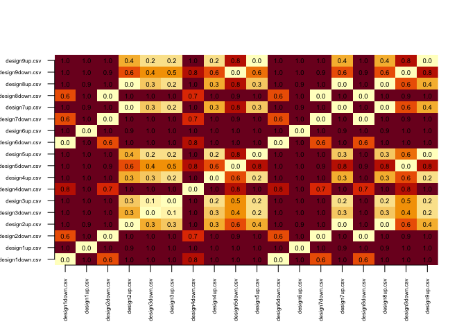<!-- -->

```r
#dev.off()
```

### Dit plot

```r
gwas_genes<-read.csv(file=paste0(WDP,'/all_PD_gwas_loci_genes_filtered.csv'))$hgnc_symbol
file_path=paste0(WDP,'/cont_split')
des_path=paste0(WDP,'/Output')
dittplot(gwas_genes,file_path,des_path)
```

```
## Saving 7 x 5 in image
## Saving 7 x 5 in image
```

## Gene Set Enrichment Analysis (GSEA)


```r
genes_rank <- setNames(mk_genes$avg_log2FC, casefold(rownames(mk_genes),upper = T))
head(genes_rank)
```

```
##       FEV       NTM     LUZP2    ZNF503    PLXDC2     GRIA4 
## 1.0922771 0.9308030 0.7504550 0.7777264 0.6357738 0.6472063
```

```r
msigdbgmt <- msigdbr::msigdbr("Homo sapiens")
msigdbgmt <- as.data.frame(msigdbgmt)
```
You check the  list  of available gene sets

```r
unique(msigdbgmt$gs_subcat)
```

```
##  [1] "MIR:MIR_Legacy"  "TFT:TFT_Legacy"  "CGP"             "TFT:GTRD"       
##  [5] ""                "VAX"             "CP:BIOCARTA"     "CGN"            
##  [9] "GO:BP"           "GO:CC"           "IMMUNESIGDB"     "GO:MF"          
## [13] "HPO"             "CP:KEGG"         "MIR:MIRDB"       "CM"             
## [17] "CP"              "CP:PID"          "CP:REACTOME"     "CP:WIKIPATHWAYS"
```
Select the subset that you need.

```r
msigdbgmt_subset <- msigdbgmt[msigdbgmt$gs_subcat == "GO:BP", ]
gmt <- lapply(unique(msigdbgmt_subset$gs_name), function(x) {
    msigdbgmt_subset[msigdbgmt_subset$gs_name == x, "gene_symbol"]
})
names(gmt) <- unique(paste0(msigdbgmt_subset$gs_name, "_", msigdbgmt_subset$gs_exact_source))
gmt %>% head() %>% lapply(head)
```

```
## $`GOBP_10_FORMYLTETRAHYDROFOLATE_METABOLIC_PROCESS_GO:0009256`
## [1] "AASDHPPT" "ALDH1L1"  "ALDH1L2"  "MTHFD1"   "MTHFD1L"  "MTHFD2L" 
## 
## $`GOBP_2_OXOGLUTARATE_METABOLIC_PROCESS_GO:0006103`
## [1] "AADAT"  "ADHFE1" "D2HGDH" "DLST"   "GOT1"   "GOT2"  
## 
## $`GOBP_2FE_2S_CLUSTER_ASSEMBLY_GO:0044571`
## [1] "BOLA2"  "BOLA2B" "GLRX3"  "GLRX5"  "HSCB"   "NFS1"  
## 
## $`GOBP_3_PHOSPHOADENOSINE_5_PHOSPHOSULFATE_BIOSYNTHETIC_PROCESS_GO:0050428`
## [1] "PAPSS1"  "PAPSS2"  "SLC26A1" "SLC26A2" "SLC35B2" "SLC35B3"
## 
## $`GOBP_3_PHOSPHOADENOSINE_5_PHOSPHOSULFATE_METABOLIC_PROCESS_GO:0050427`
## [1] "ABHD14B" "BPNT1"   "ENPP1"   "PAPSS1"  "PAPSS2"  "SLC26A1"
## 
## $`GOBP_3_UTR_MEDIATED_MRNA_DESTABILIZATION_GO:0061158`
## [1] "CPEB3"  "DHX36"  "DHX36"  "DND1"   "DND1"   "HNRNPD"
```


conduct enrichemnt analysis and order according the ES

```r
fgseaRes <- fgsea(pathways = gmt, stats = genes_rank, minSize = 15, maxSize = 500, scoreType = "pos")
fgseaRes <- fgseaRes[order(fgseaRes$ES, decreasing = T), ]
```


```r
barplot(sort(genes_rank, decreasing = T))
```

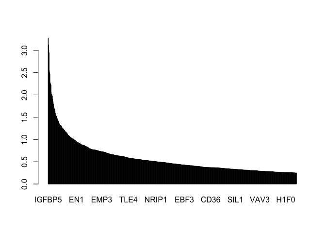<!-- -->

```r
head(fgseaRes[order( -abs(NES)), ], n=10)
```

```
##                                                      pathway         pval
##  1:                          GOBP_PROTEIN_FOLDING_GO:0006457 1.043428e-07
##  2:                   GOBP_GLIAL_CELL_DEVELOPMENT_GO:0021782 1.555491e-03
##  3:     GOBP_MULTI_MULTICELLULAR_ORGANISM_PROCESS_GO:0044706 1.776387e-03
##  4:             GOBP_PEPTIDE_BIOSYNTHETIC_PROCESS_GO:0043043 1.066019e-04
##  5:                  GOBP_CYTOPLASMIC_TRANSLATION_GO:0002181 2.941356e-03
##  6:                    GOBP_RESPONSE_TO_METAL_ION_GO:0010038 3.089347e-03
##  7:               GOBP_AMIDE_BIOSYNTHETIC_PROCESS_GO:0043604 5.266381e-04
##  8: GOBP_RESPONSE_TO_ENDOPLASMIC_RETICULUM_STRESS_GO:0034976 2.127409e-03
##  9:    GOBP_PROTEASOMAL_PROTEIN_CATABOLIC_PROCESS_GO:0010498 8.892796e-03
## 10: GOBP_CELLULAR_RESPONSE_TO_INORGANIC_SUBSTANCE_GO:0071241 9.341162e-03
##             padj   log2err        ES      NES size
##  1: 6.271004e-05 0.7049757 0.7576315 2.446605   20
##  2: 1.334511e-01 0.4550599 0.6283919 1.946792   15
##  3: 1.334511e-01 0.4550599 0.6017259 1.930405   19
##  4: 3.203386e-02 0.5384341 0.5549910 1.919229   36
##  5: 1.428229e-01 0.4317077 0.6095427 1.888396   15
##  6: 1.428229e-01 0.4317077 0.5672391 1.852131   22
##  7: 1.051354e-01 0.4772708 0.5270206 1.846684   40
##  8: 1.345279e-01 0.4317077 0.5386361 1.815753   29
##  9: 2.545033e-01 0.3807304 0.5585477 1.791884   19
## 10: 2.551836e-01 0.3807304 0.5626956 1.789993   18
##                                  leadingEdge
##  1:  PDIA6,HSP90B1,HSPA5,CALR,PPIB,PDIA3,...
##  2:         VIM,MDK,SHH,NKX6-2,CLU,PRDM8,...
##  3:           IGFBP5,IGFBP2,CALR,TIMP1,NR2F2
##  4:    IGFBP5,VIM,CALR,DNAJC3,RPL12,ENC1,...
##  5: RPL12,RPS12,RPS20,RPS11,RPS27,RPL27A,...
##  6: IGFBP2,HSPA5,CALR,SERPINF1,SHH,CPNE8,...
##  7:    IGFBP5,VIM,CALR,DNAJC3,RPL12,ENC1,...
##  8:  HSP90B1,HSPA5,CALR,PDIA3,PDIA4,MANF,...
##  9:    HSP90B1,HSPA5,CALR,SDF2L1,SHH,CLU,...
## 10:      HSPA5,CALR,SERPINF1,SHH,CPNE8,SYT11
```

get enrichment score plot for a specific pathway

```r
plotEnrichment(gmt[["GOBP_ACTIN_FILAMENT_BASED_PROCESS_GO:0030029"]], genes_rank)
```

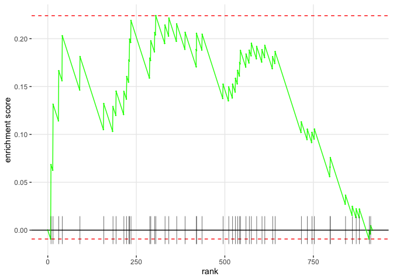<!-- -->

You can plot enrichment for multiple pathways.

```r
top_up <- fgseaRes %>% filter(ES > 0) %>% top_n(10, wt=-padj)
top_down <- fgseaRes %>% filter(ES < 0) %>% top_n(10, wt=-padj)
top_pathways <- bind_rows(top_up, top_down) %>% arrange(-ES)
plotGseaTable(gmt[top_pathways$pathway], genes_rank, fgseaRes, gseaParam = 0.5)
```

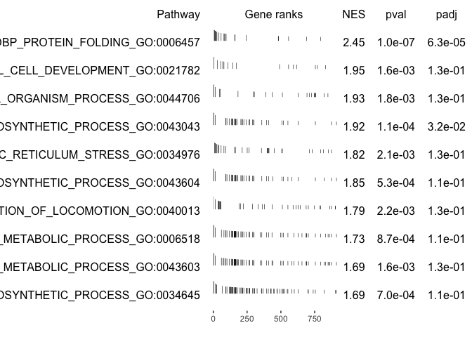<!-- -->

The following barplot can be used to compare Hallmark pathways (obtained from  https://www.biostars.org/p/467197/)


```r
fgseaResTidy <- fgseaRes %>% as_tibble() %>% arrange(desc(NES))
fgseaResTidy %>% dplyr::select(-leadingEdge, -ES) %>% arrange(padj) %>% DT::datatable()
```

```{=html}
<div id="htmlwidget-4dff91cf25de6647e3e2" style="width:100%;height:auto;" class="datatables html-widget"></div>
<script type="application/json" data-for="htmlwidget-4dff91cf25de6647e3e2">{"x":{"filter":"none","vertical":false,"data":[["1","2","3","4","5","6","7","8","9","10","11","12","13","14","15","16","17","18","19","20","21","22","23","24","25","26","27","28","29","30","31","32","33","34","35","36","37","38","39","40","41","42","43","44","45","46","47","48","49","50","51","52","53","54","55","56","57","58","59","60","61","62","63","64","65","66","67","68","69","70","71","72","73","74","75","76","77","78","79","80","81","82","83","84","85","86","87","88","89","90","91","92","93","94","95","96","97","98","99","100","101","102","103","104","105","106","107","108","109","110","111","112","113","114","115","116","117","118","119","120","121","122","123","124","125","126","127","128","129","130","131","132","133","134","135","136","137","138","139","140","141","142","143","144","145","146","147","148","149","150","151","152","153","154","155","156","157","158","159","160","161","162","163","164","165","166","167","168","169","170","171","172","173","174","175","176","177","178","179","180","181","182","183","184","185","186","187","188","189","190","191","192","193","194","195","196","197","198","199","200","201","202","203","204","205","206","207","208","209","210","211","212","213","214","215","216","217","218","219","220","221","222","223","224","225","226","227","228","229","230","231","232","233","234","235","236","237","238","239","240","241","242","243","244","245","246","247","248","249","250","251","252","253","254","255","256","257","258","259","260","261","262","263","264","265","266","267","268","269","270","271","272","273","274","275","276","277","278","279","280","281","282","283","284","285","286","287","288","289","290","291","292","293","294","295","296","297","298","299","300","301","302","303","304","305","306","307","308","309","310","311","312","313","314","315","316","317","318","319","320","321","322","323","324","325","326","327","328","329","330","331","332","333","334","335","336","337","338","339","340","341","342","343","344","345","346","347","348","349","350","351","352","353","354","355","356","357","358","359","360","361","362","363","364","365","366","367","368","369","370","371","372","373","374","375","376","377","378","379","380","381","382","383","384","385","386","387","388","389","390","391","392","393","394","395","396","397","398","399","400","401","402","403","404","405","406","407","408","409","410","411","412","413","414","415","416","417","418","419","420","421","422","423","424","425","426","427","428","429","430","431","432","433","434","435","436","437","438","439","440","441","442","443","444","445","446","447","448","449","450","451","452","453","454","455","456","457","458","459","460","461","462","463","464","465","466","467","468","469","470","471","472","473","474","475","476","477","478","479","480","481","482","483","484","485","486","487","488","489","490","491","492","493","494","495","496","497","498","499","500","501","502","503","504","505","506","507","508","509","510","511","512","513","514","515","516","517","518","519","520","521","522","523","524","525","526","527","528","529","530","531","532","533","534","535","536","537","538","539","540","541","542","543","544","545","546","547","548","549","550","551","552","553","554","555","556","557","558","559","560","561","562","563","564","565","566","567","568","569","570","571","572","573","574","575","576","577","578","579","580","581","582","583","584","585","586","587","588","589","590","591","592","593","594","595","596","597","598","599","600","601"],["GOBP_PROTEIN_FOLDING_GO:0006457","GOBP_PEPTIDE_BIOSYNTHETIC_PROCESS_GO:0043043","GOBP_AMIDE_BIOSYNTHETIC_PROCESS_GO:0043604","GOBP_PEPTIDE_METABOLIC_PROCESS_GO:0006518","GOBP_CELLULAR_MACROMOLECULE_BIOSYNTHETIC_PROCESS_GO:0034645","GOBP_GLIAL_CELL_DEVELOPMENT_GO:0021782","GOBP_MULTI_MULTICELLULAR_ORGANISM_PROCESS_GO:0044706","GOBP_CELLULAR_AMIDE_METABOLIC_PROCESS_GO:0043603","GOBP_RESPONSE_TO_ENDOPLASMIC_RETICULUM_STRESS_GO:0034976","GOBP_NEGATIVE_REGULATION_OF_LOCOMOTION_GO:0040013","GOBP_CYTOPLASMIC_TRANSLATION_GO:0002181","GOBP_RESPONSE_TO_METAL_ION_GO:0010038","GOBP_REGULATION_OF_CELLULAR_MACROMOLECULE_BIOSYNTHETIC_PROCESS_GO:2000112","GOBP_MACROMOLECULE_CATABOLIC_PROCESS_GO:0009057","GOBP_PROTEIN_CATABOLIC_PROCESS_GO:0030163","GOBP_CELLULAR_RESPONSE_TO_ORGANIC_CYCLIC_COMPOUND_GO:0071407","GOBP_NEGATIVE_REGULATION_OF_PROTEIN_METABOLIC_PROCESS_GO:0051248","GOBP_AGING_GO:0007568","GOBP_CELLULAR_PROTEIN_CATABOLIC_PROCESS_GO:0044257","GOBP_ORGANONITROGEN_COMPOUND_BIOSYNTHETIC_PROCESS_GO:1901566","GOBP_PROTEASOMAL_PROTEIN_CATABOLIC_PROCESS_GO:0010498","GOBP_CELLULAR_RESPONSE_TO_INORGANIC_SUBSTANCE_GO:0071241","GOBP_OLIGODENDROCYTE_DIFFERENTIATION_GO:0048709","GOBP_PROTEASOME_MEDIATED_UBIQUITIN_DEPENDENT_PROTEIN_CATABOLIC_PROCESS_GO:0043161","GOBP_POSTTRANSCRIPTIONAL_REGULATION_OF_GENE_EXPRESSION_GO:0010608","GOBP_RESPONSE_TO_INORGANIC_SUBSTANCE_GO:0010035","GOBP_STRIATED_MUSCLE_CELL_DIFFERENTIATION_GO:0051146","GOBP_REGULATION_OF_CELLULAR_AMIDE_METABOLIC_PROCESS_GO:0034248","GOBP_REGULATION_OF_INFLAMMATORY_RESPONSE_GO:0050727","GOBP_REPRODUCTION_GO:0000003","GOBP_MODIFICATION_DEPENDENT_MACROMOLECULE_CATABOLIC_PROCESS_GO:0043632","GOBP_NEGATIVE_REGULATION_OF_CATABOLIC_PROCESS_GO:0009895","GOBP_ORGANONITROGEN_COMPOUND_CATABOLIC_PROCESS_GO:1901565","GOBP_REGULATION_OF_REPRODUCTIVE_PROCESS_GO:2000241","GOBP_NEGATIVE_REGULATION_OF_CELLULAR_CATABOLIC_PROCESS_GO:0031330","GOBP_RESPONSE_TO_ORGANIC_CYCLIC_COMPOUND_GO:0014070","GOBP_ENDOTHELIAL_CELL_PROLIFERATION_GO:0001935","GOBP_ORGANIC_HYDROXY_COMPOUND_TRANSPORT_GO:0015850","GOBP_LEUKOCYTE_MIGRATION_GO:0050900","GOBP_MULTI_ORGANISM_REPRODUCTIVE_PROCESS_GO:0044703","GOBP_NEGATIVE_REGULATION_OF_IMMUNE_SYSTEM_PROCESS_GO:0002683","GOBP_GLAND_MORPHOGENESIS_GO:0022612","GOBP_RESPONSE_TO_VIRUS_GO:0009615","GOBP_POSITIVE_REGULATION_OF_CELL_SUBSTRATE_ADHESION_GO:0010811","GOBP_MAINTENANCE_OF_LOCATION_GO:0051235","GOBP_REGULATION_OF_DEFENSE_RESPONSE_GO:0031347","GOBP_REGULATION_OF_VASCULATURE_DEVELOPMENT_GO:1901342","GOBP_MYELOID_LEUKOCYTE_MIGRATION_GO:0097529","GOBP_ENDOTHELIAL_CELL_MIGRATION_GO:0043542","GOBP_POSITIVE_REGULATION_OF_NEURON_PROJECTION_DEVELOPMENT_GO:0010976","GOBP_REGULATION_OF_ENDOTHELIAL_CELL_MIGRATION_GO:0010594","GOBP_HINDBRAIN_DEVELOPMENT_GO:0030902","GOBP_DEVELOPMENTAL_PROCESS_INVOLVED_IN_REPRODUCTION_GO:0003006","GOBP_RHYTHMIC_PROCESS_GO:0048511","GOBP_MUSCLE_TISSUE_DEVELOPMENT_GO:0060537","GOBP_POSITIVE_REGULATION_OF_IMMUNE_SYSTEM_PROCESS_GO:0002684","GOBP_LIPID_LOCALIZATION_GO:0010876","GOBP_RESPONSE_TO_XENOBIOTIC_STIMULUS_GO:0009410","GOBP_POSITIVE_REGULATION_OF_CELL_DEVELOPMENT_GO:0010720","GOBP_REGULATION_OF_MUSCLE_SYSTEM_PROCESS_GO:0090257","GOBP_GAMETE_GENERATION_GO:0007276","GOBP_MUSCLE_CELL_DIFFERENTIATION_GO:0042692","GOBP_LEUKOCYTE_CHEMOTAXIS_GO:0030595","GOBP_CELLULAR_PROCESS_INVOLVED_IN_REPRODUCTION_IN_MULTICELLULAR_ORGANISM_GO:0022412","GOBP_REGULATION_OF_T_CELL_ACTIVATION_GO:0050863","GOBP_SUBSTRATE_ADHESION_DEPENDENT_CELL_SPREADING_GO:0034446","GOBP_RESPONSE_TO_TOPOLOGICALLY_INCORRECT_PROTEIN_GO:0035966","GOBP_NEGATIVE_REGULATION_OF_EPITHELIAL_CELL_PROLIFERATION_GO:0050680","GOBP_PROTEIN_MATURATION_GO:0051604","GOBP_OSTEOBLAST_DIFFERENTIATION_GO:0001649","GOBP_REGULATION_OF_WNT_SIGNALING_PATHWAY_GO:0030111","GOBP_MULTICELLULAR_ORGANISM_REPRODUCTION_GO:0032504","GOBP_EPITHELIAL_CELL_PROLIFERATION_GO:0050673","GOBP_REGULATION_OF_CATABOLIC_PROCESS_GO:0009894","GOBP_CAMERA_TYPE_EYE_DEVELOPMENT_GO:0043010","GOBP_REGULATION_OF_CELLULAR_COMPONENT_MOVEMENT_GO:0051270","GOBP_PROTEOLYSIS_GO:0006508","GOBP_MALE_GAMETE_GENERATION_GO:0048232","GOBP_REGULATION_OF_PROTEIN_STABILITY_GO:0031647","GOBP_REGULATION_OF_GLIAL_CELL_DIFFERENTIATION_GO:0045685","GOBP_ASTROCYTE_DIFFERENTIATION_GO:0048708","GOBP_INTRINSIC_APOPTOTIC_SIGNALING_PATHWAY_GO:0097193","GOBP_RECEPTOR_MEDIATED_ENDOCYTOSIS_GO:0006898","GOBP_RNA_PROCESSING_GO:0006396","GOBP_RESPIRATORY_SYSTEM_DEVELOPMENT_GO:0060541","GOBP_NEGATIVE_REGULATION_OF_PROTEOLYSIS_GO:0045861","GOBP_POSITIVE_REGULATION_OF_CELL_ACTIVATION_GO:0050867","GOBP_EXTERNAL_ENCAPSULATING_STRUCTURE_ORGANIZATION_GO:0045229","GOBP_NEGATIVE_REGULATION_OF_HYDROLASE_ACTIVITY_GO:0051346","GOBP_REGULATION_OF_PROTEIN_CONTAINING_COMPLEX_ASSEMBLY_GO:0043254","GOBP_GLIAL_CELL_DIFFERENTIATION_GO:0010001","GOBP_RESPONSE_TO_CYTOKINE_GO:0034097","GOBP_REGULATION_OF_EPITHELIAL_CELL_MIGRATION_GO:0010632","GOBP_REGULATION_OF_CANONICAL_WNT_SIGNALING_PATHWAY_GO:0060828","GOBP_CELLULAR_RESPONSE_TO_NITROGEN_COMPOUND_GO:1901699","GOBP_INTRACELLULAR_PROTEIN_TRANSPORT_GO:0006886","GOBP_TRANSMEMBRANE_RECEPTOR_PROTEIN_SERINE_THREONINE_KINASE_SIGNALING_PATHWAY_GO:0007178","GOBP_REGULATION_OF_PROTEIN_CATABOLIC_PROCESS_GO:0042176","GOBP_NEGATIVE_REGULATION_OF_CATALYTIC_ACTIVITY_GO:0043086","GOBP_TISSUE_MIGRATION_GO:0090130","GOBP_NEGATIVE_REGULATION_OF_GENE_EXPRESSION_GO:0010629","GOBP_DEFENSE_RESPONSE_GO:0006952","GOBP_POSITIVE_REGULATION_OF_GENE_EXPRESSION_GO:0010628","GOBP_RESPONSE_TO_OXYGEN_CONTAINING_COMPOUND_GO:1901700","GOBP_RESPONSE_TO_LIPID_GO:0033993","GOBP_PROTEIN_CONTAINING_COMPLEX_ORGANIZATION_GO:0043933","GOBP_CELLULAR_MACROMOLECULE_LOCALIZATION_GO:0070727","GOBP_CELLULAR_RESPONSE_TO_OXYGEN_CONTAINING_COMPOUND_GO:1901701","GOBP_RESPONSE_TO_NITROGEN_COMPOUND_GO:1901698","GOBP_REGULATION_OF_CELL_POPULATION_PROLIFERATION_GO:0042127","GOBP_LEUKOCYTE_CELL_CELL_ADHESION_GO:0007159","GOBP_MRNA_METABOLIC_PROCESS_GO:0016071","GOBP_CELL_CELL_SIGNALING_BY_WNT_GO:0198738","GOBP_CELL_ACTIVATION_GO:0001775","GOBP_INTRACELLULAR_TRANSPORT_GO:0046907","GOBP_NEGATIVE_REGULATION_OF_MULTICELLULAR_ORGANISMAL_PROCESS_GO:0051241","GOBP_PROTEIN_PROCESSING_GO:0016485","GOBP_NEGATIVE_REGULATION_OF_CANONICAL_WNT_SIGNALING_PATHWAY_GO:0090090","GOBP_NEGATIVE_REGULATION_OF_WNT_SIGNALING_PATHWAY_GO:0030178","GOBP_RESPONSE_TO_MECHANICAL_STIMULUS_GO:0009612","GOBP_REGULATION_OF_MRNA_METABOLIC_PROCESS_GO:1903311","GOBP_RESPONSE_TO_RADIATION_GO:0009314","GOBP_NEGATIVE_REGULATION_OF_PEPTIDASE_ACTIVITY_GO:0010466","GOBP_LEUKOCYTE_PROLIFERATION_GO:0070661","GOBP_CELL_FATE_SPECIFICATION_GO:0001708","GOBP_NEGATIVE_REGULATION_OF_RESPONSE_TO_EXTERNAL_STIMULUS_GO:0032102","GOBP_TRANSMEMBRANE_RECEPTOR_PROTEIN_TYROSINE_KINASE_SIGNALING_PATHWAY_GO:0007169","GOBP_POSITIVE_REGULATION_OF_CELL_ADHESION_GO:0045785","GOBP_REGULATION_OF_CELLULAR_RESPONSE_TO_GROWTH_FACTOR_STIMULUS_GO:0090287","GOBP_RESPONSE_TO_PEPTIDE_GO:1901652","GOBP_DEFENSE_RESPONSE_TO_OTHER_ORGANISM_GO:0098542","GOBP_INFLAMMATORY_RESPONSE_GO:0006954","GOBP_CELLULAR_RESPONSE_TO_LIPID_GO:0071396","GOBP_NEGATIVE_REGULATION_OF_MOLECULAR_FUNCTION_GO:0044092","GOBP_CARBOHYDRATE_HOMEOSTASIS_GO:0033500","GOBP_BONE_DEVELOPMENT_GO:0060348","GOBP_REGULATION_OF_GLIOGENESIS_GO:0014013","GOBP_CELL_SUBSTRATE_ADHESION_GO:0031589","GOBP_CANONICAL_WNT_SIGNALING_PATHWAY_GO:0060070","GOBP_SKELETAL_MUSCLE_ORGAN_DEVELOPMENT_GO:0060538","GOBP_RESPONSE_TO_CORTICOSTEROID_GO:0031960","GOBP_INNATE_IMMUNE_RESPONSE_GO:0045087","GOBP_PROTEIN_LOCALIZATION_TO_ORGANELLE_GO:0033365","GOBP_POSITIVE_REGULATION_OF_CELL_PROJECTION_ORGANIZATION_GO:0031346","GOBP_NEGATIVE_REGULATION_OF_CELLULAR_COMPONENT_ORGANIZATION_GO:0051129","GOBP_GLAND_DEVELOPMENT_GO:0048732","GOBP_REGULATION_OF_IMMUNE_SYSTEM_PROCESS_GO:0002682","GOBP_REGULATION_OF_FAT_CELL_DIFFERENTIATION_GO:0045598","GOBP_NEGATIVE_REGULATION_OF_TRANSPORT_GO:0051051","GOBP_PROTEIN_LOCALIZATION_TO_PLASMA_MEMBRANE_GO:0072659","GOBP_NEGATIVE_REGULATION_OF_NEURON_DIFFERENTIATION_GO:0045665","GOBP_POSITIVE_REGULATION_OF_CELL_CELL_ADHESION_GO:0022409","GOBP_REGULATION_OF_SMALL_MOLECULE_METABOLIC_PROCESS_GO:0062012","GOBP_REGULATION_OF_LYMPHOCYTE_ACTIVATION_GO:0051249","GOBP_POSITIVE_REGULATION_OF_ENDOTHELIAL_CELL_MIGRATION_GO:0010595","GOBP_POSITIVE_REGULATION_OF_NEUROGENESIS_GO:0050769","GOBP_CELL_CHEMOTAXIS_GO:0060326","GOBP_CARTILAGE_DEVELOPMENT_GO:0051216","GOBP_CELL_SURFACE_RECEPTOR_SIGNALING_PATHWAY_INVOLVED_IN_CELL_CELL_SIGNALING_GO:1905114","GOBP_REGULATION_OF_CELL_SUBSTRATE_ADHESION_GO:0010810","GOBP_REGULATION_OF_CELL_ACTIVATION_GO:0050865","GOBP_GLIOGENESIS_GO:0042063","GOBP_MITOTIC_CELL_CYCLE_PHASE_TRANSITION_GO:0044772","GOBP_MUSCLE_STRUCTURE_DEVELOPMENT_GO:0061061","GOBP_ENZYME_LINKED_RECEPTOR_PROTEIN_SIGNALING_PATHWAY_GO:0007167","GOBP_PATTERN_SPECIFICATION_PROCESS_GO:0007389","GOBP_REGIONALIZATION_GO:0003002","GOBP_NEGATIVE_REGULATION_OF_CELL_POPULATION_PROLIFERATION_GO:0008285","GOBP_TRANSFORMING_GROWTH_FACTOR_BETA_RECEPTOR_SIGNALING_PATHWAY_GO:0007179","GOBP_NERVE_DEVELOPMENT_GO:0021675","GOBP_MUSCLE_SYSTEM_PROCESS_GO:0003012","GOBP_APPENDAGE_DEVELOPMENT_GO:0048736","GOBP_EPIDERMIS_DEVELOPMENT_GO:0008544","GOBP_RESPONSE_TO_HORMONE_GO:0009725","GOBP_DEVELOPMENTAL_MATURATION_GO:0021700","GOBP_REGULATION_OF_ENDOCYTOSIS_GO:0030100","GOBP_REPRODUCTIVE_SYSTEM_DEVELOPMENT_GO:0061458","GOBP_REGULATION_OF_NEURON_PROJECTION_DEVELOPMENT_GO:0010975","GOBP_REGULATION_OF_ION_TRANSMEMBRANE_TRANSPORT_GO:0034765","GOBP_RESPONSE_TO_ABIOTIC_STIMULUS_GO:0009628","GOBP_NEGATIVE_REGULATION_OF_RESPONSE_TO_STIMULUS_GO:0048585","GOBP_POSITIVE_REGULATION_OF_CELL_POPULATION_PROLIFERATION_GO:0008284","GOBP_EMBRYONIC_SKELETAL_SYSTEM_DEVELOPMENT_GO:0048706","GOBP_RESPONSE_TO_STEROID_HORMONE_GO:0048545","GOBP_GLYCOPROTEIN_BIOSYNTHETIC_PROCESS_GO:0009101","GOBP_OSSIFICATION_GO:0001503","GOBP_REGULATION_OF_VESICLE_MEDIATED_TRANSPORT_GO:0060627","GOBP_REGULATION_OF_RESPONSE_TO_STRESS_GO:0080134","GOBP_MUSCLE_ORGAN_DEVELOPMENT_GO:0007517","GOBP_GLYCOPROTEIN_METABOLIC_PROCESS_GO:0009100","GOBP_CELL_MIGRATION_GO:0016477","GOBP_BLOOD_VESSEL_MORPHOGENESIS_GO:0048514","GOBP_NEURON_MIGRATION_GO:0001764","GOBP_NEGATIVE_REGULATION_OF_CELLULAR_RESPONSE_TO_GROWTH_FACTOR_STIMULUS_GO:0090288","GOBP_REGULATION_OF_CELL_MORPHOGENESIS_GO:0022604","GOBP_PROTEIN_LOCALIZATION_TO_CELL_PERIPHERY_GO:1990778","GOBP_NEGATIVE_REGULATION_OF_PROTEIN_MODIFICATION_PROCESS_GO:0031400","GOBP_PANCREAS_DEVELOPMENT_GO:0031016","GOBP_ANATOMICAL_STRUCTURE_MATURATION_GO:0071695","GOBP_SKELETAL_SYSTEM_DEVELOPMENT_GO:0001501","GOBP_EPITHELIAL_CELL_DEVELOPMENT_GO:0002064","GOBP_SUPRAMOLECULAR_FIBER_ORGANIZATION_GO:0097435","GOBP_REGULATION_OF_CELL_DEATH_GO:0010941","GOBP_CARBOHYDRATE_METABOLIC_PROCESS_GO:0005975","GOBP_RESPONSE_TO_BACTERIUM_GO:0009617","GOBP_AXON_EXTENSION_GO:0048675","GOBP_MAMMARY_GLAND_DEVELOPMENT_GO:0030879","GOBP_ENDOCRINE_SYSTEM_DEVELOPMENT_GO:0035270","GOBP_CELLULAR_RESPONSE_TO_STEROID_HORMONE_STIMULUS_GO:0071383","GOBP_FAT_CELL_DIFFERENTIATION_GO:0045444","GOBP_CELL_FATE_COMMITMENT_GO:0045165","GOBP_APOPTOTIC_SIGNALING_PATHWAY_GO:0097190","GOBP_T_CELL_ACTIVATION_GO:0042110","GOBP_CELLULAR_RESPONSE_TO_ENDOGENOUS_STIMULUS_GO:0071495","GOBP_POSITIVE_REGULATION_OF_PROTEIN_LOCALIZATION_GO:1903829","GOBP_POSITIVE_REGULATION_OF_RESPONSE_TO_EXTERNAL_STIMULUS_GO:0032103","GOBP_ANTERIOR_POSTERIOR_PATTERN_SPECIFICATION_GO:0009952","GOBP_SENSORY_SYSTEM_DEVELOPMENT_GO:0048880","GOBP_POSITIVE_REGULATION_OF_LOCOMOTION_GO:0040017","GOBP_REGULATION_OF_METAL_ION_TRANSPORT_GO:0010959","GOBP_VESICLE_ORGANIZATION_GO:0016050","GOBP_RESPONSE_TO_ENDOGENOUS_STIMULUS_GO:0009719","GOBP_BIOLOGICAL_PROCESS_INVOLVED_IN_INTERSPECIES_INTERACTION_BETWEEN_ORGANISMS_GO:0044419","GOBP_CONNECTIVE_TISSUE_DEVELOPMENT_GO:0061448","GOBP_ORGANIC_HYDROXY_COMPOUND_METABOLIC_PROCESS_GO:1901615","GOBP_NEGATIVE_REGULATION_OF_DEVELOPMENTAL_PROCESS_GO:0051093","GOBP_NEGATIVE_REGULATION_OF_APOPTOTIC_SIGNALING_PATHWAY_GO:2001234","GOBP_REGULATION_OF_CELL_PROJECTION_ORGANIZATION_GO:0031344","GOBP_RESPONSE_TO_KETONE_GO:1901654","GOBP_LOCOMOTION_GO:0040011","GOBP_ERYTHROCYTE_HOMEOSTASIS_GO:0034101","GOBP_REGULATION_OF_CELLULAR_PROTEIN_CATABOLIC_PROCESS_GO:1903362","GOBP_GOLGI_VESICLE_TRANSPORT_GO:0048193","GOBP_REGULATION_OF_CELL_CELL_ADHESION_GO:0022407","GOBP_NEGATIVE_REGULATION_OF_SIGNALING_GO:0023057","GOBP_LYMPHOCYTE_ACTIVATION_GO:0046649","GOBP_COGNITION_GO:0050890","GOBP_NITROGEN_COMPOUND_TRANSPORT_GO:0071705","GOBP_PHAGOCYTOSIS_GO:0006909","GOBP_REGULATION_OF_APOPTOTIC_SIGNALING_PATHWAY_GO:2001233","GOBP_PEPTIDYL_AMINO_ACID_MODIFICATION_GO:0018193","GOBP_REGULATION_OF_ANATOMICAL_STRUCTURE_MORPHOGENESIS_GO:0022603","GOBP_POSITIVE_REGULATION_OF_CYTOKINE_PRODUCTION_GO:0001819","GOBP_REGULATION_OF_TRANSMEMBRANE_RECEPTOR_PROTEIN_SERINE_THREONINE_KINASE_SIGNALING_PATHWAY_GO:0090092","GOBP_NEGATIVE_REGULATION_OF_CELL_DEATH_GO:0060548","GOBP_POSITIVE_REGULATION_OF_NERVOUS_SYSTEM_DEVELOPMENT_GO:0051962","GOBP_INTRACELLULAR_RECEPTOR_SIGNALING_PATHWAY_GO:0030522","GOBP_ANATOMICAL_STRUCTURE_HOMEOSTASIS_GO:0060249","GOBP_VASCULATURE_DEVELOPMENT_GO:0001944","GOBP_CIRCULATORY_SYSTEM_DEVELOPMENT_GO:0072359","GOBP_MORPHOGENESIS_OF_A_BRANCHING_STRUCTURE_GO:0001763","GOBP_TUBE_DEVELOPMENT_GO:0035295","GOBP_CELL_CYCLE_G1_S_PHASE_TRANSITION_GO:0044843","GOBP_RESPONSE_TO_MOLECULE_OF_BACTERIAL_ORIGIN_GO:0002237","GOBP_RAS_PROTEIN_SIGNAL_TRANSDUCTION_GO:0007265","GOBP_EMBRYONIC_SKELETAL_SYSTEM_MORPHOGENESIS_GO:0048704","GOBP_CENTRAL_NERVOUS_SYSTEM_NEURON_DIFFERENTIATION_GO:0021953","GOBP_REGULATION_OF_EXOCYTOSIS_GO:0017157","GOBP_HOMEOSTATIC_PROCESS_GO:0042592","GOBP_ESTABLISHMENT_OF_PROTEIN_LOCALIZATION_GO:0045184","GOBP_CHONDROCYTE_DIFFERENTIATION_GO:0002062","GOBP_ORGANELLE_ASSEMBLY_GO:0070925","GOBP_CELL_PROJECTION_ASSEMBLY_GO:0030031","GOBP_EXTRINSIC_APOPTOTIC_SIGNALING_PATHWAY_GO:0097191","GOBP_EXOCYTOSIS_GO:0006887","GOBP_IN_UTERO_EMBRYONIC_DEVELOPMENT_GO:0001701","GOBP_LIPID_METABOLIC_PROCESS_GO:0006629","GOBP_POSITIVE_REGULATION_OF_CELL_DEATH_GO:0010942","GOBP_MEMBRANE_ORGANIZATION_GO:0061024","GOBP_REGULATION_OF_CELL_ADHESION_GO:0030155","GOBP_CELL_CYCLE_PHASE_TRANSITION_GO:0044770","GOBP_RESPONSE_TO_PEPTIDE_HORMONE_GO:0043434","GOBP_PROGRAMMED_CELL_DEATH_GO:0012501","GOBP_SEX_DIFFERENTIATION_GO:0007548","GOBP_CARBOHYDRATE_DERIVATIVE_METABOLIC_PROCESS_GO:1901135","GOBP_CYTOSKELETON_ORGANIZATION_GO:0007010","GOBP_POSITIVE_REGULATION_OF_VASCULATURE_DEVELOPMENT_GO:1904018","GOBP_REGULATION_OF_CHEMOTAXIS_GO:0050920","GOBP_EMBRYONIC_ORGAN_DEVELOPMENT_GO:0048568","GOBP_REGULATION_OF_CELL_DEVELOPMENT_GO:0060284","GOBP_NEGATIVE_REGULATION_OF_TRANSFERASE_ACTIVITY_GO:0051348","GOBP_REGULATION_OF_PROTEIN_MODIFICATION_PROCESS_GO:0031399","GOBP_NEGATIVE_REGULATION_OF_PHOSPHORYLATION_GO:0042326","GOBP_EMBRYONIC_ORGAN_MORPHOGENESIS_GO:0048562","GOBP_CELLULAR_RESPONSE_TO_STRESS_GO:0033554","GOBP_REGULATION_OF_PROTEOLYSIS_GO:0030162","GOBP_CATION_TRANSMEMBRANE_TRANSPORT_GO:0098655","GOBP_CELLULAR_RESPONSE_TO_HORMONE_STIMULUS_GO:0032870","GOBP_PROTEIN_MODIFICATION_BY_SMALL_PROTEIN_CONJUGATION_GO:0032446","GOBP_CHEMICAL_HOMEOSTASIS_GO:0048878","GOBP_EMBRYO_DEVELOPMENT_GO:0009790","GOBP_NEGATIVE_REGULATION_OF_BIOSYNTHETIC_PROCESS_GO:0009890","GOBP_REGULATION_OF_RESPONSE_TO_EXTERNAL_STIMULUS_GO:0032101","GOBP_AMEBOIDAL_TYPE_CELL_MIGRATION_GO:0001667","GOBP_REGULATION_OF_CELL_CYCLE_GO:0051726","GOBP_MYELOID_CELL_HOMEOSTASIS_GO:0002262","GOBP_CATION_TRANSPORT_GO:0006812","GOBP_REGULATION_OF_GROWTH_GO:0040008","GOBP_REGULATION_OF_CELLULAR_LOCALIZATION_GO:0060341","GOBP_EMBRYO_DEVELOPMENT_ENDING_IN_BIRTH_OR_EGG_HATCHING_GO:0009792","GOBP_POSITIVE_REGULATION_OF_IMMUNE_RESPONSE_GO:0050778","GOBP_RESPONSE_TO_EXTRACELLULAR_STIMULUS_GO:0009991","GOBP_NEURON_DEATH_GO:0070997","GOBP_POSITIVE_REGULATION_OF_SIGNALING_GO:0023056","GOBP_IMMUNE_RESPONSE_GO:0006955","GOBP_CYTOKINE_PRODUCTION_GO:0001816","GOBP_NEGATIVE_REGULATION_OF_PHOSPHORUS_METABOLIC_PROCESS_GO:0010563","GOBP_TAXIS_GO:0042330","GOBP_LEARNING_GO:0007612","GOBP_REGULATION_OF_LEUKOCYTE_DIFFERENTIATION_GO:1902105","GOBP_IMMUNE_SYSTEM_DEVELOPMENT_GO:0002520","GOBP_SMALL_MOLECULE_METABOLIC_PROCESS_GO:0044281","GOBP_TUBE_MORPHOGENESIS_GO:0035239","GOBP_DIVALENT_INORGANIC_CATION_HOMEOSTASIS_GO:0072507","GOBP_POSITIVE_REGULATION_OF_EPITHELIAL_CELL_MIGRATION_GO:0010634","GOBP_INORGANIC_ION_TRANSMEMBRANE_TRANSPORT_GO:0098660","GOBP_NEGATIVE_REGULATION_OF_CELL_DIFFERENTIATION_GO:0045596","GOBP_SENSORY_ORGAN_DEVELOPMENT_GO:0007423","GOBP_LOCALIZATION_WITHIN_MEMBRANE_GO:0051668","GOBP_ANATOMICAL_STRUCTURE_FORMATION_INVOLVED_IN_MORPHOGENESIS_GO:0048646","GOBP_DEVELOPMENT_OF_PRIMARY_SEXUAL_CHARACTERISTICS_GO:0045137","GOBP_NEURON_PROJECTION_EXTENSION_GO:1990138","GOBP_LOCOMOTORY_BEHAVIOR_GO:0007626","GOBP_IMMUNE_EFFECTOR_PROCESS_GO:0002252","GOBP_NEGATIVE_REGULATION_OF_NEURON_PROJECTION_DEVELOPMENT_GO:0010977","GOBP_REGULATION_OF_BINDING_GO:0051098","GOBP_CELL_CYCLE_GO:0007049","GOBP_APPENDAGE_MORPHOGENESIS_GO:0035107","GOBP_REGULATION_OF_CELL_CYCLE_PHASE_TRANSITION_GO:1901987","GOBP_MONONUCLEAR_CELL_DIFFERENTIATION_GO:1903131","GOBP_MYELOID_LEUKOCYTE_DIFFERENTIATION_GO:0002573","GOBP_ION_TRANSMEMBRANE_TRANSPORT_GO:0034220","GOBP_LEUKOCYTE_DIFFERENTIATION_GO:0002521","GOBP_CARBOHYDRATE_DERIVATIVE_BIOSYNTHETIC_PROCESS_GO:1901137","GOBP_MITOTIC_CELL_CYCLE_GO:0000278","GOBP_REGULATION_OF_TRANSMEMBRANE_TRANSPORT_GO:0034762","GOBP_PROTEIN_MODIFICATION_BY_SMALL_PROTEIN_CONJUGATION_OR_REMOVAL_GO:0070647","GOBP_POSITIVE_REGULATION_OF_EPITHELIAL_CELL_PROLIFERATION_GO:0050679","GOBP_FOREBRAIN_DEVELOPMENT_GO:0030900","GOBP_REGULATION_OF_HEMOPOIESIS_GO:1903706","GOBP_POSITIVE_REGULATION_OF_CELLULAR_COMPONENT_ORGANIZATION_GO:0051130","GOBP_NEUROTRANSMITTER_TRANSPORT_GO:0006836","GOBP_CENTRAL_NERVOUS_SYSTEM_DEVELOPMENT_GO:0007417","GOBP_FATTY_ACID_METABOLIC_PROCESS_GO:0006631","GOBP_METAL_ION_TRANSPORT_GO:0030001","GOBP_MYELOID_CELL_DIFFERENTIATION_GO:0030099","GOBP_REGULATION_OF_ION_TRANSPORT_GO:0043269","GOBP_POSITIVE_REGULATION_OF_TRANSPORT_GO:0051050","GOBP_REGULATION_OF_NEUROGENESIS_GO:0050767","GOBP_EMBRYONIC_MORPHOGENESIS_GO:0048598","GOBP_TELENCEPHALON_DEVELOPMENT_GO:0021537","GOBP_REGULATION_OF_SYSTEM_PROCESS_GO:0044057","GOBP_NEGATIVE_REGULATION_OF_INTRACELLULAR_SIGNAL_TRANSDUCTION_GO:1902532","GOBP_CALCIUM_ION_TRANSMEMBRANE_TRANSPORT_GO:0070588","GOBP_REGULATION_OF_ORGANELLE_ORGANIZATION_GO:0033043","GOBP_POSITIVE_REGULATION_OF_ESTABLISHMENT_OF_PROTEIN_LOCALIZATION_GO:1904951","GOBP_REGULATION_OF_MITOTIC_CELL_CYCLE_GO:0007346","GOBP_REGULATION_OF_INTRACELLULAR_SIGNAL_TRANSDUCTION_GO:1902531","GOBP_VIRAL_PROCESS_GO:0016032","GOBP_MULTICELLULAR_ORGANISMAL_HOMEOSTASIS_GO:0048871","GOBP_MITOTIC_CELL_CYCLE_PROCESS_GO:1903047","GOBP_REGULATION_OF_NEUROTRANSMITTER_LEVELS_GO:0001505","GOBP_REGULATION_OF_ANIMAL_ORGAN_MORPHOGENESIS_GO:2000027","GOBP_RESPONSE_TO_GROWTH_FACTOR_GO:0070848","GOBP_T_CELL_DIFFERENTIATION_GO:0030217","GOBP_REGULATION_OF_PROTEIN_LOCALIZATION_GO:0032880","GOBP_CARDIAC_MUSCLE_TISSUE_DEVELOPMENT_GO:0048738","GOBP_ADENYLATE_CYCLASE_MODULATING_G_PROTEIN_COUPLED_RECEPTOR_SIGNALING_PATHWAY_GO:0007188","GOBP_POSITIVE_REGULATION_OF_CELLULAR_BIOSYNTHETIC_PROCESS_GO:0031328","GOBP_SPINAL_CORD_DEVELOPMENT_GO:0021510","GOBP_POSITIVE_REGULATION_OF_INTRACELLULAR_SIGNAL_TRANSDUCTION_GO:1902533","GOBP_ADAPTIVE_IMMUNE_RESPONSE_GO:0002250","GOBP_CELLULAR_RESPONSE_TO_EXTERNAL_STIMULUS_GO:0071496","GOBP_ACTIN_FILAMENT_BASED_PROCESS_GO:0030029","GOBP_NEGATIVE_REGULATION_OF_TRANSCRIPTION_BY_RNA_POLYMERASE_II_GO:0000122","GOBP_HOMEOSTASIS_OF_NUMBER_OF_CELLS_GO:0048872","GOBP_CELLULAR_COMPONENT_DISASSEMBLY_GO:0022411","GOBP_NERVOUS_SYSTEM_PROCESS_GO:0050877","GOBP_TRANSMEMBRANE_TRANSPORT_GO:0055085","GOBP_NEGATIVE_REGULATION_OF_GROWTH_GO:0045926","GOBP_NEURON_DEVELOPMENT_GO:0048666","GOBP_NEGATIVE_REGULATION_OF_CELL_PROJECTION_ORGANIZATION_GO:0031345","GOBP_CELLULAR_LIPID_METABOLIC_PROCESS_GO:0044255","GOBP_RESPONSE_TO_TUMOR_NECROSIS_FACTOR_GO:0034612","GOBP_TISSUE_MORPHOGENESIS_GO:0048729","GOBP_REGULATION_OF_CELLULAR_RESPONSE_TO_STRESS_GO:0080135","GOBP_EPITHELIAL_CELL_DIFFERENTIATION_GO:0030855","GOBP_GROWTH_GO:0040007","GOBP_ION_TRANSPORT_GO:0006811","GOBP_NEURAL_TUBE_DEVELOPMENT_GO:0021915","GOBP_CELL_MORPHOGENESIS_INVOLVED_IN_DIFFERENTIATION_GO:0000904","GOBP_RESPONSE_TO_CARBOHYDRATE_GO:0009743","GOBP_POSITIVE_REGULATION_OF_PROTEIN_METABOLIC_PROCESS_GO:0051247","GOBP_CARDIOCYTE_DIFFERENTIATION_GO:0035051","GOBP_ESTABLISHMENT_OF_ORGANELLE_LOCALIZATION_GO:0051656","GOBP_HEMOSTASIS_GO:0007599","GOBP_NEUROGENESIS_GO:0022008","GOBP_SMALL_GTPASE_MEDIATED_SIGNAL_TRANSDUCTION_GO:0007264","GOBP_MUSCLE_CONTRACTION_GO:0006936","GOBP_REGULATION_OF_DNA_BINDING_TRANSCRIPTION_FACTOR_ACTIVITY_GO:0051090","GOBP_REGULATION_OF_TRANSPORT_GO:0051049","GOBP_RESPONSE_TO_TOXIC_SUBSTANCE_GO:0009636","GOBP_HEAD_DEVELOPMENT_GO:0060322","GOBP_POSITIVE_REGULATION_OF_CELL_DIFFERENTIATION_GO:0045597","GOBP_PALLIUM_DEVELOPMENT_GO:0021543","GOBP_REGULATION_OF_HEART_CONTRACTION_GO:0008016","GOBP_PROTEIN_LOCALIZATION_TO_EXTRACELLULAR_REGION_GO:0071692","GOBP_ION_HOMEOSTASIS_GO:0050801","GOBP_UROGENITAL_SYSTEM_DEVELOPMENT_GO:0001655","GOBP_METANEPHROS_DEVELOPMENT_GO:0001656","GOBP_ENDOCYTOSIS_GO:0006897","GOBP_REGULATION_OF_PEPTIDASE_ACTIVITY_GO:0052547","GOBP_METAL_ION_HOMEOSTASIS_GO:0055065","GOBP_POSITIVE_REGULATION_OF_TRANSCRIPTION_BY_RNA_POLYMERASE_II_GO:0045944","GOBP_EPITHELIUM_DEVELOPMENT_GO:0060429","GOBP_VESICLE_MEDIATED_TRANSPORT_GO:0016192","GOBP_SMALL_MOLECULE_BIOSYNTHETIC_PROCESS_GO:0044283","GOBP_POSITIVE_REGULATION_OF_ORGANELLE_ORGANIZATION_GO:0010638","GOBP_POSITIVE_REGULATION_OF_SECRETION_GO:0051047","GOBP_BIOLOGICAL_ADHESION_GO:0022610","GOBP_REGULATION_OF_NERVOUS_SYSTEM_DEVELOPMENT_GO:0051960","GOBP_CELLULAR_RESPONSE_TO_PEPTIDE_GO:1901653","GOBP_CELLULAR_ION_HOMEOSTASIS_GO:0006873","GOBP_ORGANELLE_LOCALIZATION_GO:0051640","GOBP_POSITIVE_REGULATION_OF_MULTICELLULAR_ORGANISMAL_PROCESS_GO:0051240","GOBP_NEURON_DIFFERENTIATION_GO:0030182","GOBP_MORPHOGENESIS_OF_AN_EPITHELIUM_GO:0002009","GOBP_CARDIAC_SEPTUM_DEVELOPMENT_GO:0003279","GOBP_CELL_MORPHOGENESIS_INVOLVED_IN_NEURON_DIFFERENTIATION_GO:0048667","GOBP_REGULATION_OF_BLOOD_CIRCULATION_GO:1903522","GOBP_MICROTUBULE_BASED_PROCESS_GO:0007017","GOBP_REGULATION_OF_PHOSPHORUS_METABOLIC_PROCESS_GO:0051174","GOBP_NEGATIVE_REGULATION_OF_NEURON_DEATH_GO:1901215","GOBP_NEPHRON_DEVELOPMENT_GO:0072006","GOBP_HEART_DEVELOPMENT_GO:0007507","GOBP_REGULATION_OF_CELL_CYCLE_PROCESS_GO:0010564","GOBP_REGULATION_OF_CELL_DIFFERENTIATION_GO:0045595","GOBP_NEGATIVE_REGULATION_OF_CYTOKINE_PRODUCTION_GO:0001818","GOBP_CELL_CYCLE_PROCESS_GO:0022402","GOBP_NEGATIVE_REGULATION_OF_NUCLEOBASE_CONTAINING_COMPOUND_METABOLIC_PROCESS_GO:0045934","GOBP_BIOMINERALIZATION_GO:0110148","GOBP_BONE_MINERALIZATION_GO:0030282","GOBP_AMIDE_TRANSPORT_GO:0042886","GOBP_RESPONSE_TO_TRANSFORMING_GROWTH_FACTOR_BETA_GO:0071559","GOBP_POSITIVE_REGULATION_OF_NEURON_DIFFERENTIATION_GO:0045666","GOBP_CELLULAR_HOMEOSTASIS_GO:0019725","GOBP_TISSUE_DEVELOPMENT_GO:0009888","GOBP_NEURAL_PRECURSOR_CELL_PROLIFERATION_GO:0061351","GOBP_NEGATIVE_REGULATION_OF_CELL_CYCLE_GO:0045786","GOBP_HORMONE_METABOLIC_PROCESS_GO:0042445","GOBP_CELL_PROJECTION_ORGANIZATION_GO:0030030","GOBP_CARDIAC_CHAMBER_DEVELOPMENT_GO:0003205","GOBP_CELL_CELL_ADHESION_GO:0098609","GOBP_BRANCHING_MORPHOGENESIS_OF_AN_EPITHELIAL_TUBE_GO:0048754","GOBP_RESPONSE_TO_OXYGEN_LEVELS_GO:0070482","GOBP_CELL_DIVISION_GO:0051301","GOBP_POSITIVE_REGULATION_OF_PROTEIN_MODIFICATION_PROCESS_GO:0031401","GOBP_NEURON_APOPTOTIC_PROCESS_GO:0051402","GOBP_NEGATIVE_REGULATION_OF_NERVOUS_SYSTEM_DEVELOPMENT_GO:0051961","GOBP_NEGATIVE_REGULATION_OF_MITOTIC_CELL_CYCLE_GO:0045930","GOBP_ANIMAL_ORGAN_MORPHOGENESIS_GO:0009887","GOBP_REACTIVE_OXYGEN_SPECIES_METABOLIC_PROCESS_GO:0072593","GOBP_DIENCEPHALON_DEVELOPMENT_GO:0021536","GOBP_DEVELOPMENTAL_GROWTH_GO:0048589","GOBP_ACTIN_FILAMENT_BUNDLE_ORGANIZATION_GO:0061572","GOBP_RESPONSE_TO_WOUNDING_GO:0009611","GOBP_REGULATION_OF_SUPRAMOLECULAR_FIBER_ORGANIZATION_GO:1902903","GOBP_PHOSPHORYLATION_GO:0016310","GOBP_HEART_MORPHOGENESIS_GO:0003007","GOBP_CELL_MORPHOGENESIS_GO:0000902","GOBP_NEGATIVE_REGULATION_OF_CELL_DEVELOPMENT_GO:0010721","GOBP_REGULATION_OF_HYDROLASE_ACTIVITY_GO:0051336","GOBP_HORMONE_TRANSPORT_GO:0009914","GOBP_REGULATION_OF_MULTICELLULAR_ORGANISMAL_DEVELOPMENT_GO:2000026","GOBP_CELLULAR_COMPONENT_MORPHOGENESIS_GO:0032989","GOBP_MESENCHYMAL_CELL_DEVELOPMENT_GO:0014031","GOBP_CALCIUM_ION_TRANSPORT_GO:0006816","GOBP_MESENCHYME_DEVELOPMENT_GO:0060485","GOBP_MONOCARBOXYLIC_ACID_METABOLIC_PROCESS_GO:0032787","GOBP_BEHAVIOR_GO:0007610","GOBP_POSITIVE_REGULATION_OF_DEVELOPMENTAL_PROCESS_GO:0051094","GOBP_ANION_TRANSPORT_GO:0006820","GOBP_DEVELOPMENTAL_GROWTH_INVOLVED_IN_MORPHOGENESIS_GO:0060560","GOBP_EAR_DEVELOPMENT_GO:0043583","GOBP_CELLULAR_RESPONSE_TO_DNA_DAMAGE_STIMULUS_GO:0006974","GOBP_HEART_PROCESS_GO:0003015","GOBP_POSITIVE_REGULATION_OF_DEVELOPMENTAL_GROWTH_GO:0048639","GOBP_REGULATION_OF_CELLULAR_COMPONENT_BIOGENESIS_GO:0044087","GOBP_MESENCHYMAL_CELL_DIFFERENTIATION_GO:0048762","GOBP_DEVELOPMENTAL_CELL_GROWTH_GO:0048588","GOBP_CELL_PART_MORPHOGENESIS_GO:0032990","GOBP_REGULATION_OF_NEURON_DIFFERENTIATION_GO:0045664","GOBP_PEPTIDE_TRANSPORT_GO:0015833","GOBP_CELL_GROWTH_GO:0016049","GOBP_POSITIVE_REGULATION_OF_PROTEOLYSIS_GO:0045862","GOBP_REGULATION_OF_OSSIFICATION_GO:0030278","GOBP_RESPONSE_TO_OXIDATIVE_STRESS_GO:0006979","GOBP_REGULATION_OF_PROTEIN_SERINE_THREONINE_KINASE_ACTIVITY_GO:0071900","GOBP_SENSORY_ORGAN_MORPHOGENESIS_GO:0090596","GOBP_NEURAL_CREST_CELL_DIFFERENTIATION_GO:0014033","GOBP_NEURON_PROJECTION_GUIDANCE_GO:0097485","GOBP_CENTRAL_NERVOUS_SYSTEM_NEURON_DEVELOPMENT_GO:0021954","GOBP_REGULATION_OF_PROTEIN_PHOSPHORYLATION_GO:0001932","GOBP_REGULATION_OF_TRANSFERASE_ACTIVITY_GO:0051338","GOBP_REGULATION_OF_ACTIN_FILAMENT_ORGANIZATION_GO:0110053","GOBP_SKELETAL_SYSTEM_MORPHOGENESIS_GO:0048705","GOBP_INSULIN_SECRETION_GO:0030073","GOBP_CELLULAR_RESPONSE_TO_CHEMICAL_STRESS_GO:0062197","GOBP_POSITIVE_REGULATION_OF_NUCLEOBASE_CONTAINING_COMPOUND_METABOLIC_PROCESS_GO:0045935","GOBP_POSITIVE_REGULATION_OF_PROTEIN_KINASE_ACTIVITY_GO:0045860","GOBP_LIPID_BIOSYNTHETIC_PROCESS_GO:0008610","GOBP_POSITIVE_REGULATION_OF_RNA_METABOLIC_PROCESS_GO:0051254","GOBP_ACTIN_FILAMENT_ORGANIZATION_GO:0007015","GOBP_CIRCULATORY_SYSTEM_PROCESS_GO:0003013","GOBP_CARDIAC_CHAMBER_MORPHOGENESIS_GO:0003206","GOBP_ESTABLISHMENT_OR_MAINTENANCE_OF_CELL_POLARITY_GO:0007163","GOBP_REGULATION_OF_HORMONE_SECRETION_GO:0046883","GOBP_REGULATION_OF_ACTIN_FILAMENT_BASED_PROCESS_GO:0032970","GOBP_SIGNAL_RELEASE_GO:0023061","GOBP_CELL_MATRIX_ADHESION_GO:0007160","GOBP_REGULATION_OF_CYTOSOLIC_CALCIUM_ION_CONCENTRATION_GO:0051480","GOBP_REGULATION_OF_MYELOID_CELL_DIFFERENTIATION_GO:0045637","GOBP_WOUND_HEALING_GO:0042060","GOBP_EXPORT_FROM_CELL_GO:0140352","GOBP_REGULATION_OF_PEPTIDE_TRANSPORT_GO:0090087","GOBP_SENSORY_PERCEPTION_GO:0007600","GOBP_REGULATION_OF_PROTEIN_KINASE_ACTIVITY_GO:0045859","GOBP_REGULATION_OF_AXONOGENESIS_GO:0050770","GOBP_NOTCH_SIGNALING_PATHWAY_GO:0007219","GOBP_REGULATION_OF_HORMONE_LEVELS_GO:0010817","GOBP_RESPONSE_TO_BMP_GO:0071772","GOBP_POSITIVE_REGULATION_OF_GROWTH_GO:0045927","GOBP_REGULATION_OF_SECRETION_GO:0051046","GOBP_REGULATION_OF_ESTABLISHMENT_OF_PROTEIN_LOCALIZATION_GO:0070201","GOBP_ORGANIC_ACID_METABOLIC_PROCESS_GO:0006082","GOBP_REGULATION_OF_PROTEIN_SECRETION_GO:0050708","GOBP_EPITHELIAL_TO_MESENCHYMAL_TRANSITION_GO:0001837","GOBP_REGULATION_OF_IMMUNE_RESPONSE_GO:0050776","GOBP_REGULATION_OF_CYTOSKELETON_ORGANIZATION_GO:0051493","GOBP_NEPHRON_EPITHELIUM_DEVELOPMENT_GO:0072009","GOBP_CELL_CELL_SIGNALING_GO:0007267","GOBP_NEGATIVE_REGULATION_OF_CELL_GROWTH_GO:0030308","GOBP_REGENERATION_GO:0031099","GOBP_SECRETION_GO:0046903","GOBP_EPITHELIAL_TUBE_MORPHOGENESIS_GO:0060562","GOBP_POSITIVE_REGULATION_OF_PROTEIN_PHOSPHORYLATION_GO:0001934","GOBP_REGULATION_OF_BODY_FLUID_LEVELS_GO:0050878","GOBP_MESONEPHROS_DEVELOPMENT_GO:0001823","GOBP_VESICLE_MEDIATED_TRANSPORT_IN_SYNAPSE_GO:0099003","GOBP_POSITIVE_REGULATION_OF_CELL_GROWTH_GO:0030307","GOBP_DENDRITE_DEVELOPMENT_GO:0016358","GOBP_REGULATION_OF_MEMBRANE_POTENTIAL_GO:0042391","GOBP_KIDNEY_MORPHOGENESIS_GO:0060993","GOBP_AXON_DEVELOPMENT_GO:0061564","GOBP_MICROTUBULE_CYTOSKELETON_ORGANIZATION_GO:0000226","GOBP_POSITIVE_REGULATION_OF_TRANSFERASE_ACTIVITY_GO:0051347","GOBP_NEGATIVE_REGULATION_OF_NEURON_APOPTOTIC_PROCESS_GO:0043524","GOBP_G_PROTEIN_COUPLED_RECEPTOR_SIGNALING_PATHWAY_GO:0007186","GOBP_POSITIVE_REGULATION_OF_PHOSPHORUS_METABOLIC_PROCESS_GO:0010562","GOBP_POSITIVE_REGULATION_OF_KINASE_ACTIVITY_GO:0033674","GOBP_POSITIVE_REGULATION_OF_CATABOLIC_PROCESS_GO:0009896","GOBP_REGULATION_OF_DEVELOPMENTAL_GROWTH_GO:0048638","GOBP_POSITIVE_REGULATION_OF_PEPTIDASE_ACTIVITY_GO:0010952","GOBP_MAPK_CASCADE_GO:0000165","GOBP_VASCULAR_PROCESS_IN_CIRCULATORY_SYSTEM_GO:0003018","GOBP_POSITIVE_REGULATION_OF_MOLECULAR_FUNCTION_GO:0044093","GOBP_CELL_CELL_ADHESION_VIA_PLASMA_MEMBRANE_ADHESION_MOLECULES_GO:0098742","GOBP_ERK1_AND_ERK2_CASCADE_GO:0070371","GOBP_ORGANIC_ACID_TRANSPORT_GO:0015849","GOBP_ORGANOPHOSPHATE_METABOLIC_PROCESS_GO:0019637","GOBP_CELLULAR_RESPONSE_TO_OXYGEN_LEVELS_GO:0071453","GOBP_REGULATION_OF_EXTENT_OF_CELL_GROWTH_GO:0061387","GOBP_KIDNEY_EPITHELIUM_DEVELOPMENT_GO:0072073","GOBP_EYE_MORPHOGENESIS_GO:0048592","GOBP_REGULATION_OF_TRANS_SYNAPTIC_SIGNALING_GO:0099177","GOBP_SYNAPTIC_SIGNALING_GO:0099536","GOBP_REGULATION_OF_CELL_SIZE_GO:0008361","GOBP_SECOND_MESSENGER_MEDIATED_SIGNALING_GO:0019932","GOBP_REGULATION_OF_CYSTEINE_TYPE_ENDOPEPTIDASE_ACTIVITY_GO:2000116","GOBP_STEM_CELL_DIFFERENTIATION_GO:0048863","GOBP_POSITIVE_REGULATION_OF_CELLULAR_COMPONENT_BIOGENESIS_GO:0044089","GOBP_RESPONSE_TO_ALCOHOL_GO:0097305","GOBP_REGULATION_OF_CELLULAR_COMPONENT_SIZE_GO:0032535","GOBP_HOMOPHILIC_CELL_ADHESION_VIA_PLASMA_MEMBRANE_ADHESION_MOLECULES_GO:0007156","GOBP_CELL_JUNCTION_ASSEMBLY_GO:0034329","GOBP_CELL_RECOGNITION_GO:0008037","GOBP_RESPONSE_TO_REACTIVE_OXYGEN_SPECIES_GO:0000302","GOBP_PEPTIDYL_TYROSINE_MODIFICATION_GO:0018212","GOBP_POSITIVE_REGULATION_OF_MAPK_CASCADE_GO:0043410","GOBP_REGULATION_OF_SYNAPSE_STRUCTURE_OR_ACTIVITY_GO:0050803","GOBP_REGULATION_OF_CELL_MATRIX_ADHESION_GO:0001952","GOBP_CELL_JUNCTION_ORGANIZATION_GO:0034330","GOBP_POSITIVE_REGULATION_OF_CELL_JUNCTION_ASSEMBLY_GO:1901890","GOBP_POSTSYNAPSE_ORGANIZATION_GO:0099173","GOBP_SYNAPSE_ASSEMBLY_GO:0007416","GOBP_SYNAPSE_ORGANIZATION_GO:0050808","GOBP_REGULATION_OF_ANATOMICAL_STRUCTURE_SIZE_GO:0090066","GOBP_POSITIVE_REGULATION_OF_CATALYTIC_ACTIVITY_GO:0043085","GOBP_REGULATION_OF_CELL_JUNCTION_ASSEMBLY_GO:1901888","GOBP_REGULATION_OF_GTPASE_ACTIVITY_GO:0043087","GOBP_POSITIVE_REGULATION_OF_HYDROLASE_ACTIVITY_GO:0051345"],[1.0434283316594e-07,0.000106601865652085,0.000526638086934343,0.000874670144021558,0.000700653787589093,0.00155549104624117,0.00177638676530138,0.00159230697767204,0.00212740862357548,0.00223840112813716,0.00294135598648835,0.00308934683606038,0.00290435828888476,0.00357031762893869,0.00412710749544871,0.00613484409399461,0.00606048326339786,0.00769715620221524,0.00829497547231816,0.00829497547231816,0.00889279591382428,0.00934116187841357,0.010536806540443,0.0106862623010595,0.0114335415885304,0.0126291898495111,0.0157707171400236,0.0163714885354388,0.0172726467693573,0.0184741928991579,0.0199761279559169,0.0205769026039674,0.021177677563747,0.0226796161644555,0.0229800040689946,0.025974025974026,0.028971028971029,0.027972027972028,0.0292881603313127,0.02997002997003,0.035964035964036,0.03996003996004,0.041958041958042,0.044955044955045,0.047952047952048,0.050949050949051,0.050949050949051,0.0539460539460539,0.0529470529470529,0.0589410589410589,0.0659340659340659,0.0659340659340659,0.0679320679320679,0.0709290709290709,0.0739260739260739,0.0729270729270729,0.0769230769230769,0.0779220779220779,0.0779220779220779,0.0849150849150849,0.0869130869130869,0.0929070929070929,0.100899100899101,0.101898101898102,0.107892107892108,0.112887112887113,0.10989010989011,0.111888111888112,0.101898101898102,0.10989010989011,0.112887112887113,0.10989010989011,0.102897102897103,0.106893106893107,0.116883116883117,0.117882117882118,0.115884115884116,0.126873126873127,0.146853146853147,0.144855144855145,0.150849150849151,0.13986013986014,0.151848151848152,0.156843156843157,0.165834165834166,0.137862137862138,0.167832167832168,0.163836163836164,0.167832167832168,0.170829170829171,0.127872127872128,0.125874125874126,0.163836163836164,0.164835164835165,0.131868131868132,0.145854145854146,0.146853146853147,0.167832167832168,0.134865134865135,0.16983016983017,0.137862137862138,0.146853146853147,0.131868131868132,0.124875124875125,0.168831168831169,0.168831168831169,0.157842157842158,0.163836163836164,0.166833166833167,0.148851148851149,0.176823176823177,0.17982017982018,0.176823176823177,0.174825174825175,0.180819180819181,0.177822177822178,0.192807192807193,0.194805194805195,0.194805194805195,0.202797202797203,0.203796203796204,0.201798201798202,0.201798201798202,0.204795204795205,0.210789210789211,0.187812187812188,0.185814185814186,0.191808191808192,0.196803196803197,0.198801198801199,0.210789210789211,0.210789210789211,0.210789210789211,0.214785214785215,0.221778221778222,0.21978021978022,0.217782217782218,0.220779220779221,0.224775224775225,0.236763236763237,0.230769230769231,0.232767232767233,0.237762237762238,0.231768231768232,0.236763236763237,0.235764235764236,0.230769230769231,0.242757242757243,0.241758241758242,0.258741258741259,0.262737262737263,0.260739260739261,0.273726273726274,0.285714285714286,0.302697302697303,0.260739260739261,0.293706293706294,0.283716283716284,0.277722277722278,0.304695304695305,0.2997002997003,0.282717282717283,0.323676323676324,0.288711288711289,0.24975024975025,0.267732267732268,0.26973026973027,0.256743256743257,0.344655344655345,0.347652347652348,0.313686313686314,0.350649350649351,0.355644355644356,0.274725274725275,0.353646353646354,0.357642357642358,0.317682317682318,0.30969030969031,0.358641358641359,0.288711288711289,0.274725274725275,0.292707292707293,0.342657342657343,0.336663336663337,0.362637362637363,0.333666333666334,0.333666333666334,0.297702297702298,0.350649350649351,0.345654345654346,0.270729270729271,0.316683316683317,0.342657342657343,0.378621378621379,0.352647352647353,0.385614385614386,0.354645354645355,0.388611388611389,0.38961038961039,0.345654345654346,0.387612387612388,0.370629370629371,0.317682317682318,0.392607392607393,0.378621378621379,0.404595404595405,0.400599400599401,0.376623376623377,0.410589410589411,0.376623376623377,0.383616383616384,0.372627372627373,0.384615384615385,0.358641358641359,0.414585414585415,0.40959040959041,0.395604395604396,0.382617382617383,0.386613386613387,0.408591408591409,0.426573426573427,0.361638361638362,0.385614385614386,0.411588411588412,0.41958041958042,0.401598401598402,0.434565434565435,0.413586413586414,0.441558441558442,0.383616383616384,0.435564435564436,0.440559440559441,0.440559440559441,0.428571428571429,0.416583416583417,0.440559440559441,0.444555444555445,0.448551448551449,0.454545454545455,0.45954045954046,0.456543456543457,0.461538461538462,0.464535464535465,0.466533466533467,0.456543456543457,0.477522477522478,0.478521478521479,0.484515484515485,0.475524475524476,0.483516483516484,0.462537462537463,0.486513486513487,0.483516483516484,0.481518481518482,0.481518481518482,0.498501498501498,0.485514485514486,0.483516483516484,0.494505494505495,0.474525474525474,0.495504495504495,0.488511488511489,0.513486513486514,0.494505494505495,0.513486513486514,0.504495504495505,0.480519480519481,0.500499500499501,0.504495504495505,0.521478521478521,0.505494505494505,0.493506493506494,0.529470529470529,0.505494505494505,0.519480519480519,0.54045954045954,0.532467532467532,0.527472527472527,0.527472527472527,0.53946053946054,0.513486513486514,0.559440559440559,0.513486513486514,0.537462537462537,0.553446553446553,0.555444555444555,0.565434565434565,0.545454545454545,0.555444555444555,0.573426573426573,0.581418581418581,0.58041958041958,0.585414585414585,0.588411588411588,0.581418581418581,0.53946053946054,0.592407592407592,0.592407592407592,0.585414585414585,0.598401598401598,0.575424575424575,0.575424575424575,0.579420579420579,0.611388611388611,0.613386613386613,0.589410589410589,0.564435564435564,0.62037962037962,0.563436563436563,0.587412587412587,0.625374625374625,0.621378621378621,0.626373626373626,0.6003996003996,0.595404595404595,0.594405594405594,0.636363636363636,0.631368631368631,0.609390609390609,0.648351648351648,0.596403596403596,0.613386613386613,0.606393606393606,0.619380619380619,0.609390609390609,0.611388611388611,0.668331668331668,0.598401598401598,0.619380619380619,0.626373626373626,0.628371628371628,0.653346653346653,0.641358641358641,0.645354645354645,0.656343656343656,0.657342657342657,0.63036963036963,0.635364635364635,0.668331668331668,0.654345654345654,0.691308691308691,0.64035964035964,0.721278721278721,0.621378621378621,0.673326673326673,0.658341658341658,0.679320679320679,0.692307692307692,0.685314685314685,0.703296703296703,0.673326673326673,0.666333666333666,0.674325674325674,0.635364635364635,0.693306693306693,0.642357642357642,0.672327672327672,0.742257742257742,0.666333666333666,0.683316683316683,0.676323676323676,0.645354645354645,0.648351648351648,0.738261738261738,0.672327672327672,0.699300699300699,0.661338661338661,0.671328671328671,0.776223776223776,0.674325674325674,0.722277722277722,0.67032967032967,0.672327672327672,0.724275724275724,0.759240759240759,0.703296703296703,0.677322677322677,0.79020979020979,0.741258741258741,0.708291708291708,0.822177822177822,0.712287712287712,0.715284715284715,0.689310689310689,0.763236763236763,0.742257742257742,0.757242757242757,0.808191808191808,0.8001998001998,0.699300699300699,0.81018981018981,0.701298701298701,0.796203796203796,0.701298701298701,0.702297702297702,0.707292707292707,0.882117882117882,0.733266733266733,0.726273726273726,0.739260739260739,0.833166833166833,0.715284715284715,0.822177822177822,0.828171828171828,0.732267732267732,0.714285714285714,0.757242757242757,0.781218781218781,0.777222777222777,0.734265734265734,0.77022977022977,0.77022977022977,0.771228771228771,0.843156843156843,0.846153846153846,0.856143856143856,0.762237762237762,0.757242757242757,0.755244755244755,0.884115884115884,0.822177822177822,0.768231768231768,0.796203796203796,0.763236763236763,0.897102897102897,0.909090909090909,0.814185814185814,0.754245754245754,0.859140859140859,0.757242757242757,0.767232767232767,0.842157842157842,0.786213786213786,0.766233766233766,0.822177822177822,0.801198801198801,0.923076923076923,0.759240759240759,0.826173826173826,0.891108891108891,0.762237762237762,0.762237762237762,0.774225774225774,0.8001998001998,0.782217782217782,0.84015984015984,0.935064935064935,0.779220779220779,0.792207792207792,0.781218781218781,0.924075924075924,0.781218781218781,0.896103896103896,0.8001998001998,0.817182817182817,0.8001998001998,0.852147852147852,0.813186813186813,0.82017982017982,0.784215784215784,0.921078921078921,0.788211788211788,0.788211788211788,0.88011988011988,0.797202797202797,0.876123876123876,0.801198801198801,0.909090909090909,0.833166833166833,0.921078921078921,0.842157842157842,0.889110889110889,0.822177822177822,0.942057942057942,0.925074925074925,0.82017982017982,0.844155844155844,0.888111888111888,0.831168831168831,0.903096903096903,0.954045954045954,0.824175824175824,0.882117882117882,0.866133866133866,0.829170829170829,0.835164835164835,0.831168831168831,0.912087912087912,0.879120879120879,0.885114885114885,0.942057942057942,0.882117882117882,0.846153846153846,0.911088911088911,0.89010989010989,0.858141858141858,0.89010989010989,0.87012987012987,0.896103896103896,0.848151848151848,0.912087912087912,0.851148851148851,0.927072927072927,0.921078921078921,0.855144855144855,0.916083916083916,0.863136863136863,0.877122877122877,0.98001998001998,0.87012987012987,0.864135864135864,0.984015984015984,0.915084915084915,0.932067932067932,0.87012987012987,0.871128871128871,0.883116883116883,0.908091908091908,0.93006993006993,0.907092907092907,0.887112887112887,0.886113886113886,0.939060939060939,0.956043956043956,0.888111888111888,0.94005994005994,0.937062937062937,0.925074925074925,0.894105894105894,0.949050949050949,0.912087912087912,0.913086913086913,0.951048951048951,0.944055944055944,0.945054945054945,0.914085914085914,0.884115884115884,0.953046953046953,0.936063936063936,0.912087912087912,0.998001998001998,0.896103896103896,0.912087912087912,0.98001998001998,0.965034965034965,0.964035964035964,0.949050949050949,0.925074925074925,0.924075924075924,0.924075924075924,0.923076923076923,0.97002997002997,0.933066933066933,0.985014985014985,0.942057942057942,0.978021978021978,0.958041958041958,0.988011988011988,0.988011988011988,0.974025974025974,0.964035964035964,0.985014985014985,0.964035964035964,0.995004995004995,0.957042957042957,0.996003996003996,0.984015984015984,0.99000999000999,0.972027972027972,0.967032967032967,0.972027972027972,0.973026973026973,0.981018981018981,0.974025974025974,0.997002997002997,0.999000999000999,0.984015984015984,0.991008991008991,0.984015984015984,0.993006993006993,0.998001998001998,0.993006993006993,0.994005994005994,0.99000999000999,0.998001998001998,0.992007992007992,0.992007992007992,0.994005994005994,1,0.997002997002997,0.996003996003996,1,0.998001998001998,0.998001998001998,0.999000999000999,1,1,1,0.999000999000999,0.999000999000999,1],[6.27100427327301e-05,0.0320338606284515,0.105135351311391,0.105135351311391,0.105135351311391,0.133451055743266,0.133451055743266,0.133451055743266,0.134527907801043,0.134527907801043,0.142822880651714,0.142822880651714,0.142822880651714,0.153268635356582,0.165359440317645,0.21688478238181,0.21688478238181,0.249264012943161,0.249264012943161,0.249264012943161,0.254503349724209,0.255183558587571,0.267601818455698,0.267601818455698,0.274862339788271,0.291928580752161,0.35104448152423,0.35140230749281,0.357960714082198,0.37009966441313,0.38569043078218,0.38569043078218,0.38569043078218,0.394599498441878,0.394599498441878,0.433621933621934,0.4502997002997,0.4502997002997,0.4502997002997,0.4502997002997,0.527180136936235,0.571809143237715,0.586436818994959,0.614045045863228,0.64042624042624,0.651497438731481,0.651497438731481,0.661664865746498,0.661664865746498,0.708471528471528,0.762045646661031,0.762045646661031,0.770324015607035,0.789414289414289,0.793385186242329,0.793385186242329,0.793748624257099,0.793748624257099,0.793748624257099,0.850566100566101,0.85630762679943,0.900599400599401,0.916826416826417,0.916826416826417,0.916826416826417,0.916826416826417,0.916826416826417,0.916826416826417,0.916826416826417,0.916826416826417,0.916826416826417,0.916826416826417,0.916826416826417,0.916826416826417,0.920092894118868,0.920092894118868,0.920092894118868,0.933348469712106,0.933348469712106,0.933348469712106,0.933348469712106,0.933348469712106,0.933348469712106,0.933348469712106,0.933348469712106,0.933348469712106,0.933348469712106,0.933348469712106,0.933348469712106,0.933348469712106,0.933348469712106,0.933348469712106,0.933348469712106,0.933348469712106,0.933348469712106,0.933348469712106,0.933348469712106,0.933348469712106,0.933348469712106,0.933348469712106,0.933348469712106,0.933348469712106,0.933348469712106,0.933348469712106,0.933348469712106,0.933348469712106,0.933348469712106,0.933348469712106,0.933348469712106,0.933348469712106,0.936830410968342,0.936830410968342,0.936830410968342,0.936830410968342,0.936830410968342,0.936830410968342,0.952513651761772,0.952513651761772,0.952513651761772,0.952513651761772,0.952513651761772,0.952513651761772,0.952513651761772,0.952513651761772,0.952513651761772,0.952513651761772,0.952513651761772,0.952513651761772,0.952513651761772,0.952513651761772,0.952513651761772,0.952513651761772,0.952513651761772,0.96332771705906,0.965860226729792,0.965860226729792,0.965860226729792,0.965860226729792,0.971869856761943,0.972075543504115,0.972075543504115,0.972075543504115,0.972075543504115,0.972075543504115,0.972075543504115,0.972075543504115,0.972075543504115,0.979175187228878,0.979175187228878,1,1,1,1,1,1,1,1,1,1,1,1,1,1,1,1,1,1,1,1,1,1,1,1,1,1,1,1,1,1,1,1,1,1,1,1,1,1,1,1,1,1,1,1,1,1,1,1,1,1,1,1,1,1,1,1,1,1,1,1,1,1,1,1,1,1,1,1,1,1,1,1,1,1,1,1,1,1,1,1,1,1,1,1,1,1,1,1,1,1,1,1,1,1,1,1,1,1,1,1,1,1,1,1,1,1,1,1,1,1,1,1,1,1,1,1,1,1,1,1,1,1,1,1,1,1,1,1,1,1,1,1,1,1,1,1,1,1,1,1,1,1,1,1,1,1,1,1,1,1,1,1,1,1,1,1,1,1,1,1,1,1,1,1,1,1,1,1,1,1,1,1,1,1,1,1,1,1,1,1,1,1,1,1,1,1,1,1,1,1,1,1,1,1,1,1,1,1,1,1,1,1,1,1,1,1,1,1,1,1,1,1,1,1,1,1,1,1,1,1,1,1,1,1,1,1,1,1,1,1,1,1,1,1,1,1,1,1,1,1,1,1,1,1,1,1,1,1,1,1,1,1,1,1,1,1,1,1,1,1,1,1,1,1,1,1,1,1,1,1,1,1,1,1,1,1,1,1,1,1,1,1,1,1,1,1,1,1,1,1,1,1,1,1,1,1,1,1,1,1,1,1,1,1,1,1,1,1,1,1,1,1,1,1,1,1,1,1,1,1,1,1,1,1,1,1,1,1,1,1,1,1,1,1,1,1,1,1,1,1,1,1,1,1,1,1,1,1,1,1,1,1,1,1,1,1,1,1,1,1,1,1,1,1,1,1,1,1,1,1,1,1,1,1,1,1,1,1,1,1,1,1,1,1,1,1,1,1,1,1,1,1,1,1,1,1,1,1,1,1,1,1,1,1,1,1,1,1,1,1,1,1,1,1,1,1,1,1,1,1,1,1,1,1,1,1,1,1,1,1,1,1,1,1,1,1,1,1,1,1,1,1,1,1,1,1,1,1,1,1,1,1],[0.704975715167238,0.538434096309916,0.477270815362862,0.477270815362862,0.477270815362862,0.45505986738723,0.45505986738723,0.45505986738723,0.431707695803346,0.431707695803346,0.431707695803346,0.431707695803346,0.431707695803346,0.431707695803346,0.407017918923954,0.407017918923954,0.407017918923954,0.407017918923954,0.380730400722792,0.380730400722792,0.380730400722792,0.380730400722792,0.380730400722792,0.380730400722792,0.380730400722792,0.380730400722792,0.352487857583619,0.352487857583619,0.352487857583619,0.352487857583619,0.352487857583619,0.352487857583619,0.352487857583619,0.352487857583619,0.352487857583619,0.282013350011725,0.266350657088526,0.271288554688953,0.352487857583619,0.261663521711573,0.237793834423688,0.224966093540314,0.219250346703755,0.211400189384923,0.204294756516886,0.197822021315103,0.197822021315103,0.191892240384838,0.193813302725311,0.183023938384487,0.172324344900946,0.172324344900946,0.169570644405628,0.165656695205483,0.161978948883402,0.163180127180689,0.158514105424824,0.157402899305283,0.157402899305283,0.150169802128406,0.148261500475107,0.142901149386948,0.136490437780413,0.135740943810425,0.131457611642763,0.128142916898415,0.130105630751129,0.128788713061714,0.135740943810425,0.130105630751129,0.128142916898415,0.130105630751129,0.135002033828631,0.132147260608774,0.12563992130984,0.125033367555272,0.126253987849115,0.119887845115423,0.110122263835536,0.11101149245045,0.108394255853397,0.11331290842208,0.107972360317345,0.105920292736253,0.102449405629826,0.114266502484433,0.101713902282311,0.103197466945307,0.101713902282311,0.100633389423036,0.119348440591015,0.120433371642259,0.103197466945307,0.102821842840815,0.117249716749792,0.110564716336619,0.110122263835536,0.101713902282311,0.115734447701689,0.100990587455923,0.114266502484433,0.110122263835536,0.117249716749792,0.120985142145252,0.101350743797099,0.101350743797099,0.105520936843198,0.103197466945307,0.102080107662747,0.109250039480711,0.0985499803531691,0.09754492162472,0.0985499803531691,0.0992333343771191,0.0972150808846466,0.0982123351217438,0.0934449219410994,0.0928481214159878,0.0928481214159878,0.0905428948469474,0.0902635484340068,0.0908241419007155,0.0908241419007155,0.0899860794997137,0.0883594442500905,0.0949751525905595,0.0956031492204301,0.0937465422491719,0.0922597260527354,0.0916795246008379,0.0883594442500905,0.0883594442500905,0.0883594442500905,0.0873098257637931,0.0855356947987884,0.0860347242455604,0.0865399737444125,0.0857844408075645,0.0847985102819124,0.0819778796501272,0.0833634065110386,0.0828962134571565,0.0817515582532145,0.083129129135339,0.0819778796501272,0.0822054920415869,0.0833634065110386,0.0806388495950661,0.0808589150280032,0.077274697304471,0.0764767053228531,0.0768736734126542,0.0743625384422526,0.0721797965581253,0.0692836467392548,0.0768736734126542,0.0707899094502623,0.0725351864394589,0.0736212741014394,0.0689567351672811,0.0697792517076235,0.0727141077934447,0.065981614400873,0.0716527366829457,0.0791316651768349,0.0755015292281669,0.0751181635276301,0.0776798560117236,0.0629394692018967,0.0625237414724762,0.0675188953767744,0.0621124188949471,0.0614364107201271,0.0741758965588009,0.0617054053637522,0.0611692626746689,0.0668966276500666,0.0681513438679483,0.0610363728309177,0.0716527366829457,0.0741758965588009,0.0709609456938284,0.0632191170859458,0.0640703750499722,0.0605092988656667,0.0645031249656493,0.0645031249656493,0.070113215764256,0.0621124188949471,0.0628003977812234,0.0749278818393739,0.0670512579829467,0.0632191170859458,0.0584693210386381,0.0618406035753285,0.057609110864425,0.0615706755421678,0.0572461135202884,0.0571258510018113,0.0628003977812234,0.0573667426768556,0.059476028695732,0.0668966276500666,0.0567672387487446,0.0584693210386381,0.0553642837725362,0.055826471778749,0.0587185879555941,0.0546808488785442,0.0587185879555941,0.0578529757032509,0.059221919380382,0.0577308549299813,0.0610363728309177,0.0542315935495841,0.0547939500773363,0.0564118388217596,0.0579754757571486,0.0574877409561325,0.0549073703290958,0.0529129848430583,0.060640400949416,0.057609110864425,0.0545680646670941,0.0536769600638126,0.0557104226766671,0.0520570030732099,0.0543434390269162,0.0513223330421143,0.0578529757032509,0.0519512476197082,0.0514264916187015,0.0514264916187015,0.0526973085708419,0.0540088272801684,0.0514264916187015,0.051011413203915,0.0506004243853618,0.0499913914024592,0.0494904866135495,0.0497903187820785,0.0492917662312669,0.0489954089862481,0.0487989701682839,0.0497903187820785,0.0477342401407188,0.0476387259290825,0.0470699590082662,0.047925896705813,0.0471642455670861,0.0491927521045191,0.0468819856878333,0.0471642455670861,0.0473534245254193,0.0473534245254193,0.04577044581081,0.0469758727821845,0.0471642455670861,0.0461379160269737,0.0480220415968251,0.0460457683018055,0.0466948041282054,0.0444181153081573,0.0461379160269737,0.0444181153081573,0.0452247443372884,0.0474483193656297,0.0455878202571231,0.0452247443372884,0.0437125833579551,0.0451344222209097,0.0462302524077616,0.0430173196927508,0.0451344222209097,0.0438879842863647,0.042077210988939,0.0427591434738678,0.0431901998334182,0.0431901998334182,0.0421619430092452,0.0444181153081573,0.0404934829859503,0.0444181153081573,0.042331839351853,0.0409883873374721,0.0408229003677776,0.0400031517498194,0.0416556773979467,0.0408229003677776,0.0393561959521291,0.0387166740042594,0.0387962208304479,0.0383995813369433,0.0381628909049257,0.0387166740042594,0.0421619430092452,0.0378487722705029,0.0378487722705029,0.0383995813369433,0.0373806494758473,0.0391956336118146,0.0391956336118146,0.038875878582578,0.0363783055518278,0.0362254755857254,0.0380842053196415,0.0400845633477088,0.0356933083353341,0.0401660980049421,0.0382416816260774,0.0353157046479879,0.0356176233437444,0.0352404270679709,0.0372254009247509,0.0376142599562161,0.0376923295943841,0.0344919215094074,0.0348652196832942,0.0365314928349125,0.0336033244336697,0.037536290520292,0.0362254755857254,0.0367619553883609,0.0357690767485421,0.0365314928349125,0.0363783055518278,0.0321428397352941,0.0373806494758473,0.0357690767485421,0.0352404270679709,0.035090109926935,0.0332359307785383,0.0341204536062472,0.0338245444462164,0.0330162512586498,0.0329431471724691,0.0349401058848478,0.034566432206351,0.0321428397352941,0.0331626424471441,0.0304894126298511,0.0341946045318573,0.0283628487151644,0.0356176233437444,0.0317812506835949,0.0328701032730105,0.0313490001730997,0.0304180507344859,0.030918431706181,0.0296354881939192,0.0317812506835949,0.0322878452489437,0.0317090865085553,0.034566432206351,0.0303467275556782,0.0340463727579649,0.0318534652552707,0.0268860833830403,0.0322878452489437,0.0310617758113358,0.0315649069021069,0.0338245444462164,0.0336033244336697,0.0271669768425399,0.0318534652552707,0.0299195667151671,0.0326513265618535,0.0319257308349884,0.0244973552519294,0.0317090865085553,0.0282923737721473,0.0319980480340634,0.0318534652552707,0.0281514818960232,0.0256927476530375,0.0296354881939192,0.0314928902471297,0.0235084845013289,0.0269562963008323,0.0292811015816512,0.0212181723861707,0.0289981119993578,0.0287861460642093,0.0306322550486472,0.025411808387565,0.0268860833830403,0.0258331720982323,0.0222267787552589,0.0227981839377501,0.0299195667151671,0.0220834140571177,0.029777461260706,0.0230827802358481,0.029777461260706,0.0297064584935533,0.0293519190331994,0.0166782153543946,0.0275182928235944,0.0280106629226489,0.0270967423183296,0.0204160330522345,0.0287861460642093,0.0212181723861707,0.0207818350435559,0.0275885895800029,0.0288567763564905,0.0258331720982323,0.0241447930798382,0.0244268887168729,0.0274480081801021,0.024919740580511,0.024919740580511,0.0248493879589072,0.019677649030838,0.0194541744944906,0.0187018035626708,0.0254820564855004,0.0258331720982323,0.0259735747969448,0.0165175643261291,0.0212181723861707,0.0250603987343648,0.0230827802358481,0.025411808387565,0.0154513814985972,0.0144273071264209,0.0217960026831818,0.0260437699289678,0.0184736429135616,0.0258331720982323,0.0251307059474849,0.0197519290144334,0.0237915888102658,0.0252009996957834,0.0212181723861707,0.0227269260340067,0.0131702144400005,0.0256927476530375,0.0209275853209046,0.0159484509317776,0.0254820564855004,0.0254820564855004,0.0246382257063476,0.0227981839377501,0.0240742072753014,0.0199001825208318,0.0120226641890431,0.024285888595648,0.0233667307764121,0.0241447930798382,0.0130773356900516,0.0241447930798382,0.0155348639580133,0.0227981839377501,0.0215798086475871,0.0227981839377501,0.0190041999938594,0.0218679438176212,0.0213630317196063,0.0239329549624917,0.0133546284394486,0.0236501012290726,0.0236501012290726,0.016838053046391,0.0230116943194552,0.0171553985751332,0.0227269260340067,0.0144273071264209,0.0204160330522345,0.0133546284394486,0.0197519290144334,0.0161121851693944,0.0212181723861707,0.0113146012252547,0.0129839954274655,0.0213630317196063,0.0196032645039178,0.0161937051076875,0.020562605901185,0.014944717875289,0.0100128309769611,0.0210730272985761,0.0166782153543946,0.0179363489740654,0.0207088406492443,0.0202691096367175,0.020562605901185,0.0141641602737639,0.0169176756264572,0.0164369248025913,0.0113146012252547,0.0166782153543946,0.0194541744944906,0.0142522226913804,0.0160304351647231,0.0185498307405843,0.0160304351647231,0.0176259777744384,0.0155348639580133,0.0193046440642709,0.0141641602737639,0.0190794888813551,0.0127958872528513,0.0133546284394486,0.0187775930480379,0.0138082722594766,0.0181674946847152,0.01707634511757,0.00651414071836222,0.0176259777744384,0.0180905963991599,0.00581457622839549,0.0138978052489646,0.0123167455730572,0.0176259777744384,0.0175479783225763,0.0165979932903048,0.0145143429459948,0.0125099843193737,0.0146010500585968,0.0162749990509926,0.016356070983033,0.011622042518008,0.00978249842757038,0.0161937051076875,0.0115202567953401,0.0118236229287788,0.0129839954274655,0.0157010498237903,0.0105706949179311,0.0141641602737639,0.0140757415299283,0.0103504582782501,0.0111060331981493,0.0110006035430037,0.0139869590598254,0.0165175643261291,0.0101263868834473,0.0119234526278759,0.0141641602737639,0.00204130030921835,0.0155348639580133,0.0141641602737639,0.00651414071836222,0.0086840800745758,0.00881182919930239,0.0105706949179311,0.0129839954274655,0.0130773356900516,0.0130773356900516,0.0131702144400005,0.00801915843678622,0.01221929569568,0.00562708211299112,0.0113146012252547,0.00683906706351732,0.00954760674075313,0.00502537209391229,0.00502537209391229,0.00745009291296373,0.00881182919930239,0.00562708211299112,0.00881182919930239,0.00323243877654383,0.00966564348468499,0.00288973010331959,0.00581457622839549,0.00458288223817775,0.00773927265828568,0.00842359386195179,0.00773927265828568,0.00759591053352814,0.00634596373149448,0.00745009291296373,0.00250132493941571,0.0014426950408889,0.00581457622839549,0.00434551079568136,0.00581457622839549,0.00382852089890286,0.00204130030921835,0.00382852089890286,0.00354273909070668,0.00458288223817775,0.00204130030921835,0.00409492237559551,0.00409492237559551,0.00354273909070668,0,0.00250132493941571,0.00288973010331959,0,0.00204130030921835,0.00204130030921835,0.0014426950408889,0,0,0,0.0014426950408889,0.0014426950408889,0],[2.44660481891802,1.91922865218459,1.8466841794329,1.72956383270163,1.68633136467527,1.94679178893476,1.93040451684135,1.69022860301305,1.81575327840055,1.78538173638899,1.888395906743,1.85213093669418,1.78915600118631,1.64346845962549,1.70455385182965,1.67548722538625,1.52248612288083,1.75960017377049,1.66204740892749,1.48448023098503,1.79188402748142,1.78999340854642,1.75402901987979,1.74866270929838,1.71653805960099,1.60586099952642,1.74228821593371,1.64613568442482,1.73089165261951,1.45020522717754,1.72225221329393,1.67836429298931,1.57906104234445,1.69534850267258,1.69243697062635,1.44287937241572,1.68247645769455,1.63341811134188,1.6149983403894,1.49635312783951,1.56965929644538,1.57179746220267,1.59994182669705,1.55559683488905,1.55094579466079,1.48632404059257,1.48542706634706,1.55701867725131,1.48694780502126,1.55120550065303,1.48157969220039,1.44489614445603,1.36502537565066,1.49136701904752,1.39711822713727,1.39641749160158,1.46438346201498,1.42130951791381,1.37267511880214,1.48162086155761,1.39904478644248,1.40725285390393,1.4452440889033,1.44217328455739,1.42641948605663,1.42277831150101,1.41145762355784,1.41084406340075,1.40756110570651,1.38947784804984,1.35899799287592,1.32967688942262,1.32692096822507,1.30787017034686,1.32168738651684,1.26007370807859,1.25938668558483,1.38658528390869,1.37746236553978,1.36848565008405,1.36392070182649,1.35724119614684,1.35454615468357,1.35002987910776,1.33807239073201,1.33541882644566,1.33210967243557,1.32531939862982,1.32049190912444,1.31878867467973,1.31333105860571,1.30611940648424,1.30229061581696,1.29999138343977,1.29786092469194,1.29715025093484,1.29462633025891,1.29326684668913,1.274951343874,1.26490514205662,1.24803558389266,1.2448203078333,1.24422716614039,1.22939772717322,1.22396398205077,1.2220813826997,1.22068308739403,1.21977857163112,1.21141580477774,1.19145178533667,1.32518324635266,1.32324260385036,1.25880478766936,1.20937124071276,1.20127282198588,1.19062653907066,1.30627471177517,1.29932304671316,1.29932304671316,1.297086799382,1.29652325385187,1.29329693822576,1.29251479691616,1.29183618944552,1.28550789201854,1.2550513275786,1.24814877320614,1.23938823096403,1.2387238543764,1.23240022839228,1.21654075257908,1.21594739134707,1.21537608739377,1.17977361103439,1.28157660634961,1.27793071353401,1.27697849894267,1.20614006483558,1.22661082864017,1.26190462704371,1.23563441166323,1.23504308681348,1.22880755394421,1.20153082971498,1.19055661091571,1.17007801031671,1.16564164530087,1.23795676153082,1.21457995071706,1.22988019773428,1.22435094227912,1.21589289156846,1.2064527332604,1.1918346874661,1.18715292501225,1.18483271263979,1.17313966637949,1.16988344552359,1.16490378349121,1.16014805015627,1.15656217182526,1.15538899235318,1.15366590081496,1.15322761445836,1.15198866586018,1.15047445436898,1.14899231815913,1.14722940145351,1.14653076477524,1.14474202183236,1.14087186965935,1.13846245338369,1.13767980715202,1.13541750591467,1.13498051547202,1.1335615618327,1.12898807205333,1.12798432166424,1.12609428073652,1.12479911398671,1.12477415181847,1.1232944305231,1.12306788377656,1.12098071522769,1.11797199587309,1.11785959915562,1.11722975032034,1.11595564913329,1.11591196289937,1.11554000649177,1.11460542926438,1.11412597293895,1.11342320670281,1.1123559226797,1.11095149718929,1.10900269228468,1.10875408975529,1.10676347528734,1.10408391947248,1.10040556112614,1.09709544495831,1.096692911509,1.09517252978238,1.09390004354799,1.09201504105454,1.0905686720139,1.08818077319345,1.0863608219623,1.08622802847182,1.08564849187023,1.08391453003619,1.08391003300681,1.08346987934292,1.08190361365766,1.0817179579771,1.08098707374848,1.07878067422495,1.07765908504678,1.0767108614316,1.07257020079236,1.07113967134861,1.06803194999752,1.0675203647597,1.06609514328719,1.06606419184072,1.06358633620956,1.06197892573442,1.058345781114,1.05710881105381,1.05589117193537,1.05380717758247,1.05193948266699,1.05092144467226,1.04858387279297,1.04755705649766,1.04119772872133,1.0410880706434,1.03688054340485,1.03598654052685,1.03174446336636,1.02554934099723,1.02412192326841,1.0234991581934,1.02210337022989,1.01887348497559,1.01841777799958,1.01736505473222,1.01684945353245,1.01557514209422,1.01538701169537,1.01440224588629,1.01439387960059,1.01418003140602,1.01391417769064,1.01381780657398,1.01269604263923,1.01267356362644,1.01243123884879,1.01076117754889,1.00873827899672,1.00520912934816,1.00302445033405,1.00202236266315,1.00160166549949,1.0015464604727,1.00059907611417,0.998035252473493,0.996219859997554,0.991745385672669,0.991458778591089,0.990728264779712,0.989970239222365,0.989573208549002,0.987703943110855,0.985997345887601,0.983488247177677,0.983467848532601,0.982884289412312,0.981600105350681,0.981135117039133,0.980567127645561,0.973198583772229,0.971918218174269,0.970702812553336,0.968209522417444,0.963969577630201,0.962629586807384,0.962152278296682,0.960675901480661,0.959719728507105,0.959256330884418,0.956607862001936,0.955260127580002,0.9518875056325,0.950363888749289,0.950116641154506,0.946248738054974,0.945939160088107,0.944976970402223,0.944314647918105,0.942907070781799,0.942270692729451,0.941728599464294,0.941548559016119,0.940849614308743,0.938181237790503,0.937289183034197,0.93649725186932,0.932502672785413,0.930728911907812,0.929978046379685,0.928132161204785,0.927473539303072,0.926509234464878,0.923667998028309,0.923595191021981,0.921729186397423,0.920790597348988,0.919562987242807,0.912257372196982,0.911034464065088,0.908753167549866,0.903431108883952,0.903364027027153,0.902813090577859,0.902412461652979,0.90172238719077,0.899650715281609,0.898456032118547,0.89735371160882,0.89411549044022,0.892422735244875,0.891944768195726,0.891609430688351,0.888491170320651,0.887373628645547,0.887003706058808,0.885807867263519,0.884178709475294,0.883648843367136,0.881795262175899,0.880274960985972,0.879786052494361,0.879602409369473,0.877875536893968,0.87626707604252,0.875757734856215,0.873014524484522,0.871592427931024,0.870168440674235,0.868215654209953,0.867991562139789,0.86778827259562,0.867230379520333,0.866337040574551,0.863869414449888,0.863471867976555,0.861264386589907,0.860888969398978,0.860769435616133,0.859085906117437,0.857109593751184,0.854409073256152,0.853159586255988,0.85093239796309,0.84977759277093,0.849113751417031,0.848207972963906,0.8474254244042,0.846787846060964,0.84361263981551,0.843221327505958,0.840983355031586,0.837787422213529,0.835799332380411,0.832206704889877,0.830960569900435,0.827197783030907,0.827102619912967,0.824997634226939,0.823669851034713,0.821605775994334,0.821206156653542,0.81894623995438,0.817022389662229,0.815332621160889,0.814900343103224,0.813509352069669,0.813115131208881,0.812243643700964,0.809974284048224,0.809917272044096,0.809701744549197,0.809698706690169,0.806017095021244,0.804436950221587,0.802645295437148,0.802456320141199,0.801346019129997,0.800972512781432,0.798927965398913,0.797923160224282,0.797079229519953,0.796444330457095,0.790704415503393,0.789407260018406,0.7875018854927,0.786062415912369,0.785525776825537,0.784741991904194,0.784231003741311,0.783243050375544,0.782467212783261,0.781767196400124,0.778823290265156,0.776481777539341,0.775747456114429,0.773262338011066,0.772698156415402,0.772266116026135,0.770614742620302,0.766373564322113,0.763988274474901,0.763631784082622,0.762937135124819,0.762578085263901,0.759703137074117,0.759236177685551,0.755697560678411,0.755297611011333,0.755125508174015,0.754398201559883,0.751144015405098,0.750429886315278,0.746612286014245,0.74608695442475,0.746044842603074,0.74576067672029,0.745566538849512,0.743795649403183,0.741595838226106,0.741595838226106,0.737087279603514,0.735573989364252,0.734978774246141,0.734913888903759,0.733709006821871,0.731162522488662,0.72988223579051,0.729580316741847,0.728698219433173,0.727939637348752,0.72772709904741,0.726552883113425,0.72496609675288,0.724873817556366,0.722465248335047,0.721110293411353,0.720883735872562,0.719490348025682,0.714326158384979,0.711166334310435,0.707662734591882,0.707655542244971,0.707606702515567,0.706691654044331,0.705741128712367,0.704956091992172,0.704074309302001,0.703038811011313,0.702754939510439,0.698946327138121,0.698243087650928,0.698076894379254,0.69303988987979,0.689828124997912,0.688208370363643,0.683753821270019,0.680336631998259,0.677427962381026,0.675601951449091,0.674269225178132,0.673760233796279,0.668821909025613,0.668737418197726,0.663859262830473,0.662531660202579,0.660581079397261,0.65850110768254,0.657675944864593,0.656761843749911,0.656002716767447,0.654703789760178,0.649082572399197,0.640778797381878,0.638415410587656,0.637610732437008,0.636688615847485,0.635916975755446,0.635058985543938,0.634064897717565,0.632413050960418,0.631041370927238,0.627877094696983,0.626028426382566,0.622173094073023,0.621458208013295,0.621009402174721,0.619956366698904,0.619492834234563,0.619410792146881,0.618431822303015,0.617207273149345,0.609654675720471,0.607842640034814,0.605837550678066,0.592792717593764,0.592680759141292,0.588354308984677,0.587864918732453,0.585795222629375,0.583889958318515,0.583674204929846,0.582445251324775,0.581318024570982,0.580905484627216,0.57270336451852,0.571416995570992,0.570031588224815,0.568838995781536,0.567694301077351,0.566470924400439,0.56557082919681,0.56556452401872,0.563909375335435,0.563227904772516,0.555551686680812,0.553651059070866,0.552791479032335,0.543324971543796,0.543097849499541,0.537619328520624,0.528679287435889,0.511792767632555,0.511255056906543,0.510691445621936,0.510274200145863,0.50866780544733,0.508462971349833,0.507394730120635,0.501015354153916,0.490128643976319,0.489214665772092,0.480862539851803,0.465650460794207,0.451217039949196,0.450466748159072,0.431361816743661,0.430480516241409,0.426126065343128,0.424664337183038,0.404959159338389,0.404314083204437,0.404081040930336,0.402590085297429,0.397230692165735,0.377146904265493,0.366950381751746,0.360860429124088,0.355010045925347,0.354262603041851,0.351517235938883,0.349111962302597,0.347410552991986,0.296419140261764,0.291340333638567,0.281904127824224,0.26807727812215,0.262340486577907,0.256570238289937,0.255437331397008,0.246805012175201,0.237425401458195,0.222614274685934,0.200555618866161,0.200293335802538,0.196010532464467,0.174317530519523,0.141106736452065,0.138571447486504,0.12532809733984,0.113766105334417,0.0962769139714044,0.0962769139714044,0.0845589653548275,0.0774374895743524,0.0725667249119758,0.0590824007918123,0.0508033969643816,0.0440182265390697,0.0406161355022123],[20,36,40,52,67,15,19,58,29,31,15,22,29,50,40,40,70,23,32,84,19,18,15,15,23,33,18,27,18,76,17,20,48,17,17,68,15,19,24,42,22,18,17,18,18,25,30,15,27,15,22,25,60,18,33,35,22,28,37,15,27,24,15,16,15,15,18,17,23,23,28,42,44,48,35,83,77,18,15,16,15,21,18,17,18,24,17,21,21,22,34,44,26,24,45,33,33,25,49,32,63,64,76,106,60,60,70,72,76,129,18,18,32,59,59,95,17,18,18,16,16,18,18,17,16,29,38,40,32,34,34,36,36,66,15,19,16,37,26,15,24,25,25,33,48,52,62,20,26,17,15,18,15,22,16,30,23,26,36,27,30,39,20,46,70,56,53,62,18,17,28,18,16,59,19,18,42,55,22,64,112,76,24,35,22,36,36,65,24,29,133,62,28,15,29,19,29,18,15,57,20,50,121,16,27,18,15,29,18,25,33,43,30,106,18,23,35,46,54,21,18,122,70,30,22,98,19,61,19,155,15,18,15,24,105,39,29,99,15,29,45,89,24,24,81,36,15,20,70,99,28,99,18,15,15,19,31,15,97,82,18,25,19,15,19,18,43,39,37,56,26,23,136,24,41,69,17,18,49,61,16,68,22,38,85,50,31,40,17,60,87,101,53,53,52,16,54,53,31,54,17,32,37,101,56,40,23,56,15,20,55,58,85,27,20,33,79,63,34,88,22,24,17,25,21,22,69,16,19,30,18,44,35,29,42,27,19,22,49,26,70,18,114,15,46,29,40,54,49,63,32,34,35,15,51,15,28,93,18,32,26,17,16,73,20,39,15,19,118,20,52,15,15,50,66,24,16,73,54,24,124,24,31,16,58,36,51,76,72,15,77,17,69,16,15,16,181,26,23,24,99,16,90,87,17,15,31,39,37,18,38,35,33,91,91,81,24,23,22,125,56,23,34,22,119,153,48,16,65,16,22,62,24,18,48,28,143,15,42,89,15,15,20,26,16,46,154,20,21,19,125,20,76,22,25,22,40,26,24,15,107,15,15,60,19,52,20,69,25,99,28,60,22,119,76,17,25,37,22,54,122,18,34,28,20,18,16,56,31,29,74,31,18,45,26,18,28,22,27,17,34,15,52,42,15,33,16,21,118,18,19,116,29,37,16,16,20,24,31,22,18,16,34,52,16,35,31,24,15,36,21,21,41,29,31,21,17,30,27,15,120,17,16,57,36,32,24,19,16,16,18,29,16,66,16,28,20,42,38,24,21,31,16,48,15,77,27,30,16,19,16,16,22,18,35,61,20,23,15,28,33,22,27,15,37,16,16,17,28,22,17,57,15,15,20,40,34,58,21,19,32]],"container":"<table class=\"display\">\n  <thead>\n    <tr>\n      <th> <\/th>\n      <th>pathway<\/th>\n      <th>pval<\/th>\n      <th>padj<\/th>\n      <th>log2err<\/th>\n      <th>NES<\/th>\n      <th>size<\/th>\n    <\/tr>\n  <\/thead>\n<\/table>","options":{"columnDefs":[{"className":"dt-right","targets":[2,3,4,5,6]},{"orderable":false,"targets":0}],"order":[],"autoWidth":false,"orderClasses":false}},"evals":[],"jsHooks":[]}</script>
```

```r
#ggplot(fgseaResTidy, aes(reorder(pathway, NES), NES)) + geom_col(aes(fill=padj<0.05)) +coord_flip() +labs(x="Pathway", y="Normalized Enrichment Score",title="Hallmark pathways NES from GSEA") + theme_minimal()
```


## Gene Ontology gene sets (KEGG gene sets)


```r
setwd(paste0(WDP,'/Output'))
file0='design1down'
sel_genes <- read.csv(paste0(WDP,'/cont_split/',file0,'.csv',sep=""))[,1]
sel_genes_go <- clusterProfiler::enrichGO(sel_genes,"org.Hs.eg.db",keyType = "SYMBOL",ont = "BP",minGSSize = 50)
write.csv(sel_genes_go@result,file = paste(file0,'enrichGO','.csv',sep=''))
enr_go <- clusterProfiler::simplify(sel_genes_go)
enrichplot::emapplot(enrichplot::pairwise_termsim(enr_go),showCategory = 30, cex_label_category = 0.5)
```

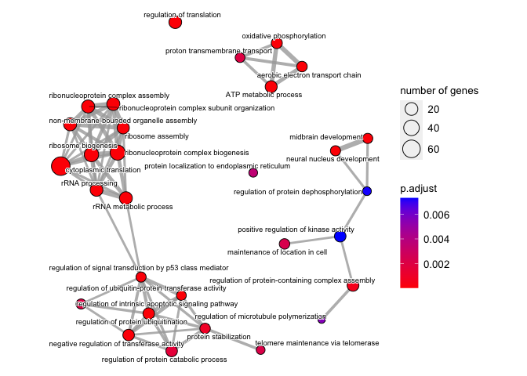<!-- -->

```r
ggsave(file = "enrich1.pdf")
```

```
## Saving 7 x 5 in image
```

```r
dotplot(enrichplot::pairwise_termsim(enr_go))
```

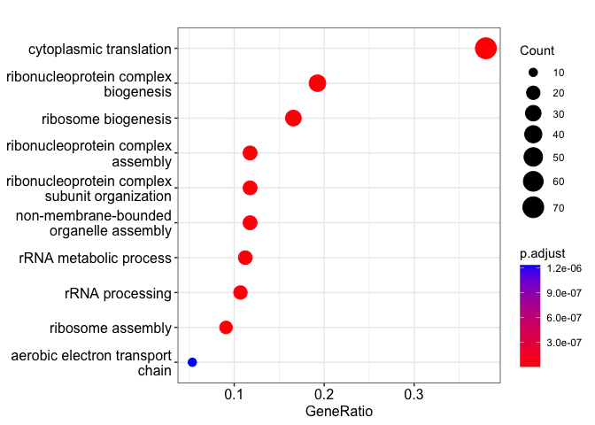<!-- -->

```r
ggsave(file = "dot1.pdf")
```

```
## Saving 7 x 5 in image
```

```r
cnetplot(enrichplot::pairwise_termsim(enr_go)) 
```

```
## Warning: ggrepel: 1 unlabeled data points (too many overlaps). Consider
## increasing max.overlaps
```

<!-- -->

```r
ggsave(file = "cnet1.pdf")
```

```
## Saving 7 x 5 in image
```

```
## Warning: ggrepel: 1 unlabeled data points (too many overlaps). Consider
## increasing max.overlaps
```

```r
gmt <- msigdbr::msigdbr(species = "human", category = "H")
sel_go0 <- clusterProfiler::enricher(gene = sel_genes,,pAdjustMethod = "BH",pvalueCutoff  = 0.05, qvalueCutoff  = 0.05, TERM2GENE = gmt[,c("gs_name", "gene_symbol")])
write.csv(sel_go0@result,file = paste(file0,'enricher','.csv',sep=''))
```


The follwoing run the KEGG pathway enrichment analysis. 

```r
sel_genes_id<-mapIds(org.Hs.eg.db, sel_genes, 'ENTREZID', 'SYMBOL',multiVals=last)
```

```
## 'select()' returned 1:1 mapping between keys and columns
```

```r
get_ENTREZID <- function(x){
  ab<-NULL
  for (i in 1: length(x)){
    ab[i]<-x[[i]]
  }
  message("There are ", sum(is.na(ab)), " NA and they are dropped")
  ret<-ab
  }
genes_id<-get_ENTREZID(sel_genes_id)
```

```
## There are 8 NA and they are dropped
```

```r
enrich_kegg <- enrichKEGG(gene = genes_id)
```

```
## Reading KEGG annotation online:
```

```
## Reading KEGG annotation online:
```

```r
head(enrich_kegg, n=10)
```

```
##                ID                                       Description GeneRatio
## hsa03010 hsa03010                                          Ribosome    69/146
## hsa05171 hsa05171                    Coronavirus disease - COVID-19    69/146
## hsa05012 hsa05012                                 Parkinson disease    28/146
## hsa05010 hsa05010                                 Alzheimer disease    24/146
## hsa05022 hsa05022 Pathways of neurodegeneration - multiple diseases    27/146
## hsa05016 hsa05016                                Huntington disease    21/146
## hsa00190 hsa00190                         Oxidative phosphorylation    14/146
## hsa05020 hsa05020                                     Prion disease    19/146
## hsa05415 hsa05415                           Diabetic cardiomyopathy    15/146
## hsa05014 hsa05014                     Amyotrophic lateral sclerosis    20/146
##           BgRatio       pvalue     p.adjust       qvalue
## hsa03010 158/8163 3.685369e-84 5.712322e-82 4.926756e-82
## hsa05171 232/8163 3.355049e-70 2.600163e-68 2.242585e-68
## hsa05012 266/8163 1.531524e-14 7.912872e-13 6.824684e-13
## hsa05010 384/8163 6.521277e-08 2.061174e-06 1.777719e-06
## hsa05022 476/8163 6.648949e-08 2.061174e-06 1.777719e-06
## hsa05016 306/8163 9.896843e-08 2.205557e-06 1.902246e-06
## hsa00190 134/8163 9.960579e-08 2.205557e-06 1.902246e-06
## hsa05020 273/8163 3.440513e-07 6.665994e-06 5.749278e-06
## hsa05415 203/8163 3.090954e-06 5.323310e-05 4.591242e-05
## hsa05014 364/8163 6.690134e-06 1.036971e-04 8.943653e-05
##                                                                                                                                                                                                                                                                                                                                                               geneID
## hsa03010 6128/6229/6141/6134/6202/6164/6233/6138/6171/6189/6176/6209/6228/6159/6133/6135/6132/3921/6158/6191/6156/6143/6137/6161/6154/6187/6223/6210/6122/6142/23521/6144/6217/6207/6188/6168/6125/6208/6206/6231/6169/6230/9349/6152/6147/6203/2197/6201/11224/9045/6222/6165/6175/6130/6167/6193/6129/25873/6234/7311/4736/6232/6235/6181/6160/6146/6205/6155/6170
## hsa05171 6128/6229/6141/6134/6202/6164/6233/6138/6171/6189/6176/6209/6228/6159/6133/6135/6132/3921/6158/6191/6156/6143/6137/6161/6154/6187/6223/6210/6122/6142/23521/6144/6217/6207/6188/6168/6125/6208/6206/6231/6169/6230/9349/6152/6147/6203/2197/6201/11224/9045/6222/6165/6175/6130/6167/6193/6129/25873/6234/7311/4736/6232/6235/6181/6160/6146/6205/6155/6170
## hsa05012                                                                                                                                                                                                                6233/7345/1350/805/7316/347733/7417/7846/801/9377/4697/29796/517/7314/5688/518/7416/7388/7280/6622/1337/7311/4725/4729/1347/4718/203068/7295
## hsa05010                                                                                                                                                                                                                                   1350/2597/805/347733/7417/7846/801/9377/4697/29796/517/5688/518/7416/7388/7280/6622/1337/10313/4725/4729/1347/4718/203068
## hsa05022                                                                                                                                                                                                                     6233/7345/1350/805/7316/347733/7417/7846/801/9377/4697/29796/517/7314/5688/518/7416/7388/7280/6622/1337/7311/4725/4729/1347/4718/203068
## hsa05016                                                                                                                                                                                                                                                 1350/347733/7417/7846/9377/4697/29796/517/5688/518/7416/7388/7280/1337/4725/1211/4729/1347/4718/1173/203068
## hsa00190                                                                                                                                                                                                                                                                                       1350/9550/9377/4697/29796/517/518/7388/1337/4725/4729/1347/4718/10632
## hsa05020                                                                                                                                                                                                                                                           1350/347733/7417/7846/9377/4697/29796/517/5688/518/7416/7388/7280/1337/4725/4729/1347/4718/203068
## hsa05415                                                                                                                                                                                                                                                                                   1350/2597/7417/9377/4697/29796/517/518/7416/7388/1337/4725/4729/1347/4718
## hsa05014                                                                                                                                                                                                                                                          71/1350/60/347733/7846/9377/4697/29796/517/5688/518/7416/7388/7280/1337/4725/4729/1347/4718/203068
##          Count
## hsa03010    69
## hsa05171    69
## hsa05012    28
## hsa05010    24
## hsa05022    27
## hsa05016    21
## hsa00190    14
## hsa05020    19
## hsa05415    15
## hsa05014    20
```

